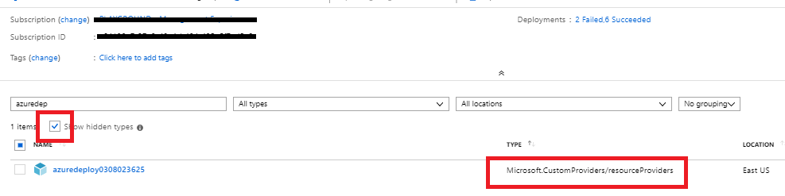
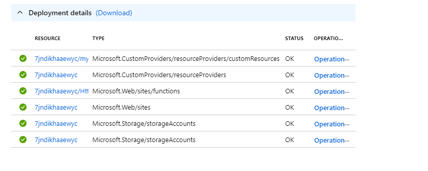

# Creating a Custom Provider with Resources


[](https://portal.azure.com/#create/Microsoft.Template/uri/https%3A%2F%2Fraw.githubusercontent.com%2FAzure%2Fazure-quickstart-templates%2Fmaster%2Fquickstarts%2Fmicrosoft.customproviders%2Fcustom-rp-with-function%2Fazuredeploy.json)  [](http://armviz.io/#/?load=https%3A%2F%2Fraw.githubusercontent.com%2FAzure%2Fazure-quickstart-templates%2Fmaster%2Fquickstarts%2Fmicrosoft.customproviders%2Fcustom-rp-with-function%2Fazuredeploy.json)

This sample Azure Resource Manager template deploys a custom resource provider to Azure that extends the Azure Resource Manager API set with custom abilities and then utilizes the new extension to deploy "customResources".

The custom resource provider is a hidden Azure resource so to confirm that the custom resource provider has been deployed you will have to check the box that says *Show hidden types* in the Azure portal Overview page for the resource group.



## Details on the custom resource provider created

This sample deployment creates the following apis on the resource.

1) An Azure Resource Manager extended API called "customResources"

### CustomResources

"customResources" is an API extension contained within the custom resource provider. This extension is defined in the following part of the ARM template under the "resourceProviders" resource:

```json
"resourceTypes": [
                    {
                        "name": "customResources",
                        "routingType": "Proxy",
                        "endpoint": "[listSecrets(resourceId('Microsoft.Web/sites/functions', parameters('funcName'), 'HttpTrigger1'), '2018-02-01').trigger_url]"
                    }
                 ]
```

In the above template, we can see that the "customResources" API has been defined as a Proxy resource which means that it is backed by a RESTful API endpoint. The details of the endpoint come next. The endpoint uri in the section refers to the endpoint that implements this resource. When the resource is defined as above , the resource will support all CRUD calls like "GET", "PUT", "DELETE" etc and it is expected that the endpoint has implemented them. In the above case, this means that we will be able to make the following calls on Azure Resource Manager:

```
PUT/GET/DELETE /subscriptions/{subscriptionId}/resourceGroups/{resourceGroupName}/providers/Microsoft.CustomProviders/resourceProviders/{resourceProviderName}/customResources/{customResourceName}?api-version=2018-09-01-preview
```

The Azure Resource Manager template also utilizes the new Azure extension to create an instance of the "customResources":

```json
{
    "type": "Microsoft.CustomProviders/resourceProviders/customResources",
    "name": "[concat(parameters('funcName'), '/', parameters('azureCustomResourceName'))]",
    "apiVersion": "2018-09-01-preview",
    "location": "[parameters('location')]",
    "properties": {
        "hello": "world",
        "myCustomProperty": "[parameters('myCustomPropertyValue')]"
    },
    "dependsOn": [
        "[resourceId('Microsoft.CustomProviders/resourceProviders', parameters('funcName'))]"
    ],
}
```

Navigating to the deployment details on the Azure Resource Manager template will show a new resource type called resourceproviders/customResources created on the custom resource provider.


To confirm that the custom resource has been created , you can use a rest api client such as postman and run the following query and see the results:

```
GET  
https://management.azure.com/subscriptions/{subscriptionId}/resourceGroups/{resourceGroupName}/providers/Microsoft.CustomProviders/resourceProviders/{resourceProviderName}/customResources/{customResourceName}?api-version=2018-09-01-preview
```

You can also create\delete additional "customResources".

### Ping action

In addition to users you can also define actions on your resourceprovider. An example action called ping is provided here defined as follows:

```json
"actions": [
                                {
                                    "name": "ping",
                                    "routingType":"Proxy",
                                    "endpoint": "[concat('https://', parameters('funcname'), '.azurewebsites.net/api/{requestPath}')]"
                                }
                            ]
```

The format for this action is similar to the resource type defined above , but since this is an action this call will only support POST methods as follows:

```
POST  
https://management.azure.com/subscriptions/{subscriptionid}/resourceGroups/{resourcegroup}/providers/Microsoft.CustomProviders/resourceProviders/{customrpname}/ping?api-version=2018-09-01-preview
```

The code that enables this process is all implemented as part of the azure function that is deployed along with the template. To further understand how the function has been configured please look here:

+ [**Creating an azure function**](SampleFunctions/CSharpSimpleProvider/README.md)


