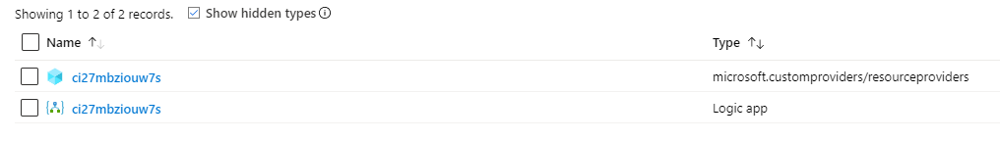
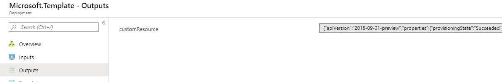
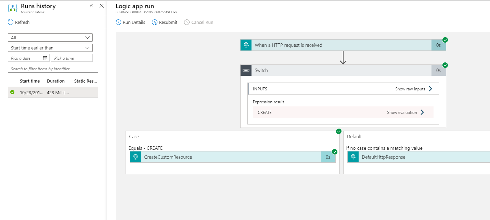

# Creating a Custom Resources for templates with Custom Providers


[](https://portal.azure.com/#create/Microsoft.Template/uri/https%3A%2F%2Fraw.githubusercontent.com%2FAzure%2Fazure-quickstart-templates%2Fmaster%2Fquickstarts%2Fmicrosoft.customproviders%2Fcustom-rp-with-logicapp%2Fazuredeploy.json)  [](http://armviz.io/#/?load=https%3A%2F%2Fraw.githubusercontent.com%2FAzure%2Fazure-quickstart-templates%2Fmaster%2Fquickstarts%2Fmicrosoft.customproviders%2Fcustom-rp-with-logicapp%2Fazuredeploy.json)

This sample Azure Resource Manager template deploys a custom resource provider to Azure that extends the Azure Resource Manager API. In this sample, the custom resource provider is powered by an Azure Logic App, but any public API endpoint can be used.

The custom resource provider is a hidden Azure resource so to confirm that the custom resource provider has been deployed you will have to check the box that says *Show hidden types* in the Azure portal Overview page for the resource group.



## Details on the custom resource provider created

This sample deployment creates the following apis on the resource.

1) An Azure Resource Manager extended API called "customResources"

### CustomResources

"customResources" is an API extension contained within the custom resource provider. This extension is defined in the following part of the ARM template under the "resourceProviders" resource:

```json
"resourceTypes": [
    {
        "name": "customResources",
        "mode": "Secure",
        "routingType": "Webhook,Cache",
        "endpoint": "[listCallbackURL(concat(resourceId('Microsoft.Logic/workflows', parameters('logicAppName')), '/triggers/CustomProviderWebhook'), '2017-07-01').value]"
    }
]
```

| Property | Required | Description |
|---|---|---|
| name | *yes* | The name is the new "resourceType" extension that is added to the Azure Resource Manager API. This extension is instanced to the custom resource provider. Example: /subscriptions/{subscriptionId}/resourceGroups/{resourceGroupName}/providers/Microsoft.CustomProviders/resourceProviders/{resourceProviderName}/**customResources**/{customResourceName} |
| mode | *no* | Hides the **endpoint** property on reads if set to "Secure". |
| routingType | *no* | Determines the HTTP structure and strategy for HTTP requests to the **endpoint**. The property is structured as flags. The "Webhook" flag changes all requests to *POST*. The "Cache" flag allows the custom provider to store request responses and automatically return them on subsequent *GET* requests. |
| endpoint | *yes* | The public HTTP endpoint that handles all incoming reuqests. |

In the above template, we can see that the "customResources" API has been defined as a "Webhook,Cache" resource which means that it is backed by a Webhook API endpoint. In this sample, we set the callback URL for the Azure Logic App to handle the incoming request and provide a response. Because we defined the "Cache" flag, the endpoint only needs to handle the PUT and DELETE calls, while the GET calls will automatically be handled by the custom provider. In the above case, the following calls will be added to the Azure Resource Manager API:

```
(PUT|GET|DELETE) /subscriptions/{subscriptionId}/resourceGroups/{resourceGroupName}/providers/Microsoft.CustomProviders/resourceProviders/{resourceProviderName}/customResources/{customResourceName}?api-version=2018-09-01-preview
```

The Azure Resource Manager template also utilizes the new Azure extension to create an instance of the "customResources":

```json
{
    "type": "Microsoft.CustomProviders/resourceProviders/customResources",
    "apiVersion": "2018-09-01-preview",
    "name": "[concat(parameters('customResourceProviderName'), '/', parameters('customResourceName'))]",
    "location": "[parameters('location')]",
    "properties": {
        "myCustomInputProperty": "myCustomInputValue",
        "myCustomInputObject": {
            "Property1": "Value1"
        }
    },
    "dependsOn": [
        "[concat('Microsoft.CustomProviders/resourceProviders/', parameters('customResourceProviderName'))]"
    ]
}
```

Navigating to the deployment details on the Azure Resource Manager template will show a new resource type called resourceproviders/customResources created on the custom resource provider.


The outputs section of the template deployment also will display the created resource, which can be accessed through the *reference* template function.


In addition, you can navigate to the deployed Azure Logic App resource in the template resource group and check the *run history* tab to see the HTTP calls.


Additional "customResources" can be created through deploying another Azure Resource Manager Template or directly interfacing with the Azure REST API.


