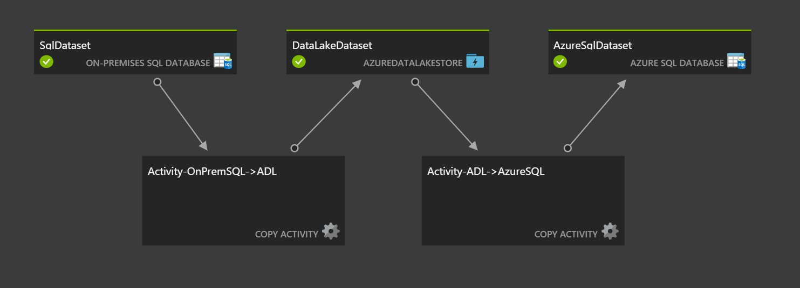

# Two-Activity Chained Data Factory Pipeline


[](https://portal.azure.com/#create/Microsoft.Template/uri/https%3A%2F%2Fraw.githubusercontent.com%2FAzure%2Fazure-quickstart-templates%2Fmaster%2Fquickstarts%2Fmicrosoft.datafactory%2Fdata-factory-chained-copy-activities%2Fazuredeploy.json)
[](https://portal.azure.us/#create/Microsoft.Template/uri/https%3A%2F%2Fraw.githubusercontent.com%2FAzure%2Fazure-quickstart-templates%2Fmaster%2Fquickstarts%2Fmicrosoft.datafactory%2Fdata-factory-chained-copy-activities%2Fazuredeploy.json)
[](http://armviz.io/#/?load=https%3A%2F%2Fraw.githubusercontent.com%2FAzure%2Fazure-quickstart-templates%2Fmaster%2Fquickstarts%2Fmicrosoft.datafactory%2Fdata-factory-chained-copy-activities%2Fazuredeploy.json)

This template deploys a new Data Factory and requisite objects (linked services, datasets, pipelines, gateways, etc.) to fascilitate a two-activity chained Data Factory pipeline. The first leg of the pipeline leverages [data management gateway](https://docs.microsoft.com/en-us/azure/data-factory/data-factory-data-management-gateway) to pull data from an on-premises SQL server source into Azure Data Lake Store in [Apache orc columnar storage format](https://orc.apache.org/). The second leg of the pipeline pulls data from orc files in Azure Data Lake Store and inserts into Azure SQL as a final destination. This pipeline can be easily customized to accommodated a wide variety of additional sources and targets.



## Please complete the following steps before deploying the template: 

1. This example leverages a single table in the [AdventureWorks2014 (OLTP) database](https://github.com/Microsoft/sql-server-samples/releases/download/adventureworks2014/adventure-works-2014-oltp-full-database-backup.zip) for demonstration purposes. Before running this template make sure that you've restored this database to an on-premises SQL server (source) as well as an Azure SQL Server instance (destination).
2. Make sure that you've opened up the required ports to allow communication between data management gateway and Azure. Details on these requirements can be found [here](https://docs.microsoft.com/en-us/azure/data-factory/data-factory-data-movement-security-considerations).
3. Create an Azure Data Lake Store leveraging the portal, ARM template, CLI, etc.
4. Configure service principal authentication so that Data Factory can access your Data Lake Store using the following [Data Lake Store connector instructions](https://docs.microsoft.com/en-us/azure/data-factory/data-factory-azure-datalake-connector). Be sure to retain the Application ID and Key as you'll need these for the ARM template parameters.

## Deploying The Template
You can deploy this sample directly through the Azure Portal or by using the scripts supplied in the root of the repository.

To deploy a sample using the Azure Portal, click the **Deploy to Azure** button at the top of the article. 

To deploy the sample via the command line (using [Azure PowerShell or the Azure CLI](https://azure.microsoft.com/en-us/downloads/)) you can use the scripts.

Simply execute the script from the root folder and pass in the folder name of the sample (101-data-factory-blob-to-sql-copy-stored-proc). For example:

```PowerShell
.\Deploy-AzureResourceGroup.ps1 -ResourceGroupLocation 'eastus' -ArtifactStagingDirectory 101-data-factory-blob-to-sql-copy-stored-proc
```
```bash
azure-group-deploy.sh -a 101-data-factory-blob-to-sql-copy-stored-proc -l eastus
```

## After Deploying the Template:

1. Install Data Management Gateway on-premises using [these instructions](https://docs.microsoft.com/en-us/azure/data-factory/data-factory-data-management-gateway).
2. Register data management gateway w/ ADF by inputing the key from the Azure Data Factory portal.
3. Encrypt the connection string for your on-premises database using the [New-AzureRmDataFactoryEncryptValue](https://docs.microsoft.com/en-us/powershell/module/azurerm.datafactories/new-azurermdatafactoryencryptvalue?view=azurermps-4.2.0) command from the AzureRM.DataFactories PowerShell module. This will ensure that you're on-premises data store credentials are encrypted using the key from data management gateway.
4. Replace the placeholder connectionString value in your SqlLinkedService linked service with the encrypted value created above by editing the linked service in the Data Factory console's "Author and deploy" blade. This password will be encrypted using an ADF managed key.
5. Un-pause data pipeline from the ADF [Monitor and Manage console](https://docs.microsoft.com/en-us/azure/data-factory/data-factory-monitor-manage-app).
6. Test your new pipline out by inserting a new record into the Sales.Currency table in your on-premises database. Make sure to set the timestamp to a time that falls within an upcoming [ADF data slice](https://docs.microsoft.com/en-us/azure/data-factory/data-factory-scheduling-and-execution).

