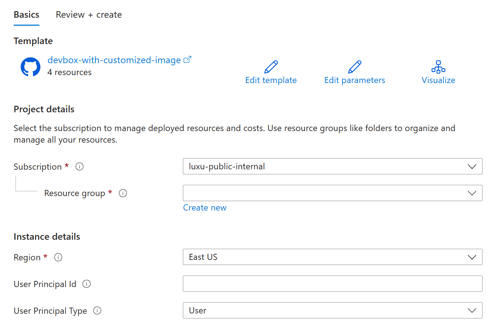
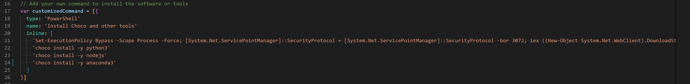

# Configure Dev Box service

   

This template would create all Dev Box admin resources as per [Dev Box quick start guide](https://learn.microsoft.com/en-us/azure/dev-box/quickstart-create-dev-box). You can view all resources created, or directly go to [Dev Portal](https://devportal.microsoft.com) to create your first Dev Box.

If you're new to **Dev Box**, see:

- [Microsoft Dev Box Documentation](https://learn.microsoft.com/en-us/azure/dev-box/overview-what-is-microsoft-dev-box)
- [Quickstarts: Microsoft Dev Box](https://learn.microsoft.com/en-us/azure/dev-box/quickstart-configure-dev-box-service?tabs=AzureADJoin)

If you're new to template deployment, see:

- [Azure Resource Manager documentation](https://docs.microsoft.com/azure/azure-resource-manager/)

`Tags: Devcenter, Dev Box, ARM Template, Microsoft.DevCenter/devcenters`

## How to deploy

Click the "Deploy to Azure" button to deploy. There will be the deployment page as below:

or Run the PowerShell script if you do not know how to get user principal id. 

### Microsoft.DevCenter

The resource provider "Microsoft.DevCenter" provides the capability to manage the Azure Dev Center.

- **Microsoft.DevCenter/devcenters**: include gallery, dev box definition
- **Microsoft.DevCenter/projects**: include project and dev box pool
- **Microsoft.DevCenter/networkConnections**: include network connection

## Parameters

When deploying this template you can provide parameters to customize the dev box and related resources.

| Parameters | Overview |
| -- | -- |
| User Principal Id | The AAD user id or gorup id that will be granted the role "Devcenter Dev Box User". Please find the user/group's object id under Azure Active Directory. If you don't provide this permission, the developer will not get the permission to access the project in the [Dev Portal](https://devportal.microsoft.com). If it's not provided, mannually you can also go to the project IAM and grant the related permissioin. Please refer to [here](https://learn.microsoft.com/en-us/azure/dev-box/quickstart-configure-dev-box-service?tabs=AzureADJoin#6-provide-access-to-a-dev-box-project). |
| Uer Principal Type | If you want to grant the permission to AAD group, please select "group" instead of "user" |

# Customize your own software and tools

If you want to add your own software and tools, please fork this repo and change the customizedCommand in the core/gallery.bicep

# Add other customized image for Base, Java, .Net and Data

After you use this template to generate the customized image, if you want to generate more other types of image, please use the button below to generate customized image to your existing gallery and image definition.
| Image Type | Software and Tools |
| -- | -- |
| Base | Git, Azure CLI, VS Code, VS Code Extension for GitHub Copilot |
| Java | Git, Azure CLI, VS Code, Maven, OpenJdk11, VS Code Extension for Java Pack |
| .Net | Git, Azure CLI, VS Code，.Net SDK, Visual Studio |
| Data | Git, Azure CLI, VS Code，Python3, VS Code Extension for Python and Jupyter |

If you're new to **Dev Box**, see:

- [Microsoft Dev Box Documentation](https://learn.microsoft.com/en-us/azure/dev-box/overview-what-is-microsoft-dev-box)
- [Quickstarts: Microsoft Dev Box](https://learn.microsoft.com/en-us/azure/dev-box/quickstart-configure-dev-box-service?tabs=AzureADJoin)

If you're new to template deployment, see:

- [Azure Resource Manager documentation](https://docs.microsoft.com/azure/azure-resource-manager/)

`Tags: Devcenter, Dev Box, ARM Template, Microsoft.DevCenter/devcenters`