# IoT Hub and Ubuntu edge simulator

The purpose of this ARM Template is **deploy an IoT Hub** with an **Ubuntu Edge Simulator**.

The Linux Ubuntu virtual machine is configured to be an IoT Edge device

For this task you will:

1. Create an IoT Hub.
2. Register an IoT Edge device to your IoT hub.
3. Install and start the IoT Edge runtime on your virtual device.

To register the IoT Edge you will need to use PowerShell. You can either install the PowerShell extension on Visual Code or use the Cloud PowerShell on the AzurePortal.

For the extension, click [here](https://docs.microsoft.com/en-us/powershell/scripting/components/vscode/using-vscode?view=powershell-6)
For a quick start on the Cloud PowerShell click [here](https://docs.microsoft.com/en-us/azure/cloud-shell/quickstart-powershell)

Now, let's understand a bit better how **IOT Hub** and **IoT Edge Device** work.

## Overview

### What is Azure IoT Edge

Azure IoT Edge moves cloud analytics and custom business logic to devices so that your organization can focus on business insights instead of data management. Scale-out your IoT solution by packaging your business logic into standard containers, then you can deploy those containers to any of your devices and monitor it all from the cloud.

Azure IoT Edge is made up of three components:

- **IoT Edge modules** are containers that run Azure services, third-party services, or your code. Modules are deployed to IoT Edge devices and execute locally on those devices.
- The **IoT Edge runtime** runs on each IoT Edge device and manages the modules deployed to each device.
- A cloud-based interface enables you to remotely monitor and manage **IoT Edge devices**.

### IoT Edge modules

IoT Edge modules are units of execution, implemented as Docker compatible containers, that run your business logic at the edge. Multiple modules can be configured to communicate with each other, creating a pipeline of data processing. You can develop custom modules or package certain Azure services into modules that provide insights offline and at the edge.

### IoT Edge runtime

The Azure IoT Edge runtime enables custom and cloud logic on IoT Edge devices. The runtime sits on the IoT Edge device and performs management and communication operations. The runtime performs several functions:

- Installs and updates workloads on the device.
- Maintains Azure IoT Edge security standards on the device.
- Ensures that IoT Edge modules are always running.
- Reports module health to the cloud for remote monitoring.
- Manages communication between downstream leaf devices and an IoT Edge device, between modules on an IoT Edge device, and between an IoT Edge device and the cloud.

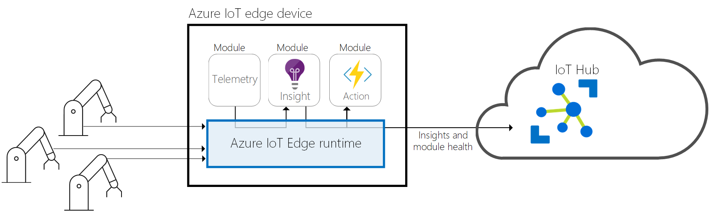

### IoT Edge cloud interface

It's difficult to manage the software life cycle for millions of IoT devices that are often different makes and models or geographically scattered. Workloads are created and configured for a particular type of device, deployed to all of your devices, and monitored to catch any misbehaving devices. These activities can’t be done on a per device basis and must be done at scale.

Azure IoT Edge integrates seamlessly with Azure IoT solution accelerators to provide one control plane for your solution’s needs. Cloud services allow you to:

- Create and configure a workload to be run on a specific type of device.
- Send a workload to a set of devices.
- Monitor workloads running on devices in the field.

## Pre Deployment Steps

Before proceeding to the deployment of the AADDS template, we need to perform the following steps.

### PowerShell commands

Open the PowerShell terminal of your choice and run the following commands:

Log in to Azure:

#### az login

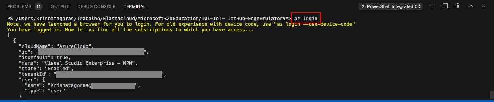

You will be redirected to the Azure Portal where you can insert your credentials and log in.

After logged in, you will see your credentials on the terminal.

To set the right subscription, type following command:

#### az account set --subscription "your subscription id"

You use the Azure CLI to complete many of the steps in this quickstart, and Azure IoT has an extension to enable additional functionality.

Add the Azure IoT extension to the cloud shell instance.

#### az extension add --name azure-cli-iot-ext

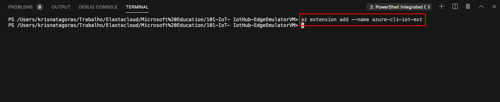

IoT Edge device: A Linux device or virtual machine to act as your IoT Edge device. You should use the Microsoft-provided Azure IoT Edge on Ubuntu virtual machine, which preinstalls everything you need to run IoT Edge on a device. For that you need to accept the terms of use:

#### az vm image accept-terms --urn microsoft_iot_edge:iot_edge_vm_ubuntu:ubuntu_1604_edgeruntimeonly:latest

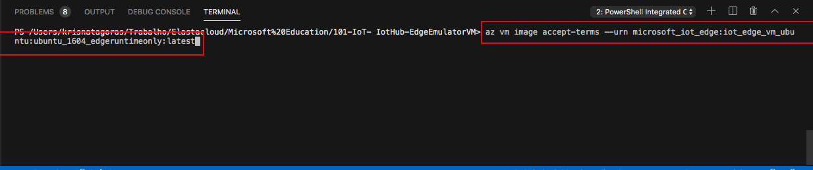

It will return a nice json, like this:

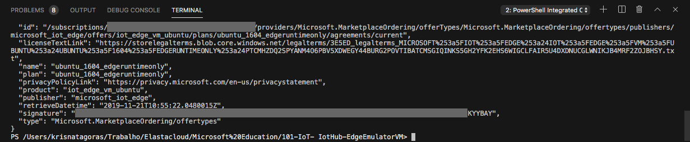

Now we can look at the template file:

## The Template

Don't let the size of the template scares you. The structure is very intuitive and once that you get the gist of it, you will see how easier your life will be regarding deploying resources to Azure.

These are the parameters on the template, most of them already have values inserted, the ones that you need to inform are: **adminUsername**, **adminPassword**, **resourceGroup** and the size of your Virtual Machine.

Here the list of all parameters:

Parameter | Suggested value | Description
:--------------- | :------------- |:---------------------
**vmName** | EdgeVM | The name of you Ubuntu Edge Virtual Machine.
**IoTHubname** | [concat('IoThub', resourceGroup().name)] | Name for your IoTHub.
**Location**| The default location | Select the geographic location for your resource group.
**Resource Group**| yourresourcegroup | That is the Resource Group that you need to deploy your resources.
**VmSize** | Standard_B1ls | The size of the VM. If you are running in a test or dev environment, it's recommended use a small Virtual Machine.
**adminUsername** | adminusername | Usernames can be a maximum of 20 characters and cannot end in a period (".").
**adminPassword** | Complex Password | Password requirements between 12 to 72 characters and have lower and upper characters, a digit and a special character (Regex match [\W_])
**virtualNetworkName** | vNet | Name of the Virtual Network.
**subnetName** | Subnet | Name of the Subnet.
**networkSecurityGroupName** | SecGroupNet | Name of the Network Security Group.
**IoTsku_name** | F1 | The name of the SKU. - F1, S1, S2, S3, B1, B2, B3. (F1 is the free tier.)
**IoTsku_units** | 1 | The number of provisioned IoT Hub units. See [here](https://docs.microsoft.com/azure/azure-subscription-service-limits#iot-hub-limits). 1 is the free tier.
**IoTsku_partitions** | 2 | This is linked to the SKU.For more information, click [here](https://docs.microsoft.com/en-us/azure/templates/microsoft.devices/2019-03-22/iothubs)
**IoTfeatures** | none | This is linked to the SKU. For more information, click [here](https://docs.microsoft.com/en-us/azure/templates/microsoft.devices/2019-03-22/iothubs)
**Resource Group**| myResourceGroup | That is the Resource Group that you need to deploy your resources.

## Deployment

There are a few ways to deploy this template.
You can use [PowerShell](https://docs.microsoft.com/en-us/azure/azure-resource-manager/resource-group-template-deploy), [Azure CLI](https://docs.microsoft.com/en-us/azure/azure-resource-manager/resource-group-template-deploy-cli), [Azure Portal](https://docs.microsoft.com/en-us/azure/azure-resource-manager/resource-group-template-deploy-portal) or your favorite SDK.

For Azure CLI I'm the Visual Code with Azure CLI and PowerShell extensions. Check the Pre Steps session for more information. Or click [here](https://code.visualstudio.com/docs/azure/extensions).

### Resource Group

Now you need a Resource Group for our deployment. If you haven't yet created a Resource Group, you can do it now. If you are new on Azure and wonder what is a Resource Group? Bare with me! A Resource Group is a container that holds related resources for an Azure solution. The resource group includes those resources that you want to manage as a group. Simply saying, it's like a folder that contains files. Simple as that.

To create a Resource Group, you need a name and a location for your Resource Group.

For a list of locations, type: **az account list-locations**

To create the Resource group, type the command:

#### az group create --name IoTEdgeResources --location your_location

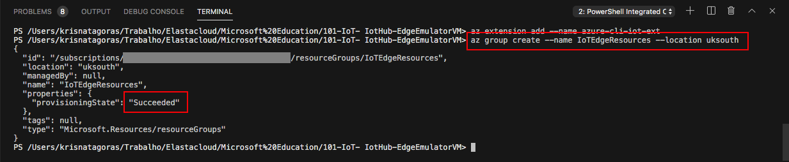

Super simple, right? Now that we have our **Resource Group** created, let's deploy the **IOT Hub** and **IOT Edge VM**.

#### az group deployment create --name "IOTdeployment" --resource-group "IoTEdgeResources" --template-file "./azuredeploy.json"

Insert the values for the parameters.
As you can see, it's running.

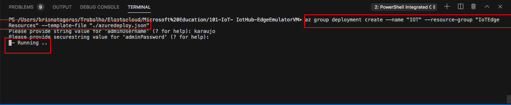

Go grab a cup of coffee, have some fresh air. Before you come back you will have your **IOT Hub** and **IOT Edge VM**.

And there we go, your deployment is Succeeded:

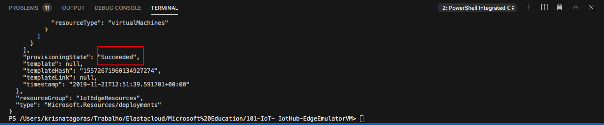

Let's go and check the resource at the [Azure Portal](https://portal.azure.com).

On the portal, go to Resource Groups. On this blade, you can see the Resource Group we've created.

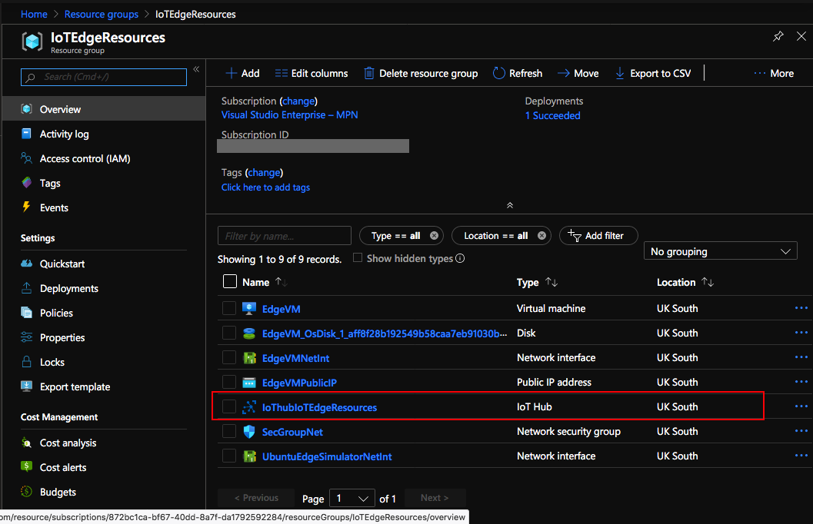

Click on the Resource Group and there it's the resources **Resources**:

- Virtual machine
- Disk
- Network interface
- Public IP address
- IoT Hub
- Network security group
- Network interface

Copy the name of the **IOT Hub**.

To have your IoT Hub connected with your IoT Device, we need to perform another task: register the IoT device.

### Register an IoT Edge device

Register an IoT Edge device with your newly created IoT hub.

Create a device identity for your IoT Edge device so that it can communicate with your IoT hub. The device identity lives in the cloud, and you use a unique device connection string to associate a physical device to a device identity.

#### az iot hub device-identity create --hub-name {hub_name} --device-id myEdgeDevice --edge-enabled

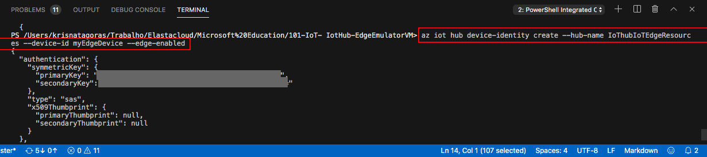

### Connection String

Retrieve the connection string for your device, which links your physical device with its identity in IoT Hub.

#### az iot hub device-identity show-connection-string --device-id myEdgeDevice --hub-name {hub_name}

Copy the connection string. 

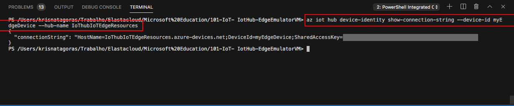

### Set the connection string on the IoT Edge device

If you're using the Azure IoT Edge on Ubuntu virtual machine as described in the prerequisites, then your device already has the IoT Edge runtime installed. You just need to configure your device with the device connection string that you retrieved in the previous section. You can do this remotely without having to connect to the virtual machine. Run the following command, replacing {device_connection_string} with your string.

#### az vm run-command invoke -g IoTEdgeResources -n EdgeVM --command-id RunShellScript --script "/etc/iotedge/configedge.sh '{device_connection_string}'"

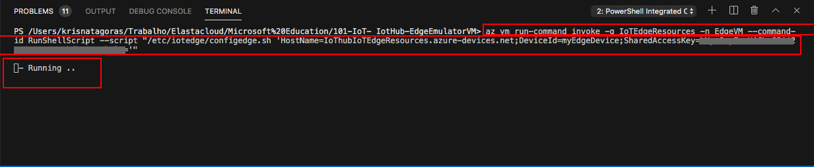

As you can see, the command was successful.

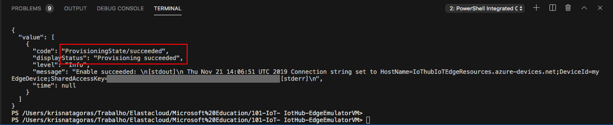

Here you have an overview of your **IOT Hub**.

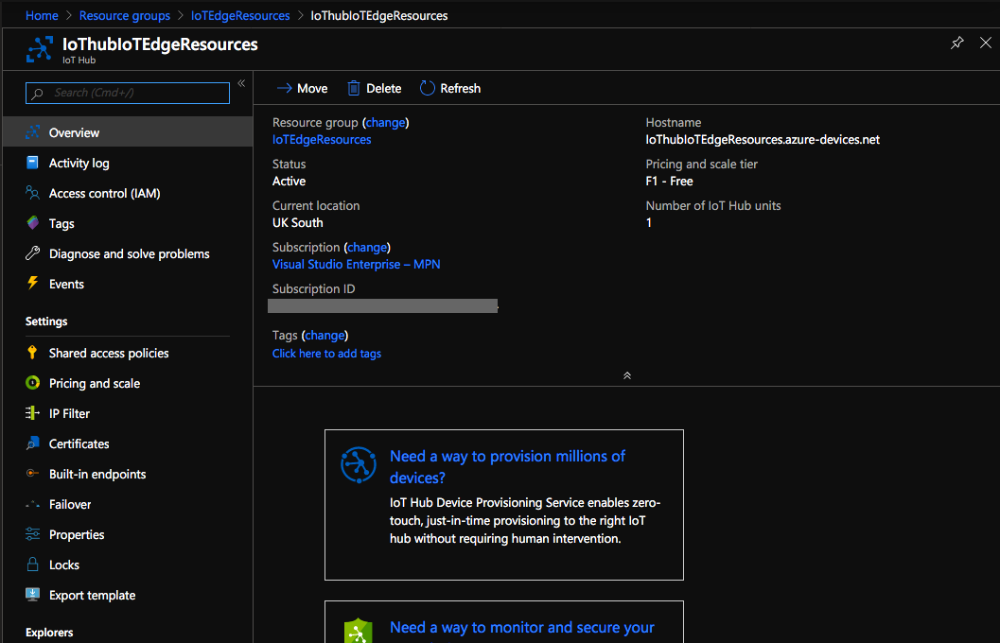

Congratulations, you just deployed an **IoT Hub** and **Ubuntu VM edge simulator**.

Don't forget to have fun!

**p.s.: Pretty easy to create resources on Azure, right? But if you are the sort of IT guy that always loves automation, here is the surprise. Just click on the button below and it will automatically deploy the IoT Hub and Ubuntu VM edge simulator.**

#### Important disclaimer: Azure charges you for the resources you are using, and you don't want to finish all your credits at once, right? So, don't forget to stop the Ubuntu VM edge simulator at the portal or even delete the Resource Group you have created to avoid unnecessary charges

### How to shutdown your resources

#### Using the portal

On the portal, open your Resource Group, look for the Virtual Machine and you can either stop it or delete it.

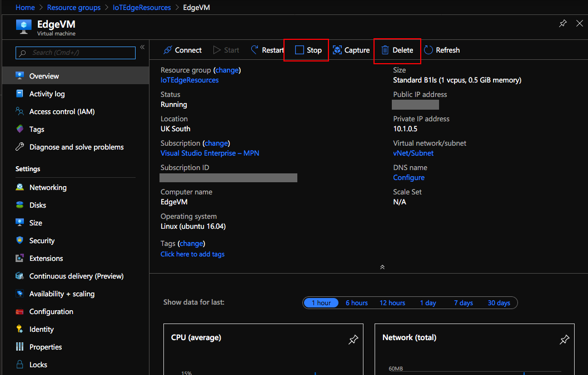

You can also delete the Resource Group.

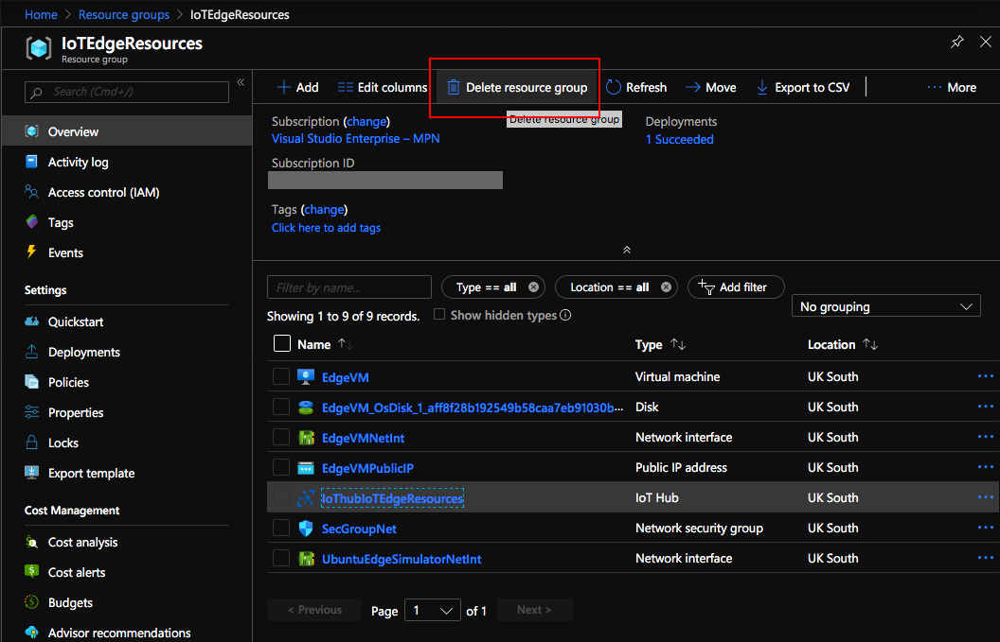

Just refresh your screen and you are good to go.
