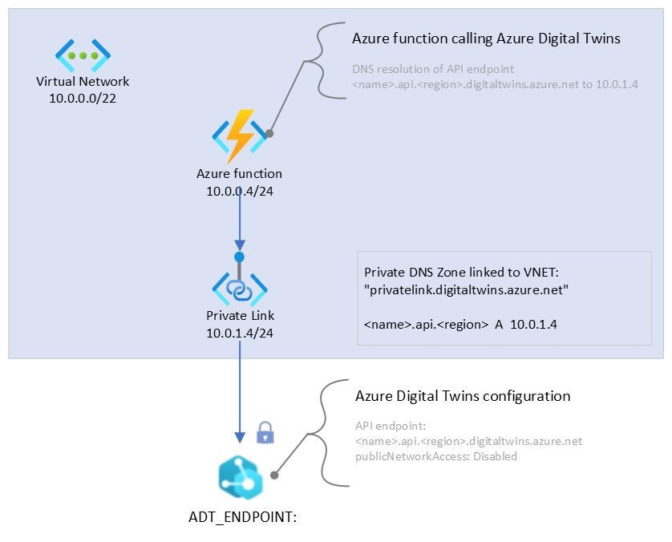

# Azure Digital Twins with Function and Private Link service

This template creates an Azure Digital Twins service configured with a Virtual Network connected Azure function that can communicate through a Private Link Endpoint to Digital Twins. It also creates a Private DNS Zone to allow seamless hostname resolution of the Digital Twins endpoint from the Virtual Network to the Private Endpoint internal subnet IP address. The hostname is stored as a setting to the Azure function with name 'ADT_ENDPOINT'.

Tags: `Azure Digital Twins, Private Link, Azure functions, Virtual Network, Managed Identities, MSI, Role-based Access Control, RBAC`

## Sample overview and deployed resources

This sample template creates an Azure Digital Twins instance, Private Link service, Private DNS Zone, an Azure function with a system-assigned identity and a role-assignment for the Azure function to access Digital Twins as Azure Digital Twins Data Owner.

The following resources are deployed as part of the solution:

### Networking

- Virtual Network, with subnets for the Azure function and and for Private Link service.
- Private Link service to make the Azure Digital Twins instance accessible to the Azure function through a private endpoint.

### Azure function

- An Azure function configured with a Server Farm and a Network Profile that connects it to the Virtual Network. An environment variable is populated with the API endpoint of Azure Digital Twins. The function can access the setting as `ADT_ENDPOINT`.

### Azure Digital Twins

- An Azure Digital Twins instance configured to not accept connections from the public network by setting the `PublicNetworkAccess` policy to `Disabled`.

The following diagram illustrates the components of this sample.

## Deployment steps

You can click the "deploy to Azure" button at the beginning of this document or follow the instructions for command line deployment using the scripts in the root of this repo.

## Usage

Once the deployment is complete, you can author an Azure function to access the Azure Digital Twins instance through the use of the provided endpoint setting `ADT_ENDPOINT`. The setting resolves to the URL that will be resolved by the Function to an IP address representing the Private Endpoint connected to Azure Digital Twins. Communication will not occur through the public network, but rather within the Virtual Network and thus will not be rejected by Digital Twins due to the `PublicNetworkAccess` policy being disabled.

## Notes

- If you receive a 403, Forbidden response from calls to the Azure Digital Twins endpoint, you must be accessing the service through the public network. The `PublicNetworkAccess` policy being set to `disabled` requires API calls to occur through the Private Endpoint. Only when accessed through the Private Endpoint, the request will be permitted through.
`Tags: Microsoft.Resources/deployments, Microsoft.DigitalTwins/digitalTwinsInstances, Microsoft.Network/virtualNetworks, Microsoft.Network/privateDnsZones, Microsoft.Network/privateDnsZones/virtualNetworkLinks, Microsoft.Network/privateEndpoints, Microsoft.Network/privateEndpoints/privateDnsZoneGroups, Microsoft.Storage/storageAccounts, Microsoft.Web/serverfarms, Microsoft.Insights/components, Microsoft.Web/sites, SystemAssigned, Microsoft.Web/sites/networkConfig, Microsoft.Authorization/roleAssignments`
