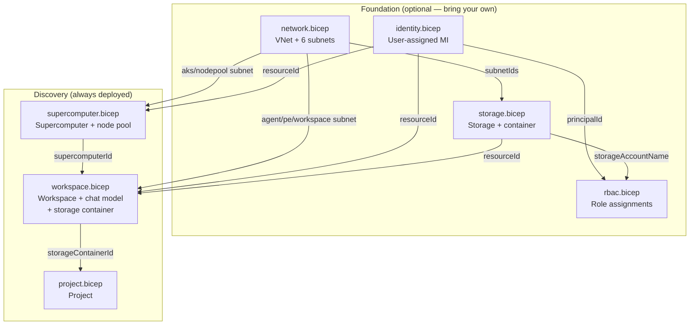

# Deploy Microsoft Discovery infrastructure (modular)


[](https://portal.azure.com/#create/Microsoft.Template/uri/https%3A%2F%2Fraw.githubusercontent.com%2FAzure%2Fazure-quickstart-templates%2Fmaster%2Fquickstarts%2Fmicrosoft.discovery%2Fdiscovery-infra-modular%2Fazuredeploy.json)
[](http://armviz.io/#/?load=https%3A%2F%2Fraw.githubusercontent.com%2FAzure%2Fazure-quickstart-templates%2Fmaster%2Fquickstarts%2Fmicrosoft.discovery%2Fdiscovery-infra-modular%2Fazuredeploy.json)

This sample is a **modular** version of the [single-file Microsoft Discovery deployment](../discovery-infra-deployment/). Individual deployment components of Microsoft Discovery are available to wire into existing infrastructure.  Use this Bicep set if you require Microsoft Discovery to be integrated into existing Azure infrastructure including networking, identity, storage, or user groups.

Use this layout when you need to:

- **Bring your own virtual network** (a hub-spoke or landing-zone network) instead of creating a new one.
- **Reuse a central managed identity** shared across workloads.
- **Reuse an existing storage account**.
- **Grant an existing Entra ID user group** platform access.
- Deploy a single module (for example, just the `Supercomputer`) into a custom deployment pipeline.

## Prerequisites

Same as the [single-file sample](../discovery-infra-deployment/README.md#prerequisites):

- An Azure subscription with access to the Microsoft Discovery preview.
- The [Azure CLI](https://learn.microsoft.com/en-us/cli/azure/install-azure-cli) installed to run the deployment commands.
- The required resource providers registered.
- Sufficient role assignments at the target resource-group scope:
  - *Discovery Platform Admin*
  - *Managed Identity Contributor*
  - *Network Contributor*
  - *Storage Account Contributor*

## Layout

| Path | Purpose |
| --- | --- |
| [main.bicep](main.bicep) | Top orchestrator that wires individual modules together with bring-your-own switches. |
| [azuredeploy.parameters.json](azuredeploy.parameters.json) | Public parameters file used by the Azure Quickstart validation pipeline. |
| [main.bicepparam](main.bicepparam) | Greenfield example — deploy everything. |
| [main.byo-network.bicepparam](main.byo-network.bicepparam) | Bring-your-own-network example. |
| [modules/types.bicep](modules/types.bicep) | Shared user-defined types (`discoverySubnetIds`, `workspaceFeatureTags`). |
| [modules/network.bicep](modules/network.bicep) | Virtual network with the six required subnets. |
| [modules/identity.bicep](modules/identity.bicep) | User-assigned managed identity. |
| [modules/storage.bicep](modules/storage.bicep) | Storage account (CORS) and blob container. |
| [modules/rbac.bicep](modules/rbac.bicep) | Role assignments for the identity and an optional user group. |
| [modules/supercomputer.bicep](modules/supercomputer.bicep) | Discovery Supercomputer with a basic node node pool. |
| [modules/workspace.bicep](modules/workspace.bicep) | Discovery Workspace, chat model deployment, and storage container. |
| [modules/project.bicep](modules/project.bicep) | Discovery project bound to the Workspace and its storage container. |

## Architecture



## Module reference

Each module is self-contained: each takes explicit inputs and returns typed outputs, so you can deploy it on its own or wire its outputs into the next module.

| Module | Key inputs | Outputs |
| --- | --- | --- |
| `network.bicep` | `vnetName`, `vnetAddressPrefix`, per-subnet prefixes | `vnetId`, `subnetIds` (object with all six subnet IDs) |
| `identity.bicep` | `managedIdentityName` | `resourceId`, `principalId`, `clientId` |
| `storage.bicep` | `storageAccountName`, `storageAccountSku`, `blobContainerName`, `allowedSubnetIds[]` | `resourceId`, `name`, `blobContainerName` |
| `rbac.bicep` | `principalId`, `storageAccountName`, `assignStorageRole`, `discoveryContributorGroupObjectId` | *(none — creates role assignments)* |
| `supercomputer.bicep` | `aksSubnetId`, `nodePoolSubnetId`, `managedIdentityResourceId`, `nodePoolVmSize`, node counts | `resourceId`, `nodePoolId` |
| `workspace.bicep` | `managedIdentityResourceId`, `supercomputerId`, agent/PE/workspace subnet IDs, `storageAccountResourceId`, chat model name | `workspaceId`, `chatModelDeploymentId`, `storageContainerId` |
| `project.bicep` | `workspaceName`, `projectName`, `storageContainerIds[]` | `projectId` |

## How the bring-your-own switches work

`main.bicep` exposes a `deploy*` boolean for each foundational module. When set to `true`, the corresponding module is deployed; when set to `false`, you need to pass in the identifiers of your existing resource instead.

| Component | Deploy default | Bring your own |
| --- | --- | --- |
| Network | `deployNetwork = true` | `deployNetwork = false` + `existingSubnetIds` |
| Identity | `deployManagedIdentity = true` | `deployManagedIdentity = false` + `existingManagedIdentityResourceId` (principal ID is read automatically; `existingManagedIdentityPrincipalId` is an optional override) |
| Storage | `deployStorage = true` | `deployStorage = false` + `existingStorageAccountResourceId` |

The `Supercomputer`, `Workspace`, and `Project` modules always deploy — they are the Discovery-specific resources this sample exists to create.

### Bring your own network

A single parameters file — [main.byo-network.bicepparam](main.byo-network.bicepparam) — drives the whole bring-your-own-network deployment. You do **not** need to edit `main.bicep`, run multiple steps, or pre-run any wiring: pass the one param file to `az deployment group create` and the template deploys identity, storage, RBAC, the Supercomputer, Workspace, and Project against your existing subnets.

It does, however, need to be **configured before its first use** — it is not deployable as shipped, because it contains placeholder values:

- Replace every `existingSubnetIds` value with the real resource IDs of your subnets (the shipped values use a `0000…` subscription and `hub-vnet` as illustration).
- Replace or remove the sample `discoveryContributorGroupObjectId` — a bogus object ID makes the role assignment fail.

The template **consumes** your subnets; it does not create or reconfigure them. So the subnets must already exist and already satisfy Discovery's requirements:

- `workspaceSubnet`, `agentSubnet`, and `searchSubnet` must be delegated to `Microsoft.App/environments`.
- `nodePool`, `aks`, `workspace`, `agent`, and `search` subnets should carry the `Microsoft.Storage` service endpoint.

When you bring your own network, the template does **not** add storage account virtual-network rules for your subnets (it can't guarantee they carry the storage service endpoint, and the storage account already uses `defaultAction: Allow`). The storage VNet rules are only applied to subnets this sample creates itself.

> Tip: [Example 3](#example-3--bring-your-own-network-query-existing-subnets) shows how to populate `existingSubnetIds` automatically from a live VNet with `az network vnet subnet list`, so you don't have to hand-write the resource IDs.

### Bring your own storage

When `deployStorage = false`, set `assignStorageRole = false` if the storage account lives in a **different** resource group (the RBAC module assigns the Storage Blob Data Contributor role at storage-account scope within this deployment's resource group).

### Incorporate existing user groups

Set `discoveryContributorGroupObjectId` to an Entra group object ID to grant that group the **Microsoft Discovery Platform Contributor** role at resource-group scope alongside the managed identity's assignments.

## Quickstart

```bash
az group create --name rg-discovery --location <region>

# Greenfield: deploy all modules
az deployment group create \
  --resource-group rg-discovery \
  --template-file main.bicep \
  --parameters main.bicepparam

# Bring your own network
az deployment group create \
  --resource-group rg-discovery \
  --template-file main.bicep \
  --parameters main.byo-network.bicepparam
```

> **Note** – The Supercomputer and Workspace resources can each take **15-30 minutes** to provision.

## Examples

The examples below show progressively more advanced integration patterns. They use the Azure CLI `--query` flag to read identifiers out of existing resources or previous deployments and feed them into the next step ("tie the modules together"). Bash examples use `$(...)` command substitution; a PowerShell variant is shown for the full chaining example.

### Example 1 — Greenfield, everything at once

Deploy the whole stack and read the resource IDs back from the deployment outputs.

```bash
RG=rg-discovery
STORAGE=disc$(date +%s)   # globally unique storage account name
az group create -n $RG -l swedencentral

az deployment group create -g $RG -n discovery-main \
  --template-file main.bicep \
  --parameters main.bicepparam \
  --parameters storageAccountName=$STORAGE

# Read every output as JSON
az deployment group show -g $RG -n discovery-main \
  --query properties.outputs -o json

# Grab a single output (for example, the workspace resource ID)
WORKSPACE_ID=$(az deployment group show -g $RG -n discovery-main \
  --query properties.outputs.workspaceId.value -o tsv)
echo "Workspace: $WORKSPACE_ID"
```

### Example 2 — Bring your own network (parameters file)

The most popular scenario, and the simplest: one parameters file drives the entire deployment. Configure [main.byo-network.bicepparam](main.byo-network.bicepparam) once (set your real `existingSubnetIds` and replace/remove the sample `discoveryContributorGroupObjectId` — see [Bring your own network](#bring-your-own-network) above), then deploy it directly. The template reuses your existing subnets and still creates the identity, storage, RBAC, Supercomputer, and Workspace for you.

```bash
RG=rg-discovery
az group create -n $RG -l swedencentral

# One param file drives the whole BYO-network deployment — no other flags needed.
az deployment group create -g $RG -n discovery-byo-net \
  --template-file main.bicep \
  --parameters main.byo-network.bicepparam
```

Use the inline-query variant in the next example if you would rather discover the subnet IDs at deploy time instead of pinning them in the param file.

### Example 3 — Bring your own network (query existing subnets)

Discover the subnet IDs of an existing landing-zone virtual network with `az network vnet subnet list`, assemble them into the `existingSubnetIds` object, and pass it inline.

```bash
RG=rg-discovery
VNET_RG=network-rg
VNET=hub-vnet
STORAGE=disc$(date +%s)   # globally unique storage account name

# Build the existingSubnetIds object straight from the live VNet.
# jq maps each subnet name to the parameter field the template expects.
SUBNETS=$(az network vnet subnet list -g $VNET_RG --vnet-name $VNET -o json | jq -c '{
  nodePoolSubnetId:        (.[] | select(.name=="discovery-nodepool") | .id),
  aksSubnetId:             (.[] | select(.name=="discovery-aks")      | .id),
  workspaceSubnetId:       (.[] | select(.name=="discovery-workspace")| .id),
  privateEndpointSubnetId: (.[] | select(.name=="discovery-pe")       | .id),
  agentSubnetId:           (.[] | select(.name=="discovery-agent")    | .id),
  searchSubnetId:          (.[] | select(.name=="discovery-search")   | .id)
}')

# Fail early if any subnet name was not found. jq omits the whole object when a
# `select` matches nothing, so this checks that all six fields are present and
# non-empty locally, before the deployment is submitted.
echo "$SUBNETS" | jq -e 'objects and (keys|length==6) and all(.[]; . != null and . != "")' >/dev/null \
  || { echo "ERROR: one or more subnets were not found; check the subnet names above." >&2; exit 1; }

az deployment group create -g $RG -n discovery-byo-net \
  --template-file main.bicep \
  --parameters deployNetwork=false \
  --parameters existingSubnetIds="$SUBNETS" \
  --parameters storageAccountName=$STORAGE
```

The template validates that all six subnet IDs are non-empty (the `discoverySubnetIds` type applies `@minLength(1)` to every field), so a typo in a subnet name fails fast at validation time rather than mid-deployment. The `jq -e` guard above catches the same mistake locally before the deployment is even submitted.

### Example 4 — Bring your own managed identity (query principalId)

Reuse a central identity by passing its resource ID. The principal (object) ID is read from that identity automatically, so you only need `existingManagedIdentityResourceId`. Make sure it is a `Microsoft.ManagedIdentity/userAssignedIdentities` resource ID, not a subnet or other resource.

```bash
RG=rg-discovery
UAMI_ID=$(az identity show -g identity-rg -n discovery-uami --query id -o tsv)
STORAGE=disc$(date +%s)   # globally unique storage account name

az deployment group create -g $RG -n discovery-byo-id \
  --template-file main.bicep \
  --parameters main.bicepparam \
  --parameters deployManagedIdentity=false \
  --parameters existingManagedIdentityResourceId="$UAMI_ID" \
  --parameters storageAccountName=$STORAGE
```

> If the identity is in another tenant or otherwise not readable at deploy time, add `--parameters existingManagedIdentityPrincipalId="<principal-guid>"` to supply the principal ID explicitly.

### Example 5 — Bring your own storage account

Point the deployment at an existing storage account. If it lives in a different resource group, disable the storage-scoped role assignment and grant it separately.

```bash
RG=rg-discovery
STG_ID=$(az storage account show -g data-rg -n mydiscoverydata --query id -o tsv)

az deployment group create -g $RG -n discovery-byo-stg \
  --template-file main.bicep \
  --parameters main.bicepparam \
  --parameters deployStorage=false \
  --parameters existingStorageAccountResourceId="$STG_ID" \
  --parameters assignStorageRole=false
```

### Example 6 — Grant an existing Entra ID user group platform access

Resolve a group's object ID with `az ad group show` and hand it to the deployment; the RBAC module grants it **Microsoft Discovery Platform Contributor**.

```bash
RG=rg-discovery
GROUP_OID=$(az ad group show --group "Discovery Scientists" --query id -o tsv)
STORAGE=disc$(date +%s)   # globally unique storage account name

az deployment group create -g $RG -n discovery-with-group \
  --template-file main.bicep \
  --parameters main.bicepparam \
  --parameters discoveryContributorGroupObjectId="$GROUP_OID" \
  --parameters storageAccountName=$STORAGE
```

### Example 7 — Deploy modules individually and chain their outputs

This is the fully decomposed flow: deploy each module on its own and feed the outputs of one into the inputs of the next. Use this when the foundational resources are owned by different teams, pipelines, or resource groups.

```bash
RG=rg-discovery
az group create -n $RG -l swedencentral
STORAGE=disc$(date +%s)   # globally unique storage account name

# 1) Network — capture the subnetIds object
az deployment group create -g $RG -n net --template-file modules/network.bicep \
  --parameters vnetName=discovery-vnet
SUBNETS=$(az deployment group show -g $RG -n net --query properties.outputs.subnetIds.value -o json)
AKS_SUBNET=$(echo "$SUBNETS"      | jq -r .aksSubnetId)
NODEPOOL_SUBNET=$(echo "$SUBNETS" | jq -r .nodePoolSubnetId)
AGENT_SUBNET=$(echo "$SUBNETS"    | jq -r .agentSubnetId)
PE_SUBNET=$(echo "$SUBNETS"       | jq -r .privateEndpointSubnetId)
WS_SUBNET=$(echo "$SUBNETS"       | jq -r .workspaceSubnetId)

# 2) Identity — capture resourceId + principalId
az deployment group create -g $RG -n id --template-file modules/identity.bicep \
  --parameters managedIdentityName=discovery-uami
UAMI_ID=$(az deployment group show -g $RG -n id --query properties.outputs.resourceId.value -o tsv)
UAMI_PID=$(az deployment group show -g $RG -n id --query properties.outputs.principalId.value -o tsv)

# 3) Storage — pass subnet IDs for the VNet rules, capture the account name
az deployment group create -g $RG -n stg --template-file modules/storage.bicep \
  --parameters storageAccountName=$STORAGE \
  --parameters allowedSubnetIds="[\"$AKS_SUBNET\",\"$AGENT_SUBNET\"]"
STG_ID=$(az deployment group show -g $RG -n stg --query properties.outputs.resourceId.value -o tsv)
STG_NAME=$(az deployment group show -g $RG -n stg --query properties.outputs.name.value -o tsv)

# 4) RBAC — tie the identity's principalId to the storage account
az deployment group create -g $RG -n rbac --template-file modules/rbac.bicep \
  --parameters principalId="$UAMI_PID" storageAccountName="$STG_NAME"

# 5) Supercomputer — tie the subnets + identity together, capture its ID
az deployment group create -g $RG -n sc --template-file modules/supercomputer.bicep \
  --parameters aksSubnetId="$AKS_SUBNET" nodePoolSubnetId="$NODEPOOL_SUBNET" \
  --parameters managedIdentityResourceId="$UAMI_ID"
SC_ID=$(az deployment group show -g $RG -n sc --query properties.outputs.resourceId.value -o tsv)

# 6) Workspace — tie identity + supercomputer + subnets + storage together
az deployment group create -g $RG -n ws --template-file modules/workspace.bicep \
  --parameters managedIdentityResourceId="$UAMI_ID" supercomputerId="$SC_ID" \
  --parameters agentSubnetId="$AGENT_SUBNET" privateEndpointSubnetId="$PE_SUBNET" \
  --parameters workspaceSubnetId="$WS_SUBNET" storageAccountResourceId="$STG_ID"
WORKSPACE_ID=$(az deployment group show -g $RG -n ws --query properties.outputs.workspaceId.value -o tsv)
STORAGE_CONTAINER_ID=$(az deployment group show -g $RG -n ws --query properties.outputs.storageContainerId.value -o tsv)
WORKSPACE_NAME=${WORKSPACE_ID##*/}
PROJECT_STORAGE=$(jq -cn --arg id "$STORAGE_CONTAINER_ID" '[$id]')

# 7) Project — bind the Workspace to its Discovery storage container
az deployment group create -g $RG -n project --template-file modules/project.bicep \
  --parameters workspaceName="$WORKSPACE_NAME" storageContainerIds="$PROJECT_STORAGE"
```

The same chaining in **PowerShell**, using `ConvertFrom-Json` instead of `jq`:

```powershell
$RG = 'rg-discovery'
az group create -n $RG -l swedencentral

# 1) Network
az deployment group create -g $RG -n net --template-file modules/network.bicep --parameters vnetName=discovery-vnet
$subnets = az deployment group show -g $RG -n net --query properties.outputs.subnetIds.value -o json | ConvertFrom-Json

# 2) Identity
az deployment group create -g $RG -n id --template-file modules/identity.bicep --parameters managedIdentityName=discovery-uami
$uamiId  = az deployment group show -g $RG -n id --query properties.outputs.resourceId.value -o tsv
$uamiPid = az deployment group show -g $RG -n id --query properties.outputs.principalId.value -o tsv

# 3) Storage (array param passed as a compact JSON string)
$allowed = @($subnets.aksSubnetId, $subnets.agentSubnetId) | ConvertTo-Json -Compress
az deployment group create -g $RG -n stg --template-file modules/storage.bicep `
  --parameters storageAccountName="disc$(Get-Random -Max 99999)" `
  --parameters allowedSubnetIds=$allowed
$stgId   = az deployment group show -g $RG -n stg --query properties.outputs.resourceId.value -o tsv
$stgName = az deployment group show -g $RG -n stg --query properties.outputs.name.value -o tsv

# 4) RBAC
az deployment group create -g $RG -n rbac --template-file modules/rbac.bicep --parameters principalId=$uamiPid storageAccountName=$stgName

# 5) Supercomputer
az deployment group create -g $RG -n sc --template-file modules/supercomputer.bicep `
  --parameters aksSubnetId=$($subnets.aksSubnetId) nodePoolSubnetId=$($subnets.nodePoolSubnetId) managedIdentityResourceId=$uamiId
$scId = az deployment group show -g $RG -n sc --query properties.outputs.resourceId.value -o tsv

# 6) Workspace
az deployment group create -g $RG -n ws --template-file modules/workspace.bicep `
  --parameters managedIdentityResourceId=$uamiId supercomputerId=$scId `
  --parameters agentSubnetId=$($subnets.agentSubnetId) privateEndpointSubnetId=$($subnets.privateEndpointSubnetId) `
  --parameters workspaceSubnetId=$($subnets.workspaceSubnetId) storageAccountResourceId=$stgId
$workspaceId = az deployment group show -g $RG -n ws --query properties.outputs.workspaceId.value -o tsv
$storageContainerId = az deployment group show -g $RG -n ws --query properties.outputs.storageContainerId.value -o tsv
$workspaceName = ($workspaceId -split '/')[-1]
$projectStorage = @($storageContainerId) | ConvertTo-Json -Compress

# 7) Project
az deployment group create -g $RG -n project --template-file modules/project.bicep `
  --parameters workspaceName=$workspaceName storageContainerIds=$projectStorage
```

### Example 8 — Consume a module directly from your own Bicep

Instead of deploying manually from the command line, advanced users can reference  modules and their shared types from their own Bicep. As a best practice, import the type so your parameters stay strongly typed, then wire your existing resources into the module.

```bicep
import { discoverySubnetIds } from 'modules/types.bicep'

// Your existing landing-zone resources
resource hubVnet 'Microsoft.Network/virtualNetworks@2024-05-01' existing = {
  name: 'hub-vnet'
  scope: resourceGroup('network-rg')
}
resource centralUami 'Microsoft.ManagedIdentity/userAssignedIdentities@2024-11-30' existing = {
  name: 'discovery-uami'
  scope: resourceGroup('identity-rg')
}

var subnets discoverySubnetIds = {
  nodePoolSubnetId: '${hubVnet.id}/subnets/discovery-nodepool'
  aksSubnetId: '${hubVnet.id}/subnets/discovery-aks'
  workspaceSubnetId: '${hubVnet.id}/subnets/discovery-workspace'
  privateEndpointSubnetId: '${hubVnet.id}/subnets/discovery-pe'
  agentSubnetId: '${hubVnet.id}/subnets/discovery-agent'
  searchSubnetId: '${hubVnet.id}/subnets/discovery-search'
}

module supercomputer 'modules/supercomputer.bicep' = {
  params: {
    aksSubnetId: subnets.aksSubnetId
    nodePoolSubnetId: subnets.nodePoolSubnetId
    managedIdentityResourceId: centralUami.id
  }
}

module workspace 'modules/workspace.bicep' = {
  params: {
    managedIdentityResourceId: centralUami.id
    supercomputerId: supercomputer.outputs.resourceId
    agentSubnetId: subnets.agentSubnetId
    privateEndpointSubnetId: subnets.privateEndpointSubnetId
    workspaceSubnetId: subnets.workspaceSubnetId
    storageAccountResourceId: resourceId('data-rg', 'Microsoft.Storage/storageAccounts', 'mydiscoverydata')
  }
}
```

## Preview and validate before deploying

```bash
RG=rg-discovery

# What-if: preview the changes without applying them
az deployment group what-if -g $RG \
  --template-file main.bicep --parameters main.bicepparam

# Validate: server-side template + parameter validation
az deployment group validate -g $RG \
  --template-file main.bicep --parameters main.bicepparam \
  --query "{status:properties.provisioningState, error:error}" -o json
```

## Verify a deployment with queries

```bash
RG=rg-discovery

# List just the Microsoft.Discovery resources in the group
az resource list -g $RG \
  --query "[?starts_with(type,'Microsoft.Discovery/')].{name:name, type:type}" -o table

# Check the workspace provisioning state
WORKSPACE_ID=$(az deployment group show -g $RG -n discovery-main \
  --query properties.outputs.workspaceId.value -o tsv)
az resource show --ids "$WORKSPACE_ID" --query properties.provisioningState -o tsv

# Confirm the identity's role assignments landed
UAMI_PID=$(az deployment group show -g $RG -n discovery-main \
  --query properties.outputs.managedIdentityId.value -o tsv \
  | xargs -I{} az resource show --ids {} --query properties.principalId -o tsv)
az role assignment list --assignee "$UAMI_PID" -g $RG \
  --query "[].roleDefinitionName" -o tsv
```

## Clean up

```bash
az group delete --name rg-discovery --yes --no-wait
```

## Notes

- All resources must reside in the same region.
- The `storageAccountName` parameter must be globally unique (3-24 lowercase alphanumeric characters).
- GPU SKU examples for `nodePoolVmSize`: `Standard_NC24ads_A100_v4`, `Standard_NC4as_T4_v3`.
- The storage account keeps `networkAcls.defaultAction: Allow` because the `Microsoft.Discovery` control plane is not yet on the Azure Storage trusted-services bypass list; the virtual network rules are pre-configured to enforce once Discovery supports trusted-service access.
- Discovery Studio's workbench currently only supports connecting when network isolation is `false`; set `workspaceFeatures.networkIsolation` to `false` if you need public preview workbench access.
- Parameters carry validation guards grounded in the [Discovery quickstart](https://learn.microsoft.com/en-us/azure/microsoft-discovery/quickstart-infrastructure-portal): `location` defaults to the resource group's region (deploy into a Discovery-supported region — East US, Sweden Central, or UK South), `chatModelFormat` is limited to `OpenAI`, `nodePoolScaleSetPriority` to `Regular`/`Spot`, `storageAccountSku` to zone/geo-redundant SKUs, and name/length limits are enforced for the node pool (1-12), managed identity (3-128), blob container (3-63), and other resources. When bringing your own network, all six `existingSubnetIds` must be non-empty.

Tags: `Microsoft.Discovery/supercomputers`, `Microsoft.Discovery/workspaces`, `Microsoft.Discovery/storageContainers`, `Microsoft.Discovery/workspaces/projects`, `Microsoft.Network/virtualNetworks`, `Microsoft.ManagedIdentity/userAssignedIdentities`, `Microsoft.Storage/storageAccounts`
