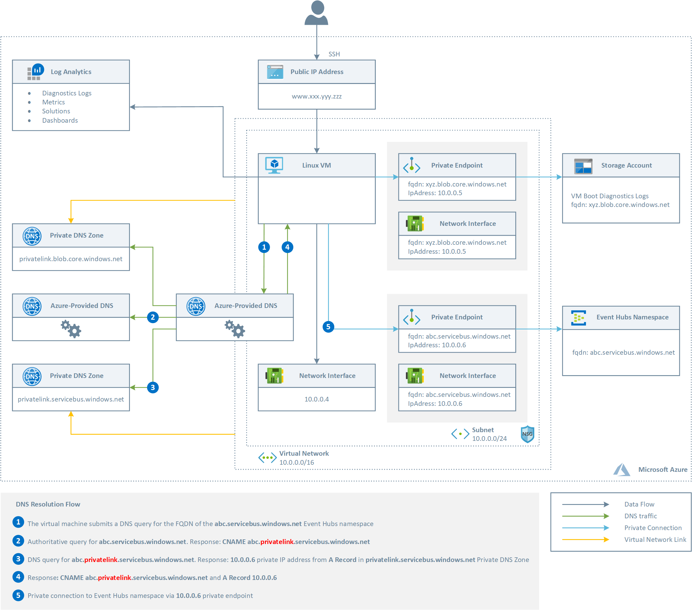
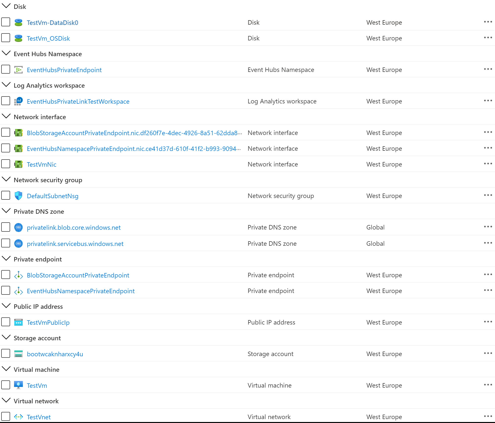
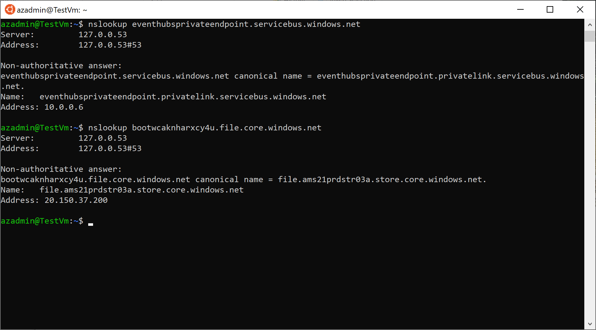

# Connect to an Event Hubs namespace via a Private Endpoint #

This sample demonstrates how to create a Linux Virtual Machine in a virtual network that privately accesses an Event Hubs namespace using an [Azure Private Endpoint](https://docs.microsoft.com/en-us/azure/private-link/private-endpoint-overview). Azure Private Endpoint is a network interface that connects you privately and securely to a service powered by Azure Private Link. Private Endpoint uses a private IP address from your virtual network, effectively bringing the service into your virtual network. The service could be an Azure service such as Azure Storage, Azure Cosmos DB, SQL, etc. or your own Private Link Service. For more information, see [What is Azure Private Link?](https://docs.microsoft.com/en-us/azure/private-link/private-link-overview). For more information on the DNS configuration of a private endpoint, see [Azure Private Endpoint DNS configuration](https://docs.microsoft.com/en-us/azure/private-link/private-endpoint-dns).

## Architecture ##

The following picture shows the architecture and network topology of the sample.

The ARM template deploys the following Azure resources:

- Virtual Network: this virtual network has a single subnet that hosts a Linux (Ubuntu) virtual machine
- Network Security Group: this resource contains an inbound rule to allow the access to the virtual machine on port 22 (SSH)
- A Linux virtual machine used to test the private endpoint
- A Public IP for the Linux virtual machine
- The NIC used by the Linux virtual machine that makes use of the Public IP
- A Linux virtual machine used for testing the connectivity to the storage account via a private endpoint
- A Log Analytics workspace used to monitor the health status of the Linux virtual machine
- A Blob Storage Account used to store the boot diagnostics log of the virtual machine
- An Event Hubs namespace
- A Private DNS Zone for Blob private endpoints
- A Private DNS Zone for Event Hubs private endpoints
- A Private Endpoint to let the virtual machine access the Blob Storage Account via a private address
- A Private Endpoint to let the virtual machine access the messaging entities in the Event Hubs namespace via a private address
- A Private DNS Zone Group for the Event Hubs private endpoint
- A Private DNS Zone Group for the Blob Storage Account private endpoint

The [PrivateDnsZoneGroup](https://docs.microsoft.com/en-us/azure/templates/microsoft.network/privateendpoints/privateDnsZoneGroups) resource type establishes a relationship between the Private Endpoint and the Private the privatelink.* DNS zone for the name resolution of the fully qualified name of the resource referenced by the Private Endpoint.

- When creating a Private Endpoint, the related A record will automatically be created in the target Private DNS Zone with the private IP address of the network interface associated to the Private Endpoint and the name of the Azure resource referenced by the Private Endpoint
- When deleting a Private Endpoint, the related A record gets automatically deleted from the corresponding Private DNS Zone.

The ARM template uses the [Azure Custom Script Extension](https://docs.microsoft.com/en-us/azure/virtual-machines/extensions/custom-script-linux) to download and run the following [Bash script](scripts/eventhubs_nslookup.sh) on the virtual machine. The script performs the following steps:

- Validates the parameters received by the Custom Script extension
- Updates the system and upgrades packages
- Runs the nslookup command against the public URL of the Storage Account to verify that this gets resolved to a private address
- Runs the nslookup command against the public URL of the Event Hubs namespace to verify that this gets resolved to a private address

## Deployment ##

The following figure shows the resources deployed by the ARM template in the target resource group.

## Testing ##

If you open an ssh session to the Linux virtual machine and manually run the nslookup command, you should see an output like the the following:

