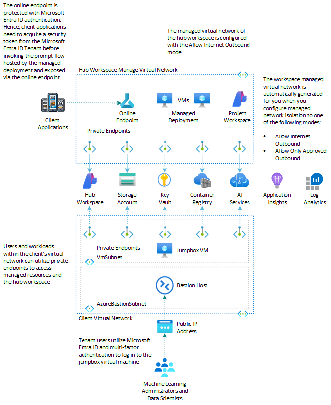
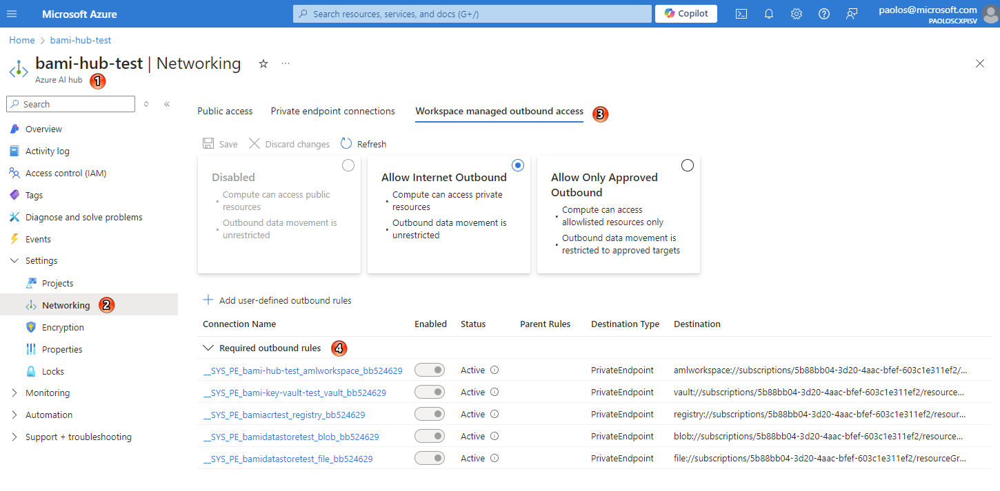
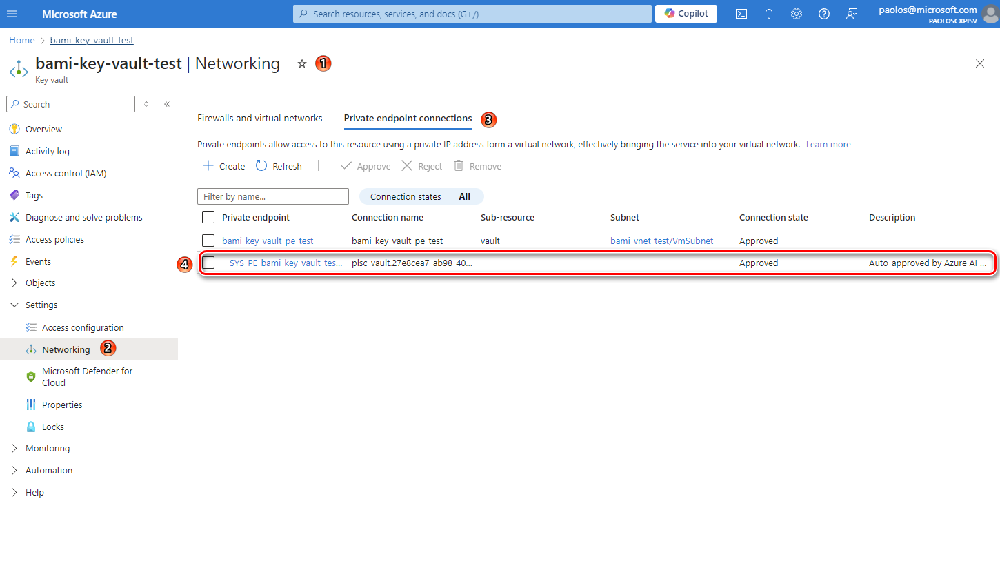
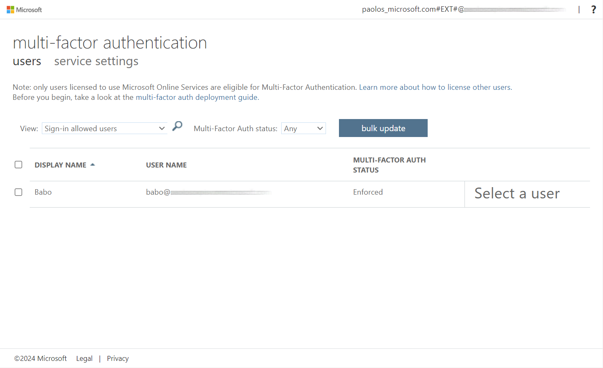
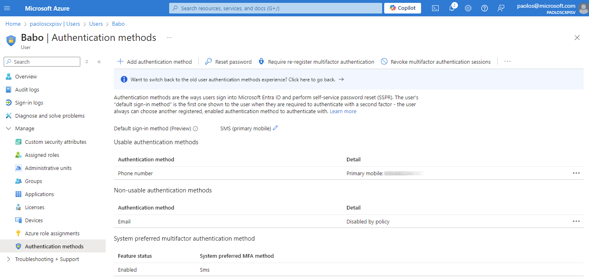

# Deploy Secure Azure AI Foundry with a managed virtual network


[](https://portal.azure.com/#create/Microsoft.Template/uri/https%3A%2F%2Fraw.githubusercontent.com%2FAzure%2Fazure-quickstart-templates%2Fmaster%2Fquickstarts%2Fmicrosoft.machinelearningservices%2Faifoundry-networking-aoao%2Fazuredeploy.json)
[](http://armviz.io/#/?load=https%3A%2F%2Fraw.githubusercontent.com%2FAzure%2Fazure-quickstart-templates%2Fmaster%2Fquickstarts%2Fmicrosoft.machinelearningservices%2Faifoundry-networking-aoao%2Fazuredeploy.json)

This collection of [Bicep](https://learn.microsoft.com/en-us/azure/azure-resource-manager/bicep/file) templates demonstrates how to set up an [Azure AI Foundry](https://learn.microsoft.com/en-us/azure/ai-foundry/what-is-ai-foundry) environment with managed identity and Azure RBAC to connected [Azure AI Services](https://learn.microsoft.com/en-us/azure/ai-services/what-are-ai-services) and dependent resources and with the managed virtual network isolation mode set to [Allow Internet Outbound](https://learn.microsoft.com/en-us/azure/ai-foundry/how-to/configure-managed-network). For more information, see [How to configure a managed network for Azure AI Foundry hubs](https://learn.microsoft.com/en-us/azure/ai-foundry/how-to/configure-managed-network).

## Azure Resources

The Bicep modules deploy the following Azure resources:



| Resource                    | Type                                                                                                                                                                    | Description                                                                                                                                                 |
| --------------------------- | ----------------------------------------------------------------------------------------------------------------------------------------------------------------------- | ----------------------------------------------------------------------------------------------------------------------------------------------------------- |
| Azure Application Insights  | [Microsoft.Insights/components](https://learn.microsoft.com/en-us/azure/templates/microsoft.insights/components?pivots=deployment-language-bicep)                       | An Azure Application Insights instance associated with the Azure AI Foundry workspace                                                                        |
| Azure Monitor Log Analytics | [Microsoft.OperationalInsights/workspaces](https://learn.microsoft.com/en-us/azure/templates/microsoft.operationalinsights/workspaces?pivots=deployment-language-bicep) | An Azure Log Analytics workspace used to collect diagnostics logs and metrics from Azure resources                                                          |
| Azure Key Vault             | [Microsoft.KeyVault/vaults](https://learn.microsoft.com/en-us/azure/templates/microsoft.keyvault/vaults?pivots=deployment-language-bicep)                               | An Azure Key Vault instance associated with the Azure AI Foundry workspace                                                                                   |
| Azure Storage Account       | [Microsoft.Storage/storageAccounts](https://learn.microsoft.com/en-us/azure/templates/microsoft.storage/storageaccounts)                                                | An Azure Storage instance associated with the Azure AI Foundry workspace                                                                                     |
| Azure Container Registry    | [Microsoft.ContainerRegistry/registries](https://learn.microsoft.com/en-us/azure/templates/microsoft.containerregistry/registries)                                      | An Azure Container Registry instance associated with the Azure AI Foundry workspace                                                                          |
| Azure AI Hub / Project      | [Microsoft.MachineLearningServices/workspaces](https://learn.microsoft.com/en-us/azure/templates/microsoft.machinelearningservices/workspaces)                          | An Azure AI Foundry Hub and Project (Azure ML Workspace of kind 'hub' and 'project')                                                                         |
| Azure AI Services           | [Microsoft.CognitiveServices/accounts](https://learn.microsoft.com/en-us/azure/templates/microsoft.cognitiveservices/accounts)                                          | An Azure AI Services as the model-as-a-service endpoint provider including GPT-4o and ADA Text Embeddings model deployments                                 |
| Azure Virtual Network       | [Microsoft.Network/virtualNetworks](https://learn.microsoft.com/en-us/azure/templates/microsoft.network/virtualnetworks?pivots=deployment-language-bicep)               | A bring-your-own (BYO) virtual network hosting a jumpbox virtual machine to manage Azure AI Foundry                                                          |
| Azure Bastion Host          | [Microsoft.Network/virtualNetworks](https://docs.microsoft.com/en-us/azure/templates/microsoft.network/bastionhosts)                                                    | A Bastion Host defined in the BYO virtual network that provides RDP connectivity to the jumpbox virtual machine                                             |
| Azure NAT Gateway           | [Microsoft.Network/natGateways](https://learn.microsoft.com/en-us/azure/virtual-network/nat-gateway/nat-overview)                                                       | An Azure NAT Gateway that provides outbound connectivity to the jumpbox virtual machine                                                                     |
| Azure Private Endpoints     | [Microsoft.Network/privateEndpoints](https://docs.microsoft.com/en-us/azure/templates/microsoft.network/privateendpoints)                                               | Azure Private Endpoints defined in the BYO virtual network for Azure Container Registry, Azure Key Vault, Azure Storage Account, and Azure AI Hub Workspace |
| Azure Private DNS Zones     | [Microsoft.Network/privateDnsZones](https://docs.microsoft.com/en-us/azure/templates/microsoft.network/privatednszones)                                                 | Azure Private DNS Zones are used for the DNS resolution of the Azure Private Endpoints                                                                      |

> [!NOTE]
> You can select a different version of the GPT model by specifying the `openAiDeployments` parameter in the [main.bicepparam](./main.bicepparam) parameters file. For details on the models available in various Azure regions, please refer to the [Azure OpenAI Service models](https://learn.microsoft.com/en-us/azure/ai-services/openai/concepts/models) documentation.

## Network isolation architecture and isolation modes

When you enable managed virtual network isolation, a managed virtual network is created for the hub workspace. Any managed compute resources you create for the hub, for example the virtual machines of online endpoint managed deployment, will automatically use this managed virtual network. The managed virtual network can also utilize [Azure Private Endpoints](https://learn.microsoft.com/en-us/azure/private-link/private-endpoint-overview) for Azure resources that your hub depends on, such as Azure Storage, Azure Key Vault, and Azure Container Registry.

There are three different configuration modes for outbound traffic from the managed virtual network:

| Outbound mode                | Description                                                           | Scenarios                                                                                                                                                                                                                                              |
| ---------------------------- | --------------------------------------------------------------------- | ------------------------------------------------------------------------------------------------------------------------------------------------------------------------------------------------------------------------------------------------------ |
| Allow internet outbound      | Allow all internet outbound traffic from the managed virtual network. | You want unrestricted access to machine learning resources on the internet, such as python packages or pretrained models.                                                                                                                              |
| Allow only approved outbound | Outbound traffic is allowed by specifying service tags.               | You want to minimize the risk of data exfiltration, but you need to prepare all required machine learning artifacts in your private environment.</br>\* You want to configure outbound access to an approved list of services, service tags, or FQDNs. |
| Disabled                     | Inbound and outbound traffic isn't restricted.                        | You want public inbound and outbound from the hub.                                                                                                                                                                                                     |

This set of [Bicep](https://learn.microsoft.com/en-us/azure/azure-resource-manager/bicep/file) templates demonstrates how to deploy an Azure AI Foundry environment with the hub workspace's managed network isolation mode configured to `Allow Internet Outbound`.

The [Azure Private Endpoints](https://learn.microsoft.com/en-us/azure/private-link/private-endpoint-overview) and [Private DNS Zones](https://docs.microsoft.com/en-us/azure/templates/microsoft.network/privatednszones) in the hub workspace managed virtual network are automatically created for you, while the Bicep templates create the [Azure Private Endpoints](https://learn.microsoft.com/en-us/azure/private-link/private-endpoint-overview) and relative [Private DNS Zones](https://docs.microsoft.com/en-us/azure/templates/microsoft.network/privatednszones) in the client virtual network.

## Managed Virtual Network

When you provision the hub workspace of your Azure AI Foundry with an isolation mode equal to the [Allow Internet Outbound](https://learn.microsoft.com/en-us/azure/ai-foundry/how-to/configure-managed-network?tabs=portal#configure-a-managed-virtual-network-to-allow-internet-outbound) isolation mode, the managed virtual network and the Azure Private Endpoints to the dependent resources will not be created if public network access of Azure Key Vault, Azure Container Registry, and Azure Storage Account dependent resources is enabled.

The creation of the managed virtual network is deferred until a compute resource is created or provisioning is manually started. When allowing automatic creation, it can take around 30 minutes to create the first compute resource as it is also provisioning the network. For more information, see [Manually provision workspace managed VNet](https://learn.microsoft.com/en-us/azure/machine-learning/how-to-managed-network?view=azureml-api-2#manually-provision-a-managed-vnet).

If you initially create Azure Key Vault, Azure Container Registry, and Azure Storage Account dependent resources with public network enabled and then decide to disable it later, the managed virtual network will not be automatically provisioned if it is not already provisioned, and the private endpoints to the dependent resources will not be created.

In this case, if you want o create the private endpoints to the dependent resources, you need to reprovision the hub manage virtual network in one of the following ways:

- Redeploy the hub workspace using Bicep or Terraform templates. If the isolation mode is set to [Allow Internet Outbound](https://learn.microsoft.com/en-us/azure/ai-foundry/how-to/configure-managed-network?tabs=portal#configure-a-managed-virtual-network-to-allow-internet-outbound) and the dependent resources referenced by the hub workspace have public network access disabled, this operation will trigger the creation of the managed virtual network, if it does not already exist, and the private endpoints to the dependent resources.
- Execute the following Azure CLI command [az ml workspace provision-network](https://learn.microsoft.com/en-us/cli/azure/ml/workspace?view=azure-cli-latest#az-ml-workspace-provision-network) to reprovision the managed virtual network. The private endpoints will be created with the managed virtual network if the public network access of the dependent resources is disabled.

```bash
az ml workspace provision-network --name my_hub_workspace_name --resource-group
```

At this time, it's not possible to directly access the managed virtual network via the Azure CLI or the Azure Portal. You can see the managed virtual network indirectly by looking at the private endpoints, if any, under the hub workspace. You can proceed as follows:

1. Go to the Azure Portal and select your Azure AI hub.
2. Click on `Settings` and then `Networking`.
3. Open the `Workspace managed outbound access` tab.
4. Expand the section titled `Required outbound rules`.

Here, you will find the private endpoints that are connected to the resources within the hub managed virtual network. Ensure that these private endpoints are active.



You can also see the private endpoints hosted by the manage virtual network of your hub workspace inside the `Networking` settings of individual dependent resources, for example Key Vault:

1. Go to the Azure Portal and select your Azure Key Vault.
2. Click on `Settings` and then `Networking`.
3. Open the `Private endpoint connections` tab.

Here, you will find the private endpoint created by the Bicep templates in the client virtual network along with the private endpoint created in the hub managed virtual network of the hub. 



Also note that when you create a hub workspace with the [Allow Internet Outbound](https://learn.microsoft.com/en-us/azure/ai-foundry/how-to/configure-managed-network?tabs=portal#configure-a-managed-virtual-network-to-allow-internet-outbound) isolation mode, the creation of the managed network is not immediate to save costs. The managed virtual network needs to be manually triggered via the [az ml workspace provision-network](https://learn.microsoft.com/en-us/cli/azure/ml/workspace?view=azure-cli-latest#az-ml-workspace-provision-network) command, or it will be triggered when you create a compute resource or private endpoints to dependent resources.

At this time, the creation of an online endpoint does not automatically trigger the creation of a managed virtual network. An error occurs if you try to create an online deployment under the workspace which enabled workspace managed VNet but the managed VNet is not provisioned yet. Workspace managed VNet should be provisioned before you create an online deployment. Follow instructions to manually provision the workspace managed VNet. Once completed, you may start creating online deployments. For more information, see Network isolation with managed online endpoint and Secure your managed online endpoints with network isolation.

## Limitations

The current limitations of managed virtual network are:

- Azure AI Foundry currently doesn't support bringing your own virtual network, it only supports managed virtual network isolation.
- Once you enable managed virtual network isolation of your Azure AI, you can't disable it.
- Managed virtual network uses private endpoint connections to access your private resources. You can't have a private endpoint and a service endpoint at the same time for your Azure resources, such as a storage account. We recommend using private endpoints in all scenarios.
- The managed virtual network is deleted when the Azure AI is deleted.
- Data exfiltration protection is automatically enabled for the only approved outbound mode. If you add other outbound rules, such as to FQDNs, Microsoft can't guarantee that you're protected from data exfiltration to those outbound destinations.
- Using FQDN outbound rules increases the cost of the managed virtual network because FQDN rules use Azure Firewall. For more information, see [Pricing](https://learn.microsoft.com/en-us/azure/ai-foundry/how-to/configure-managed-network?tabs=portal#pricing).
- FQDN outbound rules only support ports 80 and 443.
- When using a compute instance with a managed network, use the `az ml compute connect-ssh` command to connect to the compute using SSH.

## Pricing

According to the [documentation](https://learn.microsoft.com/en-us/azure/ai-foundry/how-to/configure-managed-network?tabs=portal#pricing), the hub managed virtual network feature is free. However, you will be charged for the following resources used by the managed virtual network:

- Azure Private Link - Private endpoints used to secure communications between the managed virtual network and Azure resources rely on Azure Private Link. For more information on pricing, see [Azure Private Link pricing](https://azure.microsoft.com/pricing/details/private-link/).
- FQDN outbound rules - FQDN outbound rules are implemented using Azure Firewall. If you use outbound FQDN rules, charges for Azure Firewall are included in your billing. Azure Firewall SKU is standard. Azure Firewall is provisioned per hub.

> [!NOTE]
> The firewall isn't created until you add an outbound FQDN rule. If you don't use FQDN rules, you will not be charged for Azure Firewall. For more information on pricing, see [Azure Firewall pricing](https://azure.microsoft.com/pricing/details/azure-firewall/).

## Secure Access to the Jumpbox Virtual Machine

The jumpbox virtual machine is deployed with Windows 11 operating system and the `Microsoft.Azure.ActiveDirectory` VM extension, a specialized extension for integrating Azure virtual machines (VMs) with Microsoft Entra ID. This integration provides several key benefits, particularly in enhancing security and simplifying access management. Here's an overview of what the Microsoft.Azure.ActiveDirectory VM extension offers:

`Microsoft.Azure.ActiveDirectory` VM extension is specialized for integrating Azure virtual machines (VMs) with Microsoft Entra ID. This integration provides several key benefits, particularly in enhancing security and simplifying access management. Here's an overview of the features and benefits of this VM extension:

- Enables users to sign in to a Windows or Linux virtual machine using their Microsoft Entra ID credentials.
- Facilitates single sign-on (SSO) experiences, reducing the need for managing separate local VM accounts.
- Supports multi-factor authentication, increasing security by requiring additional verification steps during login.
- Integrates with Azure RBAC, allowing administrators to assign specific roles to users, thereby controlling the level of access and permissions on the virtual machine.
- Allows administrators to apply conditional access policies to the VM, enhancing security by enforcing controls such as trusted device requirements, location-based access, and more.
- Eliminates the need to manage local administrator accounts, simplifying VM management and reducing overhead.

For more information, see [Sign in to a Windows virtual machine in Azure by using Microsoft Entra ID including passwordless](https://learn.microsoft.com/en-us/entra/identity/devices/howto-vm-sign-in-azure-ad-windows).

Make sure to enforce multi-factor authentication on your user account in your Microsoft Entra ID Tenant, as shown in the following screenshot:



Then, specify at least an authentication method in addition to the password for the user account, for example the phone number, as shown in the following screenshot:



To log in to the jumpbox virtual machine using a Microsoft Entra ID tenant user, you need to assign one of the following Azure roles to determine who can access the VM. To assign these roles, you must have the [Virtual Machine Data Access Administrator](https://learn.microsoft.com/en-us/azure/role-based-access-control/built-in-roles#virtual-machine-data-access-administrator-preview) role, or any role that includes the `Microsoft.Authorization/roleAssignments/write` action, such as the [Role Based Access Control Administrator](https://learn.microsoft.com/en-us/azure/role-based-access-control/built-in-roles#role-based-access-control-administrator-preview) role. If you choose a role other than the Virtual Machine Data Access Administrator, it is recommended to [add a condition to limit the permission to create role assignments](https://learn.microsoft.com/en-us/azure/role-based-access-control/delegate-role-assignments-overview).

- [Virtual Machine Administrator Login](https://learn.microsoft.com/en-us/azure/role-based-access-control/built-in-roles/compute#virtual-machine-administrator-login): Users who have this role assigned can sign in to an Azure virtual machine with administrator privileges.
- [Virtual Machine User Login](https://learn.microsoft.com/en-us/azure/role-based-access-control/built-in-roles/compute#virtual-machine-user-login): Users who have this role assigned can sign in to an Azure virtual machine with regular user privileges.

To allow a user to sign in to the jumpbox virtual machine over RDP, you must assign the `Virtual Machine Administrator Login` or `Virtual Machine User Login` role to the user at the subscription, resource group, or virtual machine level. The `virtualMachine.bicep` module assigns the `Virtual Machine Administrator Login` to the user identified by the `userObjectId` parameter.

To log in to the jumpbox virtual machine via Azure Bastion Host using a Microsoft Entra ID tenant user with multi-factor authentication, you can use the [az network bastion rdp](https://learn.microsoft.com/en-us/cli/azure/network/bastion?view=azure-cli-latest#az-network-bastion-rdp) command as follows:

```bash
az network bastion rdp \
    --name <bastion-host-name> \
    --resource-group <resource-group-name> \
    --target-resource-id <virtual-machine-resource-id> \
    --auth-type AAD
```

After logging in to the virtual machine, if you open the Edge browser and navigate to the Azure Portal or Azure AI Foundry, the browser profile will automatically be configured to the tenant user account used for the VM login.

## Bicep Parameters

Specify a value for the required parameters in the [main.bicepparam](./main.bicepparam) parameters file before deploying the Bicep modules. Here is the markdown table extrapolating the name, type, and description of the parameters from the provided Bicep code:

| Name                                      | Type   | Description                                                                                                                 |
| ----------------------------------------- | ------ | --------------------------------------------------------------------------------------------------------------------------- |
| prefix                                    | string | Specifies the name prefix for all the Azure resources.                                                                      |
| suffix                                    | string | Specifies the name suffix for all the Azure resources.                                                                      |
| location                                  | string | Specifies the location for all the Azure resources.                                                                         |
| hubName                                   | string | Specifies the name Azure AI Hub workspace.                                                                                  |
| hubFriendlyName                           | string | Specifies the friendly name of the Azure AI Hub workspace.                                                                  |
| hubDescription                            | string | Specifies the description for the Azure AI Hub workspace displayed in Azure AI Foundry.                                      |
| hubIsolationMode                          | string | Specifies the isolation mode for the managed network of the Azure AI Hub workspace.                                         |
| hubPublicNetworkAccess                    | string | Specifies the public network access for the Azure AI Hub workspace.                                                         |
| connectionAuthType                        | string | Specifies the authentication method for the OpenAI Service connection.                                                      |
| systemDatastoresAuthMode                  | string | Determines whether to use credentials for the system datastores of the workspace workspaceblobstore and workspacefilestore. |
| projectName                               | string | Specifies the name for the Azure AI Foundry Hub Project workspace.                                                           |
| projectFriendlyName                       | string | Specifies the friendly name for the Azure AI Foundry Hub Project workspace.                                                  |
| projectPublicNetworkAccess                | string | Specifies the public network access for the Azure AI Project workspace.                                                     |
| logAnalyticsName                          | string | Specifies the name of the Azure Log Analytics resource.                                                                     |
| logAnalyticsSku                           | string | Specifies the service tier of the workspace: Free, Standalone, PerNode, Per-GB.                                             |
| logAnalyticsRetentionInDays               | int    | Specifies the workspace data retention in days.                                                                             |
| applicationInsightsName                   | string | Specifies the name of the Azure Application Insights resource.                                                              |
| aiServicesName                            | string | Specifies the name of the Azure AI Services resource.                                                                       |
| aiServicesSku                             | object | Specifies the resource model definition representing SKU.                                                                   |
| aiServicesIdentity                        | object | Specifies the identity of the Azure AI Services resource.                                                                   |
| aiServicesCustomSubDomainName             | string | Specifies an optional subdomain name used for token-based authentication.                                                   |
| aiServicesDisableLocalAuth                | bool   | Specifies whether to disable the local authentication via API key.                                                          |
| aiServicesPublicNetworkAccess             | string | Specifies whether or not public endpoint access is allowed for this account.                                                |
| openAiDeployments                         | array  | Specifies the OpenAI deployments to create.                                                                                 |
| keyVaultName                              | string | Specifies the name of the Azure Key Vault resource.                                                                         |
| keyVaultNetworkAclsDefaultAction          | string | Specifies the default action of allow or deny when no other rules match for the Azure Key Vault resource.                   |
| keyVaultEnabledForDeployment              | bool   | Specifies whether the Azure Key Vault resource is enabled for deployments.                                                  |
| keyVaultEnabledForDiskEncryption          | bool   | Specifies whether the Azure Key Vault resource is enabled for disk encryption.                                              |
| keyVaultEnabledForTemplateDeployment      | bool   | Specifies whether the Azure Key Vault resource is enabled for template deployment.                                          |
| keyVaultEnableSoftDelete                  | bool   | Specifies whether soft delete is enabled for this Azure Key Vault resource.                                                 |
| keyVaultEnablePurgeProtection             | bool   | Specifies whether purge protection is enabled for this Azure Key Vault resource.                                            |
| keyVaultEnableRbacAuthorization           | bool   | Specifies whether to enable the RBAC authorization for the Azure Key Vault resource.                                        |
| keyVaultSoftDeleteRetentionInDays         | int    | Specifies the soft delete retention in days.                                                                                |
| acrName                                   | string | Specifies the name of the Azure Container Registry resource.                                                                |
| acrAdminUserEnabled                       | bool   | Enable admin user that have push/pull permission to the registry.                                                           |
| acrPublicNetworkAccess                    | string | Specifies whether to allow public network access. Defaults to Enabled.                                                      |
| acrSku                                    | string | Specifies the tier of your Azure Container Registry.                                                                        |
| acrAnonymousPullEnabled                   | bool   | Specifies whether or not registry-wide pull is enabled from unauthenticated clients.                                        |
| acrDataEndpointEnabled                    | bool   | Specifies whether or not a single data endpoint is enabled per region for serving data.                                     |
| acrNetworkRuleSet                         | object | Specifies the network rule set for the container registry.                                                                  |
| acrNetworkRuleBypassOptions               | string | Specifies whether to allow trusted Azure services to access a network-restricted registry.                                  |
| acrZoneRedundancy                         | string | Specifies whether or not zone redundancy is enabled for this container registry.                                            |
| storageAccountName                        | string | Specifies the name of the Azure Storage Account resource.                                                                   |
| storageAccountAccessTier                  | string | Specifies the access tier of the Azure Storage Account resource. The default value is Hot.                                  |
| storageAccountAllowBlobPublicAccess       | bool   | Specifies whether the Azure Storage Account resource allows public access to blobs. The default value is false.             |
| storageAccountAllowSharedKeyAccess        | bool   | Specifies whether the Azure Storage Account resource allows shared key access. The default value is true.                   |
| storageAccountAllowCrossTenantReplication | bool   | Specifies whether the Azure Storage Account resource allows cross-tenant replication. The default value is false.           |
| storageAccountMinimumTlsVersion           | string | Specifies the minimum TLS version to be permitted on requests to the Azure Storage account. The default value is TLS1_2.    |
| storageAccountANetworkAclsDefaultAction   | string | The default action of allow or deny when no other rules match.                                                              |
| storageAccountSupportsHttpsTrafficOnly    | bool   | Specifies whether the Azure Storage Account resource should only support HTTPS traffic.                                     |
| virtualNetworkResourceGroupName           | string | Specifies the name of the resource group hosting the virtual network and private endpoints.                                 |
| virtualNetworkName                        | string | Specifies the name of the virtual network.                                                                                  |
| virtualNetworkAddressPrefixes             | string | Specifies the address prefixes of the virtual network.                                                                      |
| vmSubnetName                              | string | Specifies the name of the subnet which contains the virtual machine.                                                        |
| vmSubnetAddressPrefix                     | string | Specifies the address prefix of the subnet which contains the virtual machine.                                              |
| vmSubnetNsgName                           | string | Specifies the name of the network security group associated with the subnet hosting the virtual machine.                    |
| bastionSubnetAddressPrefix                | string | Specifies the Bastion subnet IP prefix. This prefix must be within the virtual network IP prefix address space.             |
| bastionSubnetNsgName                      | string | Specifies the name of the network security group associated with the subnet hosting Azure Bastion.                          |
| bastionHostEnabled                        | bool   | Specifies whether Azure Bastion should be created.                                                                          |
| bastionHostName                           | string | Specifies the name of the Azure Bastion resource.                                                                           |
| bastionHostDisableCopyPaste               | bool   | Enable/Disable Copy/Paste feature of the Bastion Host resource.                                                             |
| bastionHostEnableFileCopy                 | bool   | Enable/Disable File Copy feature of the Bastion Host resource.                                                              |
| bastionHostEnableIpConnect                | bool   | Enable/Disable IP Connect feature of the Bastion Host resource.                                                             |
| bastionHostEnableShareableLink            | bool   | Enable/Disable Shareable Link of the Bastion Host resource.                                                                 |
| bastionHostEnableTunneling                | bool   | Enable/Disable Tunneling feature of the Bastion Host resource.                                                              |
| bastionPublicIpAddressName                | string | Specifies the name of the Azure Public IP Address used by the Azure Bastion Host.                                           |
| bastionHostSkuName                        | string | Specifies the name of the Azure Bastion Host SKU.                                                                           |
| natGatewayName                            | string | Specifies the name of the Azure NAT Gateway.                                                                                |
| natGatewayZones                           | array  | Specifies a list of availability zones denoting the zone in which the NAT Gateway should be deployed.                       |
| natGatewayPublicIps                       | int    | Specifies the number of Public IPs to create for the Azure NAT Gateway.                                                     |
| natGatewayIdleTimeoutMins                 | int    | Specifies the idle timeout in minutes for the Azure NAT Gateway.                                                            |
| blobStorageAccountPrivateEndpointName     | string | Specifies the name of the private link to the blob storage account.                                                         |
| fileStorageAccountPrivateEndpointName     | string | Specifies the name of the private link to the file storage account.                                                         |
| keyVaultPrivateEndpointName               | string | Specifies the name of the private link to the Key Vault.                                                                    |
| acrPrivateEndpointName                    | string | Specifies the name of the private link to the Azure Container Registry.                                                     |
| hubWorkspacePrivateEndpointName           | string | Specifies the name of the private link to the Azure Hub Workspace.                                                          |
| vmName                                    | string | Specifies the name of the virtual machine.                                                                                  |
| vmSize                                    | string | Specifies the size of the virtual machine.                                                                                  |
| imagePublisher                            | string | Specifies the image publisher of the disk image used to create the virtual machine.                                         |
| imageOffer                                | string | Specifies the offer of the platform image or marketplace image used to create the virtual machine.                          |
| imageSku                                  | string | Specifies the image version for the virtual machine.                                                                        |
| authenticationType                        | string | Specifies the type of authentication when accessing the virtual machine. SSH key is recommended.                            |
| vmAdminUsername                           | string | Specifies the name of the administrator account of the virtual machine.                                                     |
| vmAdminPasswordOrKey                      | string | Specifies the SSH Key or password for the virtual machine. SSH key is recommended.                                          |
| diskStorageAccountType                    | string | Specifies the storage account type for OS and data disk.                                                                    |
| numDataDisks                              | int    | Specifies the number of data disks of the virtual machine.                                                                  |
| osDiskSize                                | int    | Specifies the size in GB of the OS disk of the VM.                                                                          |
| dataDiskSize                              | int    | Specifies the size in GB of the data disk of the virtual machine.                                                           |
| dataDiskCaching                           | string | Specifies the caching requirements for the data disks.                                                                      |
| enableMicrosoftEntraIdAuth                | bool   | Specifies whether to enable Microsoft Entra ID authentication on the virtual machine.                                       |
| enableAcceleratedNetworking               | bool   | Specifies whether to enable accelerated networking on the virtual machine.                                                  |
| tags                                      | object | Specifies the resource tags for all the resources.                                                                          |
| userObjectId                              | string | Specifies the object ID of a Microsoft Entra ID user.                                                                       |

We suggest reading sensitive configuration data such as passwords or SSH keys from a pre-existing Azure Key Vault resource. For more information, see [Create parameters files for Bicep deployment](https://learn.microsoft.com/en-us/azure/azure-resource-manager/bicep/parameter-files?tabs=Bicep)

## Learn More

For more information, see:

- [Azure AI Foundry Documentation](https://aka.ms/aistudio/docs)`Tags: ``Tags: `