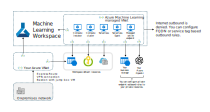

# Azure AI Studio Network Restricted


[](https://portal.azure.com/#create/Microsoft.Template/uri/https%3A%2F%2Fraw.githubusercontent.com%2FAzure%2Fazure-quickstart-templates%2Fmaster%2Fquickstarts%2Fmicrosoft.machinelearningservices%2Fmachine-learning-network-restricted%2Fazuredeploy.json)
[](http://armviz.io/#/?load=https%3A%2F%2Fraw.githubusercontent.com%2FAzure%2Fazure-quickstart-templates%2Fmaster%2Fquickstarts%2Fmicrosoft.machinelearningservices%2Fmachine-learning-network-restricted%2Fazuredeploy.json)

This set of templates demonstrates how to set up Azure AI Studio with a network-restricted configuration, meaning with public internet access disabled and egress disabled. It uses Microsoft-managed keys for encryption and Microsoft-managed identity configuration for the Azure ML resource. Customization is required to create rules for the managed outbound access, and setup does not include additional rules to facilitate traffic access to the managed VNet. This template works as-is.



## Limitations

Limitations are maintained and kept up-to-date [here](https://learn.microsoft.com/en-us/azure/ai-studio/how-to/configure-private-link?source=recommendations&tabs=azure-portal#limitations):

* You might encounter problems trying to access the private endpoint for your workspace if you're using Mozilla Firefox. This problem might be related to DNS over HTTPS in Mozilla Firefox. We recommend using Microsoft Edge or Google Chrome.

## Pre-requisites

This template expects that you have private VNet setup for your organization, and that you have traffic patterns established to access it securely. You must have access to creating private endpoints for the VNet setup you wish to connect.

## Resources

| Provider and type | Description |
| - | - |
| `Microsoft.Resources/resourceGroups` | The resource group all resources get deployed into |
| `Microsoft.Insights/components` | An Azure Application Insights instance associated with the Azure Machine Learning workspace |
| `Microsoft.KeyVault/vaults` | An Azure Key Vault instance associated with the Azure Machine Learning workspace |
| `Microsoft.Storage/storageAccounts` | An Azure Storage instance associated with the Azure Machine Learning workspace |
| `Microsoft.ContainerRegistry/registries` | An Azure Container Registry instance associated with the Azure Machine Learning workspace |
| `Microsoft.MachineLearningServices/workspaces` | An Azure Machine Learning workspace to build and deploy assets into |
| `Microsoft.CognitiveServices/accounts` | An Azure AI Services as the model-as-a-service endpoint provider (allowed kinds: 'AIServices' and 'OpenAI') |

## Deployment

With Azure CLI:

```sh
# Pre-reqs, if required
az group create --name networkRg --location westus
az deployment group create --resource-group networkRg --template-file prereqs/prereq.main.bicep

# Main Deployment
az group create --name privateAiHub --location westus
az deployment group create --resource-group privateAiHub --template-file main.bicep
```

## Learn more

If you are new to Azure AI Studio, see:

- [Azure AI Studio](https://aka.ms/aistudio/docs)`Tags: `