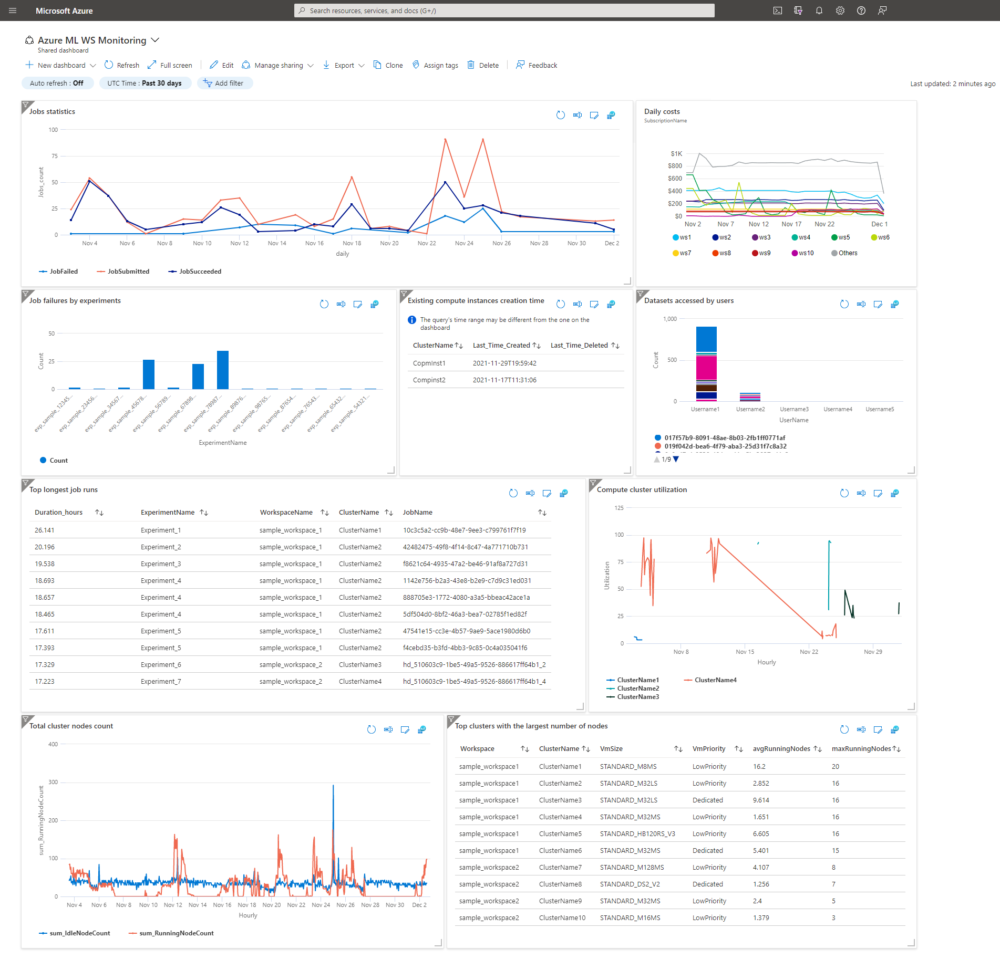

# Create an Azure ML monitoring dashboard

   

This template creates an Azure Machine Learning dashboard using existing Log Analytics diagnostics data. 

Sample view:

 If you don't have Log Analytics Data for Azure Machine Learning Workspace yet, please consider:
 - [Creating Diagnostics Settings for Azure Machine Learning](https://docs.microsoft.com/en-us/azure/machine-learning/monitor-azure-machine-learning#collection-and-routing)
 - [Creating Diagnostics Settings for Azure Machine Learning using Azure policy](https://github.com/Azure/data-management-zone/blob/main/docs/guidance/EnterpriseScaleAnalytics-Policies.md#all-services)

If you are new to Azure Machine Learning, see:

- [Azure Machine Learning service](https://azure.microsoft.com/services/machine-learning-service/)
- [Azure Machine Learning documentation](https://docs.microsoft.com/azure/machine-learning/)
- [Azure Machine Learning template reference](https://docs.microsoft.com/azure/templates/microsoft.machinelearningservices/allversions)
- [Quickstart templates](https://azure.microsoft.com/resources/templates/)

If you are new to template development, see:

- [Azure Resource Manager documentation](https://docs.microsoft.com/azure/azure-resource-manager/)
- [Create an Azure Machine Learning service workspace by using a template](https://docs.microsoft.com/azure/machine-learning/service/how-to-create-workspace-template)

Tags: Azure Machine Learning, Machine Learning, Monitoring, Azure Dashboard, Azure Log Analytics, Resource Manager templates, ARM templates

 