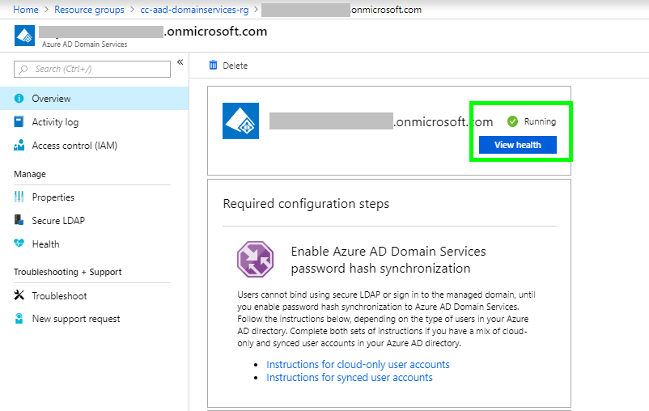
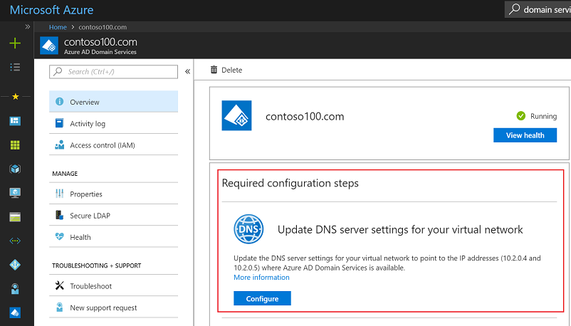

# Azure Active Directory Domain Service (AADDS) template 

 

 
## Table of Contents

1. [Overview](#overview)
2. [Important Notes](#importantnotes)
3. [Pre Deployment Steps](#predeployment)
4. [Deployment](#deployment)
5. [Post Deployment Steps](#postdeployment)
6. [Teardown Deployment](#teardown)
7. [References](#references)

<a name="overview">

## Overview
This template provisions an Azure Active Directory Domain Service (AADDS) with required VNET and NSG groups.

<a name="importantnotes">

### Important Notes

* The scripts create Managed Azure Active Directory Domain Services. We recommend creating a new Azure Active Directory (AD) tenant to deploy this solution.
* The subscription tenant should not have existing managed Azure Active Directory Domain Services (AADDS). Azure active directory supports only **one Domain Service per tenant**.
* The Domain Name provided as an input parameter while deployment should be **verified** within Azure Active Directory.
* AAD Domain Services requires the chosen subnet to belong to a reserved private range. Use the AADDS subnet range within one of the following IP address ranges: 192.168.0.0/16, 172.16.0.0/12, or 10.0.0.0/8.
* Do not run this solution in a **production environment/subscription**.
* It is recommended you use a clean Windows 10 (or similar) VM to perform the solution to ensure that the correct PowerShell modules get loaded.
* Deployment takes around **40-45 minutes** to complete.

<a name="predeployment">

### Pre Deployment Step

Before proceeding to the deployment of the AADDS template, we need to perform the following steps.

**Note:** You can perform these steps through the Azure portal as well.

#### 1. Install the required PowerShell modules

* Install and configure the Azure AD PowerShell module

    Follow the instructions in the article to [install the Azure AD PowerShell module and connect to Azure AD](https://docs.microsoft.com/powershell/azure/active-directory/install-adv2?toc=%2fazure%2factive-directory-domain-services%2ftoc.json).

* Install and configure the Azure PowerShell module

    Follow the instructions in the article to [install the Azure PowerShell module and connect to your Azure subscription](https://docs.microsoft.com/powershell/azure/install-azurerm-ps?toc=%2fazure%2factive-directory-domain-services%2ftoc.json).

#### 2. Connect To Azure Active Directory

    # Connect to your Azure Account.
    Connect-AzureAD -TenantId <Active Directory ID>

#### 3. Register the Azure Active Directory Application Service Principal

    # Create the service principal for Azure AD Domain Services.
    New-AzureRmADServicePrincipal -AppId "2565bd9d-da50-47d4-8b85-4c97f669dc36"

#### 4. Configure Administrative Group

    # Create the delegated administration group for AAD Domain Services.
    New-AzureADGroup -DisplayName "AAD DC Administrators" `
                     -Description "Delegated group to administer Azure AD Domain Services" `
                     -SecurityEnabled $true -MailEnabled $false `
                     -MailNickName "AADDCAdministrators"

    # Add user to "AAD DC Administrators" group

    # First, retrieve the object ID of the newly created 'AAD DC Administrators' group.
    $GroupObjectId = Get-AzureADGroup `
    -Filter "DisplayName eq 'AAD DC Administrators'" | `
    Select-Object ObjectId

    # Now, retrieve the object ID of the user you'd like to add to the group.
    $UserObjectId = Get-AzureADUser `
    -Filter "UserPrincipalName eq 'admin@contoso100.onmicrosoft.com'" | `
    Select-Object ObjectId

    # Add the user to the 'AAD DC Administrators' group.
    Add-AzureADGroupMember -ObjectId $GroupObjectId.ObjectId -RefObjectId $UserObjectId.ObjectId

#### 5. Register Resource Provider

    # Login to Azure Account
    Connect-AzureRmAccount -TenantId <Active Directory ID>
    # Register the resource provider for Azure AD Domain Services with Resource Manager.
    Register-AzureRmResourceProvider -ProviderNamespace Microsoft.AAD

<a name="deployment">

**Note:** 
* Deployment takes around 40-50 minutes.

<a name="postdeployment">

### Post Deployment Steps

After deploying AAD Domain Services it will take around 40 minutes more to be configured internally.

#### 1. Check AADDS status
To check configuration status:
Go to the Azure portal -> Select AADDS resource group -> select Domain services resource -> health status is "Running"(refer below image)

#### 2. Update DNS on the virtual network

Click on the "Configure" button from overview blade to update the DNS server settings to point to the two IP addresses where Azure Active Directory Domain Services is available on the virtual network.

#### 3. Enable password hash synchronization

Users cannot bind using secure LDAP or sign in to the managed domain until you enable password hash synchronization to Azure AD Domain Services. We are using cloud-only user accounts. Refer to this document for resetting the passwords and more details.

**Reset AAD User password:** To use the Managed AADDS we need to perform the password hash synchronization.

You need to change the active directory administrator [AADGlobalAdminUser] password. Azure requires 20 minutes to sync the password hashes from Azure AD to manage AADDS.

<a name="teardown">

### Teardown Deployment
To remove this deployment simply remove the resource group that contains this sample. 
    
<a name="references">

### References
1. Pre-requisites: https://docs.microsoft.com/en-us/azure/active-directory-domain-services/active-directory-ds-enable-using-powershell
2. Networking Considerations: https://docs.microsoft.com/en-us/azure/active-directory-domain-services/active-directory-ds-networking
3. Password Synchronization: https://docs.microsoft.com/en-us/azure/active-directory-domain-services/active-directory-ds-getting-started-password-sync
4. Troubleshooting Guide: https://docs.microsoft.com/en-us/azure/active-directory-domain-services/active-directory-ds-troubleshooting
