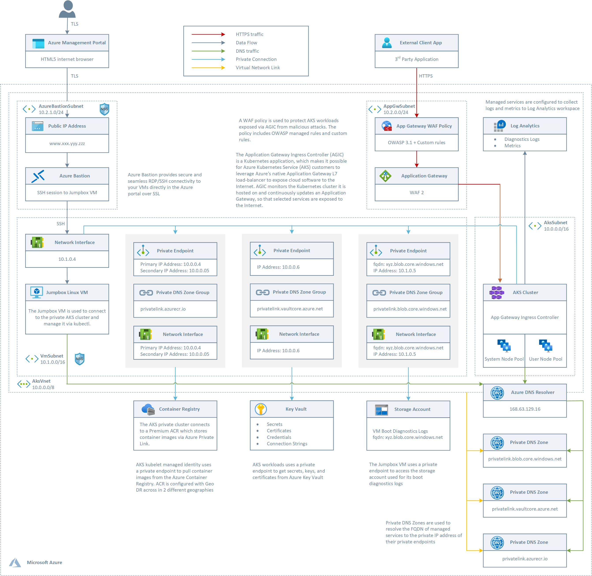
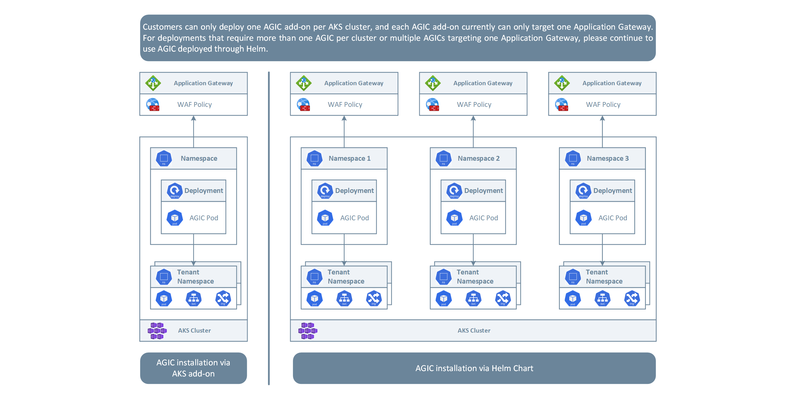
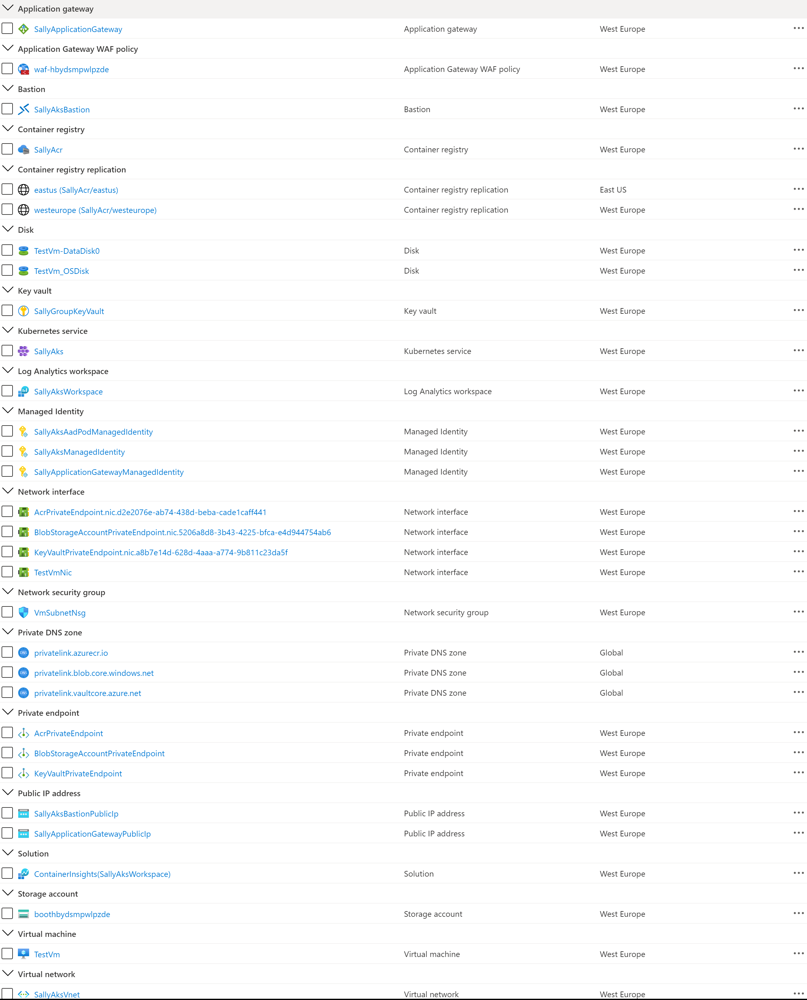
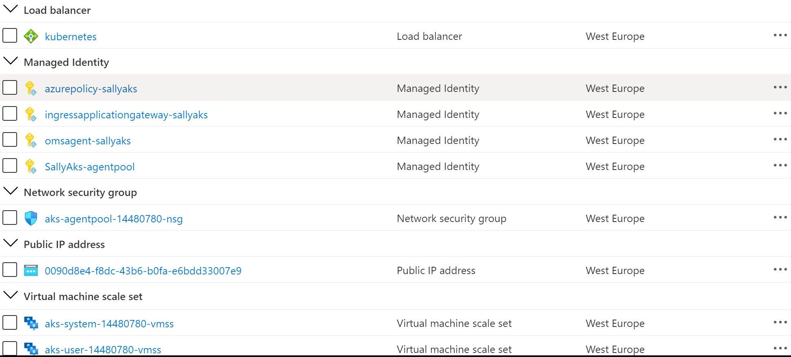

# Create an Azure Kubernetes Service cluster with the Application Gateway Ingress Controller #


[](https://portal.azure.com/#create/Microsoft.Template/uri/https%3A%2F%2Fraw.githubusercontent.com%2FAzure%2Fazure-quickstart-templates%2Fmaster%2Fquickstarts%2Fmicrosoft.network%2Faks-application-gateway-ingress-controller%2Fazuredeploy.json)
[](http://armviz.io/#/?load=https%3A%2F%2Fraw.githubusercontent.com%2FAzure%2Fazure-quickstart-templates%2Fmaster%2Fquickstarts%2Fmicrosoft.network%2Faks-application-gateway-ingress-controller%2Fazuredeploy.json)

This ARM template can be used to deploy a public or private [Azure Kubernetes Cluster (AKS) cluster](https://docs.microsoft.com/en-us/azure/aks/intro-kubernetes) with an [Azure Application Gateway](https://docs.microsoft.com/en-us/azure/application-gateway/overview) and  [Application Gateway Ingress Controller](https://docs.microsoft.com/en-us/azure/application-gateway/ingress-controller-overview) add-on. The template allows to deploy a rich set of AKS features such as:

- [AKS-managed AAD integration](https://docs.microsoft.com/en-us/azure/aks/managed-aad)
- [Azure RBAC for Kubernetes Authorization](https://docs.microsoft.com/en-us/azure/aks/manage-azure-rbac)
- [Managed identity in place of a service principal](https://docs.microsoft.com/en-us/azure/aks/use-managed-identity)
- [Azure Active Directory pod-managed identities](https://docs.microsoft.com/en-us/azure/aks/use-azure-ad-pod-identity)
- [Azure Network Policies](https://docs.microsoft.com/en-us/azure/aks/use-network-policies)
- [Azure Monitor for containers add-on](https://docs.microsoft.com/en-us/azure/azure-monitor/containers/container-insights-enable-new-cluster)
- [Application Gateway Ingress Controller add-on](https://azure.github.io/application-gateway-kubernetes-ingress/)

For a sample on how to use the Application Gateway Ingress Controller in a multi-tenant AKS cluster, see this [sample](https://github.com/paolosalvatori/aks-multi-tenant-agic).

## Architecture ##

This diagram shows the overall architecture:



The ARM template deploys the following resources:

- A new virtual network with 4 subnets:
  - **AksSubnet**: hosts the AKS cluster
  - **VmSubnet**: hosts the jumpbox virtual machine and private endpoints
  - **AppGatewaySubnet**: hosts Application Gateway WAF2
  - **AzureBastionSubnet**: Azure Bastion
- The AKS cluster uses a user-defined managed identity to create additional resources like load balancers and managed disks in Azure.
- The AKS cluster is composed of a:
  - System node pool hosting only critical system pods and services. The worker nodes have node taint which prevents application pods from beings scheduled on this node pool.
  - User node pool hosting user workloads and artifacts.
- An Azure Bastion resource that provides secure and seamless SSH connectivity to the jumpbox virtual machine directly in the Azure portal over SSL
- An Azure Container Registry (ACR) to build, store, and manage container images and artifacts in a private registry for all types of container deployments.
- a Storage Account for the boot diagnostic logs of the jumpbox virtual machine
- An Application Gateway used by the Application Gateway Ingress Controller
- A Web Access Firewall (WAF) Policy associated to the Application Gateway as the root level and HTTP listener level. The Policy is configured in Prevention mode and uses the OWASP 3.1 rule set and a couple of custom rules that demostrate how to block requests when the query string or a header contain a specific string. You can create more sophisticated custom rules to whitelist or blacklist the incoming traffic to the Application Gateway Ingres Controller.
- A Key Vault that can be used by workloads running on AKS to retrieve keys, certificates, and secrets
- A private endpoint to the Blob Storage Account
- A private endpoint to to Azure Container Registry (ACR)
- A private endpoint to Key Vault
- When you opt for a private AKS cluster, a private endpoint to the control plane / API server hosted by an AKS-managed Azure subscription. In this case, the cluster can communicate with the API server exposed via a Private Link Service using a private endpoint.
- When you choose Premium as SKU for ACR, a Private Endpoint is created to allow the private AKS cluster to access ACR via a private IP address. For more information, see [Connect privately to an Azure container registry using Azure Private Link](https://docs.microsoft.com/en-us/azure/container-registry/container-registry-private-link).
- A Private DNS Zone for the name resolution of the private endpoint to the Blob Storage Account
- A Private DNS Zone for the name resolution of the private endpoint to Azure Container Registry (ACR)
- A Private DNS Zone for the name resolution of the private endpoint to Key Vault
- When you deploy the cluster as private, a Private DNS Zone for the name resolution of the private endpoint to the Kubernetes Server API
- A Virtual Network Link between the virtual network hosting the AKS cluster and the above Private DNS Zones
- A jumpbox virtual machine to manage the AKS cluster in case you decide to deploy a private AKS cluster.
- A Log Analytics workspace to collect the diagnostics logs and metrics from: 
  - AKS cluster
  - Jumpbox virtual machine
  - Application Gateway
  - Key Vault
  - Network Security Group

## Application Gateway Ingress Controller: Deployment Options ##

In this architecture, the [Application Gateway Ingress Controller](https://azure.github.io/application-gateway-kubernetes-ingress/) was installed using the [AGIC add-on for AKS](https://docs.microsoft.com/en-us/azure/application-gateway/tutorial-ingress-controller-add-on-new). You can also [install the Application Gateway Ingress Controller via a Helm chart](https://docs.microsoft.com/en-us/azure/application-gateway/ingress-controller-install-existing#multi-cluster--shared-application-gateway). The primary benefit of deploying AGIC as an AKS add-on is that it's much simpler than deploying through Helm. For a new setup, you can deploy a new Application Gateway and a new AKS cluster with AGIC enabled as an add-on in one line in Azure CLI. The add-on is also a fully managed service, which provides added benefits such as automatic updates and increased support. Both ways of deploying AGIC (Helm and AKS add-on) are fully supported by Microsoft. Additionally, the add-on allows for better integration with AKS as a first class add-on.

The AGIC add-on is still deployed as a pod in the customer's AKS cluster, however, there are a few differences between the Helm deployment version and the add-on version of AGIC. Below is a list of differences between the two versions:

- Helm deployment values cannot be modified on the AKS add-on:

  - `verbosityLevel` will be set to 5 by default
  - `usePrivateIp` will be set to be false by default; this can be overwritten by the use-private-ip annotation
  - `shared` is not supported on add-on
  - `reconcilePeriodSeconds` is not supported on add-on
  - `armAuth.type` is not supported on add-on

- AGIC deployed via Helm supports `ProhibitedTargets`, which means AGIC can configure the Application Gateway specifically for AKS clusters without affecting other existing backends. AGIC add-on doesn't currently support this.
- Since AGIC add-on is a managed service, customers will automatically be updated to the latest version of AGIC add-on, unlike AGIC deployed through Helm where the customer must manually update AGIC.
- As shown in the following picture, customers can only deploy one AGIC add-on per AKS cluster, and each AGIC add-on currently can only target one Application Gateway. For deployments that require more than one AGIC per cluster or multiple AGICs targeting one Application Gateway, please continue to use AGIC deployed through Helm.



As documented at [Enable multiple Namespace support in an AKS cluster with Application Gateway Ingress Controller](https://docs.microsoft.com/en-us/azure/application-gateway/ingress-controller-multiple-namespace-support), a single instance of the Azure Application Gateway Kubernetes Ingress Controller (AGIC) can ingest events from and observe multiple namespaces. Should the AKS administrator decide to use App Gateway as an ingress, all namespaces will use the same instance of Application Gateway. A single installation of Ingress Controller will monitor accessible namespaces and will configure the Application Gateway it is associated with.

To enable multiple namespace support:

- modify the helm-config.yaml file in one of the following ways:

  - delete the `watchNamespace` key entirely from helm-config.yaml - AGIC will observe all namespaces
  - set `watchNamespace` to an empty string - AGIC will observe all namespaces
  - add multiple namespaces separated by a comma (`watchNamespace: default,secondNamespace`) - AGIC will observe these namespaces exclusively
- apply Helm template changes with: `helm install -f helm-config.yaml application-gateway-kubernetes-ingress/ingress-azure`

Once deployed with the ability to observe multiple namespaces, AGIC will:

- list ingress resources from all accessible namespaces
- filter to ingress resources annotated with kubernetes.io/ingress.class: azure/application-gateway
- compose combined [Application Gateway config](https://github.com/Azure/azure-sdk-for-go/blob/37f3f4162dfce955ef5225ead57216cf8c1b2c70/services/network/mgmt/2016-06-01/network/models.go#L1710-L1744)
- apply the config to the associated Application Gateway via [ARM](https://docs.microsoft.com/en-us/azure/azure-resource-manager/management/overview)

## Limits ##

[Azure subscription and service limits, quotas, and constraints](https://docs.microsoft.com/en-us/azure/azure-resource-manager/management/azure-subscription-service-limits#networking-limits) documentation reports that the max number of:

- Active Listeners
- Backend Pools
- HTTP Load Balancing Rules
- HTTP Settings
- Authentication certificates
- Etc.

is 100, and in case of WAF-enabled SKUs, this limit is 40. This implies that the maximum number of tenants that can be served by a single AGIC is equal to 100 when using Application Gateway Standard V2, and 40 for Application Gateway WAF V2.

## Deployment ##

The following picture shows the resources deployed by the ARM template in the target resource group.



The following picture shows the resources deployed by the ARM template in the MC resource group associated to the AKS cluster:



**NOTE**: make sure to properly install the necessary preview features.

## Application Gateway ##

Azure Application Gateway is a web traffic load balancer that enables customers to manage the inbound traffic to multiple downstream web applications and REST APIs. Traditional load balancers operate at the transport layer (OSI layer 4 - TCP and UDP) and route traffic based on source IP address and port, to a destination IP address and port. The Application Gateway instead is an application layer (OSI layer 7) load balancer. Azure Application Gateway provides a rich set of features:

- [Secure Sockets Layer (SSL/TLS) termination](https://docs.microsoft.com/en-us/azure/application-gateway/features#secure-sockets-layer-ssltls-termination)
- [Autoscaling](https://docs.microsoft.com/en-us/azure/application-gateway/features#autoscaling)
- [Zone redundancy](https://docs.microsoft.com/en-us/azure/application-gateway/features#zone-redundancy)
- [Static VIP](https://docs.microsoft.com/en-us/azure/application-gateway/features#static-vip)
- [Web Application Firewall](https://docs.microsoft.com/en-us/azure/application-gateway/features#web-application-firewall)
- [Ingress Controller for AKS](https://docs.microsoft.com/en-us/azure/application-gateway/features#ingress-controller-for-aks)
- [URL-based routing](https://docs.microsoft.com/en-us/azure/application-gateway/features#url-based-routing)
- [Multiple-site hosting](https://docs.microsoft.com/en-us/azure/application-gateway/features#multiple-site-hosting)
- [Redirection](https://docs.microsoft.com/en-us/azure/application-gateway/features#redirection)
- [Session affinity](https://docs.microsoft.com/en-us/azure/application-gateway/features#session-affinity)
- [WebSocket and HTTP/2 traffic](https://docs.microsoft.com/en-us/azure/application-gateway/features#websocket-and-http2-traffic)
- [Connection draining](https://docs.microsoft.com/en-us/azure/application-gateway/features#connection-draining)
- [Custom error pages](https://docs.microsoft.com/en-us/azure/application-gateway/features#custom-error-pages)
- [Rewrite HTTP headers](https://docs.microsoft.com/en-us/azure/application-gateway/features#rewrite-http-headers-and-url)
- [Sizing](https://docs.microsoft.com/en-us/azure/application-gateway/features#sizing)

For more information, see [How an Application Gateway works](https://docs.microsoft.com/en-us/azure/application-gateway/how-application-gateway-works).

## Web Access Firewall Policy for Application Gateway ##

[Web Application Firewall (WAF)](https://docs.microsoft.com/en-us/azure/web-application-firewall/ag/ag-overview) is a service that provides centralized protection of web applications from common exploits and vulnerabilities. WAF is based on rules from the [OWASP (Open Web Application Security Project) core rule sets](https://owasp.org/www-project-modsecurity-core-rule-set/). WAF also provide the ability to create custom rules that are evaluated for each request that passes through the WAF. These rules hold a higher priority than the rest of the rules in the managed rule sets. The custom rules contain a rule name, rule priority, and an array of matching conditions. If these conditions are met, an action is taken (to allow or block). Web applications can be the target of malicious attacks that exploit common, known vulnerabilities that include SQL injection attacks, DDOS attacks, and cross site scripting attacks. Preventing such attacks in application code can be challenging and may require rigorous maintenance, patching and monitoring at many layers of the application topology. A centralized web application firewall helps make security management much simpler and gives better assurance to application administrators against threats or intrusions. A WAF solution can also react to a security threat faster by patching a known vulnerability at a central location versus securing each of individual web applications. Existing application gateways can be converted to a Web Application Firewall enabled application gateway very easily.
Azure Application Gateway allows the association of a separate WAF policy to each individual listener. For example, if there are three sites behind the same Application Gateway or WAF, you can configure three separate WAF policies (one for each listener) to customize the exclusions, custom rules, and managed rulesets for one site without effecting the other two. If you want a single policy to apply to all sites, you can just associate the policy with the Application Gateway, rather than the individual listeners, to make it apply globally. Application Gateway also supports per-URI WAF Policies. This feature requires the use of a Path-based routing rule instead of a basic routing rule and requires the definition of a URL Path Map where a specific WAF policy can be associated to a given URL. For more information, see [Configure per-site WAF policies using Azure PowerShell](https://docs.microsoft.com/en-us/azure/web-application-firewall/ag/per-site-policies). The order of precedence for WAF policies is as follows:

- If a per-URI WAF policy exists for the current path, this will take effect / apply and no other WAF policy will apply
- If no per-URI WAF policy exists for the current path, but a WAF policy exists for the current listener, this policy will apply, and no other WAF policy will take effect
- If no WAF policy exists for the current URI and listener, the global WAF policy will apply, if any.

The Application Gateway WAF can be configured to run in the following two modes:

- **Detection mode**: Monitors and logs all threat alerts. You turn on logging diagnostics for Application Gateway in the Diagnostics section. You must also make sure that the WAF log is selected and turned on. Web application firewall doesn't block incoming requests when it's operating in Detection mode.
- **Prevention mode**: Blocks intrusions and attacks that the rules detect. The attacker receives a "403 unauthorized access" exception, and the connection is closed. Prevention mode records such attacks in the WAF logs.

You can configure Application Gateway to store diagnostic logs and metrics to Log Analytics. In this case, also WAF logs will be stored in Log Analytics and they can be queries using Kusto Query Language. In the ARM template the WAF policy is configured in Prevention mode and contains a couple of sample custom rules that block incoming request, when the query string contains the word blockme or when the User-Agent header contain the string evilbot:

```json
{
  "name": "BlockMe",
  "priority": 1,
  "ruleType": "MatchRule",
  "action": "Block",
  "matchConditions": [
    {
      "matchVariables": [
        {
          "variableName": "QueryString"
        }
      ],
      "operator": "Contains",
      "negationConditon": false,
      "matchValues": [
        "blockme"
      ],
      "transforms": []
    }
  ]
},
{
  "name": "BlockEvilBot",
  "priority": 2,
  "ruleType": "MatchRule",
  "action": "Block",
  "matchConditions": [
    {
      "matchVariables": [
        {
          "variableName": "RequestHeaders",
          "selector": "User-Agent"
        }
      ],
      "operator": "Contains",
      "negationConditon": false,
      "matchValues": [
        "evilbot"
      ],
      "transforms": [
        "Lowercase"
      ]
    }
  ]
}
```

## References ##

Azure Kubernetes Service:

- [Create a private Azure Kubernetes Service cluster](https://github.com/paolosalvatori/private-aks-cluster)
- [Best practices for multi-tenancy and cluster isolation](https://docs.microsoft.com/en-us/azure/aks/operator-best-practices-cluster-isolation)
- [Best practices for basic scheduler features in Azure Kubernetes Service (AKS)](https://docs.microsoft.com/en-us/azure/aks/operator-best-practices-scheduler)
- [Best practices for advanced scheduler features](https://docs.microsoft.com/en-us/azure/aks/operator-best-practices-advanced-scheduler)
- [Best practices for authentication and authorization](https://docs.microsoft.com/en-us/azure/aks/operator-best-practices-advanced-scheduler)
- [Best practices for cluster security and upgrades in Azure Kubernetes Service (AKS)](https://docs.microsoft.com/en-us/azure/aks/operator-best-practices-cluster-security)
- [Best practices for container image management and security in Azure Kubernetes Service (AKS)](https://docs.microsoft.com/en-us/azure/aks/operator-best-practices-container-image-management)
- [Best practices for network connectivity and security in Azure Kubernetes Service (AKS)](https://docs.microsoft.com/en-us/azure/aks/operator-best-practices-network)
- [Best practices for storage and backups in Azure Kubernetes Service (AKS)](https://docs.microsoft.com/en-us/azure/aks/operator-best-practices-storage)
- [Best practices for business continuity and disaster recovery in Azure Kubernetes Service (AKS)](https://docs.microsoft.com/en-us/azure/aks/operator-best-practices-multi-region)
- [Azure Kubernetes Services (AKS) day-2 operations guide](https://docs.microsoft.com/en-us/azure/architecture/operator-guides/aks/day-2-operations-guide)

Azure Application Gateway:

- [Overview of WebSocket support in Application Gateway](https://docs.microsoft.com/en-us/azure/application-gateway/application-gateway-websocket#websocket-enabled-backend)
- [Configure end to end TLS by using Application Gateway with PowerShell](https://docs.microsoft.com/en-us/azure/application-gateway/application-gateway-end-to-end-ssl-powershell)
- [How an Application Gateway works](https://docs.microsoft.com/en-us/azure/application-gateway/how-application-gateway-works)

Azure Application Gateway Ingress Controller

- [What is Application Gateway Ingress Controller?](https://docs.microsoft.com/en-us/azure/application-gateway/ingress-controller-overview)
- [Documentation for Application Gateway Ingress Controller](https://azure.github.io/application-gateway-kubernetes-ingress/)
- [Annotations for Application Gateway Ingress Controller](https://docs.microsoft.com/en-us/azure/application-gateway/ingress-controller-annotations)
- [Certificate issuance with LetsEncrypt.org](https://azure.github.io/application-gateway-kubernetes-ingress/how-tos/lets-encrypt/)
- [Tutorial: Enable the Ingress Controller add-on (preview) for a new AKS cluster with a new Application Gateway instance](https://docs.microsoft.com/en-us/azure/application-gateway/tutorial-ingress-controller-add-on-new)
- [Tutorial: Enable Application Gateway Ingress Controller add-on for an existing AKS cluster with an existing Application Gateway through Azure CLI (Preview)](https://docs.microsoft.com/en-us/azure/application-gateway/tutorial-ingress-controller-add-on-existing)
- [Difference between Helm deployment and AKS Add-On](https://docs.microsoft.com/en-us/azure/application-gateway/ingress-controller-overview#difference-between-helm-deployment-and-aks-add-on)

Azure Application Gateway WAF

- [What is Azure Web Application Firewall on Azure Application Gateway?](https://docs.microsoft.com/en-us/azure/web-application-firewall/ag/ag-overview)
- [Web Application Firewall CRS rule groups and rules](https://docs.microsoft.com/en-us/azure/web-application-firewall/ag/application-gateway-crs-rulegroups-rules?tabs=owasp31)
- [Custom rules for Web Application Firewall v2 on Azure Application Gateway](https://docs.microsoft.com/en-us/azure/web-application-firewall/ag/custom-waf-rules-overview)
- [Quickstart: Create an Azure WAF v2 on Application Gateway using an ARM template](https://docs.microsoft.com/en-us/azure/web-application-firewall/ag/quick-create-template)
- [Microsoft.Network/ApplicationGatewayWebApplicationFirewallPolicies Resource Type](https://docs.microsoft.com/en-us/azure/templates/microsoft.network/applicationgatewaywebapplicationfirewallpolicies)
- [Create and use Web Application Firewall v2 custom rules on Application Gateway](https://docs.microsoft.com/en-us/azure/web-application-firewall/ag/create-custom-waf-rules)
- [az network application-gateway waf-policy Azure CLI commands](https://docs.microsoft.com/en-us/cli/azure/network/application-gateway/waf-policy?view=azure-cli-latest)
- [Enable Web Application Firewall using the Azure CLI](https://docs.microsoft.com/en-us/azure/web-application-firewall/ag/tutorial-restrict-web-traffic-cli)
- [Configure per-site WAF policies using Azure PowerShell](https://docs.microsoft.com/en-us/azure/web-application-firewall/ag/per-site-policies)
- [Create Web Application Firewall policies for Application Gateway](https://docs.microsoft.com/en-us/azure/web-application-firewall/ag/create-waf-policy-ag#migrate-to-waf-policy)
