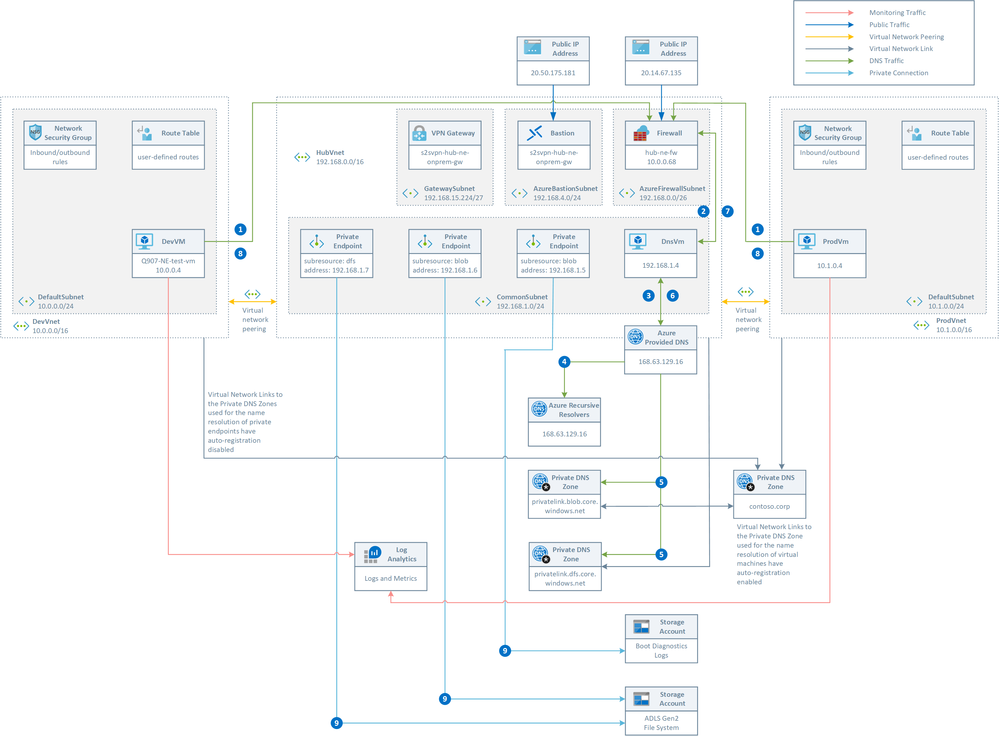
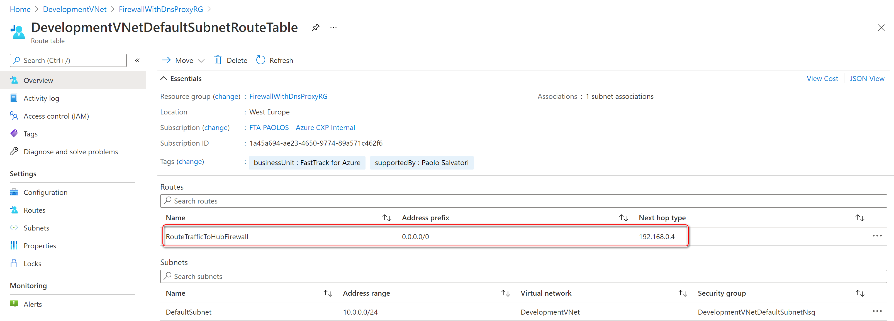
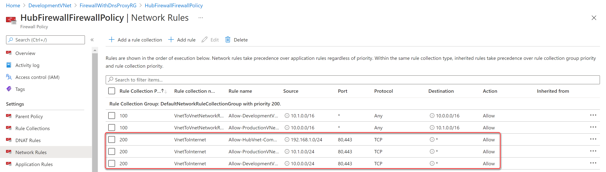
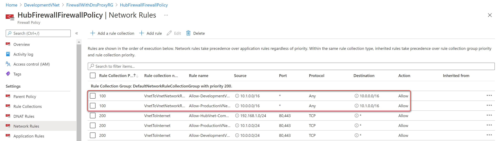
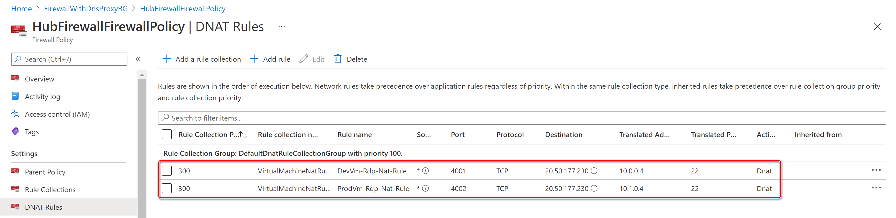
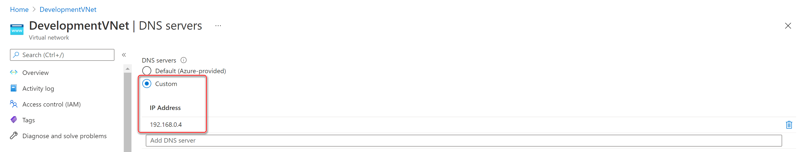
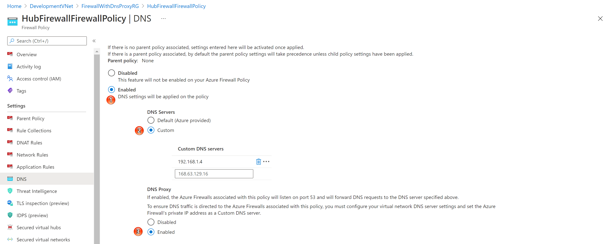
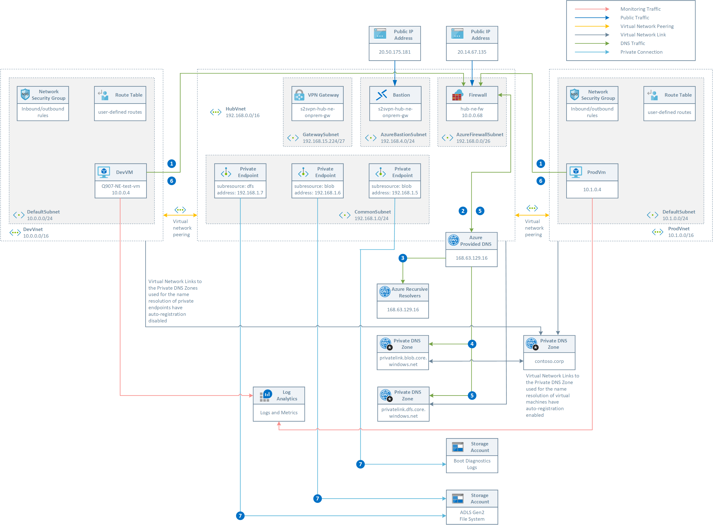
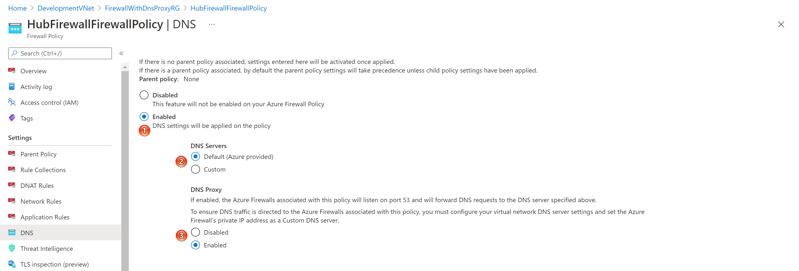
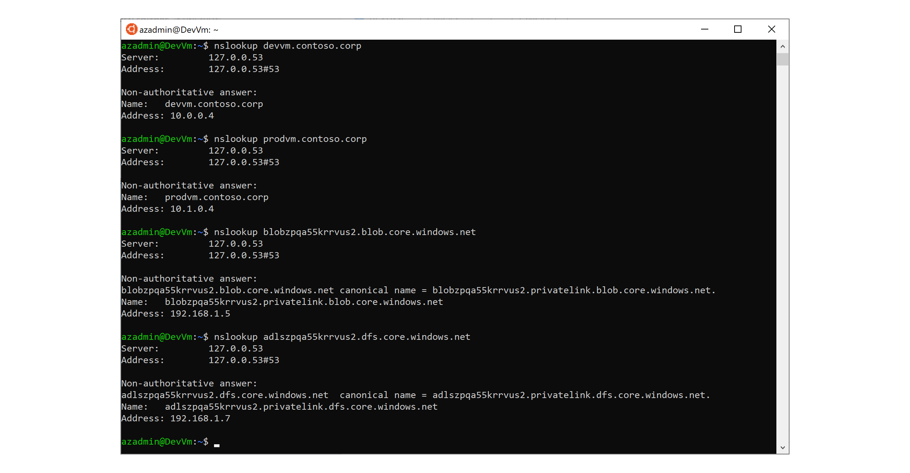

# Use Azure Firewall as a DNS Proxy in a Hub and Spoke topology along with Private Endpoints

This sample shows how to deploy a [hub-spoke topology](https://docs.microsoft.com/en-us/azure/architecture/reference-architectures/hybrid-networking/hub-spoke?tabs=cli) in Azure. The hub virtual network acts as a central point of connectivity to many spoke virtual networks that are connected to hub virtual network via [virtual network peering](https://docs.microsoft.com/en-us/azure/virtual-network/virtual-network-peering-overview). The hub can also be used as the connectivity point to your on-premises networks using a [VPN gateway](https://docs.microsoft.com/en-us/azure/vpn-gateway/vpn-gateway-about-vpngateways). The spoke virtual networks can be hosted in the same or a different Azure subscription with respect to the hub virtual network and they are used to isolate workloads from one another. The benefits of using a hub and spoke configuration include cost savings, overcoming subscription limits, and workload isolation. This topology shows how to:

- Deploy a zone-redundant Azure Firewall in a complex hub-and-spoke network topology that spans across multiple availability zones within a region. For more information on this network topology, see [Hub and spoke network topology](https://docs.microsoft.com/en-us/azure/cloud-adoption-framework/ready/azure-best-practices/hub-spoke-network-topology).
- Use Azure Firewall to inspects ingress and egress traffic between zones: internet, on-premises, and spokes. The hub and spoke topology gives the central IT department an effective way to enforce security policies in a central location. It also reduces the potential for misconfiguration and exposure. You can centrally create allow or deny network filtering rules by source and destination IP address, port, and protocol. Azure Firewall is fully stateful, so it can distinguish legitimate packets for different types of connections. Rules are enforced and logged across multiple subscriptions and virtual networks. In this sample, a network rule collection is used to provide internet access to the spoke virtual networks peered to the hub virtual network and to enable vnet-to-vnet communications between the two spoke virtual networks. In addition, the ARM template provided the option to deploy DNAT rules to access the virtual machines in the spoke virtual machines via SSH as an alternative to Azure Bastion. For more information, see [Configure Azure Firewall rules](https://docs.microsoft.com/en-us/azure/firewall/rule-processing).
- Use Azure Firewall to inspect or block traffic from clients to the managed services exposed via private endpoints. For more information, see [Use Azure Firewall to inspect traffic destined to a private endpoint](https://docs.microsoft.com/en-us/azure/private-link/inspect-traffic-with-azure-firewall).
- Use Azure Firewall as a DNS Proxy to a custom DNS forwader virtual machine deployed in the hub virtual network or directly to the default Azure-provided DNS. A DNS proxy is an intermediary for DNS requests from client virtual machines to a DNS server. If you configure a custom DNS server, then enable DNS proxy to avoid a DNS resolution mismatch, and enable FQDN (fully qualified domain name) filtering in the network rules. This functionality is required to have reliable FQDN filtering in network rules. If you don't enable DNS proxy, then DNS requests from the client might travel to a DNS server at a different time or return a different response compared to that of the firewall. DNS proxy puts Azure Firewall in the path of the client requests to avoid inconsistency. You can enable DNS proxy in Azure Firewall and Firewall Policy settings. For more information, see [Azure Firewall DNS Proxy](https://docs.microsoft.com/en-us/azure/firewall/dns-settings#dns-proxy). To learn more about DNS proxy logs, see the [Azure Firewall log and metrics documentation](https://docs.microsoft.com/en-us/azure/firewall/logs-and-metrics).
- Use Azure Bastion to open an RDP or SSH session directly from the Azure portal to a virtual machine in the hub virtual network where Bastion is deployed or a virtual machine in any peered spoke virtual network. For more information, see [VNet peering and Azure Bastion](https://docs.microsoft.com/en-us/azure/bastion/vnet-peering).
- How to deploy a VPN gateway A VPN to send encrypted traffic between an Azure virtual network and an on-premises location over the public Internet. For more information, see [VPN gateway](https://docs.microsoft.com/en-us/azure/vpn-gateway/vpn-gateway-about-vpngateways).
- How to use Private DNS Zones in a hub and spoke topology to provide secure access to managed services to the computing resources (virtual machines, virtual machine scale sets, AKS, webs apps, Azure Functions, etc.) deployed in the hub virtual network or any spoke virtual network peered to the hub virtual network. This sample shows how two virtual machines can access a blob storage account and an ADLS Gen2 file system via private endpoints deployed in the hub virtual network. For more information, see:

  - [Centralized vs Decentralized Private DNS Zones](https://github.com/paolosalvatori/private-endpoints-topologies)
  - [Enterprise-Scale - Reference Implementation](https://github.com/Azure/Enterprise-Scale)
  - [What is Azure Private Link?](https://docs.microsoft.com/en-us/azure/private-link/private-link-overview)
  - [What is Azure Private  Endpoint?](https://docs.microsoft.com/en-us/azure/private-link/private-endpoint-overview)
  - [Azure Private Endpoint DNS configuration](https://docs.microsoft.com/en-us/azure/private-link/private-endpoint-dns)
  - [Name resolution for resources in Azure virtual networks](https://docs.microsoft.com/en-us/azure/virtual-network/virtual-networks-name-resolution-for-vms-and-role-instances#name-resolution-that-uses-your-own-dns-server)
  - [DNS in Microsoft Azure -- Part 1](https://journeyofthegeek.com/2019/11/14/dns-in-microsoft-azure-part-1/)
  - [DNS in Microsoft Azure -- Part 2](https://journeyofthegeek.com/2019/11/21/dns-in-microsoft-azure-part-2/)
  - [DNS in Microsoft Azure -- Part 3](https://journeyofthegeek.com/2019/11/24/dns-in-microsoft-azure-part-3/)
  - [Azure Private Link and DNS -- Part 1](https://journeyofthegeek.com/2020/03/05/azure-private-link-and-dns-part-1/)
  - [Azure Private Link and DNS -- Part 2](https://journeyofthegeek.com/2020/03/06/azure-private-link-and-dns-part-2/)
  - [Private Endpoint DNS Integration Scenarios](https://github.com/dmauser/PrivateLink/tree/master/DNS-Integration-Scenarios)

## Architecture with a custom DNS forwarder

The following diagram illustrates the DNS resolution sequence from a virtual network located in a spoke virtual network. The configuration uses a custom DNS forwarder deployed in Azure. The Azure Firewall is configured as a DNS Proxy to send DNS queries to the custom DNS forwarder that is implemented by using NGINX in a Linux virtual machine as a DNS Proxy to the default Azure-provided DNS. For more information, see [Deploy VMSS of a NGINX DNS Proxy into an existing Virtual Network.](https://github.com/microsoft/PL-DNS-Proxy). For more information on this topology and DNS configuration, see [Virtual network and on-premises workloads using a DNS forwarder](https://docs.microsoft.com/en-us/azure/private-link/private-endpoint-dns#virtual-network-and-on-premises-workloads-using-a-dns-forwarder). As an alternative solution based on [bind9](https://www.isc.org/bind/) to deploy a custom DNS forwarder in a virtual network, you can look at [DNS Forwarder VM](https://github.com/Azure/azure-quickstart-templates/tree/master/301-dns-forwarder). In order to deploy the following topology, make sure to set the value of the `deployCustomDnsForwarder` parameter to `true`.

This topology implements the following scenario:

- Contoso Corporation implemented and deployed [Hub and Spoke network topology](https://docs.microsoft.com/en-us/azure/architecture/reference-architectures/hybrid-networking/hub-spoke?tabs=cli).
- Any outbound traffic is routed via the Azure Firewall in the two hub virtual network by using user-defined route (UDRs) defined in a route table associated to the default subnet in the two spoke virtual networks.

- Network rules in the Azure Firewall Policy are used to enable outbound traffic to the internet on bports80 and 443 from the hub virtual network and two spoke virtual networks.

- Network rules in the Azure Firewall Policy are used to enable vnet-to-vnet communications between the two spoke virtual networks via the vnet peering connections to the hub virtual network and the Azure Firewall.

- DNAT Network rules in the Azure Firewall Policy are used to enable SSH access to the virtual machines in the two spoke virtual networks as an alternative to Azure Bastion.

- DNS settings in the virtual network are configured to send DNS queries to the private IP adddress of the Azure Firewall.

- DNS settings in the Azure Policy is configured to enable the DNS Proxy on the associated Azure Firewall that will listen on port 53 for DNS queries and will them to the the private IP adddress of the custom DNS forwarder. To ensure DNS traffic is directed to the Azure Firewalls associated with this policy, you must configure your virtual network DNS server settings and set the Azure Firewall’s private IP address as a custom DNS server.

- Some of the subnets in the hub and spoke topology are configured to used a Network Security Group (NSG) to control the ingress and egress traffic to and from those suvnets. These NSGs are configured to send diagnostics logs and metrics to a Log Analytics workspace.
- A Private DNS Zone called `contoso.corp` is used for the name resolution of the virtual machines in the hub and spoke virtual networks. A virtual network link with auto-registration enabled exists between this Private DNS Zone and all the virtual networks in the topology.
- A Private DNS Zone for the name resolution of private endpoints to blob and ADLS storage accounts are deployed and a virtual network link is created between these Private DNS Zones and the hub virtual network.
- Two ADLS Gen2 storage accounts are deployed in the topology. One of them is used for the diagnostics boot logs of the three virtual machines deployed in the topology, while the second one is used as an ADLS Gen2 file system.
- A Linux virtual machine is deployed in each of the two spoke virtual networks and configured to run a Bash script via the custom script extension to run some DNS and access tests (see below for more information). In addition, the two virtial machines asre configured to send diagnostics logs and metrics to a Log Analytics workspace.

This is the list of steps necessary for the name resolution of the FQDN of a blob/ADLS storage account to the private IP address of the corresponding private endpoint deployed in the hub virtual network:

1. The virtual machine submits a DNS query for the FQDN of the `abc.blob.core.windows.net` blob storage account. The DNS request is sent to the Azure Firewall that acts as a DNS Proxy.
2. Azure Firewall forwards the DNS request to the custom DNS server
3. The custom DNS server forwards the request to the default Azure DNS at `168.63.129.16`
4. The authoritative query for `abc.blob.core.windows.net` returns `abc.privatelink.blob.core.windows.net` canonical name (CNAME)
5. The DNS request for `abc.privatelink.blob.core.windows.net` is sent the `privatelink.blob.core.windows.net` Private DNS Zone that uses the A record for `abc` to return the associated private IP address
6. The result is sent back to the custom DNS server
7. The result is sent back to the Azure Firewall
8. The result is sent back to the virtual machine
9. The virtual machine uses the private IP address of the private endpoint to access the `abc.blob.core.windows.net` storage account

## Architecture without a custom DNS forwarder

In the following topology, the DNS settings of the Azure Firewall Policy associated to the Azure Firewall is configured to directly send DNS queries to the default Azure-provided DNS. For more information on Azure Firewall Policies and Azure Firewall Manager, see [Azure Firewall Manager policy overview](https://docs.microsoft.com/en-us/azure/firewall-manager/policy-overview). In order to deploy the following topology, make sure to set the value of the `deployCustomDnsForwarder` parameter to `false`.

This topology implements the same scenario as the previous topology with two differences:

- No custom DNS forwarder is deployed in the hub virtual network.
- The DNS settings of the Azure policy are configured to enable the DNS proxy on the associated Azure Firewall, but in this case the Azure Firewall will listent for DNS request on port 53 and directly send them to the default Azure DNS.

This is the list of steps necessary for the name resolution of the FQDN of a blob/ADLS storage account to the private IP address of the corresponding private endpoint deployed in the hub virtual network:

1. The virtual machine submits a DNS query for the FQDN of the `abc.blob.core.windows.net` blob storage account. The DNS request is sent to the Azure Firewall that acts as a DNS Proxy.
2. Azure Firewall forwards the request to the default Azure DNS at `168.63.129.16`
3. The authoritative query for `abc.blob.core.windows.net` returns `abc.privatelink.blob.core.windows.net` canonical name (CNAME)
4. The DNS request for `abc.privatelink.blob.core.windows.net` is sent the `privatelink.blob.core.windows.net` Private DNS Zone that uses the A record for `abc` to return the associated private IP address
5. The result is sent back to the Azure Firewall
6. The result is sent back to the virtual machine
7. The virtual machine uses the private IP address of the private endpoint to access the `abc.blob.core.windows.net` storage account

## VM Custom Script Extemsion

The two storage accounts are accessed via a different endpoint, hence their private endpoints need different private DNS zone:

| Storage Service | Zone Name |
| :-- | :--|
| Blob service | privatelink.blob.core.windows.net |
| Data Lake Storage Gen2 | privatelink.dfs.core.windows.net |

For more information, see [Use private endpoints for Azure Storage](https://docs.microsoft.com/en-us/azure/storage/common/storage-private-endpoints#dns-changes-for-private-endpoints).

The ARM template uses the [Azure Custom Script Extension](https://docs.microsoft.com/en-us/azure/virtual-machines/extensions/custom-script-linux) to download and run the following Bash script on the virtual machine. The script performs the following steps:

- Validates the parameters received by the Custom Script extension
- Updates the system and upgrades packages
- Installs curl and traceroute packages
- Install the NGINX web server on the local machine
- Customize the main page of the NGINX web server to print the name of the local machine
- Runs the nslookup command against the FQDN name of the two virtual machines
- Runs curl against the web server of the virtual machines using their FQDN
- Runs the nslookup command against the public URL of the ADLS Gen 2 storage account to verify that this gets resolved to a private address
- Runs the nslookup command against the public URL of the second storage account to verify that this gets resolved to a private address
- Downloads and installs the Azure CLI
- Logins using the system-assigned managed identity of the virtual machine
- Creates a file system in the ADLS Gen 2 storage account
- Creates a directory in the file system
- Creates a file in the directory with the content passed as a parameter

## DNS Forwarder

When the value of the `deployCustomDnsForwarder` parameter is set to `true`, a Linux virtual machine is deployed in the hub virtual network and the [Azure Custom Script Extension](https://docs.microsoft.com/en-us/azure/virtual-machines/extensions/custom-script-linux) is used to download and run the following Bash script on the virtual machine which installs and configure NGINX to forward DNS requests on port 53 to the default Azure DNS at `168.63.129.16`.

## Testing

If you open an SSH session to the any of the virtual machines in one of the two spoke virtual network using Azure Bastion or via Azure Firewall DNAT rules, you can manually run the `nslookup` using the FQDN of the virtual machines and storage accounts to prove that they properly get resolved to their corresponding private IP address, as shown in the following picture.

