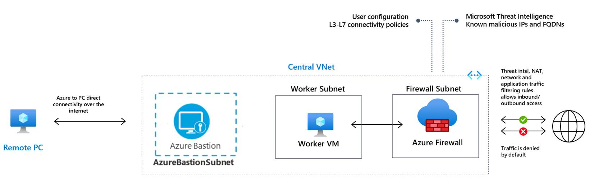

# Create Testing Environment for Firewall Premium (IDPS, TLS Inspection, Web Categories)

This template deploys a complete testing environment for Azure Firewall Premium enabled with IDPS, TLS Inspection, URL Filtering and Web Categories:

- The template deploys a new Azure Firewall Premium and Firewall Policy with predefined settings to allow easy validation of its core capabilities (IDPS, TLS Inspection, URL Filtering and Web Categories)
- The template deploys all dependencies including Key Vault and a Managed Identity. In a production environment these resources may already be created and not needed in the same template.
- The template generates self signed Root CA and deploys it on the generated Key Vault
- The template generates a derived Intermediate CA and deploys it on a Windows testing machine (WorkerVM)
- A Bastion Host (BastionHost) is also deployed and can be used to connect to the Windows testing machine (WorkerVM)
- Firewall Policy is pre-configured with TLS inspection and IDPS enabled. You can test it via the following URLs
  - Go to https://www.azure.com and inspect the certificate in the browser.
  - Go to https://azure.microsoft.com/en-us/community/events which is denied using a URL deny rule.

Azure Firewall is a managed cloud-based network security service that protects your Azure Virtual Network resources. It is a fully stateful firewall as a service with built-in high availability and unrestricted cloud scalability. You can centrally create, enforce, and log application and network connectivity policies across subscriptions and virtual network. Azure Firewall uses a static public IP address for your virtual network resources allowing outside firewalls to identify traffic originating from your virtual network.

Learn more at https://docs.microsoft.com/en-us/azure/firewall.
