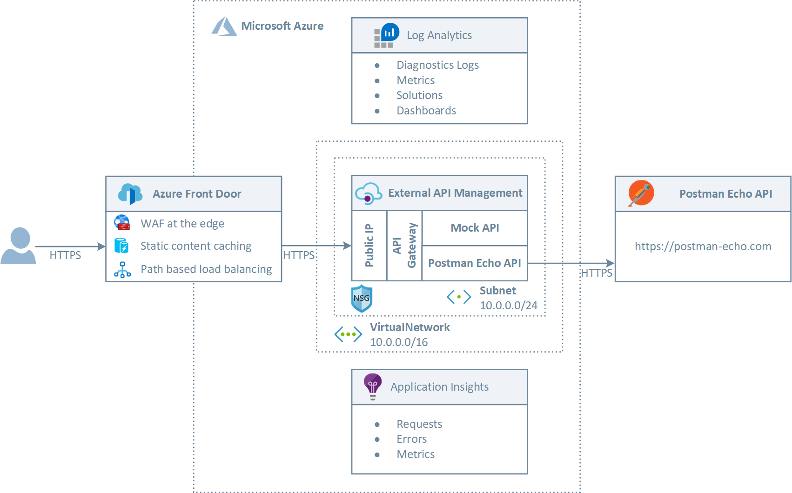
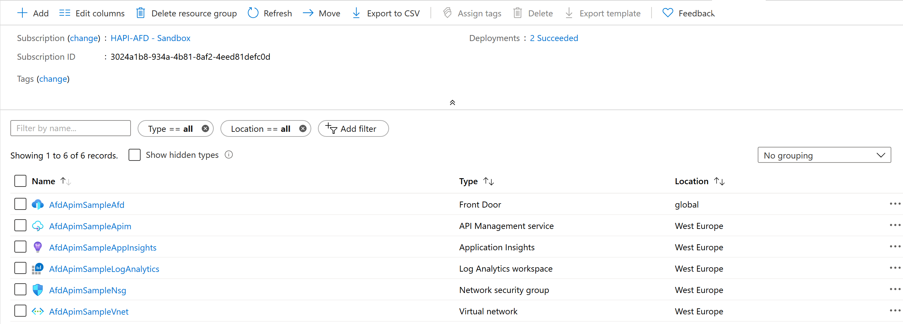
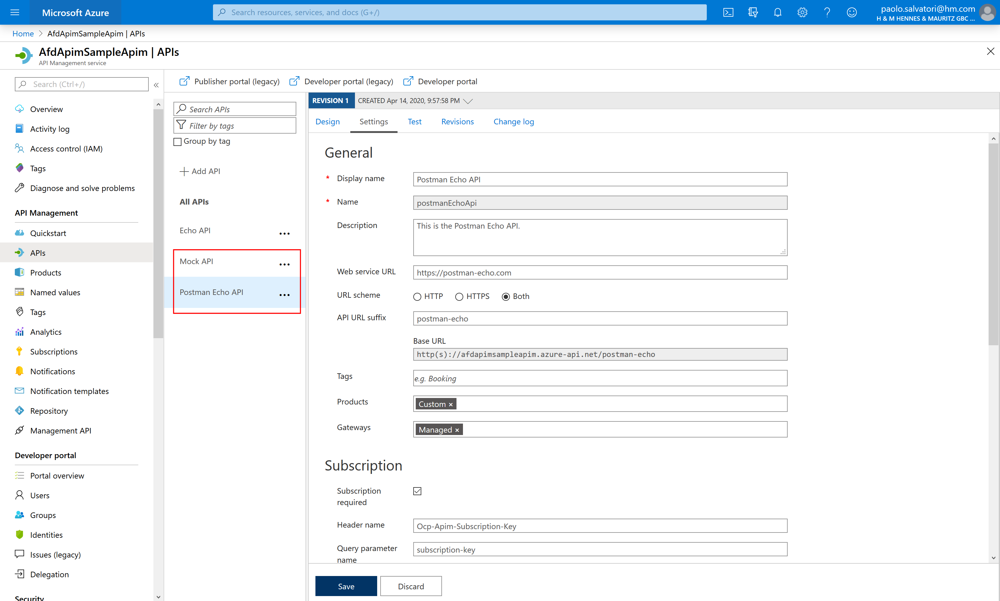
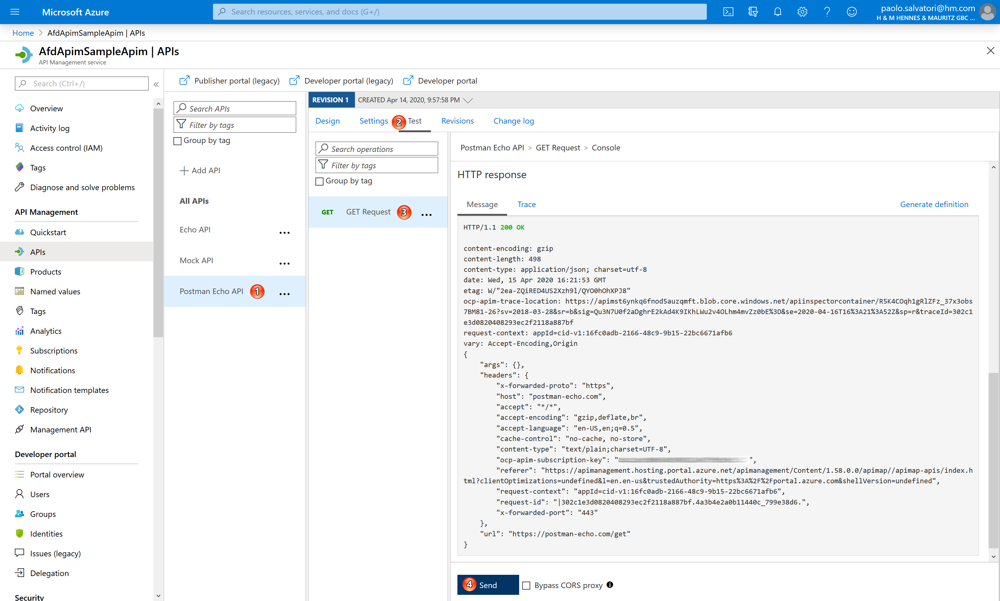
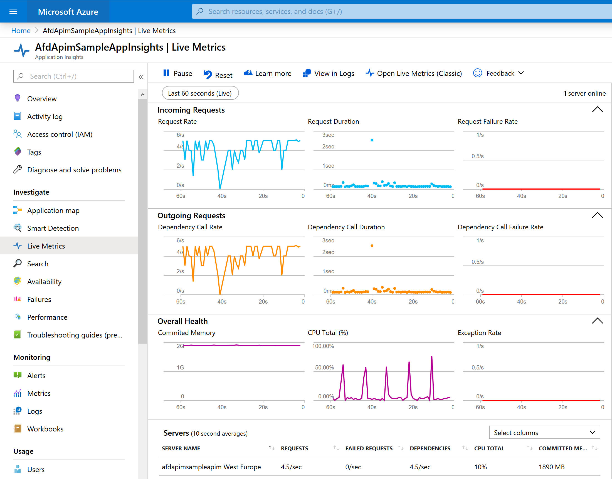
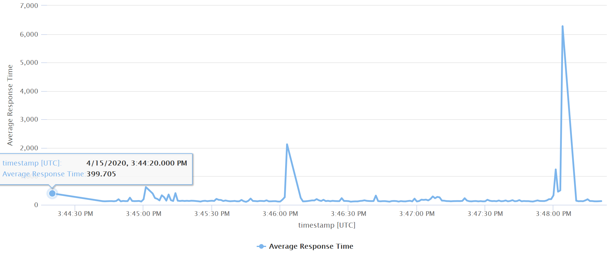
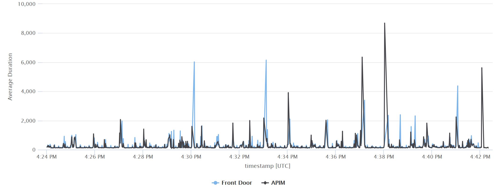

# Create Azure Front Door in front of Azure API Management #


[](https://portal.azure.com/#create/Microsoft.Template/uri/https%3A%2F%2Fraw.githubusercontent.com%2FAzure%2Fazure-quickstart-templates%2Fmaster%2Fquickstarts%2Fmicrosoft.network%2Ffront-door-api-management%2Fazuredeploy.json)
[](https://portal.azure.us/#create/Microsoft.Template/uri/https%3A%2F%2Fraw.githubusercontent.com%2FAzure%2Fazure-quickstart-templates%2Fmaster%2Fquickstarts%2Fmicrosoft.network%2Ffront-door-api-management%2Fazuredeploy.json)
[](http://armviz.io/#/?load=https%3A%2F%2Fraw.githubusercontent.com%2FAzure%2Fazure-quickstart-templates%2Fmaster%2Fquickstarts%2Fmicrosoft.network%2Ffront-door-api-management%2Fazuredeploy.json)

This sample demonstrates how to use [Azure Front Door](https://docs.microsoft.com/azure/frontdoor/front-door-overview) as a global load balancer in front of [Azure API Management](https://docs.microsoft.com/en-us/azure/api-management/api-management-key-concepts) to get the following advantages:

- Dynamic request acceleration allows to decrease the latency and increase the throughput of backend APIs.
- The use of a WAF policy at the edge provides API security against DDoS attacks and malicious users.
- Response caching allows to drammatically improve performance of GET methods.

## Architecture ##

The following picture shows the architecture and network topology of the sample.



The ARM template included in this project deploys a virtual network with a single subnet. The API Management is deployed in a separate subnet of the same virtual network and is configured to use the external access type for resources. For more information, see [How to use Azure API Management with virtual networks](https://docs.microsoft.com/en-us/azure/api-management/api-management-using-with-vnet). The ARM template creates two APIs:

- Mock API: this API exposes a HTTP GET method that makes use of the [mock-response](https://docs.microsoft.com/en-us/azure/api-management/api-management-advanced-policies#mock-response) policy to return a mocked response directly to the caller. For more information, see [Mock API responses](https://docs.microsoft.com/en-us/azure/api-management/mock-api-responses).
- Postman Echo API: this API exposes a HTTP GET method that in turn calls the GET Request method exposed by the Postman Echo. This is service that developers can use to test REST clients and make sample API calls. It provides endpoints for GET, POST, PUT, various auth mechanisms and other utility endpoints. The documentation for the endpoints as well as example responses can be found [here](https://postman-echo.com).

Both APIs:

- Are configured to use the same product called Custom.
- Require specifying the subscription key in the query string or in the header when invoking a method.
- Make use of an logger to trace requests, errors and metrics to an Application Insights resource.

A Network Security Groups (NSG) is used to control inbound and outbound traffic for the subnet hosting API Management. Inbound and outbound rules are defined to guarantee the proper ingress and egress access to the resources contained in that subnet. Azure Front Door is configured as follows:

- The Backend Pool contains a single backend that is configured to use the public hostname used by the API Management service.
- A custom probe is defined in the Backend Pool for the API Management service domain endpoint. The custom probe is configured to use the path /status-0123456789abcdef which is the default health endpoint hosted on all the API Management services.
- Routing Rule: this rule is configured to send all the incoming traffic to the above Backend Pool.

You can optionally deploy a Web Access Firewall (WAF) policy and associate it to the frontend of Azure Front Door to protect the API Management from malicious attacks just setting the value of the deployWaf parameter to true. The WAF policy deployed by the ARM template is configured to use the OWASP default rule set. For more information, see:

- [Azure Web Application Firewall on Azure Front Door](https://docs.microsoft.com/en-us/azure/web-application-firewall/afds/afds-overview) 
- [Tutorial: Create a Web Application Firewall policy on Azure Front Door using the Azure portal](https://docs.microsoft.com/en-us/azure/web-application-firewall/afds/waf-front-door-create-portal).
- [Open Web Application Security Project (OWASP)](https://owasp.org/)

Front Door is a modern Content Delivery Network (CDN) and so along with dynamic site acceleration and load balancing, it also supports caching behaviors just like any other CDN. The ARM template allows to configure Front Door to response caching at the edge and dynamic compression. If you want to disable caching, just set the value of the cacheConfiguration property to {} in the afdRoutingRule parameter. For more information, see [Caching with Azure Front Door](https://docs.microsoft.com/en-us/azure/frontdoor/front-door-caching).

When API Management is deployed in a virtual network and configured to use the external access type as explained at [How to use Azure API Management with virtual networks](https://docs.microsoft.com/en-us/azure/api-management/api-management-using-with-vnet), the API Gateway and Developer Portal are accessible from the public internet via an external load balancer and the API Gateway can access resources within the virtual network. If you want to force client applications to invoke the API Gateway through Azure Front Door, you can proceed as follows:

- You can set an inbound rule in the [Network Security Group](https://docs.microsoft.com/en-us/azure/virtual-network/security-overview) (NSG) associated with the subnet hosting API Management to accept inbound traffic on HTTP/HTTPS ports only from Front Door using the AzureFrontDoor.Backend service tag. This way the public endpoints exposed by API Management, including the endpoints exposed by the API Gateway and developer portal, will accept calls only via Azure Front Door. For more information, see [How do I lock down the access to my backend to only Azure Front Door?](https://docs.microsoft.com/en-us/azure/frontdoor/front-door-faq).
- If you want to provide access to the API Management developer portal to users, you can create an additional inbound rule to provide access to one or more ranges of IP addresses, or you can deploy the self-hosted developer portal, on-premises or in the cloud (e.g. a VM on Azure), and create an inbound rule in the NSG associated to the subnet hosting API Management to accept inbound traffic on HTTP/HTTPS ports fromt the IP address of the physical server or virtual machine hosting the self-hosted developer portal.

The ARM template provides a boolean parameter called allowTrafficOnlyFromFrontDoor that specifies whether the inbound traffic on ports 80 (HTTP) and 443 (HTTPS) is allowed only from Azure Front Door.

Azure Front Door and API Management are configured to collect diagnostics logs and metrics in a Log Analytics workspace deployed by the ARM template.

## Azure API Management ##

API Management helps organizations publish APIs to external, partner, and internal developers to unlock the potential of their data and services. Azure API Management provides the following capabilities:

- Routing Rules
- Local or external caching of response messages to improve performance
- Protect backend API with rate and throttling limits
- Protect a Web API backend using OAuth 2.0 with Azure Active Directory
- Secure access to the backend service of an API using certificates
- Monitoring by sending request and response messages to an Event Hub
- Monitoring requests via Application Insights
- Change request/response messages via policies

For more information, see [Azure API Management](https://docs.microsoft.com/en-us/azure/api-management/api-management-key-concepts).

## Azure Front Door ##

Azure Front Door is a global HTTP\HTTPS load balancer that works at layer 7 provides. Front Door terminates HTTPS requests at the edge of Microsoft’s network and actively probes to detect application or infrastructure health or latency changes. Front Door then always routes traffic to the fastest available backend. Refer to Front Door's routing architecture details and traffic routing methods to learn more about the service. When using Front Door, once a packet enters the Azure global WAN, the request is sent over extremely low latency connection between any two points. This speed cannot be matched on the public Internet where there would be many hops and much higher latency. Deployed to the edge of Microsoft’s global network, Azure Front Door exploits the same points of presence (POPs) of the Azure CDN and provides web and mobile applications, APIs, and/or cloud services with always-on reliability, high performance, easy scalability and simplified connectivity. Like Traffic Manager, Front Door is resilient to failures, including the failure of an entire Azure region. Azure Front Door provides the following functionalities:

- Application acceleration with anycast and using Microsoft’s massive private global network to directly connect to your Azure deployed backends means your app runs with lower latency and higher throughput to your end users.
- HTTP load balancing enables to host and operate applications resiliently across multiple regions, fail-over instantly and offer users an “always-on” web site / mobile app availability experience.
- SSL offload at a massive scale enables you to maintain security and scale to a rapidly growing or expanding user base, all while reducing latency.
- Path based routing powers global microservice applications with independent routing all under a single global domain.
- A single pane of glass to monitor and gain insight into user’s traffic and distributed backend service’s health.
- Health Probes: in order to determine the health of each backend, each Front Door environment periodically sends a synthetic HTTP/HTTPS request to each of your configured backends. Front Door then uses responses from these probes to determine the "best" backends to which it should route real client requests.
- WAF at the edge provides application security against DDoS attacks or malicious users providing protection at scale without sacrificing on performance.
- Caching: Azure Front Door delivers large files without a cap on file size. Azure Front Door is able to cache and deliver large files in chunks of 8 MB. In addition, Azure Front Door can dynamically compress content on the edge, resulting in a smaller and faster response to your clients.
- URL Rewrite allows to copy any part of the incoming path that matches to a wildcard path to the forwarded path.
- IPv6, custom SSL certificates, rate limiting, geo-filtering, etc.

For more information, see [Azure Front Door](https://docs.microsoft.com/azure/frontdoor/front-door-overview)

## Deployment ##

You can use the template.json ARM template and parameters.json file included in this repository to deploy the sample. Make sure to edit the parameters.json file to customize the installation. You can also use the deploy.sh Bash script under the scripts folder to deploy the ARM template. The following figure shows the resources deployed by the ARM template in the target resource group.



## Testing ##
You can the Azure Portal to verify that the resources have been successfully deployed in your Azure subscription. In particular, click the API Management resource and check if the both the Mock API and Postman Echo API have been successfully deployed as shown in the following figure.



You can use the Azure Portal to test the methods exposed by both APIs. As shown in the following figure, you can select an API, click the Test in the upper part of the right panel, select an operation and then click the Send button to call the method.



If you want to call the API using a command-line tool like [curl](https://curl.haxx.se/) or using a tool like [Postman](https://www.postman.com/) you need to retrieve the subscription key of the Custom product used by both APIs. As shown in the following figure, you can select the Custom product, Select Subscriptions in the left panel, right click the subscription key, click the show/hide key context menu item and copy the primary key.


If you want to invoke the GET method exposed by the Postman Echo API via Azure Front Door, make sure to use the following URL.

```batch
https://front-door-name.azurefd.net/postman-echo/get?color=red&vehicle=car&subscription-key=apim-subscription-key
```

You can use [Apache JMeter](https://jmeter.apache.org/) to create a load test for the Postman Echo API, or use your favorite tool for load testing to generate traffic against the GET method. While running a load test against the API, you can use [Application Insights Live Metrics Stream](https://docs.microsoft.com/en-us/azure/azure-monitor/app/live-stream) to see incoming and outgoint requests, as shown in the following picture.



When the test is finished, you can also run Kusto queries in Application Insights and Log Analytics to get more insights in the actual performance results. For example, the following Kusto query in Application Insights renders a timechart of the requests processed by API Management in the last 20 minutes.

```kusto
requests
| where name == 'GET /postman-echo/get'
  and timestamp > ago(10m)
| summarize ["Average Response Time"] = avg(duration) by bin(timestamp, 1s)
| render timechart
```



Likewise, the following Kusto query in Log Analytics renders a timechart of the requests processed by Front Door and API Management in the last 20 minutes.

```kusto
let startDatetime = now(-20m);
let endDatetime = now();
let interval = 1s;
AzureDiagnostics
| where Resource == 'AFDAPIMSAMPLEAFD'
  and TimeGenerated  between(startDatetime .. endDatetime)
| extend duration = toreal(timeTaken_s) * 1000, 
         service = "Front Door", 
         timestamp = TimeGenerated
| project service, duration, timestamp
| union (app("AfdApimSampleAppInsights").requests
| where name == "GET /postman-echo/get"
  and timestamp between(startDatetime .. endDatetime)
| extend service = "APIM"
| project service, duration, timestamp)
| summarize ['Average Duration'] = avg(duration) by bin(timestamp, interval), service
| render timechart
```


