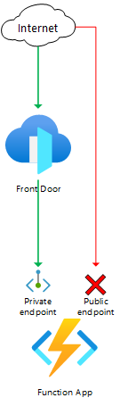

# Front Door Standard/Premium (Preview) with Azure Functions origin and private endpoint

    

This template deploys a Front Door Standard/Premium (Preview) with an Azure Functions origin, using a private endpoint to access the Azure Functions application.

## Sample overview and deployed resources

This sample template creates an Azure Functions app, HTTP triggered-function, and a Front Door profile, and uses a private endpoint (also known as Private Link) to access the Azure Functions app.

The following resources are deployed as part of the solution:

### Azure Functions
- Azure Functions plan and application.
  - The Azure Functions plan must use a [SKU that supports private endpoints](https://docs.microsoft.com/azure/-function-/networking/private-endpoint).

### Front Door Standard/Premium (Preview)
- Front Door profile, endpoint, origin group, origin, and route to direct traffic to the Azure Functions application.
  - This sample must be deployed using the premium Front Door SKU, since this is required for Private Link integration.
  - The Front Door origin is configured to use Private Link. The behaviour of Azure Functions (as of February 2021) is that, once a private endpoint is configured on an Azure Functions app, [that Azure Functions application will no longer accept connections directly from the internet](https://docs.microsoft.com/azure/app-service/networking/private-endpoint). Traffic must flow through Front Door for it to be accepted by App Service.

The following diagram illustrates the components of this sample.

## Deployment steps

You can click the "deploy to Azure" button at the beginning of this document or follow the instructions for command line deployment using the scripts in the root of this repo.

## Usage

### Connect

Once you have deployed the Azure Resource Manager template, you need to approve the private endpoint connection. This step is necessary because the private endpoint created by Front Door is deployed into a Microsoft-owned Azure subscription, and cross-subscription private endpoint connections require explicit approval. To approve the private endpoint:
1. Open the Azure portal and navigate to the Azure Functions application.
2. Click the **Networking** tab, and then click **Configure your private endpoint connections**.
3. Select the private endpoint that is awaiting approval, and click the **Approve** button. This can take a couple of minutes to complete.

After approving the private endpoint, wait a few minutes before you attempt to access your Front Door endpoint to allow time for Front Door to propagate the settings throughout its network.

You can then access the function through the Front Door endpoint. The function's URL is emitted as an output from the deployment - the output is named `frontDoorEndpointFunctionUrl`. You should get a response saying _This HTTP triggered function executed successfully. Pass a name in the query string or in the request body for a personalized response._. If you see an error page, wait a few minutes and try again.

You can also attempt to access the function directly through the Azure Functions endpoint. The hostname is also emitted as an output from the deployment - the output is named `functionAppFunctionUrl`. You should see a _Forbidden_ error, since your Azure Functions instance no longer accepts requests that come from the internet.

## Notes

- Front Door Standard/Premium is currently in preview.
- When using Private Link origins with Front Door Premium during the preview period, [there is a limited set of regions available for use](https://docs.microsoft.com/azure/frontdoor/standard-premium/concept-private-link#limitations). These have been enforced in the template. Once the service is generally available this restriction will likely be removed.
- Front Door Standard/Premium is not currently available in the US Government regions.
