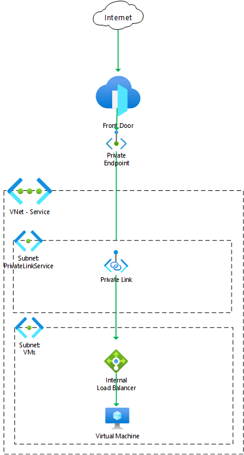

# Front Door Standard/Premium (Preview) with VM origin and Private Link service

    

This template deploys a Front Door Standard/Premium (Preview) with a virtual machine web server origin. Front Door uses a private endpoint, configured with Private Link service, to access the web application.

## Sample overview and deployed resources

This sample template creates a virtual machine (VM), Private Link service, and a Front Door profile, and uses a private endpoint to access the VM-hosted web app.

The following resources are deployed as part of the solution:

## Networking
- Virtual network, with subnets for the VMs and internal load balancer (`VMs`) and for Private Link service (`PrivateLinkService`).
- Internal load balancer to sit in front of the VM.
- Private Link service to make the load balancer accessible to Front Door through a private endpoint.

## Compute
- Virtual machine, added to the load balancer.
- Virtual machine extension to deploy and enable IIS.

### Front Door Standard/Premium (Preview)
- Front Door profile, endpoint, origin group, origin, and route to direct traffic to the VM.
  - This sample must be deployed using the premium Front Door SKU, since this is required for Private Link integration.

The following diagram illustrates the components of this sample.

## Deployment steps

You can click the "deploy to Azure" button at the beginning of this document or follow the instructions for command line deployment using the scripts in the root of this repo.

## Usage

### Connect

Once you have deployed the Azure Resource Manager template, you need to approve the private endpoint connection. This step is necessary because the private endpoint created by Front Door is deployed into a Microsoft-owned Azure subscription, and cross-subscription private endpoint connections require explicit approval. To approve the private endpoint:
1. Open the Azure portal and navigate to the Private Link service deployed as part of this sample.
2. Click the **Private endpoint connections** tab.
3. Select the private endpoint that is awaiting approval, and click the **Approve** button. This can take a couple of minutes to complete.

After approving the private endpoint, wait a few minutes before you attempt to access your Front Door endpoint to allow time for Front Door to propagate the settings throughout its network.

You can then access the application through the Front Door endpoint. The application's hostname is emitted as an output from the deployment - the output is named `frontDoorEndpointHostName`. You should see the default IIS welcome page. If you see an error page, wait a few minutes and try again.

You cannot access the VM directly because it is not exposed to the internet.

## Notes

- Front Door Standard/Premium is currently in preview.
- When using Private Link origins with Front Door Premium during the preview period, [there is a limited set of regions available for use](https://docs.microsoft.com/azure/frontdoor/standard-premium/concept-private-link#limitations). These have been enforced in the template. Once the service is generally available this restriction will likely be removed.
- Front Door Standard/Premium is not currently available in the US Government regions.
- In this sample, HTTPS connections terminate at Front Door, and connections from Front Door through to the virtual machine are made using HTTP.
- In this sample, the `Host` header of requests from Front Door will be the hostname of the Front Door endpoint. With a default website on IIS this works successfully since the `Host` header is effectively ignored. In more complex scenarios you may need to send specific `Host` header values based on what the web server expects or understands.
