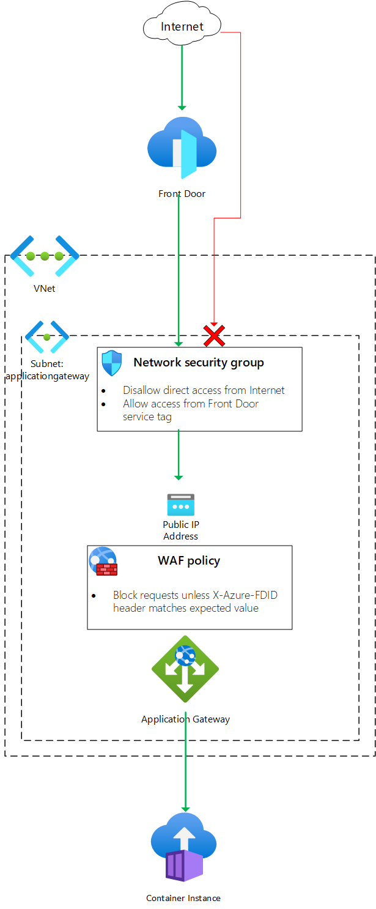

# Front Door Standard/Premium (Preview) with Azure Container Instances and Application Gateway origin

  

This template deploys a Front Door Standard/Premium (Preview) with Azure Container Instances and Application Gateway.

## Sample overview and deployed resources

This sample template creates an Azure Container Instances container group and a Front Door profile. The container group is added to a virtual network, and Application Gateway is used to enable Front Door to send traffic to the container group.

The following resources are deployed as part of the solution:

## Networking
- Virtual network, with two subnets (`ApplicationGateway` and `Containers`).
- Network security group (NSG) that will block traffic that does not flow through Front Door. It uses the Front Door service tag to identify valid traffic.

## Container Instances
- Container group, with a single container deployed from the Hello World image.

## Application Gateway
- WAF policy. This includes a mandatory managed ruleset, and a custom rule to inspect the `X-Azure-FDID` header and confirm it matches the value of the Front Door profile's ID.
- Application Gateway instance, deployed using the `WAF_v2` SKU. This is required to be able to inspect the `X-Azure-FDID` header.

### Front Door Standard/Premium (Preview)
- A Front Door profile with an endpoint, which is configured with an origin group, origin, and route to direct traffic to the Application Gateway.
  - Note that you can use either the standard or premium Front Door SKU for this sample. By default, the standard SKU is used.

The following diagram illustrates the components of this sample.

## Deployment steps

You can click the "deploy to Azure" button at the beginning of this document or follow the instructions for command line deployment using the scripts in the root of this repo.

## Usage

### Connect

Once you have deployed the Azure Resource Manager template, wait a few minutes before you attempt to access your Front Door endpoint to allow time for Front Door to propagate the settings throughout its network.

You can then access the Front Door endpoint. The hostname is emitted as an output from the deployment - the output is named `frontDoorEndpointHostName`. If you access the base hostname you should see a page saying _Welcome to Azure Container Instances!_. If you see a different error page, wait a few minutes and try again.

## Notes

- Front Door Standard/Premium is currently in preview.
- Front Door Standard/Premium is not currently available in the US Government regions.
