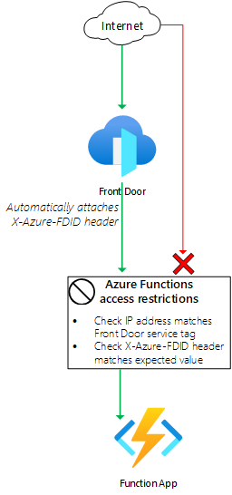

# Front Door Standard/Premium (Preview) with Azure Functions origin

  

This template deploys a Front Door Standard/Premium (Preview) with an Azure Functions (HTTP trigger) origin, using the Azure Functions public endpoint.

## Sample overview and deployed resources

This sample template creates an Azure Functions app, HTTP triggered-function, and a Front Door profile, and uses the Azure Function app's public IP address with [access restrictions](https://docs.microsoft.com/azure/app-service/app-service-ip-restrictions) to enforce that incoming connections must come through your Front Door instance.

The following resources are deployed as part of the solution:

### Azure Functions
- Azure Functions plan and application. This sample uses the public endpoint for the Azure Functions application and does not use a private endpoint.
- HTTP-triggered sample function. The function is configured with the `anonymous` authentication level, which means there is no function key required, and anyone can invoke the function as long as they access the function app through the Front Door endpoint.
- [Azure Functions access restrictions](https://docs.microsoft.com/azure/app-service/app-service-ip-restrictions) to block access to the application unless they have come through Front Door. The traffic is checked to ensure it has come from the `AzureFrontDoor.Backend` service tag, and also that the `X-Azure-FDID` header is configured with your specific Front Door instance's ID.

### Front Door Standard/Premium (Preview)
- Front Door profile, endpoint, origin group, origin, and route to direct traffic to the Azure Functions application.
  - Note that you can use either the standard or premium Front Door SKU for this sample. By default, the standard SKU is used.

The following diagram illustrates the components of this sample.

## Deployment steps

You can click the "deploy to Azure" button at the beginning of this document or follow the instructions for command line deployment using the scripts in the root of this repo.

## Usage

### Connect

Once you have deployed the Azure Resource Manager template, wait a few minutes before you attempt to access your Front Door endpoint to allow time for Front Door to propagate the settings throughout its network.

You can then access the function through the Front Door endpoint. The function's URL is emitted as an output from the deployment - the output is named `frontDoorEndpointFunctionUrl`. You should get a response saying _This HTTP triggered function executed successfully. Pass a name in the query string or in the request body for a personalized response._. If you see an error page, wait a few minutes and try again.

You can also attempt to access the function directly through the Azure Functions endpoint. The hostname is also emitted as an output from the deployment - the output is named `functionAppFunctionUrl`. You should see a _Forbidden_ error, since your Azure Functions instance has been configured to block requests that don't come through your Front Door profile.

## Notes

- Front Door Standard/Premium is currently in preview.
- Front Door Standard/Premium is not currently available in the US Government regions.
- Azure Functions access restrictions rules for service tags and headers are currently in preview.
