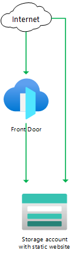

# Front Door Standard/Premium (Preview) with Azure Storage static website origin

  

This template deploys a Front Door Standard/Premium (Preview) with an [Azure Storage static website](https://docs.microsoft.com/azure/storage/blobs/storage-blob-static-website) origin, using the public endpoint for the Azure Storage static website.

## Sample overview and deployed resources

This sample template creates an Azure Storage static website and a Front Door profile.

Note that in this sample, the storage account will still accept requests directly to the static website. If you are only using Front Door for features like caching and compression then this is not likely to be a concern. However, if you need traffic flows to be restricted so that requests must come through Front Door, consider using the **201-front-door-premium-storage-blobs-private-link** sample instead.

The following resources are deployed as part of the solution:

### Azure Storage
- Azure Storage account.

### Deployment script
- A deployment script enables [static website hosting](https://docs.microsoft.com/azure/storage/blobs/storage-blob-static-website) on the storage account account. This script only executes on the initial deployment of the template.

### Front Door Standard/Premium (Preview)
- Front Door profile, endpoint, origin group, origin, and route to direct traffic to the static website.
  - Note that you can use either the standard or premium Front Door SKU for this sample. By default, the standard SKU is used.

The following diagram illustrates the components of this sample.

## Deployment steps

You can click the "deploy to Azure" button at the beginning of this document or follow the instructions for command line deployment using the scripts in the root of this repo.

## Usage

### Connect

Once you have deployed the Azure Resource Manager template, wait a few minutes before you attempt to access your Front Door endpoint to allow time for Front Door to propagate the settings throughout its network.

You can then access the Front Door endpoint. The hostname is emitted as an output from the deployment - the output is named `frontDoorEndpointHostName`. You should see a page saying _Welcome_. If you see a different error page, wait a few minutes and try again.

You can also attempt to access the static website hostname directly. The hostname is also emitted as an output from the deployment - the output is named `storageStaticWebsiteHostName`. This should show you the same page as when you access through Front Door, since Azure Storage static websites can't be configured to only allow traffic from Front Door.

## Notes

- Front Door Standard/Premium is currently in preview.
- Front Door Standard/Premium is not currently available in the US Government regions.
