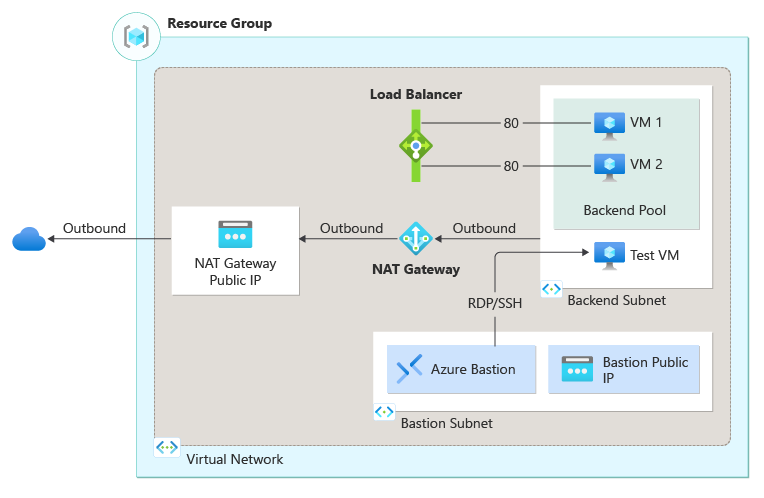

# Create a standard internal load balancer

This template creates a standard internal Azure Load Balancer with backend pool containing two virtual machines. The Azure Load Balancer is assigned a static IP in the Virtual Network and is configured to load balance on Port 80. Health probes are configured to check the status of the virtual machines.

As part of the deployment, Azure Bastion is deployed for virtual machine management, and NAT Gateway is deployed for outbound connectivity. This template also deploys a Storage Account, Virtual Network & subnets, and network interfaces.

To learn more about how to deploy the template, see the [quickstart](https://docs.microsoft.com/azure/load-balancer/quickstart-load-balancer-standard-internal-bicep.md) article.

Outbound rules are not created as part of this template.  For more information on providing outbound connectivity to the backend pool see, [What is Virtual Network NAT?](https://docs.microsoft.com/azure/virtual-network/nat-overview).

`Tags: Microsoft.Network/virtualNetworks, Microsoft.Network/virtualNetworks/subnets, Microsoft.Network/networkInterfaces, Microsoft.Network/loadBalancers`