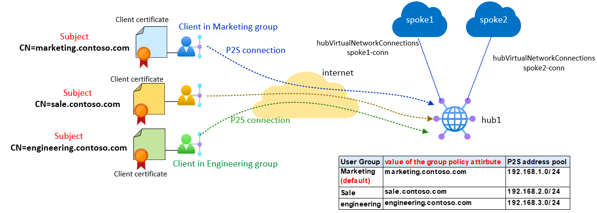
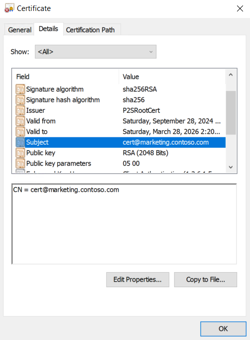
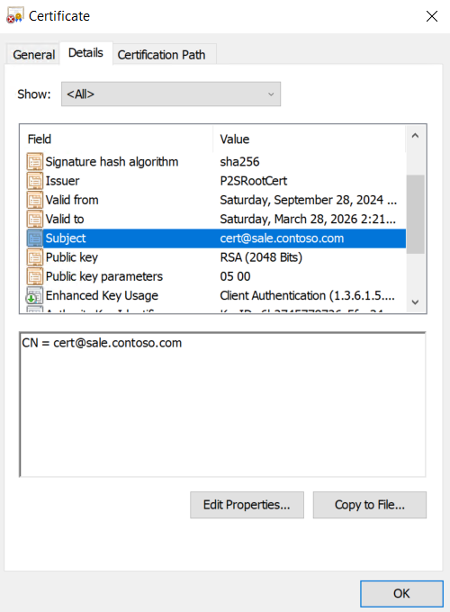
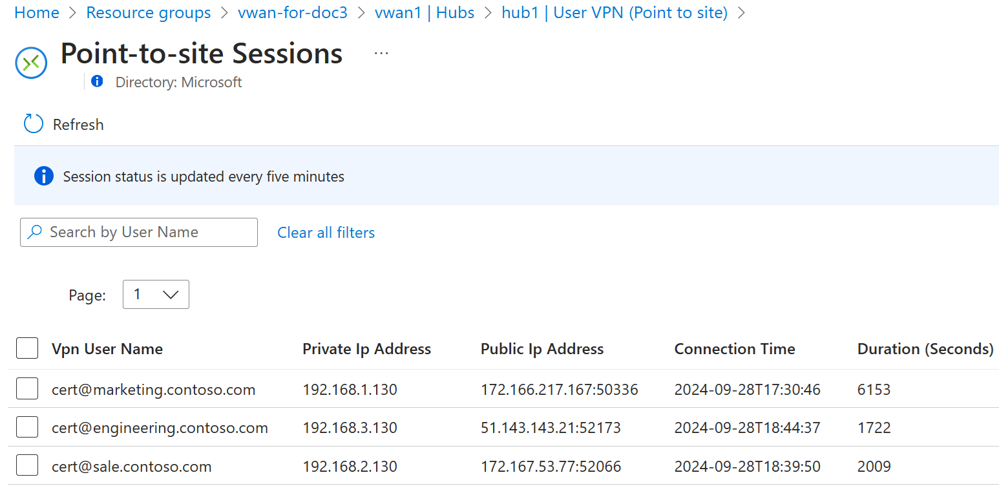

# vWAN P2S deployment with multi address pool and user groups


[](https://portal.azure.com/#create/Microsoft.Template/uri/https%3A%2F%2Fraw.githubusercontent.com%2FAzure%2Fazure-quickstart-templates%2Fmaster%2Fquickstarts%2Fmicrosoft.network%2Fvirtual-wan-multiple-address-pool%2Fazuredeploy.json)
[](https://portal.azure.us/#create/Microsoft.Template/uri/https%3A%2F%2Fraw.githubusercontent.com%2FAzure%2Fazure-quickstart-templates%2Fmaster%2Fquickstarts%2Fmicrosoft.network%2Fvirtual-wan-multiple-address-pool%2Fazuredeploy.json)

[](http://armviz.io/#/?load=https%3A%2F%2Fraw.githubusercontent.com%2FAzure%2Fazure-quickstart-templates%2Fmaster%2Fquickstarts%2Fmicrosoft.network%2Fvirtual-wan-multiple-address-pool%2Fazuredeploy.json)

## Overview

This template provisions an Azure Virtual WAN with a single hub, featuring **Point-to-Site connections configured with user groups and multiple address pools.**

## Description

This ARM template provisions an Azure Virtual WAN (vWAN) environment with the following resources:

- a single hub,
- two Azure Virtual Networks (VNets): spoke1 and spoke2
- two VNet connections for the vWAN hub: cone connecting to spoke1 VNet and the other to spoke2 VNet. Both VNet connections are associated with the routing table 'RT_SPOKE' and propagated to the 'RT_SPOKE' and default routing tables.
- A Point-to-Site (P2S) VPN gateway is configured with multiple user groups and multiple address pools. All the P2S connections are authenticated using digital certificates.


The ARM template creates a Point-to-Site server configuration named **hub1_P2SvpnServerConfiguration** with the following setting:

| group configuration name  | Default | Priority | Group Name  | Authentication Type   | group configuration value|
|---------------------------|---------|----------|-------------|-----------------------|--------------------------|
|hub1_P2SvpnServerConfigGrp1| true    | 0        | Marketing   | Certificate: Group ID | marketing.contoso.com    |
|hub1_P2SvpnServerConfigGrp2| false   | 1        | Sale        | Certificate: Group ID | sale.contoso.com         |
|hub1_P2SvpnServerConfigGrp3| false   | 2        | Engineering | Certificate: Group ID | engineering.contoso.com  |

All three user groups are authenticated using digital certificates. The Marketing group is set as the default group. <br>
If there is no match between the **Subject** in the client's digital certificate and the **group configuration value**, the VPN Gateway will assign the client an IP address from the default group. <br> The Point-to-Site server configuration **hub1_P2SvpnServerConfiguration** is associated with hub1, and each group configuration is linked to a specific address pool:

| group configuration name  | Address pool   |
|---------------------------|----------------|
|hub1_P2SvpnServerConfigGrp1| 192.168.1.0/24 |
|hub1_P2SvpnServerConfigGrp2| 192.168.2.0/24 |
|hub1_P2SvpnServerConfigGrp3| 192.168.3.0/24 |

<br>



<br>

IP addressing scheme is specified by variables within the template. <br>
In P2S with authentication with digital certificate, the root certificate is used to sign the client certificates.  <br>
The ARM template requires the mandatory specification of public certificate data of the root certificate. Without the root certificate data, the deployment will fail. 
After the provisioning, checking the Point-to-Site configuration requires three different P2S clients. <br>
The steps to connect in P2S the clients to vWAN:

- Create three different digital certificates client signed by root certificate.
- Load the three P2S client digital certificates (Marketing, Sales, Engineering) onto the P2S clients.
- Download and install the Azure VPN client on the P2S clients.
- Download the user profile from the Azure management portal and copy it to each client.
- Open the Azure VPN client on the P2S clients and import the user profile.
- In the Azure VPN client, select the imported user profile and connect to the vWAN

More details about multiple address pools and user groups can be found in the documentation:

[About client address pools for Virtual WAN point-to-site configurations](https://learn.microsoft.com/azure/virtual-wan/about-client-address-pools) <br>
[Configure user groups and IP address pools for P2S User VPNs](https://learn.microsoft.com/azure/virtual-wan/user-groups-create)

For simplicity, the ARM template in **Microsoft.Network/vpnServerConfigurations** does not include the **vpnClientRevokedCertificates** property, as it assumes there are no revoked digital certificates. However, this property should be included if you need to revoke any certificates.

To create the digital certificates for test environments, you can use the powershell script **create-root-and-clients-certificates.ps1** from the root of this repo:

```powershell
.\create-root-and-clients-certificates.ps1 'PASSWORD-TO-EXPORT-DIGITAL-CERTIFICATE'
```
The powershell scripts generate the following certificates for the clients:






Point-to-site sessions between three clients in different users group :



`Tags: vWAN, Virtual WAN, VPN, P2S, multiple address pool, user group, Microsoft.Network/virtualWans, Microsoft.Network/virtualHubs, Microsoft.Network/virtualNetworks, Microsoft.Network/virtualHubs/hubVirtualNetworkConnections, Microsoft.Network/vpnGateways, Microsoft.Network/vpnServerConfigurations, Microsoft.Network/p2sVpnGateways`