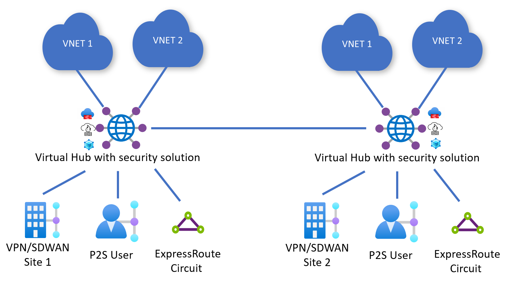

# Azure Virtual WAN Routing Intent and Policies

## Overview

This template provisions an Azure Virtual WAN with two hubs with **Routing Intent and Policies** feature enabled using integrated Azure Firewall instances. Optionally, Express Route and S2S VPN Gateways will be also created.

## Description

An Azure Virtual WAN is deployed, composed by two Hubs. Each Hub is secured by an integrated Azure Firewall instance (tier can be selected). For each Hub, two Virtual Network resources are created and peered to the hub. Optionally, Express Route and VPN S2S Gateways can be created. Then, Routing Intent and Policy feature is demonstrated applying the required configuration. By default, routing policies to control both Private and Internet traffic are enabled, behavior can be changed through parameters. For each Azure Firewall instance, a default policy is created containing a default Rule Collection Group, Rule Collection (Network) and default Rule to ALLOW all traffic either private and to the Internet. Additionally, IP Groups representing each Virtual Network address space is created and can be eventually used in the Firewall Policy definition as source and/or target.

## Architecture

The architecture of this solution will be similar to the picture below:

> [!NOTE]
> P2S Gateways will be not created. VPN S2S and Express Route Gateways can be created (optional) by the template, but no connections nor circuits will be deployed.

For more information on **Azure Virtual WAN Routing Intent and Policies** see article [How to configure Virtual WAN Hub routing intent and routing policies](https://learn.microsoft.com/azure/virtual-wan/how-to-routing-policies).

### Deployed Resources

The following resource types will be created as part of this template deployment:

- [**Microsoft.Network/virtualWans**](https://learn.microsoft.com/azure/virtual-wan/virtual-wan-about)
- [**Microsoft.Network/virtualHubs**](https://learn.microsoft.com/azure/virtual-wan/virtual-wan-global-transit-network-architecture)
- [**Microsoft.Network/virtualHubs/routingIntent**](https://learn.microsoft.com/azure/virtual-wan/how-to-routing-policies)
- [**Microsoft.Network/azureFirewalls**](https://learn.microsoft.com/azure/firewall/overview)
- [**Microsoft.Network/firewallPolicies**](https://learn.microsoft.com/azure/firewall/policy-rule-sets)
- [**Microsoft.Network/ipGroups**](https://learn.microsoft.com/azure/firewall/ip-groups)
- [**Microsoft.Network/virtualNetworks**](https://learn.microsoft.com/azure/templates/microsoft.network/virtualnetworks)
- [**Microsoft.Network/expressRouteGateways**](https://learn.microsoft.com/azure/expressroute/expressroute-about-virtual-network-gateways)
- [**Microsoft.Network/vpnGateways**](https://learn.microsoft.com/azure/vpn-gateway/vpn-gateway-about-vpngateways)

### Deployment steps

Before deploying the template, or immediately after and before using for production purposes, it is highly recommended to review the Azure Firewall policies and rules to adapt to your own security and network requirements. By default all internal VNet-toVNet and outbound Internet traffic is allowed.

`Tags: Virtual WAN, vWAN, Hub, Routing Intent and Policies, Azure Firewall, Azure Firewall Policies, ExpressRoute, VPN S2S, Microsoft.Network/virtualWans, Microsoft.Network/virtualHubs, Microsoft.Network/virtualNetworks, Microsoft.Network/virtualHubs/hubVirtualNetworkConnections, Microsoft.Network/vpnGateways, Microsoft.Network/expressRouteGateways, Microsoft.Network/azureFirewalls, Microsoft.Network/firewallPolicies, Microsoft.Network/ipGroups, Microsoft.Network/virtualHubs/routingIntent`
