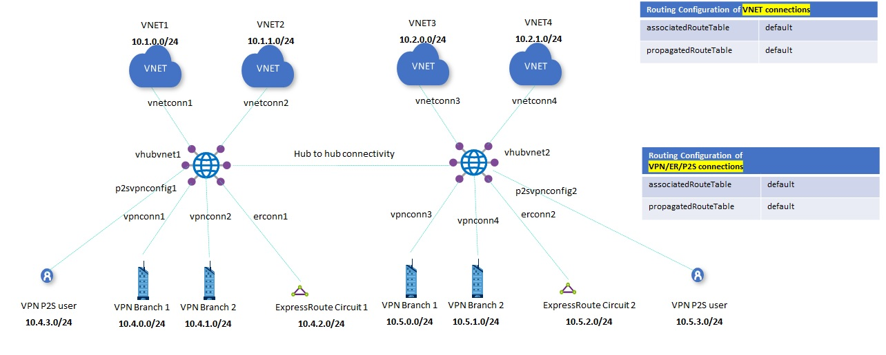
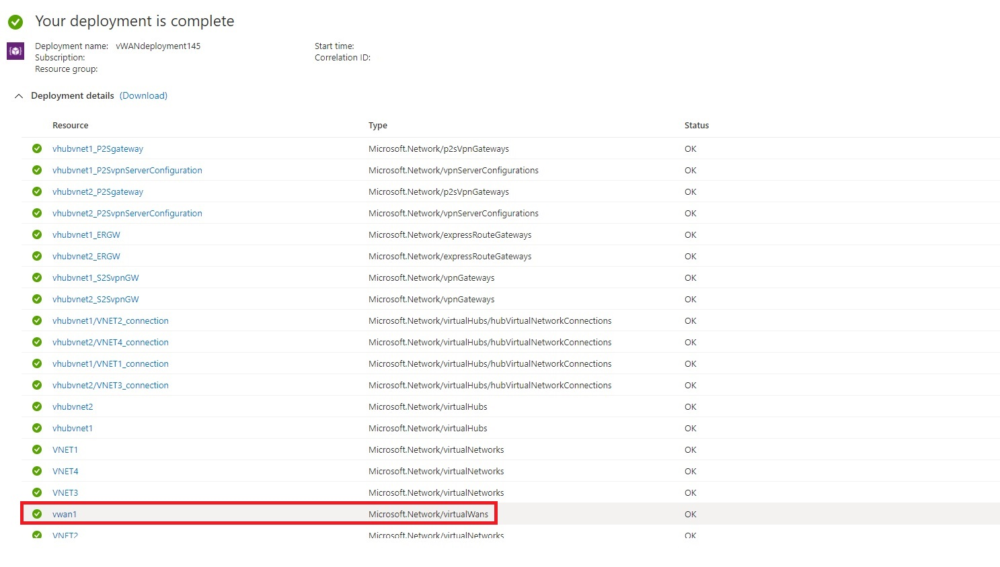
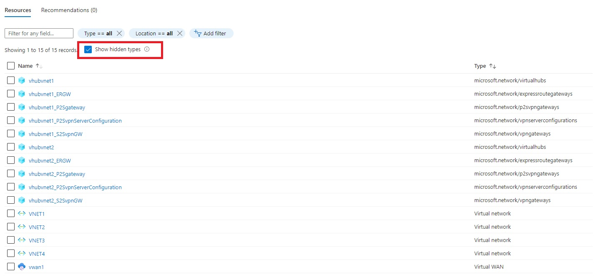

# Azure Virtual WAN (vWAN) Multi-Hub Deployment

## Solution Overview

This template creates a fully functional Azure Virtual WAN (vWAN) environment with the following resources:

- Two distinct hubs in different regions
- Four Azure Virtual Networks (VNET)
- Two VNET connections for each vWAN hub
- One Point-to-Site (P2S) VPN gateway in each hub
- One Site-to-Site (S2S) VPN gateway in each hub
- One Express Route gateway in each hub

## Architecture

vWAN resource deployed is of type "Standard" with default full mesh connectivity.
The scenario implemented is exactly the one referenced in the Azure Virtual WAN documentation article below:

[Azure vWAN Routing Scenario: any-to-Any](https://docs.microsoft.com/azure/virtual-wan/scenario-any-to-any)

List of input parameters has been kept at the very minimum.
IP addressing scheme can be changed modifying the variables inside the template, values have been provided based on the architecture diagram above.

> [!NOTE]
> This template will create all the vWAN resources listed above, but will not create the customer side resources required for hybrid connectivity. After template deployment will be completed, user will need to create P2S VPN clients, VPN branches (Local Sites) and connect Express Route circuits.

## Successful Deployment

Once the ARM deployment of the template will be completed, you should see something similar to the image below:

## ARM resources

Additionally, inside the Resource Group the following resources will be created:

`Tags: Virtual WAN, vWAN, Hub, ExpressRoute, VPN, S2S, P2S, Routing`
