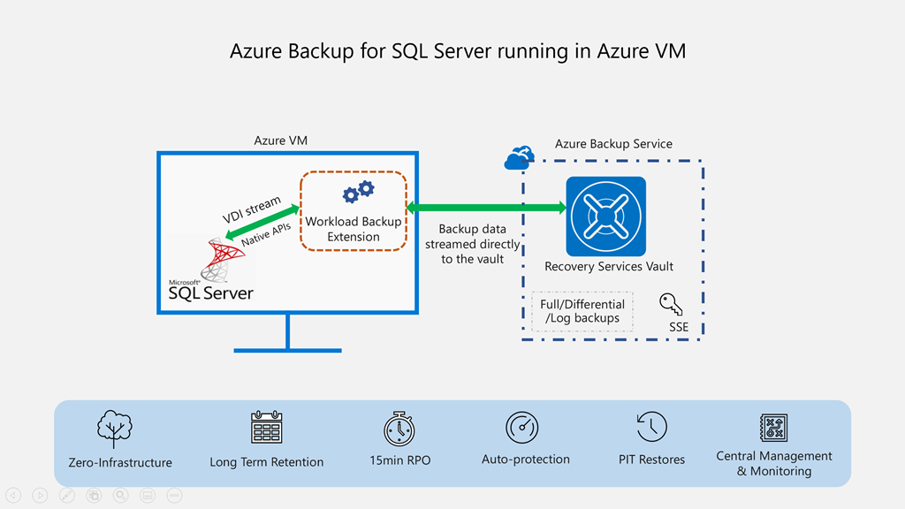

# Azure Backup for SQL Server in Azure Virtual Machines

  

### This template creates a Recovery Services Vault and a Workload specific Backup Policy. Registers VM with Azure Backup service and Configures Protection.

The Backup service is Microsoft's born in the cloud backup solution to backup data that's located on-premises and in Azure. It replaces your existing on-premises or offsite backup solution with a reliable, secure and cost competitive cloud backup solution. It also provides the flexibility of protecting your assets running in the cloud. You can backup Windows Servers, Windows Clients, Hyper-V VMs, Microsoft workloads, Azure Virtual Machines (Windows and Linux) with its in-built resilience and high SLAs. [Learn more](http://aka.ms/backup-learn-more/).

### Prerequisites

You need to have [VM with SQL Server](https://azure.microsoft.com/en-us/services/virtual-machines/sql-server/). Sample template for VM with SQL Server can be found under prereqs directory.

### Steps (Operations performed in Template)

Once you have VM and Database available to be backed up.

<ol>
<li>Create Recovery Services Vault (Create new or use existing)</li>
<li>Create Workload Backup Policy (Create new or use existing)</li>
<li>Register VM with Backup Service (Installs Backup VM Extension)</li>
<li>Configure Protection</li>
</ol>

Make use of conditional property in the template to toggle between new vs existing vault and policy.

In order to delete the recovery services vault, you first need to stop protection to any existing backup item (e.g. database) and unregister the virtual machine containing the workload. You may refer below documentation:

<ul>
<li>[Stop backup and delete backup data](https://docs.microsoft.com/en-us/azure/backup/backup-azure-sql-automation#delete-backup-data)</li>
<li>[Unregister VM](https://docs.microsoft.com/en-us/azure/backup/backup-azure-sql-automation#unregister-sql-vm)</li>
<li>[Delete Recovery Services Vault](https://docs.microsoft.com/en-us/azure/backup/backup-azure-delete-vault#delete-the-recovery-services-vault-by-force)</li>
</ul>

To know more about Azure Backup for SQL Server in Azure Virtual Machines [Click Here](https://azure.microsoft.com/en-us/blog/azure-backup-for-sql-server-in-azure-virtual-machines-now-generally-available/)

