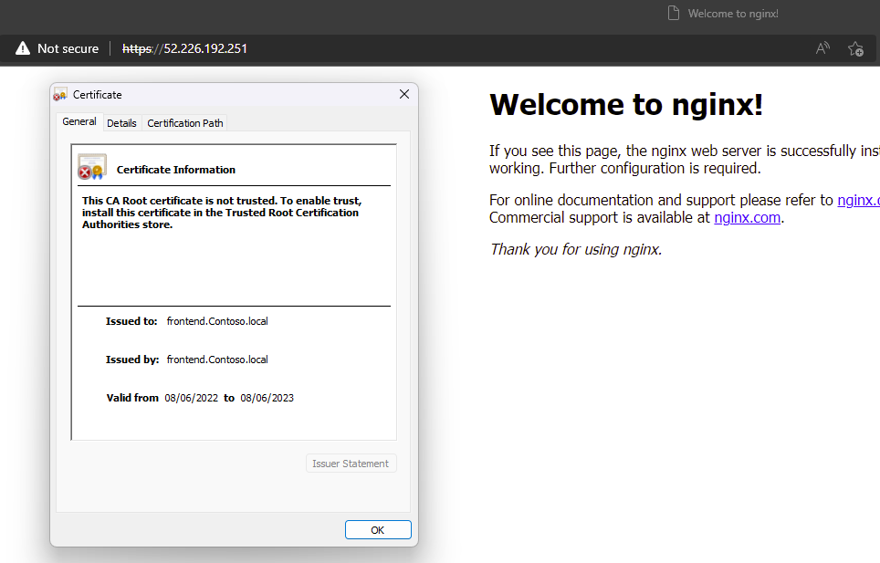

# Create Application Gateway with Certificates

   

## Sample overview

This template leverages the KeyVault Certificate module from the bicep registry to create a self-signed certificate which is then added to an Azure Application Gateway.
This demonstrates SSL termination, Key Vault - Application Gateway integration and the Key Vault capability of generating self-signed certificates.

A new Azure Application Gateway and Azure KeyVault are created, as well as a **private** DNS zone.

See the [Create-Kv-Certificate](https://github.com/Azure/bicep-registry-modules/tree/main/modules/deployment-scripts/create-kv-certificate) module in the Bicep Registry for more information.
See the [docs](https://docs.microsoft.com/en-us/azure/azure-resource-manager/templates/deployment-script-template?tabs=CLI) for more information on the deployment script resource.

## Deployment steps

You can click the "deploy to Azure" button at the beginning of this document or follow the instructions for command line deployment using the scripts in the root of this repo.

`Tags: ApplicationGateway, Certificate, AzureCli`

## Notes

After deploying the template, access the sample application from your browser using either
- https://[application-gateway-public-ip]
- Using the `ApplicationGatewayPublicIp` and `FrontendPrivateDnsFqdn` deployment outputs to configure your local host file with the private dns address.

Here is what you can expect when accessing the sample application.

> To mitigate deployment errors due to RBAC propagation, a resource named `DeployDelay` is created that causes a pause in the deployment for 60 seconds. This allows time for RBAC changes to propagate.
