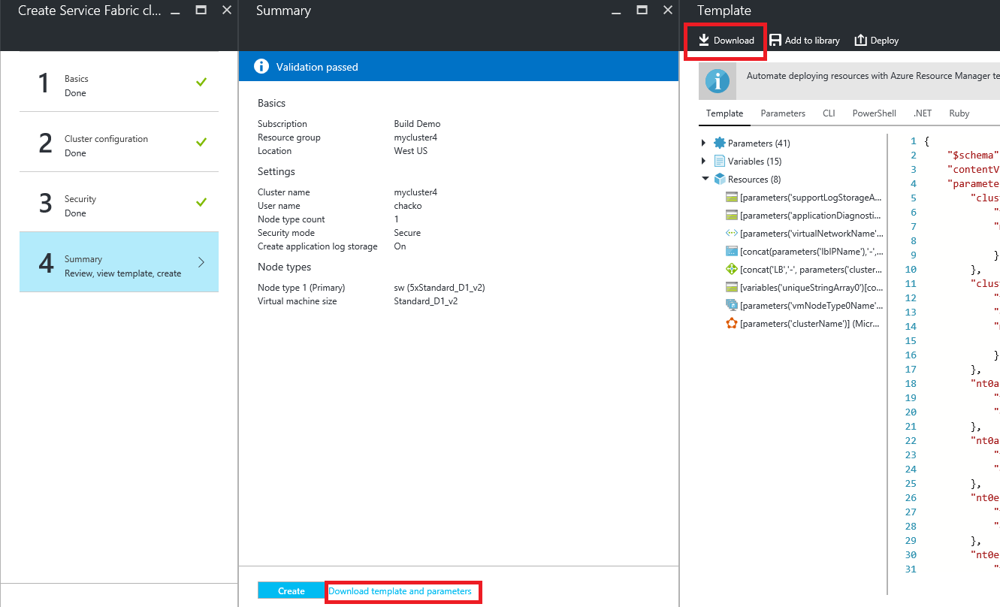

# Deploy a 5 Node Ubuntu Service Fabric Cluster

This template allows you to deploy a secure 5 node, Single Node Type Service Fabric Cluster running Ubuntu Server on a Standard_D2_v2 Size Virtual Machine Scale set with Azure Diagnostics turned on.

This template assumes that you already have certificates uploaded to your keyvault.  If you want to create a new certificate run the **New-ServiceFabricClusterCertificate.ps1** file in the scripts folder of this sample.

You can download the cert from the keyvault from the portal

- Got to the keyvalut resource
- navigate to the secrets tab and download the cert

## Creating a custom ARM template

If you are wanting to create a custom ARM template for your cluster, then you have two choices.

1. You can acquire this sample template make changes to it.
1. Log into the azure portal and use the service fabric portal pages to generate the template for you to customize.
   1. Log on to the [Azure Portal](https://aka.ms/servicefabricportal).

   1. Go through the process of creating the cluster as described in [Creating Service Fabric Cluster via portal](https://docs.microsoft.com/azure/service-fabric/service-fabric-cluster-creation-via-portal) , but do not click on ***create**, instead go to Summary and download the template and parameters.

 

Unzip the downloaded .zip on your local machine, make any changes to template or the parameter file as you need.

`Tags: Microsoft.Storage/storageAccounts, Microsoft.Network/virtualNetworks, Microsoft.Network/publicIPAddresses, Microsoft.Network/loadBalancers, Microsoft.Compute/virtualMachineScaleSets, ServiceFabricLinuxNode, LinuxDiagnostic, Microsoft.ServiceFabric/clusters`
