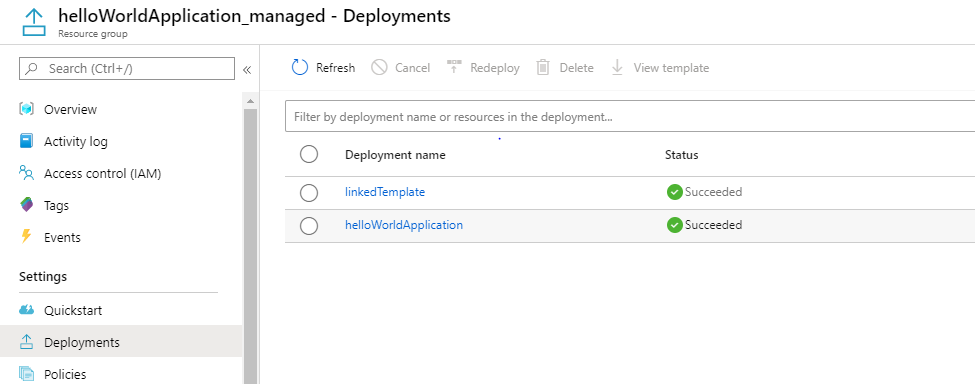

# Deploying your managed application with linked templates


    


    
    
[](https://portal.azure.com/#create/Microsoft.Template/uri/https%3A%2F%2Fraw.githubusercontent.com%2FAzure%2Fazure-quickstart-templates%2Fmaster%2Fquickstarts%2Fmicrosoft.solutions%2Fmanaged-application-with-linked-templates%2Fazuredeploy.json)  
[](https://portal.azure.us/#create/Microsoft.Template/uri/https%3A%2F%2Fraw.githubusercontent.com%2FAzure%2Fazure-quickstart-templates%2Fmaster%2Fquickstarts%2Fmicrosoft.solutions%2Fmanaged-application-with-linked-templates%2Fazuredeploy.json) 
[](http://armviz.io/#/?load=https%3A%2F%2Fraw.githubusercontent.com%2FAzure%2Fazure-quickstart-templates%2Fmaster%2Fquickstarts%2Fmicrosoft.solutions%2Fmanaged-application-with-linked-templates%2Fazuredeploy.json)


This sample template deploys a Service catalog managed application along with the definition that creates a linked deployment for the managed application. While creating managed application packages your scenario might require a complex deployment scenario which needs the ARM template to be broken down in to simpler templates that can be called by the main template. Managed Applications allow this by utilizing linked ARM template deployments and providing a location to store your linked templates.

This sample template combines two steps:

1) Deploys a Service catalog managed application definition.
2) Deploys a managed application using deployed application definition.

In a production environment a typical scenario would deploy the application definition and application instance as separate steps. For example, a definition is deployed once and an application many times. In this sample the two steps are combined to make it easy to quickly see the final result of those steps.

## Deploying linked templates

Azure resource manager templates allow you to call other templates from within an template. The called templates are known as linked templates. To do this a resource of type Microsoft.resources/deployments is created in the template and the Uri to the linked template is passed in.

```json
{
    "apiVersion": "2017-05-10",
    "name": "linkedTemplate",
    "type": "Microsoft.Resources/deployments",
    "properties": {
        "mode": "Incremental",
        "templateLink": {
            "uri" : "[<Uri to the child template>]",
            "contentVersion":"1.0.0.0"
        }
    }
}
```

[To learn more about linked templates click here](https://docs.microsoft.com/en-us/azure/azure-resource-manager/templates/linked-templates)

## Including additional files in your managed application package

When you create your managed application package, you can choose to add files other than the files read by the system (maintemplate.json, createuidefinition.json and viewdefinition.json(optional)). These files are also uploaded into the same blob where the other files are stored and can be referenced using the arm template 'deployment()' function

```json
deployment().properties.templateLink.uri
```

[To learn more about the deployment function click here](https://docs.microsoft.com/en-us/azure/azure-resource-manager/templates/template-functions-deployment)

## Putting it all together

When you create the package that is used to create the service catalog managed application definition, you can include the additional templates as part of the package. In the current sample the linked file is included in a folder called "linkedtemplates". In the main template file to reference the template the call is made as follows :

```json
    "variables": {
        "_deploymentLink": "[deployment().properties.templateLink.uri]"
    },
    .
    .
    .
    "templateLink": {
        "uri" : "[uri(variables('_deploymentLink'), 'linkedtemplates/storageAccountdeploy.json')]",
        "contentVersion":"1.0.0.0"
    },
```

Since the entire package is uploaded as a blob you can use the relative path "linkedtemplates/storageAccountdeploy.json" to access the linked template. Just for illustration the uri "uri(variables('_deploymentLink'), 'viewdefinition.json')" would access the viewdefinition.json file in the blob storage. Similarly you can access any other file from the blob using relative paths.

To verify that the linked deployment is trigerred, you can navigate to the managed resourcegroup created by the managed application. For this, navigate to the "Managed resource group" link when you click on the managed application in the azure portal. Here you can take a look at the deployments and you will see that there are 2 deployments created for this managed application as intended.



To learn how to create application with metrics and alerts please visit:

+ [Creating managed application with metrics and alerts](https://github.com/Azure/azure-quickstart-templates/tree/master/101-managed-application-with-metrics-and-alerts)


