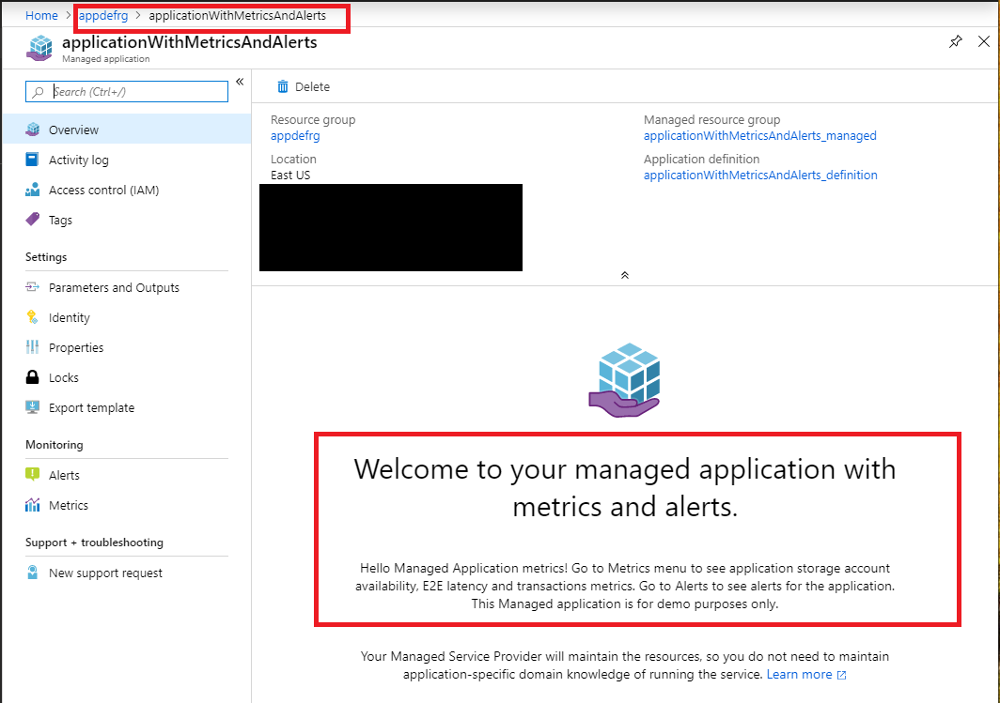
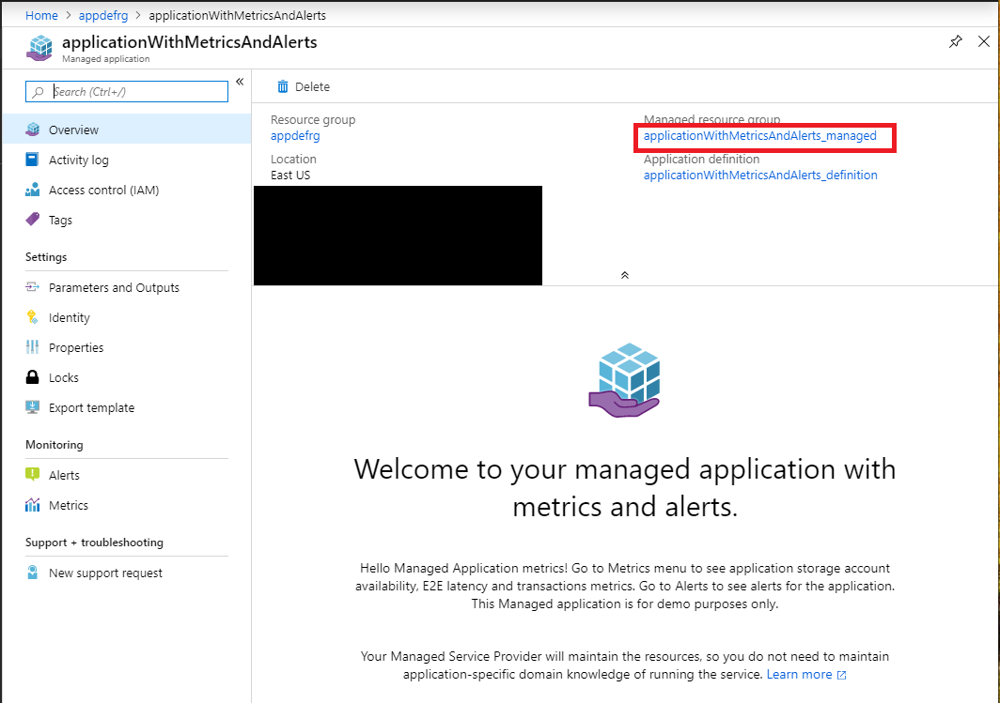
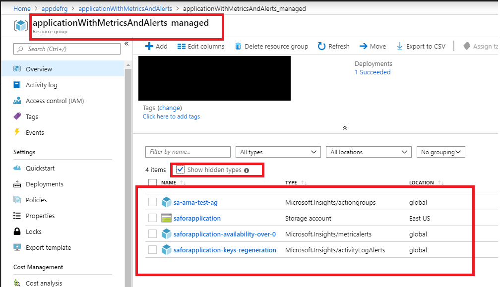
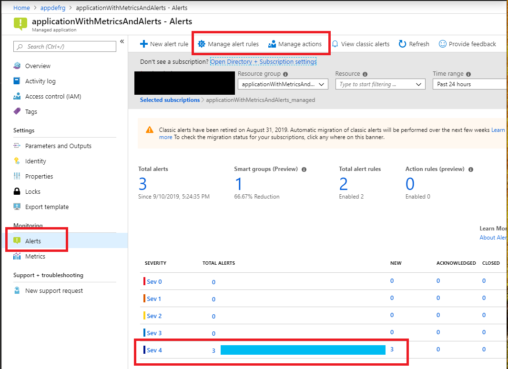
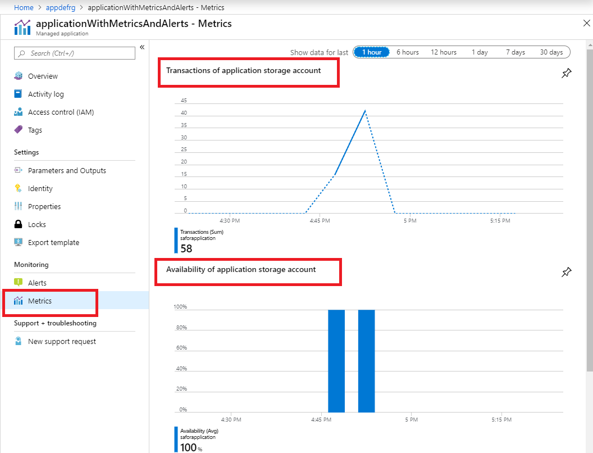

# Creating managed application with metrics and alerts

If this is your first time learning about Azure managed applications, please visit:

+ [**Deploying your first managed application**](https://github.com/Azure/azure-quickstart-templates/tree/master/101-managed-application).

This sample shows how you can author a service catalog managed application definition that will allow to deploy a managed application with defined metrics and alerts.
This managed application will contain single storage account as a resource, expose application metrics for the storage account including availability, success E2E latency, transactions; as well as alerts based on storage account availability and activity log alerts based on regenerating storage account keys.

This sample template combines two steps:

1. Deploys a service catalog managed application definition.
1. Deploys a managed application using deployed application definition.

In a production environment a typical scenario would deploy the application definition and application instance as separate steps. The definition is deployed once and the application many times. In this sample the two steps are combined to make it easy to quickly see the final result of those steps.

Once you deploy this sample template, navigate to the deployed managed application. The Application Overview contains a header and description of the application.

This view is driven by the [viewDefinition.json](artifacts/ManagedAppZip/viewDefinition.json) file from the application definition package.
The Overview is defined by the "kind" propert when set to "Overview".  Values for the header and description shown as a default overview experience.
To learn more about View definition please visit:

+ [**View definition artifact in Azure Managed Applications**](https://docs.microsoft.com/en-us/azure/managed-applications/concepts-view-definition)

Click *managed resource group* in managed application overview.

You'll see a storage account created inside the resource group. Click "Show hidden types" and you'll see that actually resource group contains an action group and two alert rules. These resources are deployed using the Azure Resource Manager Template [mainTemplate.json](artifacts/ManagedAppZip/mainTemplate.json) from the application definition package.

This sample [mainTemplate.json](artifacts/ManagedAppZip/mainTemplate.json) specifies deployment of the [action group](artifacts/ManagedAppZip/mainTemplate.json#L45), [metric alert rule](artifacts/ManagedAppZip/mainTemplate.json#L59) and [activity log alert rule](artifacts/ManagedAppZip/mainTemplate.json#L102) in addition to storage account deployment.

To learn more about Azure alerts, please visit:

+ [**Overview of alerts in Microsoft Azure**](https://docs.microsoft.com/en-us/azure/azure-monitor/platform/alerts-overview).

To learn more about Azure Resource Manager templates best practices please visit: 

+ [**Azure Resource Manager Templates - Best Practices Guide**](https://github.com/Azure/azure-quickstart-templates/blob/master/1-CONTRIBUTION-GUIDE/best-practices.md)

This sample application definition creates an application with the lock level set to "None", so you'll be able to access resources in managed resource group. Go to the managed resource group, go to storage account and perform some blob operations to generate some transactions.  Also go to "Access keys" and regenerate storage account key(s).

Go back to the application and select the Alerts menu. You'll be able to see that this application has two alert rules:

+ Metrics alert rule: if the Availability metric for the storage account is greater than 0
+ Activity log alert rule: if storage account key was regenerated

It may take a moment to propagate, but because you performed blob operations and regenerated the storage account key, you'll see Alerts raised for your application.

Now click on the Metrics menu item. The application is exposing three metrics: Transactions, Availability and Success E2E latency for the application storage account. Because you performed blob operations with the storage account you'll see data is flowing into the metric graphs.

The metrics view is driven by the [viewDefinition.json](artifacts/ManagedAppZip/viewDefinition.json) file from the application definition package. Metrics are defined by the "kind" property and the "Metrics" element. You can use any metric supported by your application's Azure resource to expose an application metric. You see different views: bar chart, line chart etc for better visualization.
You can drill down into each metric that you are interested in and explore more using [**Azure Metrics Explorer**](https://docs.microsoft.com/en-us/azure/azure-monitor/platform/metrics-getting-started) capabilities.

To learn more about supported metrics, please visit:

+ [**Supported metrics with Azure Monitor**](https://docs.microsoft.com/en-us/azure/azure-monitor/platform/metrics-supported).

To learn more about View definition please visit:

+ [**View definition artifact in Azure Managed Applications**](https://docs.microsoft.com/en-us/azure/managed-applications/concepts-view-definition)

