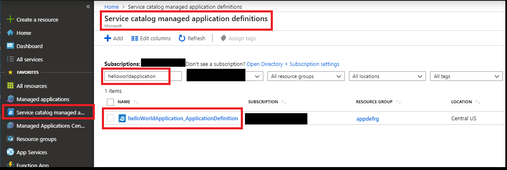

# Deploying your first managed application

  
 

This sample template deploys a Service catalog managed application definition that creates a single storage account as an application resource.  The application definition demonstrates how you can customize default application overview: header and description.

[To learn more about managed applications click here](https://docs.microsoft.com/en-us/azure/managed-applications/overview)

This template deploys a Service catalog managed application definition first, after that uses this application definition to  deploy a managed application.
You can also use the package located under the artifacts folder to deploy the managed application as Azure Marketplace application offer.

To learn more about Managed Application definitions and Marketplace please visit :

+ [Publish an Azure managed application definition](https://docs.microsoft.com/en-us/azure/managed-applications/publish-managed-app-definition-quickstart)
+ [Azure managed applications in the Marketplace](https://docs.microsoft.com/en-us/azure/managed-applications/publish-marketplace-app)

## Exploring created Managed Application

This sample template combines two steps:

1) Deploys a Service catalog managed application definition.
2) Deploys a managed application using deployed application definition.

In a production environment a typical scenario would deploy the application definition and application instance as separate steps. For example, a definition is deployed once and an application many times. In this sample the two steps are combined to make it easy to quickly see the final result of those steps.

Once you click on the deployed managed application you will notice that Overview contains header and description of the application.

This view is driven by [viewDefinition.json](artifacts/ManagedAppZip/viewDefinition.json) file from application definition package.

To learn more about View definition please visit:
+ [**View definition artifact in Azure Managed Applications**](https://docs.microsoft.com/en-us/azure/managed-applications/concepts-view-definition)

Every managed application has associated managed resource group, that actually contains application resources. These resources are deployed using Azure Resource Manager template [mainTemplate.json](artifacts/ManagedAppZip/mainTemplate.json) from the application definition package.

If you click managed resource group in managed application Overview, you'll see a storage account created inside that resource group.

To learn more about Azure Resource Manager templates best practices please visit: 
+ [**Azure Resource Manager Templates - Best Practices Guide**](https://github.com/Azure/azure-quickstart-templates/blob/master/1-CONTRIBUTION-GUIDE/best-practices.md)

## Exploring created Managed Application definition and deploy another application instance

If you click on application definition in managed application Overview, you'll be able to see managed application definition that was used for the application deployment.

You can also browse to the application definition using Service catalog managed application definition view.

Navigate to the managed application definition, you'll see "Deploy from definition" button.

When you click "Deploy from definition" button, you'll see the Create application experience. 
Fill in Basics and proceed to Application Settings.

Enter storage account name prefix and select storage account type if needed. Proceed to "Next: Review + Create".

You should see "Validation Passed" status, so you may proceed with actual application deployment: click "Create".

You should see notification that application deployment was successful, so you can navigate to the application.

Create experience is driven by [createUiDefinition.json](artifacts/ManagedAppZip/createUiDefinition.json) file from application definition package.

To learn more about authoring your managed application create experience please visit:
+ [Create Azure portal user interface for your managed application](https://docs.microsoft.com/en-us/azure/managed-applications/create-uidefinition-overview)
+ [Test your portal interface for Azure Managed Applications](https://docs.microsoft.com/en-us/azure/managed-applications/test-createuidefinition)

To learn how to create application with metrics and alerts please visit:
+ [Creating managed application with metrics and alerts](https://github.com/Azure/azure-quickstart-templates/tree/master/101-managed-application-with-metrics-and-alerts)

