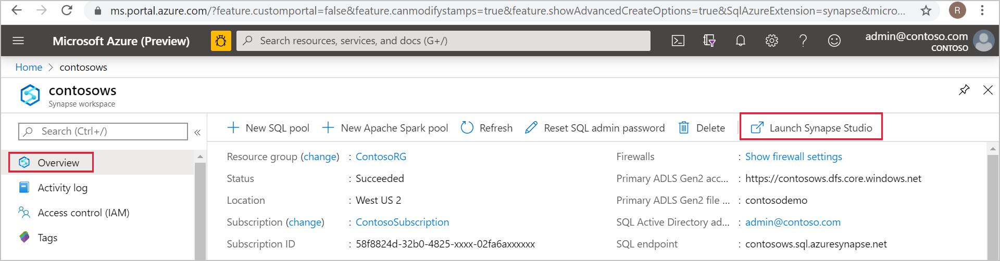
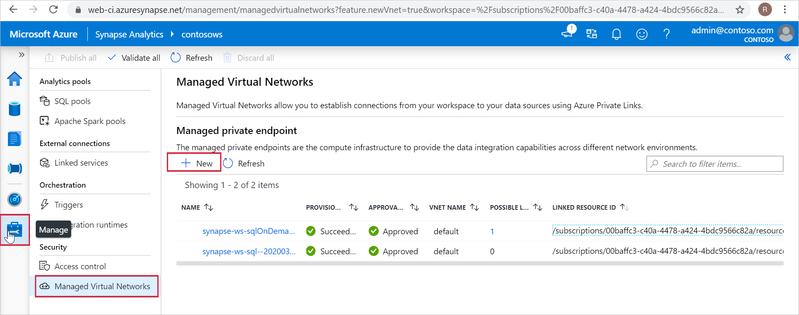
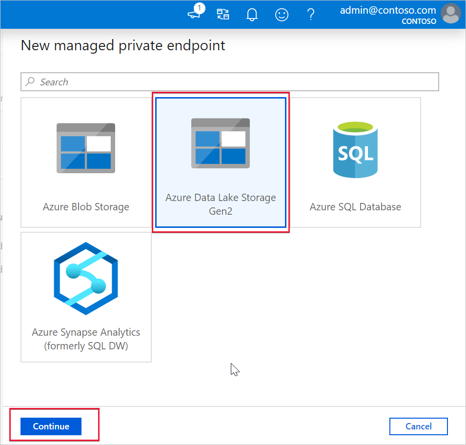
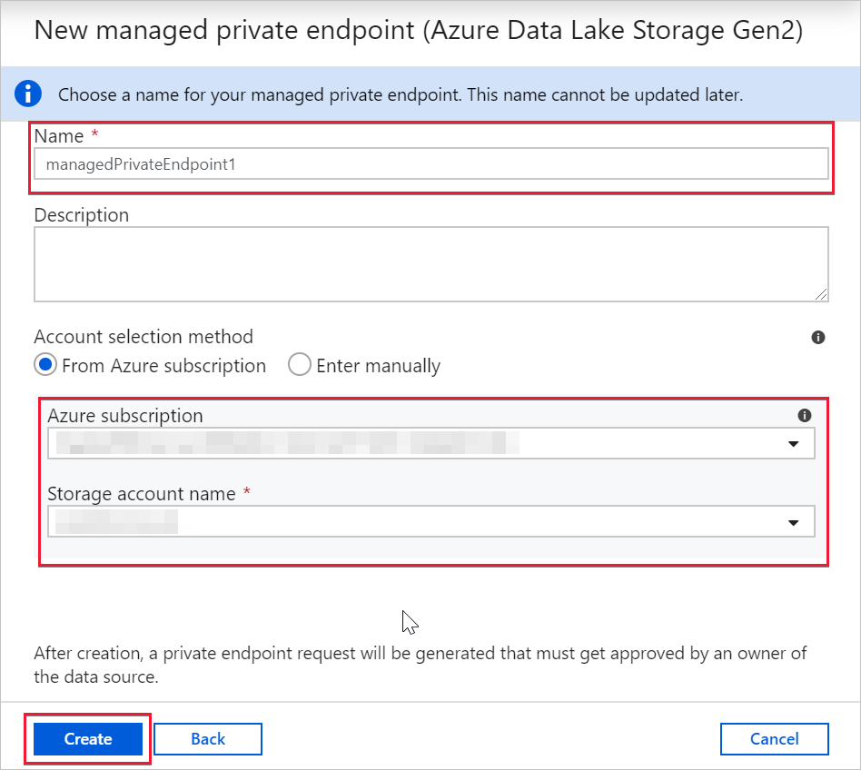
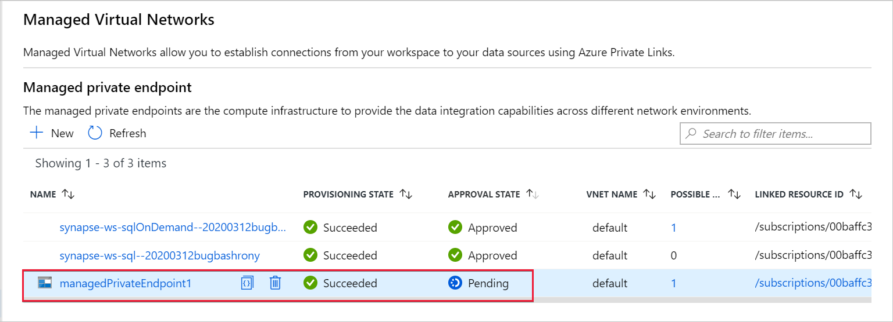

# Azure Synapse Proof-of-Concept

 

This template deploys necessary resources to run an Azure Synapse Proof-of-Concept

This template deploys the following:

- An Azure Synapse Workspace
  - (OPTIONAL) Allows All connections in by default (Firewall IP Addresses)
  - Allows Azure Services to access the workspace by default
  - Managed Virtual Network is Enabled
- An Azure Synapse SQL Pool
- (OPTIONAL) Apache Spark Pool
  - Auto-paused set to 15 minutes of idling
- Azure Data Lake Storage Gen2 account
  - Azure Synapse Workspace identity given Storage Blob Data Contributor to the Storage Account
    - A new File System inside the Storage Account to be used by Azure Synapse
- A Logic App to Pause the SQL Pool at defined schedule
  - The Logic App will check for Active Queries. If there are active queries, it will wait 5 minutes and check again until there are none before pausing
- A Logic App to Resume the SQL Pool at defined schedule
- Both Logic App managed identities are given Contributor rights to the Resource Group
- Grants the Workspace identity CONTROL to all SQL pools and SQL on-demand pool

## Index

- [Purpose](https://github.com/Azure/azure-quickstart-templates/tree/master/101-synapse-poc#purpose)
- [Prerequisites](https://github.com/Azure/azure-quickstart-templates/tree/master/101-synapse-poc#prerequisites)
- [Deploy to Azure](https://github.com/Azure/azure-quickstart-templates/tree/master/101-synapse-poc#deploy-to-azure)
- [Post Deployment](https://github.com/Azure/azure-quickstart-templates/tree/master/101-synapse-poc#post-deployment)

## Purpose

This template allows the Administrator to deploy a Proof-of-Concept environment of Azure Synapse Analytics with some pre-set parameters. This allows more time to focus on the Proof-of-Concept at hand and test the service.

Using the Getting Started wizard inside of the workspace is recommended to use sample data if you do not have your own with you to add to the Storage Account.

## Prerequisites

- Owner to the Azure Subscription being deployed. This is for creation of a separate Proof-of-Concept Resource Group and to delegate roles necessary for this proof of concept

## Post Deployment

Because the Synapse Workspace is using a Managed Virtual Network, the Storage Account requires a Managed Private Endpoint to be created into the Managed Virtual Network.

You can create a Managed private endpoint to your data source from Azure Synapse Studio. Select the Overview tab in Azure portal and select Launch Synapse Studio.

In Azure Synapse Studio, select the Manage tab from the left navigation. Select Managed Virtual Networks and then select + New.

Select the data source type. In this case, the target data source is an ADLS Gen2 account. Select Continue.

In the next window, enter information about the data source. In this example, we're creating a Managed private endpoint to an ADLS Gen2 account. Enter a Name for the Managed private endpoint. Provide an Azure subscription and a Storage account name. Select Create.

After submitting the request, you'll see its status. To verify the successful creation of your Managed private endpoint was created, check its Provisioning State. You may need to wait 1 minute and select Refresh to update the provisioning state. You can see that the Managed private endpoint to the ADLS Gen2 account was successfully created.

You can also see that the Approval State is Pending. The owner of the target resource can approve or deny the private endpoint connection request. If the owner approves the private endpoint connection request, then a private link is established. If denied, then a private link isn't established.

Further information can be found:

[Create a Managed private endpoint to your data source](https://docs.microsoft.com/en-us/azure/synapse-analytics/security/how-to-create-managed-private-endpoints)
