# Azure Functions App

The purpose of this ARM Template is to deploy an empty **Function App** and a **hosting Plan**.

But let's understand a bit better how all this will work.

## Overview

### How Functions App works in Azure

Azure Functions is a solution for easily running small pieces of code, or "functions," in the cloud. You can write just the code you need for the problem at hand, without worrying about a whole application or the infrastructure to run it. Functions can make development even more productive, and you can use your development languages of choice, such as C#, Java, JavaScript, PowerShell, and Python. Pay only for the time your code runs and trust Azure to scale as needed. Azure Functions lets you develop serverless applications on Microsoft Azure.

### What can I do with Functions

Functions are a great solution for processing data, integrating systems, working with the internet-of-things (IoT), and building simple APIs and microservices. Consider Functions for tasks like image or order processing, file maintenance, or for any tasks that you want to run on a schedule.

### How much does Functions cost

Azure Functions has two kinds of pricing plans. Choose the one that best fits your needs:

- **Consumption plan** - When your function runs, Azure provides all of the necessary computational resources. You don't have to worry about resource management, and you only pay for the time that your code runs.
- **App Service plan** - Run your functions just like your web apps. When you are already using App Service for your other applications, you can run your functions on the same plan at no additional cost.

## The Template

Don't let the size of the template scares you. The structure is very intuitive and once that you get the gist of it, you will see how much easier your life will be deploying resources to Azure.

These are the parameters on the template, they already have values inserted, so you don't need to worry about change them.

Here the list of all parameters:

Parameter         | Suggested value     | Description
:--------------- | :-------------      |:---------------------
**siteName** | globally unique name  | The unique name of Function App. The name must use alphanumeric and underscore characters only. There is a 35 character limit to this field. The App name cannot be changed once the bot is created.
**location** | location | This template takes the location of your Resource Group.

## Deployment

There are a few ways to deploy this template.
You can use [PowerShell](https://docs.microsoft.com/en-us/azure/azure-resource-manager/resource-group-template-deploy), [Azure CLI](https://docs.microsoft.com/en-us/azure/azure-resource-manager/resource-group-template-deploy-cli), [Azure Portal](https://docs.microsoft.com/en-us/azure/azure-resource-manager/resource-group-template-deploy-portal) or your favorite SDK.

For Azure CLI I'm using the Visual Code with Azure CLI extensions. If you would like you can find more information [here](https://code.visualstudio.com/docs/azure/extensions). But bare in mind that you don't need to use the Visual Code app, you can stick with the always present **Command Line** on Windows or the Linux **bash terminal**.

### Using Azure CLI with Visual Code

In the terminal window type: **az login**

You will be redirected to the Azure Portal in your web browser where you can insert your credentials and log in.

After logging in, you will see your credentials on the terminal.

To set the right subscription, type following command:

#### az account set --subscription "your subscription id"

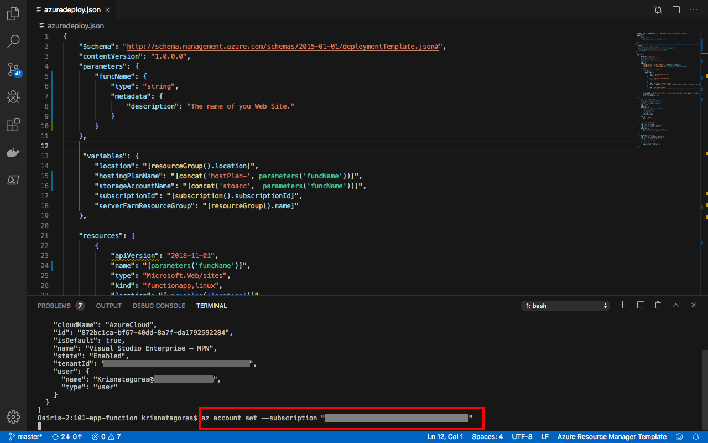

### Resource Group

Now you need a Resource Group for our deployment. If you haven't already created a Resource Group, you can do it now. If you are new to Azure and wonder what is a Resource Group? Bare with me! A Resource Group is a container that holds related resources for an Azure solution. The resource group includes those resources that you want to manage as a group. Simply saying: it's like a folder that contains files. Simple as that.

To create a Resource Group, you need a name and a location for your Resource Group.

For a list of locations, type: **az account list-locations**

To create the Resource group, type the command:

#### az group create --name "resource-group" --location "your location"

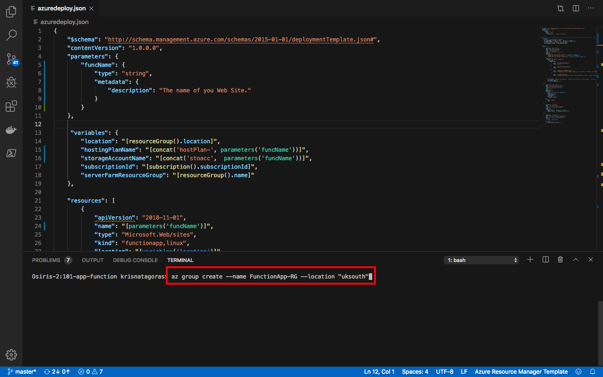

Super simple, right? Now that we have our **Resource Group** created, let's deploy the Function App using the az cli.

#### az group deployment create --name "name of your deployment" --resource-group "resource-group" --template-file "./azuredeploy.json"

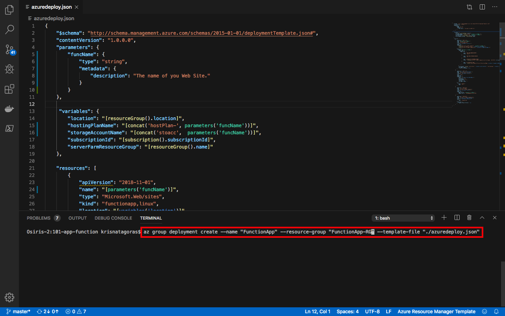

Insert the values for the parameters.
As you can see, it's running.

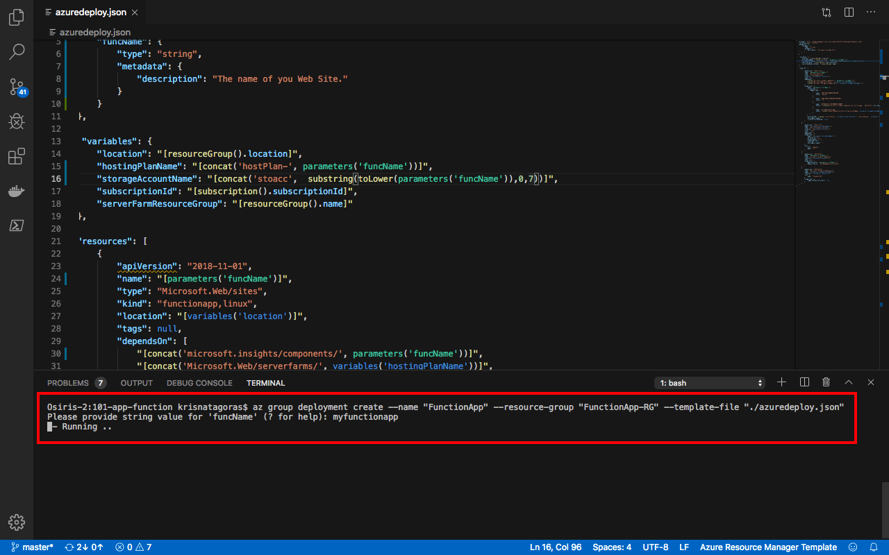

Go grab a cup of coffee, have some fresh air. Before you come back you will have your Function App.

And there we go, your deployment has Succeeded:

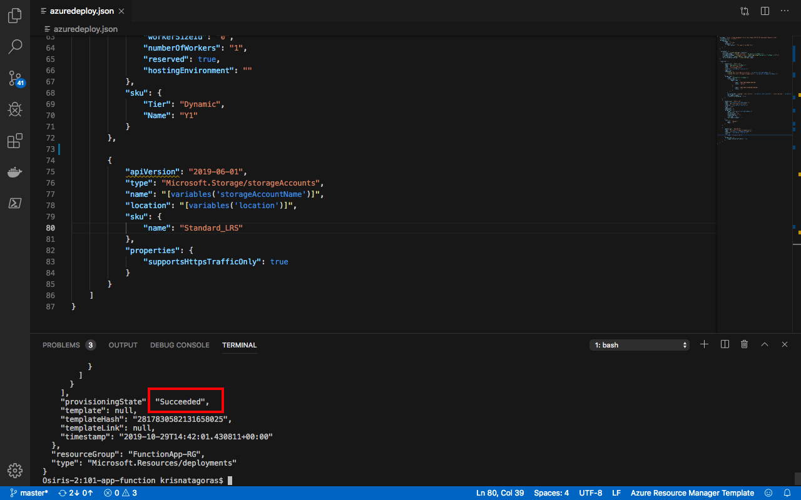

Let's check the resource in the [Azure Portal](https://portal.azure.com).

On the portal, navigate to Resource Groups. On this blade, you can see the Resource Group we've created.

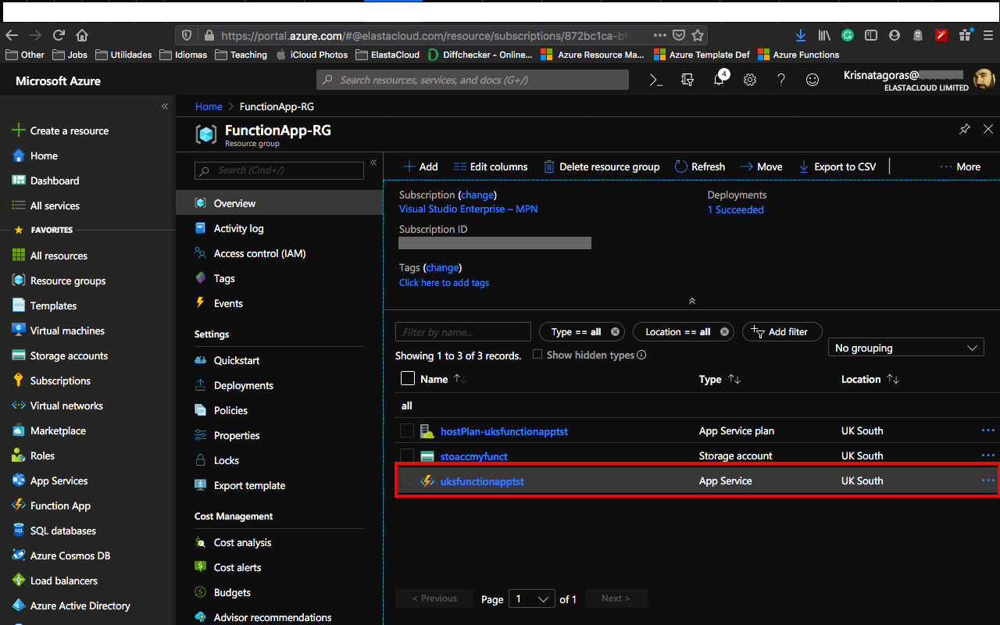

Click on the Resource Group to expand and show the **Resources**:

- App Service plan
- App Service

Click on the App Service and you have an overview of your **Function App**.

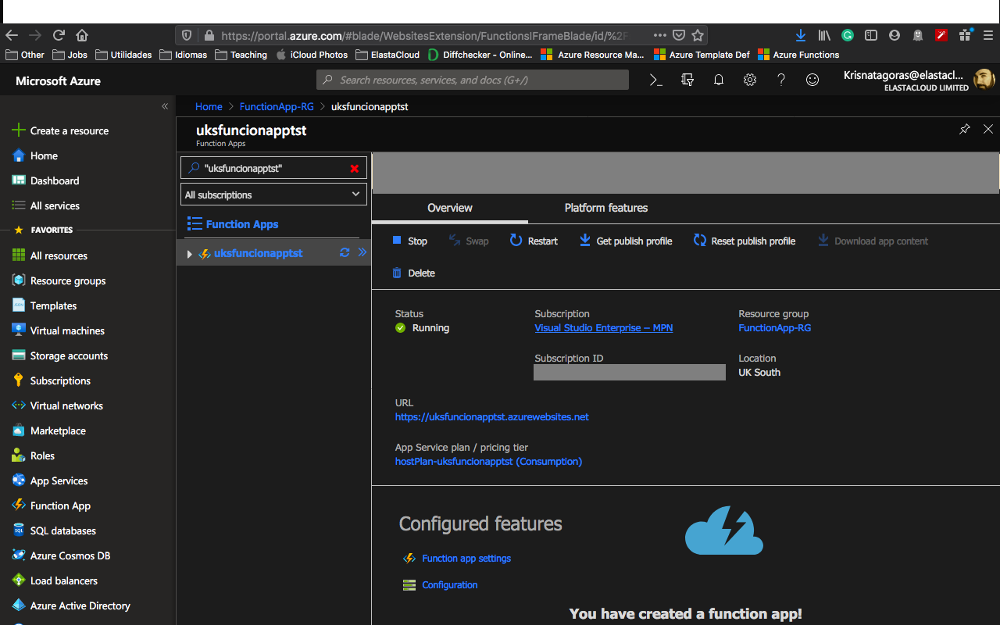

And that is just the tip of the iceberg. You can start to deploy code to your new **Function App**.

Most important, don't forget to have fun!

### Using the Portal

Using your favorite web browser Navigate to the Portal, in All Services look for **Templates**, you may want to add this service to favorites.

Click on **Add** to add your template:

On General, type the name and the description for your template, and click on [OK].

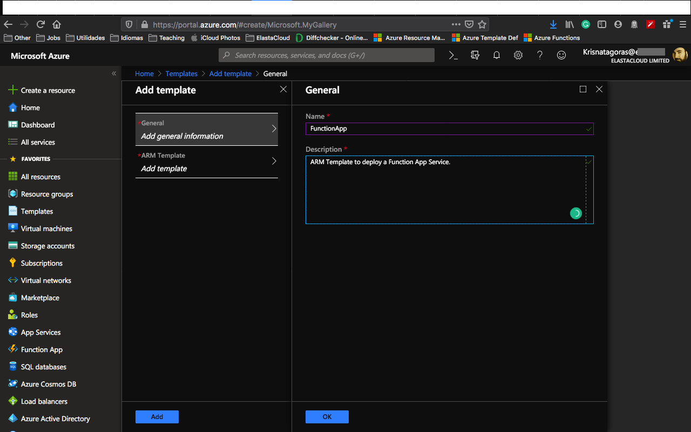

On ARM Template, replace the contents of the template with your template, and click on [OK].

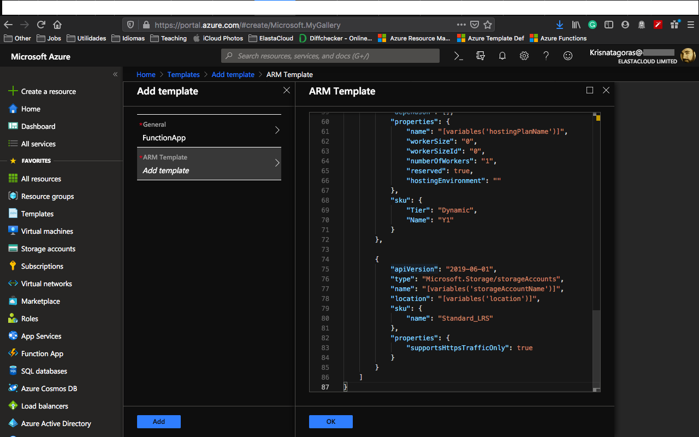

Click on the refresh button and you will find your template. Click on your template and then click in [Deploy]

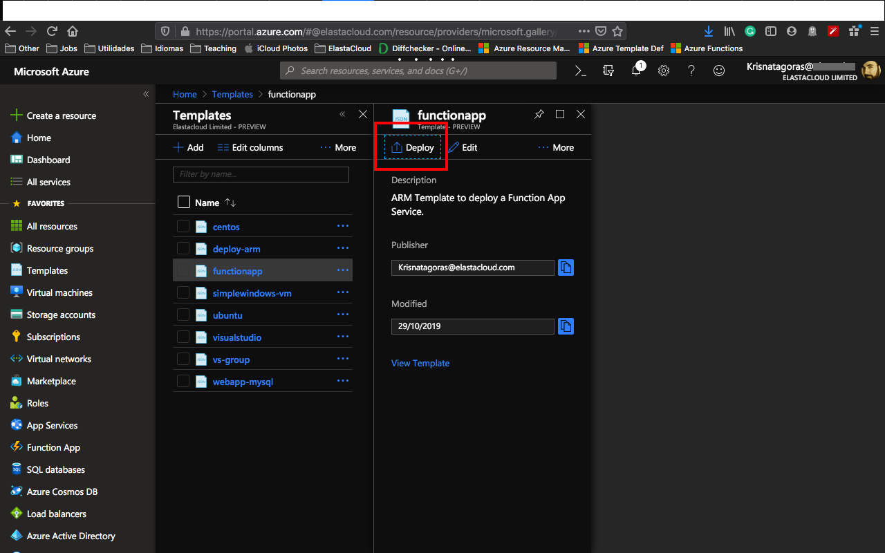

On the screen Custom Deployment, inform the values for the parameters, by now you must be already familiar with these.

Select [I agree] and click on [Purchase].

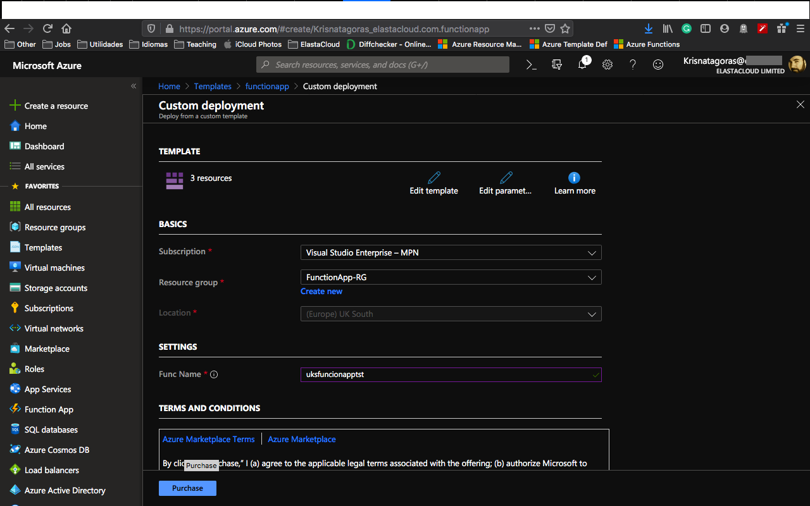

As you can see, it's deploying.

After a couple of minutes, voilà, you have your Function App deployed.

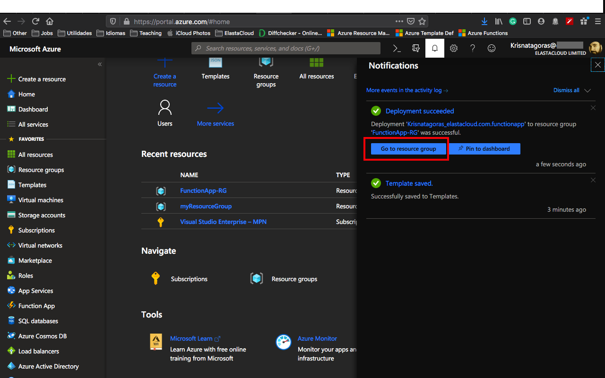

Go to the Resource. Repeat the test that you have done before.

**p.s.: It's pretty easy to create resources on Azure, right? But if you are the sort of IT guy that always loves automation, here is the surprise. Just click on the button below and it will automatically deploy the Function App through the Azure Portal.**

#### Important disclaimer: Azure charges you for the resources you are using, and you don't want to use all your credits at once, right? So, don't forget to stop the Function App at the portal or even delete the Resource Group you have created to avoid unnecessary charges

### How to shutdown your resources

#### Using the portal

On the portal, open your Resource Group, if you want to remove the Function App, you can just click on the [Delete] Button.

If you would like to just stop the Function App. Open the resource and click on Stop.

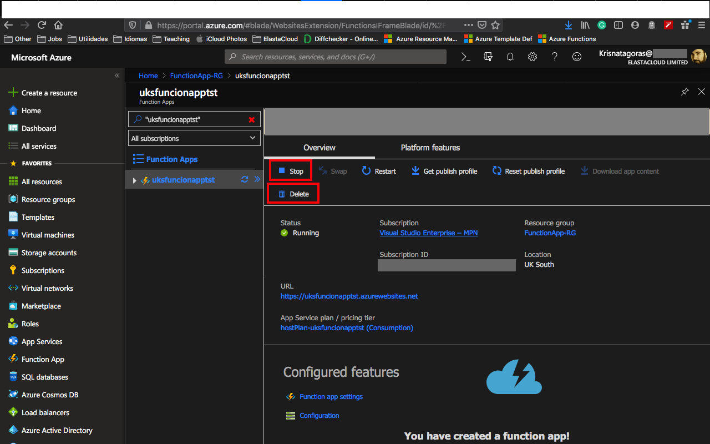

Just refresh your screen and you are good to go.
