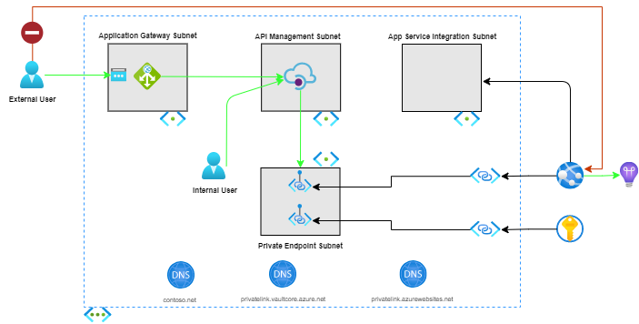

# Application Gateway with internal API Management and Web App


[](https://portal.azure.com/#create/Microsoft.Template/uri/https%3A%2F%2Fraw.githubusercontent.com%2FAzure%2Fazure-quickstart-templates%2Fmaster%2Fquickstarts%2Fmicrosoft.web%2Fprivate-webapp-with-app-gateway-and-apim%2Fazuredeploy.json)

[](http://armviz.io/#/?load=https%3A%2F%2Fraw.githubusercontent.com%2FAzure%2Fazure-quickstart-templates%2Fmaster%2Fquickstarts%2Fmicrosoft.web%2Fprivate-webapp-with-app-gateway-and-apim%2Fazuredeploy.json)

This template deploys an **Application Gateway with an internal (virtual network) API Management instance and Azure Web App**.

## Overview and deployed resources

The Bicep, and generated ARM template, presented in this sample complements the Microsoft documentation showing how to ["Integrate Application Gateway in an internal virtual network"](https://docs.microsoft.com/azure/api-management/api-management-howto-integrate-internal-vnet-appgateway).



This quickstart includes a [Bash shell script](./scripts/create-certs.sh) that can be used to generate the self-signed certificates useful in a test scenario.

The following resources are deployed as part of the solution:

### Application Gateway

Acts as a reverse-proxy service and Web Application Firewall (WAF).

The provided Application Gateway instance uses custom domain names and self-signed certificates to communicate with the provided API Management instance.

- **Microsoft.Network/applicationGateway**: Defines the Application Gateway configuration.

### API Management

The template provisions an API Management instance configured in a [virtual network internal mode](https://docs.microsoft.com/azure/api-management/api-management-using-with-internal-vnet).

The provided API Management instance uses custom domain names for the Developer Portal (e.g., portal.contoso.com), Proxy (e.g., api.contoso.com), and Management (e.g., management.contoso.com) endpoints.

- **Microsoft.ApiManagement/service**: Defines the API Management resource.
- **Microsoft.ApiManagement/service/loggers**: Defines the logging configuration for the API Management resource.
- **Microsoft.ApiManagement/service/diagnostics**: Defines the diagnostic configuration for the API Management resource.

### App Service and App Service Plan

The template provisions an Azure App Service Plan and related Web App.  The may host a web API which is served via the provided Application Gateway and API Management instances.

The web application is configured to integrate with the provided virtual network and to route all traffic into the virtual network.

The web application is configured with a System Assigned [managed identity](https://docs.microsoft.com/azure/active-directory/managed-identities-azure-resources/overview).

- **Microsoft.Web/serverfarms**: Defines the Azure App Service Plan.
- **Microsoft.Web/sites**: Defines the Azure Web Application.

### Application Insights

The template provisions an Application Insights resource which is used by the Azure Web Application, as well as Application Gateway and API Management.

- **Microsoft.Insights/components**: Defines the Application Insights capabilities.

### Log Analytics

The template provision a Log Analytics workspace for use with diagnostics and metrics from Application Gateway and API Management.  The workspace is linked to the provisioned Application Insights instance.

- **Microsoft.OperationalInsights/workspaces**: Defines the Log Analytics workspace configuration.

### Diagnostic Settings

The template provisions diagnostic settings for the provided Application Gateway and API Management resources.

- **Microsoft.Insights/diagnosticSettings**: Defines the diagnostic settings for the scoped resource.

### Azure Key Vault

The template provisions an Azure Key Vault to store application secrets, including the Application Insights instrumentation key.

The web application is granted the ability to retrieve secrets from the key vault.

The key vault is accessible only via the virtual network private endpoint.

- **Microsoft.KeyVault/vaults**: Defines the Key Vault configuration, including access policies and network access control lists (ACLs).

### Azure Virtual Network

The template provisions a virtual network with four subnets:

1. subnet for Application Gateway
1. subnet for API Management
1. subnet for allocating private endpoint IP addresses
1. subnet for delegation to the Azure Web App

- **Microsoft.Network/virtualNetworks**: Defines the virtual network and subnets.

### Network Security Group

The template provisions two Network Security Groups (NSGs), one configured for use with the Application Gateway subnet, and the other for use with the API Management subnet.  For the Application Gateway associated NSG, inbound security rules are provided to allow Application Gateway (v2) traffic, and inbound HTTPS traffic.

- **Microsoft.Network/networkSecurityGroups**: The NSGs configured for use with subnets associated with Application Gateway and API Management resources.

### Private Endpoint

The template provisions [private endpoints](https://docs.microsoft.com/azure/private-link/private-endpoint-overview) for the Azure Web App and Key Vault resources.

- **Microsoft.Network/privateEndpoints**: The private endpoints and related DNS Zone Group resources for the Azure Web App and Key Vault resources.

### Public IP Address

The template provisions one public IP address which is used as the entry point for Internet traffic flowing into the Application Gateway resource.

- **Microsoft.Network/publicIPAddresses**: The public IP address to use with Application Gateway.

### Private DNS Zone

The template provisions private DNS for use with API Management and the web application's virtual network private endpoint.

DNS A records are configured for API Management's "api", "management", and "portal" endpoints (e.g, api.contoso.com).

- **Microsoft.Network/privateDnsZones**: Description

## Prerequisites

The following prerequisites are required to use this quickstart:

- [OpenSSL](https://www.openssl.org/)
- Ability to execute a Bash shell script

## Deployment steps

Please follow the instructions below for a command line (Azure CLI) deployment.

You will need certificates to use for custom domains for Application Gateway and API Management's developer portal, management, and proxy endpoints.  The certificates will need to be Base64 encoded and the Base64 encoded text added to the appropriate parameter values when executing the template.  

The included [create-certs.sh](./scripts/create-certs.sh) script will create a .txt file for each .PFX and .CRT file.  The .txt file includes the Base64 encoded version of the certificate.

```shell
./create-certs.sh *.contoso.net
```

> Be sure the domain used in the parameters file matches the hostname of the certificates.  For example, if the certificates were created using `*.contoso.net`, the parameters file should use `contoso.net` for the domains.

1. Execute the included [create-certs.sh](./scripts/create-certs.sh) script to create self-signed certificates useful for testing.
1. Copy the contents of the .txt file into the appropriate parameter fields in the azuredeploy.parameters.json file.  Assuming the root domain name for the certificates is _*.contoso.net_, copy the text from the appropriate .txt file to the corresponding parameter, as shown in the table below.
    | Certificate file | Template parameter                                            |
    | ---------------- | ------------------------------------------------------------- |
    | domain.pfx.txt   | apiManagementPortalCustomHostnameBase64EncodedCertificate     |
    | domain.pfx.txt   | apiManagementProxyCustomHostnameBase64EncodedCertificate      |
    | domain.pfx.txt   | apiManagementManagementCustomHostnameBase64EncodedCertificate |
    | rootCA.crt.txt   | applicationGatewayTrustedRootBase64EncodedCertificate         |
    | pass             | apiManagementPortalCertificatePassword                        |
    | pass             | apiManagementProxyCertificatePassword                         |
    | pass             | apiManagementManagementCertificatePassword                    |
1. Provide values for the other required fields in the parameters file.
    1. If using a self-signed certificate (not a certificate from Certificate Authority), set the `useWellKnownCertificateAuthority` parameter to "false".
1. Deploy the template.

An alternative approach is to read in the certificate files as part of the Azure CLI command to deploy the template.

```shell
    az deployment group create \
    --resource-group <RESOURCE_GROUP_NAME> \
    --template-file main.bicep \
    --parameters azuredeploy.parameters.json \
      applicationGatewayTrustedRootBase64EncodedCertificate=$(cat ./scripts/.certs/rootCA.crt.txt) \
      apiManagementPortalCustomHostnameBase64EncodedCertificate=$(cat ./scripts/.certs/domain.pfx.txt) \
      apiManagementProxyCustomHostnameBase64EncodedCertificate=$(cat ./scripts/.certs/domain.pfx.txt) \
      apiManagementManagementCustomHostnameBase64EncodedCertificate=$(cat ./scripts/.certs/domain.pfx.txt) \
      apiManagementPortalCertificatePassword=$(cat ./scripts/.certs/pass) \
      apiManagementProxyCertificatePassword=$(cat ./scripts/.certs/pass) \
      apiManagementManagementCertificatePassword=$(cat ./scripts/.certs/pass)
```
