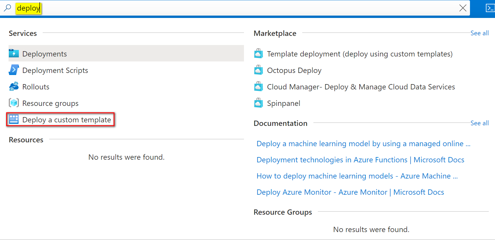
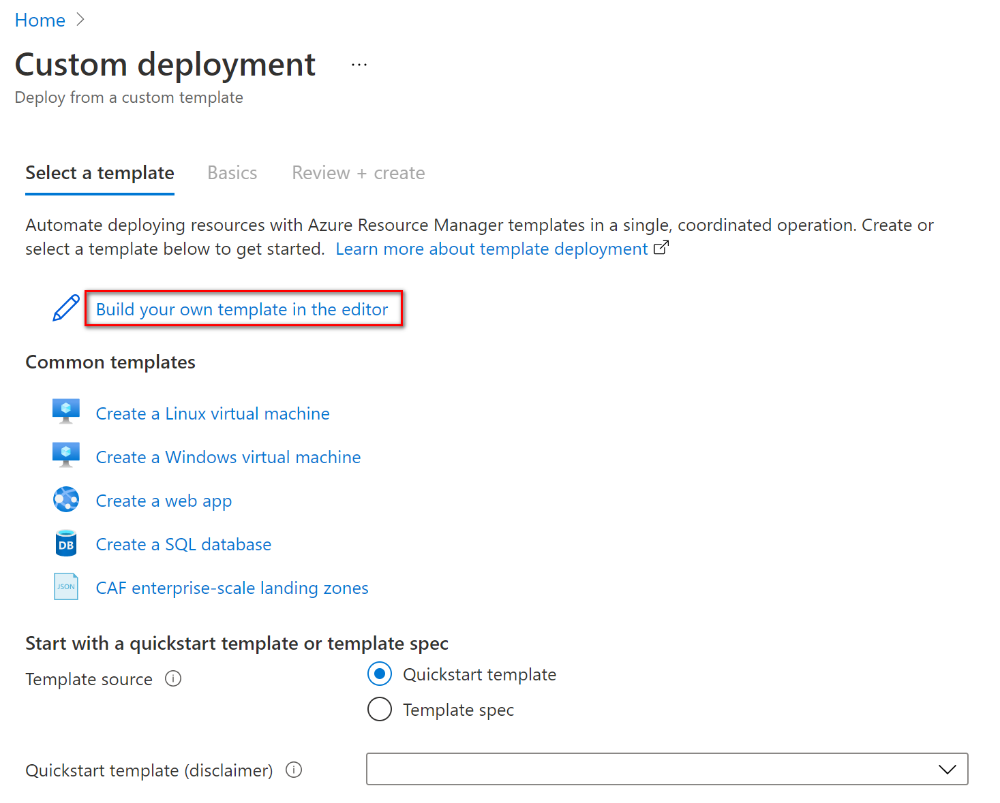
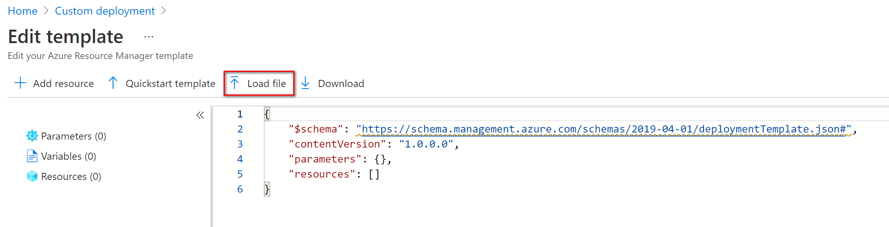
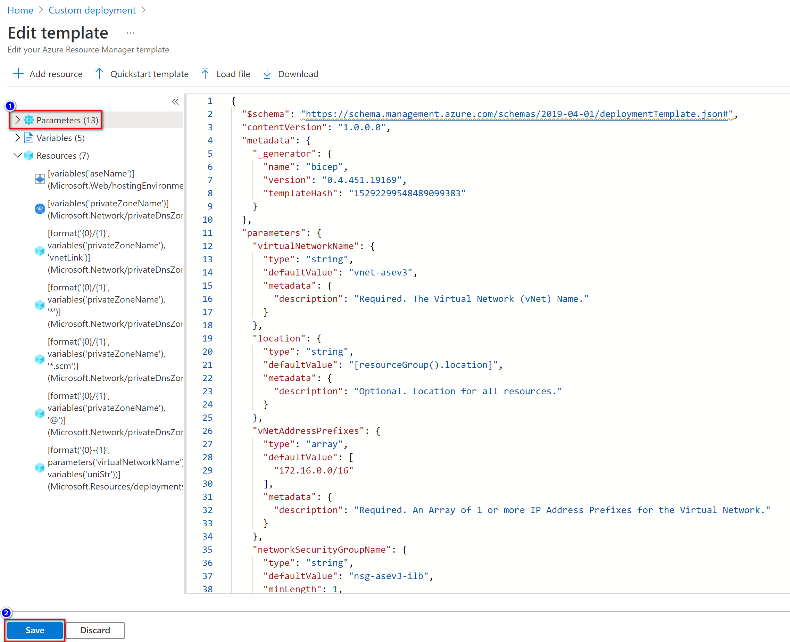
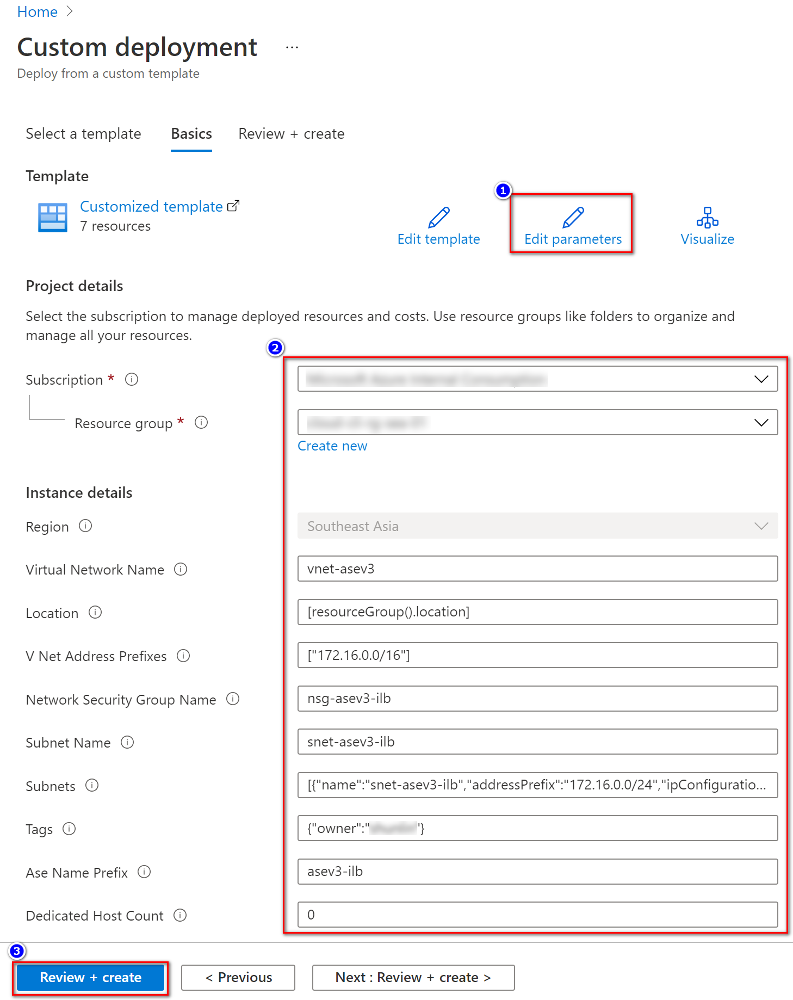
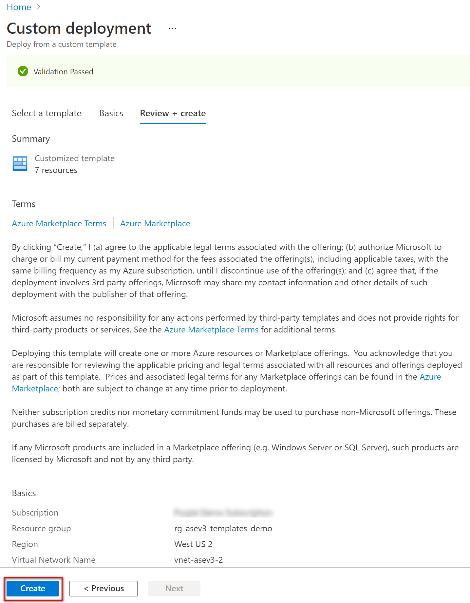
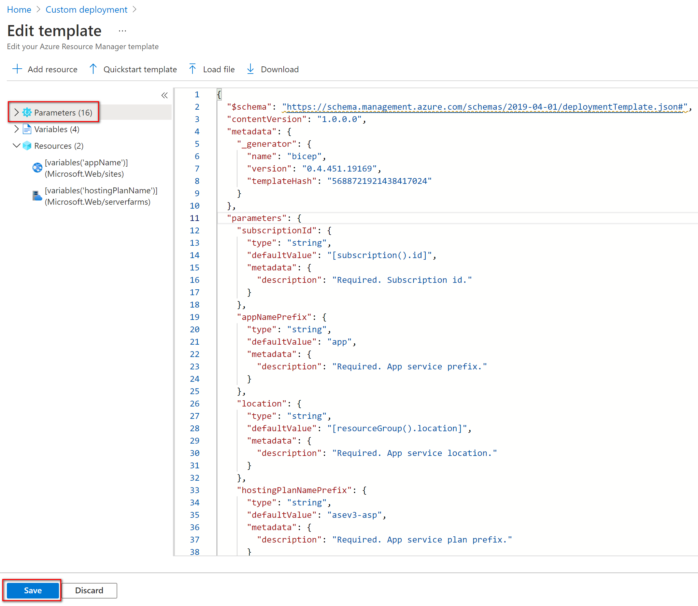
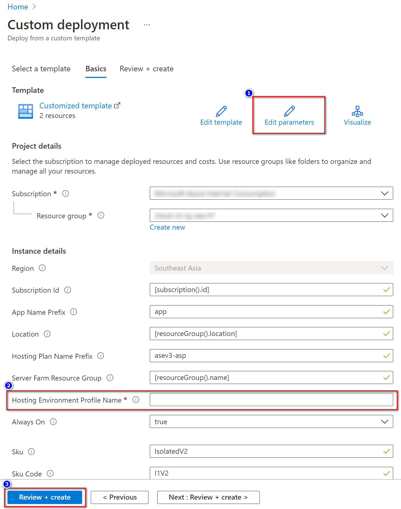
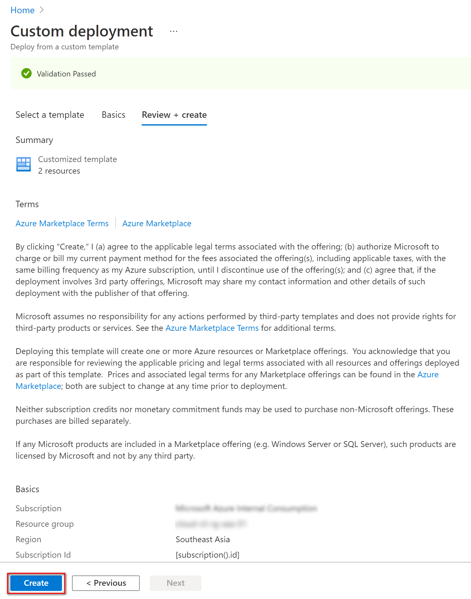

# Create an App Service Plan and an App in an App Service Environment v3


[](http://armviz.io/#/?load=https%3A%2F%2Fraw.githubusercontent.com%2FAzure%2Fazure-quickstart-templates%2Fmaster%2Fquickstarts%2Fmicrosoft.web%2Fweb-app-asp-app-on-asev3-create%2Fazuredeploy.json)

[](https://portal.azure.com/#create/Microsoft.Template/uri/https%3A%2F%2Fraw.githubusercontent.com%2FAzure%2Fazure-quickstart-templates%2Fmaster%2Fquickstarts%2Fmicrosoft.web%2Fweb-app-asp-app-on-asev3-create%2Fazuredeploy.json)

[](https://portal.azure.us/#create/Microsoft.Template/uri/https%3A%2F%2Fraw.githubusercontent.com%2FAzure%2Fazure-quickstart-templates%2Fmaster%2Fquickstarts%2Fmicrosoft.web%2Fweb-app-asp-app-on-asev3-create%2Fazuredeploy.json)


This template deploys an **App Service Environment v3 (ASEv3).** 

## Overview and deployed resources

This solution provides ARM templates or Bicep to create the following Azure resource templates:

- A Network Security Group
- A Virtual Network include a Subnet
- An App Service Environment v3
- An App Service Plan(*)
- An App Service (*)

(*) Currently, the App Service Plan and App Service need to be deployed separately.

### Microsoft.Network/networkSecurityGroups

This template will create a Network Security Group with an empty Network Security Group Rule. *<u>If you are using external load balancer, please add an allow HTTPS inbound rule in the NSG.</u>*

### Microsoft.Network/virtualNetworks

This template will create a Virtual Network, and a /24 Subnet will be created for the ASEv3 environment, where the Subnet needs to be delegated and assigned to HostingEnvironments for Subnet configuration.

### Microsoft.Web/hostingEnvironments

In the HostingEnvironments section of this template, an App Service Environments will be created with following properties**:**

- **aseNamePrefix (String)**: Required. In this sample template, you will need to provide an ASEv3 name prefix, will plus a 4-digit unique string as ASEv3 name.

- **dedicatedHostCount (String)**: Required. Configure dedicated host count (Value : **"0"** means no dedicated host will be deployed).
- **zoneRedundant (bool)**: Required. Configure zone redundant (Value: **false** means no zone redundant will be deployed).
- **internalLoadBalancingMode (int)**: Required. Load balancer mode: **0** - external load balancer, **3** - internal load balancer for ASEv3.
- **createPrivateDNS (bool)**: Optional. Only when this properties set to **true** and **internalLoadBalancingMode** set to **3** will create Private DNS zone.

### Microsoft.Web/serverfarms

In this template, an application service environment will be created in the ASEv3. This example will be created with the following default values. You can adjust the parameter settings upon your requirements.

- **hostingPlanNamePrefix (string)**: In this sample template, you will need to provide an hosting plan name prefix, will plus a 4-digit unique string as App Service Plan name.
- **workerSize (string)**: Required. App service plan worker size. Default value is **"6"**.
- **workerSizeId (string)**: Required. App service plan worker size id. Default value is **"6"**.
- **numberOfWorkers (string)**: Required. Number of App service plan workers. Default value is **"1"**.
- **hostingEnvironmentProfile** (string): Required. The ASEv3 name where App service the reside.
- **sku (string)**: Required. App service plan sku. Default value is **"IsolatedV2"**.
- **skuCode (string)**: Required. App service plan sku code. Default value is **"I1V2"**.

### Microsoft.Web/sites

In this template, an application service environment will be created in the App service plan. This example will be created with the following default values. You can adjust the parameter settings upon your requirements.

- **appNamePrefix (string)**: In this sample template, you will need to provide an App service name prefix, will plus a 4-digit unique string as App service name.

- **currentStack (string)**: Required. Current stack of App service. Default value is **"dotnet"**.

- **phpVersion (string)**: Required. Enable php of App service. Default value is **"OFF"**.

- **netFrameworkVersion (string)**: Required. .NET Framework version of App service, Default value is **"v5.0"**

- **alwaysOn (bool)**: Required. Enable Always-on of App service. Default value is **true**.

  

## Prerequisites

The prerequisites for the deployment is creating a resource group that ASEv3 is available. Be aware that zone redundant is available in some region. If you don't have any resource group exist, you can use following PowerShell or Az cli to create one.

**PowerShell:**

```powershell
New-AzResourceGroup -Name "rg-asev3-templates-demo" -location "West US 2"
```

**Az cli:**

```bash
az group create --name rg-asev3-templates-demo --location westus2
```


## Deployment steps

You can click the "deploy to Azure" button at the beginning of this document or follow the instructions for command line deployment using the scripts in the root of this repo.

#### Create ASEv3 and virtual network, subnet and NSG

1. **Create a Resource Group**, if you are going to create a zone redundant ASEv3, please check if it is available in the region you selected.
2. **Edit parameters** file(**azuredeploy.json**) with required parameters.
   - **Network Security Group** name
   - **Virtual Network** name, modify the IP address space if needed
   - **Subnet** name, modify the subnet cidr if needed
   - **ASEv3 prefix** name
   - **dedicatedHostCount** 
   - **zoneRedundant** 
   - **createPrivateDNS** 

3. **Deploy to Azure**, you can deploy the ASEv3 by one of following method:

   - Deploy ARM template by PowerShell command:

     ```powershell
     New-AzResourceGroupDeployment -Name "asev3-deployment-2021081101" -ResourceGroupName "rg-asev3-templates-demo" -TemplateFile ".\azuredeploy.json" -TemplateParameterFile ".\azuredeploy.parameters.json"
     ```
     
   - Deploy ARM template by Az cli command:

     ```bash
     az deployment group create --name asev3-deployment-2021081102 -f azuredeploy.json --parameters azuredeploy.parameters.json -g rg-asev3-templates-demo
     ```
     
   - Deploy Bicep template by PowerShell
     
     ```powershell
     New-AzResourceGroupDeployment -Name "bicep-asev3-deployment-2021081103" -ResourceGroupName "rg-asev3-templates-demo" -TemplateFile ".\main.bicep" -TemplateParameterFile ".\azuredeploy.parameters.json"
     ```
     
   - Deploy Bicep template by Az cli
     
     ```bash
     az deployment group create --name bicep-asev3-deployment-2021081104 -f main.bicep --parameters azuredeploy.parameters.json -g rg-asev3-templates-demo
     ```
     
   - Deploy template in Azure portal

     (1) In the search box, enter **"deploy"** to find **"Deploy a custom template"**.

     

     (2) Select **"Build your owner template in the editor"**.

     

     (3) Click **"Load file"** to upload **"azuredeploy.json"** template file.

     

     ```
     
     ```

     (4) Edit the **"Parameters"** then click **"Save"**.

     

     (5) You can select **"Edit Parameters"** back to ARM template file. Or Input the parameters in the textbox. Then click **"Review + Create"** button.

     

     (6) Click **"Create"** button to deploy ASEv3 on Azure.

     


#### Create App Service Plan and App Service on ASEv3

After you create the ASEv3, you will need to an App service plan and an App service reside the ASEv3. For some reason, merging the App service plan and App service template into ASEv3 template will be failed. Hence, to add an App service plan and an App Service need to do in separate steps. The ARM templates will be in the **"nested"** subfolder and Bicep templates will be in the **"modules"** subfolder.

1. **Edit the parameters** file(**azuredeploy.site.json**) under **"nested" folder** with required parameters.
   - **hostingEnvironmentProfileName (string)**: Required, add the ASEv3 name in this value. You can leave others parameters as default for a quickstart sample.
   
2. **Deploy to Azure**, you can deploy an App service plan and an App service into ASEv3 by one of following method:

   - Deploy ARM template by PowerShell command:

     ```powershell
     New-AzResourceGroupDeployment -Name "asev3-appserviceplan-deployment-2021081105" -ResourceGroupName "rg-asev3-templates-demo" -TemplateFile ".\nested\azuredeploy.site.json" -TemplateParameterFile ".\nested\azuredeploy.site.parameters.json"
     ```

   - Deploy ARM template by Az cli command:

     ```bash
     az deployment group create --name asev3-appserviceplan-deployment-2021081106 -f nested/azuredeploy.site.json --parameters nested/azuredeploy.site.parameters.json -g rg-asev3-templates-demo
     ```
   
   - Deploy Bicep template by PowerShell
   
     ```powershell
     New-AzResourceGroupDeployment -Name "bicep-asev3-appserviceplan-deployment-2021081107" -ResourceGroupName "rg-asev3-templates-demo" -TemplateFile ".\modules\site.bicep" -TemplateParameterFile ".\nested\azuredeploy.site.parameters.json"
     ```
   
   - Deploy Bicep template by Az cli
   
     ```bash
     az deployment group create --name bicep-asev3-appserviceplan-deployment-2021081108 -f modules/site.bicep --parameters nested/azuredeploy.site.parameters.json -g rg-asev3-templates-demo
     ```
   
   - Deploy template in Azure portal
     (1) In the search box, enter **"deploy"** to find **"Deploy a custom template"**.

     

     (2) Select **"Build your owner template in the editor"**.

     

     (3) Click **"Load file"** to upload **"azuredeploy.json"** template file.

     

     ```
     
     ```

     (4) Edit the **"Parameters"** then click **"Save"**.

     

     (5) You can select **"Edit Parameters"** back to ARM template file. Or Input the parameters in the textbox. Then click **"Review + Create"** button.

     

     (6) Click **"Create"** button to deploy ASEv3 on Azure.

     


## Usage

### From Az cli
- ARM

```bash
az deployment group create --name asev3-deployment-2021081102 -f azuredeploy.json --parameters azuredeploy.parameters.json -g rg-asev3-templates-demo

az deployment group create --name asev3-appserviceplan-deployment-2021081106 -f nested/azuredeploy.site.json --parameters nested/azuredeploy.site.parameters.json -g rg-asev3-templates-demo
```

- Bicep

```bash
az deployment group create --name bicep-asev3-deployment-2021081104 -f main.bicep --parameters azuredeploy.parameters.json -g rg-asev3-templates-demo

az deployment group create --name bicep-asev3-appserviceplan-deployment-2021081108 -f modules/site.bicep --parameters nested/azuredeploy.site.parameters.json -g rg-asev3-templates-demo
```

### From PowerShell

- ARM

```powershell
New-AzResourceGroupDeployment -Name "asev3-deployment-2021081101" -ResourceGroupName "rg-asev3-templates-demo" -TemplateFile ".\azuredeploy.json" -TemplateParameterFile ".\azuredeploy.parameters.json"

New-AzResourceGroupDeployment -Name "asev3-appserviceplan-deployment-2021081105" -ResourceGroupName "rg-asev3-templates-demo" -TemplateFile ".\nested\azuredeploy.site.json" -TemplateParameterFile ".\nested\azuredeploy.site.parameters.json"
```

- Bicep

```powershell
New-AzResourceGroupDeployment -Name "bicep-asev3-deployment-2021081103" -ResourceGroupName "rg-asev3-templates-demo" -TemplateFile ".\main.bicep" -TemplateParameterFile ".\azuredeploy.parameters.json"

New-AzResourceGroupDeployment -Name "bicep-asev3-appserviceplan-deployment-2021081107" -ResourceGroupName "rg-asev3-templates-demo" -TemplateFile ".\modules\site.bicep" -TemplateParameterFile ".\nested\azuredeploy.site.parameters.json"
```


------

For more details on App Service Environments v3, see the [App Service Environment overview](https://docs.microsoft.com/en-us/azure/app-service/environment/overview).

