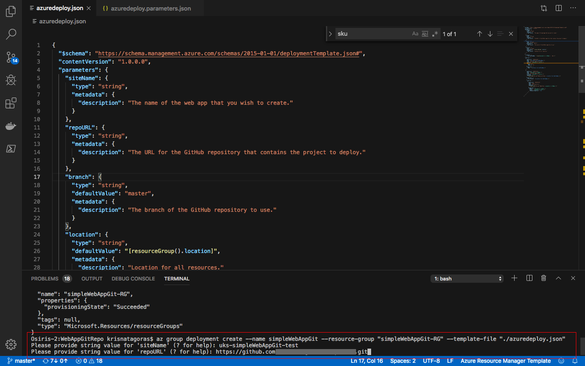

# Azure Web App linked to a GitHub Repo

The purpose of this ARM Template is **deploy a WebApp** linked to a **GitHub Repo**.

But let's understand a bit better how all this will work.

## How Web Apps works in Azure

Azure App Service is a fully managed compute platform that is optimized for hosting websites and web applications. Customers can use App Service on Linux to host web apps natively on Linux for supported application stacks. The Languages section lists the application stacks that are currently supported.

## Languages

App Service on Linux supports several Built-in images to increase developer productivity.

Language          | Supported Versions
:--------------- | :-------------  
Node.js     | 4.4, 4.5, 4.8, 6.2, 6.6, 6.9, 6.10, 6.11, 8.0, 8.1, 8.2, 8.8, 8.9, 8.11, 8.12, 9.4, 10.1, 10.10, 10.14
Java *     | Tomcat 8.5, 9.0, Java SE, WildFly 14 (all running JRE 8)
PHP     | 5.6, 7.0, 7.2, 7.3
Python     | 2.7, 3.6, 3.7
.NET Core     | 1.0, 1.1, 2.0, 2.1, 2.2
Ruby     | 2.3, 2.4, 2.5, 2.6

## Code deployments

To deploy your code you can use:  

- FTP
- Local Git
- GitHub
- Bitbucket

## Pre Deployment Steps

Before proceeding to the deployment of the **Azure Web App linked to a GitHub Account** template, we need to perform the following steps.

### A GitHub Account

If you don't have yet a GitHub account, you can create your account on [GitHub](https://github.com/).

What you need for this task is the address of the GitRepo.

Copy this address, you will need it to inform as a parameter during the deployment.

## The Template

Don't let the size of the template scares you. The structure is very intuitive and once that you get the gist of it, you will see how much easier your life will be deploying resources to Azure.

These are the parameters on the template, most of them already have values inserted, the ones that you need to inform are: **webAppName** , **repoURL**  and **branch**.

Here is the full list parameters in this template:

Parameter         | Suggested value     | Description
:--------------- | :-------------      |:---------------------
**webAppName** |*location*-*name*-*environment* i.e.:  uks-mywebappgit-test  | A globally unique name of azure web app. I recommend you to use the notation above, that will help to create a unique name for your Web Application. The name must use alphanumeric and underscore characters only. There is a 35 character limit to this field. The App name cannot be changed once the Web App is created.
**repoURL**  | Git Repository URL     |The URL for the GitHub repository that contains the project to deploy.
**branch**  | master     |The branch of the GitHub repository to use.
**sku** | F1 | The pricing tier for the hosting plan. Here we are using as default the Free Tier (F1), which is ideal for testing and Dev environments.
**workerSize** | 0 | The instance size of the hosting plan (0=small, 1=medium, or 2=large).
**Location**| The default location | Select the geographic location for your resource group.
**Resource Group**| yourresourcegroup |  That is the Resource Group that you need to deploy your resources.

## Deployment

There are a few ways to deploy this template.
You can use [PowerShell](https://docs.microsoft.com/azure/azure-resource-manager/resource-group-template-deploy), [Azure CLI](https://docs.microsoft.com/azure/azure-resource-manager/resource-group-template-deploy-cli), [Azure Portal](https://docs.microsoft.com/azure/azure-resource-manager/resource-group-template-deploy-portal) or your favorite SDK.

For Azure CLI I'm using the Visual Code with Azure CLI extensions. If you would like you can find more information [here](https://code.visualstudio.com/docs/azure/extensions). But bare in mind that you don't need to use the Visual Code app, you can stick with the always present **Command Line** on Windows or the Linux **bash terminal**.

### Using Azure CLI with Visual Code

In the terminal window type: **az login**

You will be redirected to the Azure Portal in your web browser where you can insert your credentials and log in.

After logging in, you will see your credentials on the terminal.

To set the right subscription, type following command:

#### az account set --subscription "your subscription id"

### Resource Group

Now you need a Resource Group for our deployment. If you haven't already created a Resource Group, you can do it now. If you are new to Azure and wonder what is a Resource Group? Bare with me! A Resource Group is a container that holds related resources for an Azure solution. The resource group includes those resources that you want to manage as a group. Simply saying: it's like a folder that contains files. Simple as that.

To create a Resource Group, you need a name and a location for your Resource Group.

For a list of locations, type: **az account list-locations**

To create the Resource group, type the command:

#### az group create --name "resource-group" --location "your location"

Super simple, right? Now that we have our **Resource Group** created, let's deploy the **Azure Web App linked to a GitHub Account** using the az cli.

#### az group deployment create --name "name of your deployment" --resource-group "resource-group" --template-file "./azuredeploy.json"

Insert the values for the parameters.
As you can see, it's running.

Go grab a cup of coffee, have some fresh air. Before you come back you will have your **Azure Web App linked to a GitHub Account**

And there we go, your deployment has Succeeded:

Let's go and check the resource at the [Azure Portal](https://portal.azure.com).

On the portal, go to Resource Groups. On this blade, you can see the Resource Group we've created.

Let's check the resource in the [Azure Portal](https://portal.azure.com).

On the portal, navigate to Resource Groups. On this blade, you can see the Resource Group we've created.

Click on the Resource Group to expand and show the **Resources**:

- App Service plan
- App Service

Click on the Web Plan and then look for **Deployment Center**.

Here you can check the external Github account linked to your Web App.

And that is just the tip of the iceberg. You can start to deploy code to your new **Azure Web App linked to a GitHub Account**.

Most important, don't forget to have fun!

### Using the Portal

Using your favorite web browser Navigate to the Portal, in All Services look for **Templates**, you may want to add this service to favorites.

Click on **Add** to add your template:

On General, type the name and the description for your template, and click on [OK].

On ARM Template, replace the contents of the template with your template, and click on [OK].

Click on the refresh button and you will find your template. Click on it and then click in [Deploy]

On the screen Custom Deployment, inform the values for the parameters, by now you must be already familiar with these.

Select [I agree] and click on [Purchase].

As you can see, it's deploying.

After a couple of minutes, voilà, you have your **Azure Web App linked to a GitHub Account**.

Go to the Resource. Repeat the test that you have done before.

**p.s.: Pretty easy to create resources on Azure, right? But if you are the sort of IT guy that always loves automation, here is the surprise. Just click on the button below and it will automatically deploy the Azure Web App linked to a GitHub Account through the  Azure Portal.**

#### Important disclaimer: Azure charges you for the resources you are using, and you don't want to use all your credits at once, right? So, don't forget to stop the Web App at the portal or even delete the Resource Group you have created to avoid unnecessary charges

### How to shutdown your resources

#### Using the portal

On the portal, open your Resource Group, if you will not use the Web App anymore, you can just click on the [Delete] Button.

You can also just stop the Web App in case you gonna need the resource. Open the resource and click on Stop.

Just refresh your screen and you are good to go.
