# Build a Web App on Linux with Azure database for MySQL

The purpose of this ARM Template is deploy a **Web App and MySQL Database** in Azure App Service on Linux.

## Overview

### Azure App Service on Linux

Azure App Service is a fully managed compute platform that is optimized for hosting websites and web applications. Customers can use App Service on Linux to host web apps natively on Linux for supported application stacks.

### Languages

App Service on Linux supports a number of Built-in images in order to increase developer productivity. Languages include: Node.js, Java (JRE 8 & JRE 11), PHP, Python, .NET Core and Ruby.

For more information about Web Apps on Linux, click [here](https://docs.microsoft.com/azure/app-service/overview).

## The Template

Don't let the size of the template scares you. The structure is very intuitive and once that you get the gist of it, you will see how much easier your life will be deploying resources to Azure.

These are the parameters on the template, most of them already have values inserted, the ones that you need to inform are: **administratorLogin** and **administratorLoginPassword**.

Here is the full list parameters in this template:

Parameter         | Suggested value     | Description
:--------------- | :-------------      |:---------------------
**siteName** | [concat('MySQL-', uniqueString(resourceGroup().name))]  | The unique name of your Web Site.
**administratorLogin** | your database admin login | Database administrator login name.
**administratorLoginPassword** | your Database administrator password  | Database administrator password.
**dbSkucapacity** | 2 | The scale up/out capacity, representing server's compute units.
**dbSkuName** | GP_Gen5_2 | The name of the sku, typically, tier + family + cores, e.g. B_Gen4_1, GP_Gen5_8.
**dbSkuSizeMB** | 51200 | The size code, to be interpreted by resource as appropriate.
**dbSkuTier** | GeneralPurpose | Azure database for mySQL pricing tier.
**mysqlVersion** | 5.7 | Server version. - 5.6 or 5.7
**Location**| location | The location of your Resource Group.
**Resource Group**| your Resource Group | You can create a new resource group or choose from an existing one.
**databaseskuFamily** | Gen5 | Azure database for mySQL sku family.

## Deployment

There are a few ways to deploy this template.
You can use [PowerShell](https://docs.microsoft.com/azure/azure-resource-manager/resource-group-template-deploy), [Azure CLI](https://docs.microsoft.com/azure/azure-resource-manager/resource-group-template-deploy-cli), [Azure Portal](https://docs.microsoft.com/azure/azure-resource-manager/resource-group-template-deploy-portal) or your favorite SDK.

For Azure CLI I'm using the Visual Code with Azure CLI extensions. If you would like you can find more information [here](https://code.visualstudio.com/docs/azure/extensions). But bare in mind that you don't need to use the Visual Code app, you can stick with the always present **Command Line** on Windows or the Linux **bash terminal**.

### Using Azure CLI with Visual Code

In the terminal window type: **az login**

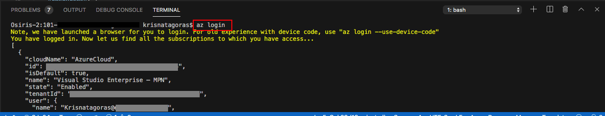

You will be redirected to the Azure Portal in your web browser where you can insert your credentials and log in.

After logging in, you will see your credentials on the terminal.

To set the right subscription, type following command:

#### az account set --subscription "your subscription id"

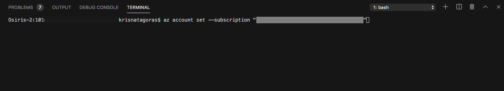

### Resource Group

Now you need a Resource Group for our deployment. If you haven't already created a Resource Group, you can do it now. If you are new to Azure and wonder what is a Resource Group? Bare with me! A Resource Group is a container that holds related resources for an Azure solution. The resource group includes those resources that you want to manage as a group. Simply saying: it's like a folder that contains files. Simple as that.

To create a Resource Group, you need a name and a location for your Resource Group.

For a list of locations, type: **az account list-locations**

To create the Resource group, type the command:

#### az group create --name "resource-group" --location "your location"

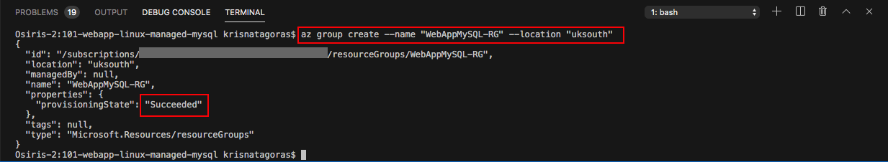

Super simple, right? Now that we have our **Resource Group** created, let's deploy the **Web App on Linux with Azure database for MySQL** using the az cli.

#### az group deployment create --name "name of your deployment" --resource-group "resource-group" --template-file "./azuredeploy.json"

Insert the Administrator Login and Password and press [enter].

As you can see, it's running.

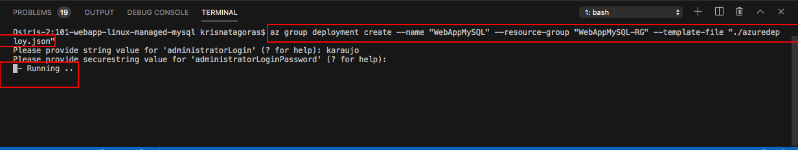

Go grab a cup of coffee, have some fresh air. Before you come back you will have your **Web App on Linux with Azure database for MySQL**.

And there we go, your deployment has Succeeded:

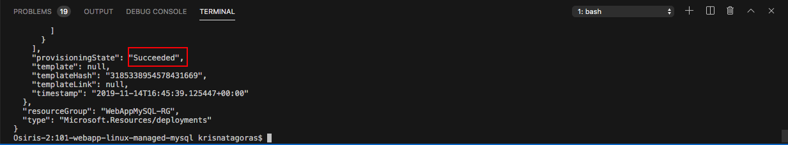

Let's check the resource in the [Azure Portal](https://portal.azure.com).

On the portal, navigate to Resource Groups. On this blade, you can see the Resource Group we've created.

Click on the Resource Group to expand and show the **Resources**:

- App Service plan
- App Service
- Azure Database for MySQL server

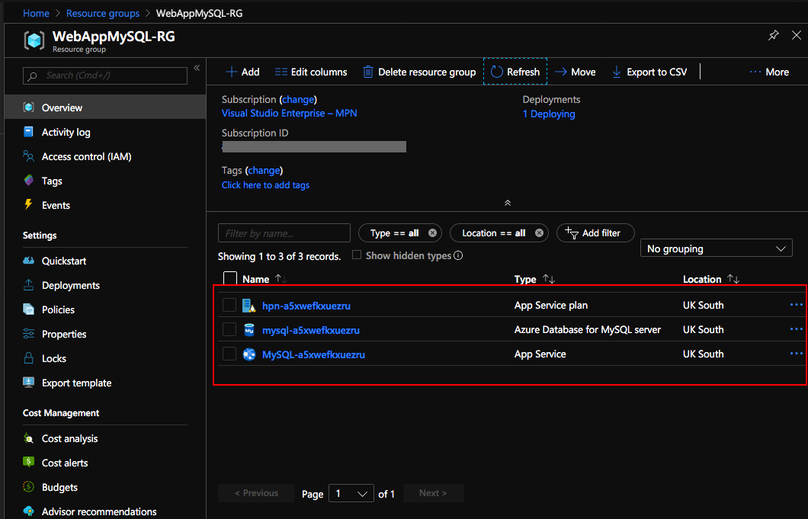

Click on the Azure Database for MySQL server.

On this blade you have the overview of **Azure Database for MySQL**.

In **Connection Strings** you will find supported connection properties.

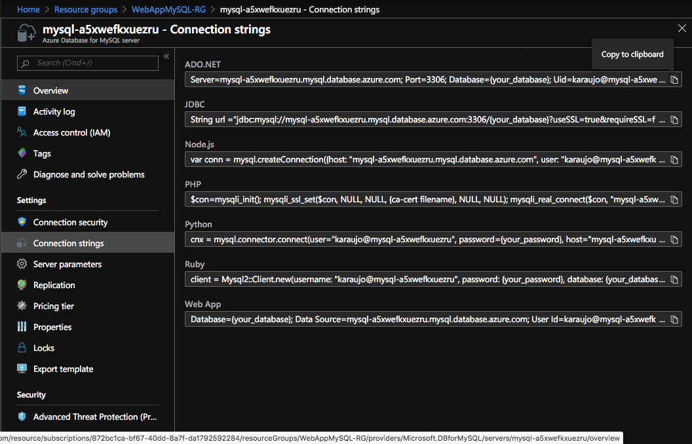

Congratulations, you have deployed a **Azure Database for MySQL**  and that is just the tip of the Iceberg.

Most important, don't forget to have fun!

### Using the Portal

Using your favorite web browser Navigate to the Portal, in All Services look for **Templates**, you may want to add this service to favorites.

Click on **Add** to add your template:

On General, type the name and the description for your template, and click on [OK].

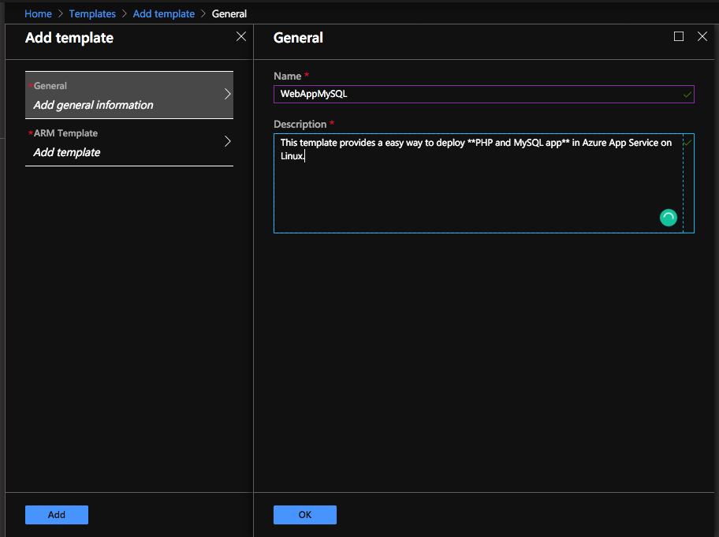

On ARM Template, replace the contents of the template with your template, and click on [OK] and then on [Add].

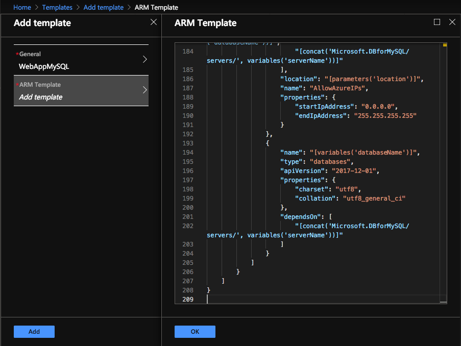

Click on the refresh button and you will find your template. Click on your template and then click in [Deploy]

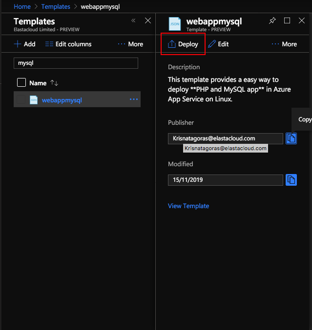

On the screen Custom Deployment, inform the values for the parameters, by now you must be already familiar with these.

Select [I agree] and click on [Purchase].

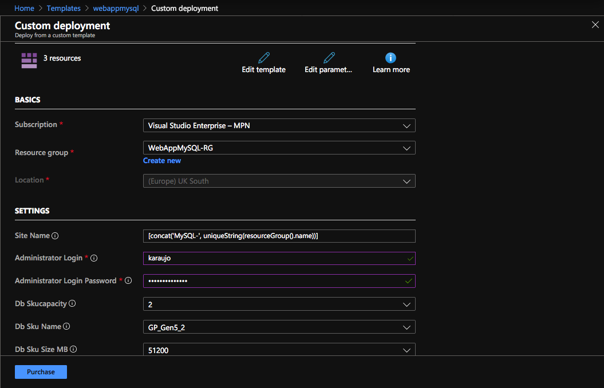

As you can see, it's deploying.

After a couple of minutes, voilà, you have your **Azure Database for MySQL**  deployed.

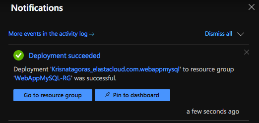

Go to the Resource. Repeat the test that you have done before.

**p.s.: It's pretty easy to create resources on Azure, right? But if you are the sort of IT guy that always loves automation, here is the surprise. Just click on the button below and it will automatically deploy Azure Bot Service through the  Azure Portal.**

#### Important disclaimer: Azure charges you for the resources you are using, and you don't want to use all your credits at once, right? So, don't forget to stop the Azure Database for MySQL at the portal or even delete the Resource Group you have created to avoid unnecessary charges

### How to shutdown your resources

#### Using the portal

On the portal, open your Resource Group, if you want to remove the **Azure Bot Service** , you can just click on the [Delete] Button.

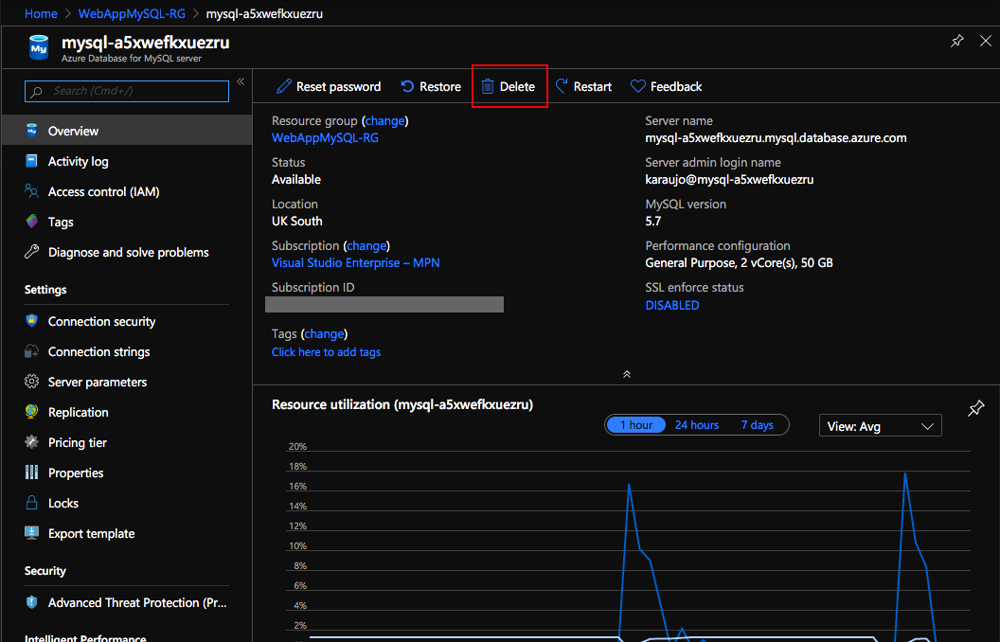

Alternatively you can delete the Resource Group, clicking on [Delete Resource Group] buttton.

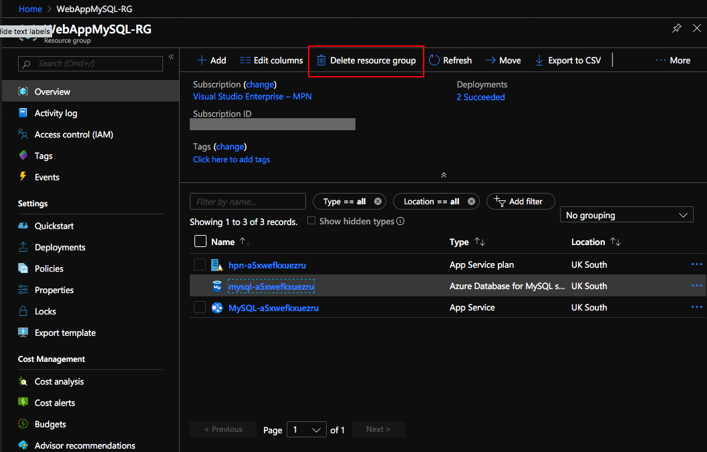

Just refresh your screen and you are good to go.
