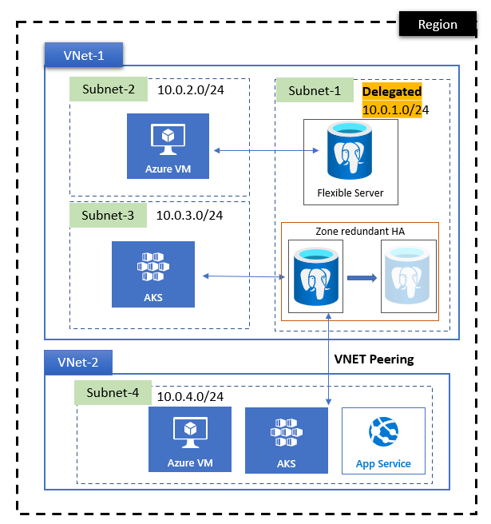

# SonarQube on Web App with PostgreSQL and VNet integration

This template provides easy to deploy SonarQube on Web App with PostgreSQL (Flexible Servers), VNet integration and private DNS.

This approach of running SonarQube keeps communication between Sonar's App and database (Postgres) private using VNet integration and private DNS.

**Notice** once deployed Sonar can take a while to start due the creation of the initial empty database, it can even fail if you try to access it directly, allow to start it before accessing it or even adjust the tier for the webapp or PostgreSQL accordingly.

When deploying SonarQube using this template, it's important to note that by default, the `latest` tag is used for the SonarQube Docker image. While this ensures you always get the newest version, it can lead to unexpected upgrades and potential compatibility issues. To avoid sudden version changes that may cause SonarQube to enter maintenance mode unexpectedly, it's recommended to specify a fixed Docker image tag. This allows you to control when upgrades occur and ensure compatibility with your existing setup. You can find the list of available SonarQube Docker image tags [here](https://hub.docker.com/_/sonarqube/tags). Review the tags and select the desired version that meets your requirements, then update the template accordingly to use that specific tag instead of `latest`. By following this approach, you can maintain a stable and predictable SonarQube environment, reducing the risk of unexpected downtime or issues caused by unintended version upgrades.

`Tags: Azure Web App, Azure PostgreSQL (Flexible Servers), VNet Integration, Private DNS, SonarQube, SAST`