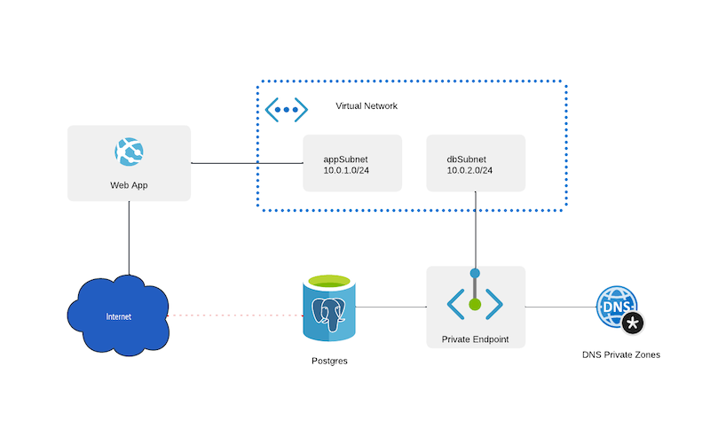

# Deploy Sonarqube on a Linux web app with PostgreSQL Flexible Servers, private endpoints and DNS

This template provides easy to deploy SonarQube to Web App on Linux with PostgreSQL FlexibleServer, private endpoints and private DNS.

This approach of running SonarQube keeps communication between App and database private.

**Notice** once deployed Sonar can take a while to start due the creation of the initial empty database, it can even fail if you try to access it directly, allow to start it before accessing it or even adjust the tier for the webapp or PostgreSQL accordingly.

`Tags: Azure Web App, Azure PostgreSQL (Flexible Servers), Private DNS, SonarQube, SAST}`
