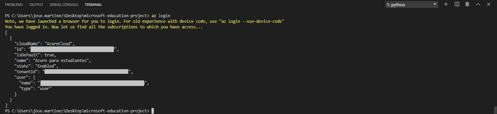
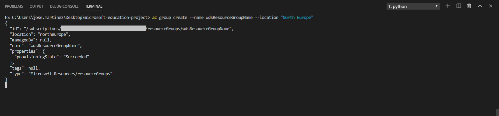
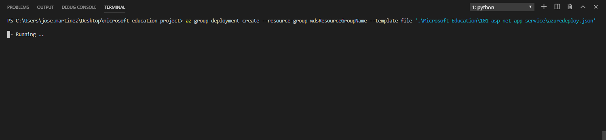
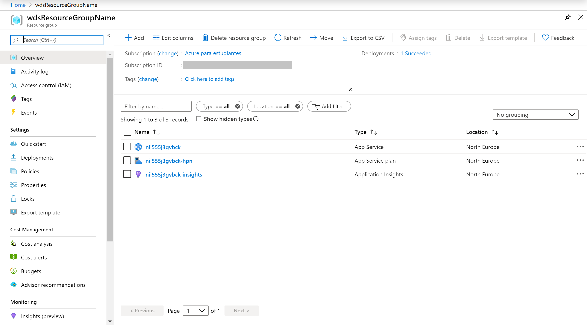
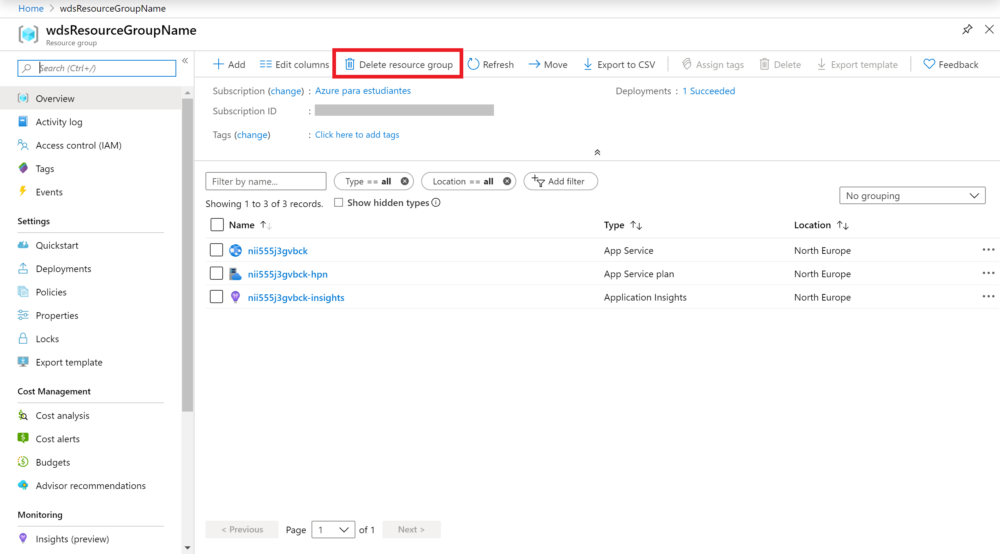
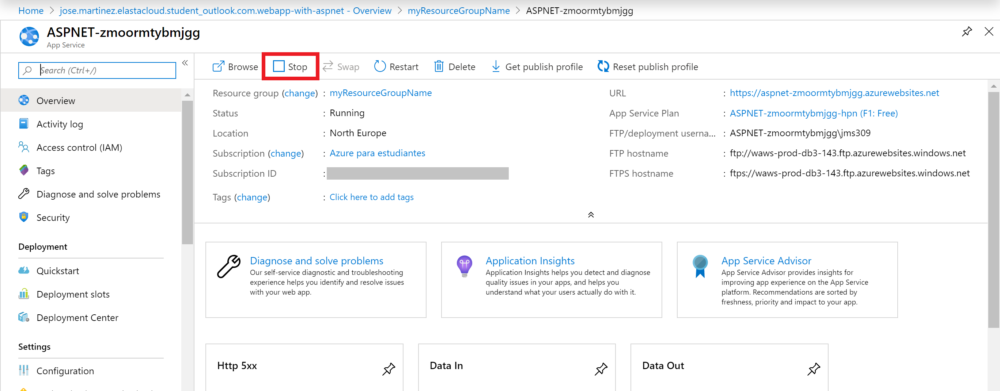

# WebApp with ASPNET

The purpose of this ARM Template is **deploy a web app with ASP.NET** using a **web app**.

But let's understand a bit better how all this work.

## Overview

Azure App Service is an HTTP-based service for hosting web applications, REST APIs, and mobile back ends. You can develop in your favourite language, be it .NET, .NET Core, Java, Ruby, Node.js, PHP, or Python. Applications run and scale with ease on both Windows and Linux-based environments.

## Pre Deployment Steps

Before proceeding to the deployment of the template, we need to perform the following steps.

### The Template

Don't let the size of the template scares you. The structure is very intuitive and once that you get the gist of it, you will see how easier your life will be regarding deploying resources to Azure.

Those are the parameters on the template. Most of them are already with the values, the ones that you need to inform are **web app name** and **location**.

Parameter         | Suggested value     | Description
:--------------- |:-------------      |:---------------------
**webAppName** |*location*-*name*-*environment* i.e.:  uks-name-tst  | A globally unique name of azure web app. I recommend you to use the notation above, that will help to create a unique name for your Web Application. The name must use alphanumeric and underscore characters only. There is a 35 character limit to this field. The App name cannot be changed once the Web App is created.
**location**| The default location | Select the geographic location for your resource group.
**Resource Group**| your resource group |  That is the Resource Group that you need to deploy your resources.

## Deployment

There are a few ways to deploy this template.
You can use [PowerShell](https://docs.microsoft.com/azure/azure-resource-manager/resource-group-template-deploy), [Azure CLI](https://docs.microsoft.com/azure/azure-resource-manager/resource-group-template-deploy-cli), [Azure Portal](https://docs.microsoft.com/azure/azure-resource-manager/resource-group-template-deploy-portal) or your favorite SDK.

For Azure CLI I'm using the Visual Code with Azure CLI extensions, if you like, you can find more information [here](https://code.visualstudio.com/docs/azure/extensions). But bare in mind that you don't need to use the Visual Code, you can stick with the old good always present **Command Line** on Windows or any **bash terminal**.

### Using Azure CLI with Visual Code

Type on the terminal window: **az login**

You will be redirected to the Azure Portal where you can insert your credentials and log in.

After logged in, you will see your credentials on the terminal.

To set the right subscription, type following command:

#### az account set --subscription "your subscription id"

### Resource Group

Now you need a Resource Group for our deployment. If you haven't yet created a Resource Group, you can do it now. If you are new on Azure and wonder what is a Resource Group? Bare with me! A Resource Group is a container that holds related resources for an Azure solution. The resource group includes those resources that you want to manage as a group. Simply saying, it's like a folder that contains files. Simple as that.

To create a Resource Group, you need a name and a location for your Resource Group.

For a list of locations, type: **az account list-locations**

To create the Resource group, type the command:

#### az group create --name "resource-group" --location "your location"

Super simple, right? Now that we have our **Resource Group** created, let's deploy the WebApp.

#### az group deployment create --name "name of your deployment" --resource-group "resource-group" --template-file "./azuredeploy.json"

Insert the values for the parameters.
As you can see, it's running.

Go grab a cup of coffee, have some fresh air. Before you come back you will have your WebApp.

And there we go, your deployment is Succeeded. Let's check the resource on the [Azure Portal](https://portal.azure.com).

On the portal, go to Resource Groups. In this blade, you can see the Resource Group that you created.

Click on the Resource Group and there it's the resources

Congratulations! You have deployed the template successfully. We can see our web visiting an URL like that:

#### webAppName.azurewebsites.net

### Using the Portal

At the Portal, in All Services look for **Templates**, you can favourite this service.

Click in **Add** to add your template: 

On General, type the name and the description for your template, and click on [Ok].

On ARM Template, replace the contents of the template with your template, and click on [OK] and then on [Add].

Click on the refresh button and you will find your template. Click on it and the click in [Deploy].

On the screen Custom Deployment, inform the values for the parameters, by now you must be already familiar with.

Select [Agree] and click on [Purchase].

As you can see, it's deploying.

After a couple of minutes, voilà, you have your Web App deployed.

Go to the Resource. Repeat the test that you have done before.

**p.s.: Pretty easy to create resources on Azure, right? But if you are the sort of IT guy that always loves automation, here is the surprise. Just click on the button below and it will automatically deploy the VM through the  Azure Portal.**

#### Important disclaimer: Azure charges you for the resources you are using, and you don't want to finish all your credits at once, right? So, don't forget to stop the ___Service___ at the portal or even delete the Resource Group you have created to avoid unnecessary charges

### Deploy your app

To deploy your our ASP.NET app you can follow that [tutorial](https://docs.microsoft.com/azure/app-service/app-service-web-get-started-dotnet#create-an-aspnet-core-web-app).

Just take care when you want to publish your application because you have to select an existing app service (the one that we have created).

### How to delete your resources

#### Using the portal

On the portal, open your Resource Group, if you will not use the Web App anymore, you can just click on the [Delete] button.

You can also just stop the Web App in case you gonna need the resource. Open the resource and click on Stop.

Just refresh your screen and you are good to go.
