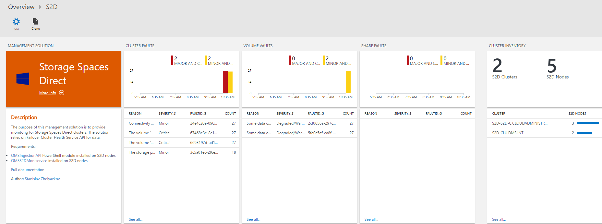
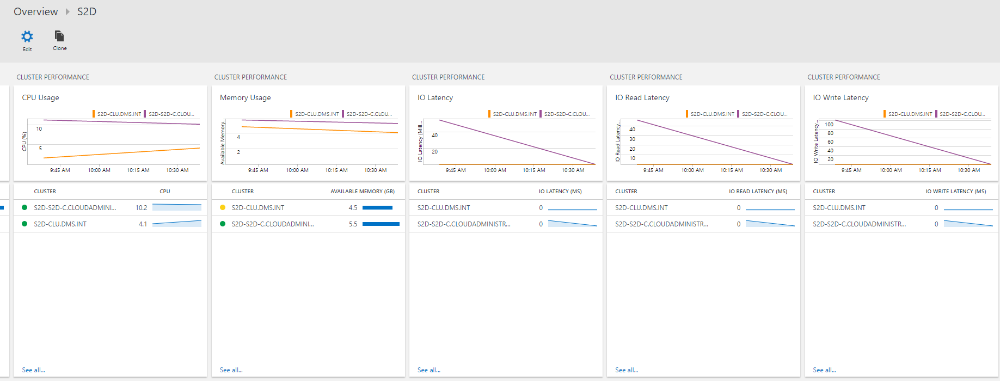

# S2D Management Solution for OMS

[](https://portal.azure.com/#create/Microsoft.Template/uri/https%3A%2F%2Fraw.githubusercontent.com%2FAzure%2Fazure-quickstart-templates%2Fmaster%2Fs2d-oms-mgmt-solution%2Fazuredeploy.json) 
<a href="http://armviz.io/#/?load=https%3A%2F%2Fraw.githubusercontent.com%2FAzure%2Fazure-quickstart-templates%2Fmaster%2Fs2d-oms-mgmt-solution%2Fazuredeploy.json" target="_blank">
    
</a>

The purpose of this management solution is to provide monitoring for Storage Spaces Direct clusters.
The solution relies on [Failover Cluster Health Service API](https://technet.microsoft.com/en-us/windows-server-docs/failover-clustering/health-service-overview?f=255&MSPPError=-2147217396) for data.
Metrics and Faults are gathered from S2D clusters and send to OMS. The solution consists of 2 parts:

- S2DMon service that sends data to OMS Log Analytics Workspace. More info below.
- OMS Solution with visualization for the data in OMS Log ANalytics. More info below.

When deployed the solution is viewable in both OMS portal and Azure.





## Prerequisites

- **S2D Cluster**
- **OMS Log ANalytics Workspace**
- **OMSIngestionAPI module installed on S2D Nodes**
- **S2DMon service installed on S2D Nodes**

## S2DMon Service

The S2DMon service is basically a PowerShell script that runs as a service. The code for getting
data from S2D Cluster and sending it to OMS runs every 10 seconds. The engine for running that code
is forked version from [PSService.ps1](https://github.com/JFLarvoire/SysToolsLib/blob/master/PowerShell/PSService.ps1)
created by Jean-François Larvoire. Full article of the PSService.ps1 can be found [here](https://msdn.microsoft.com/en-us/magazine/mt703436.aspx?f=255&MSPPError=-2147217396).
The service sends the following information every 10 seconds:

- Metrics
  - StorageSubSystem
    - CPUUsageAverage
    - CapacityPhysicalPooledAvailable
    - CapacityPhysicalPooledTotal
    - CapacityPhysicalTotal
    - CapacityPhysicalUnpooled
    - CapacityVolumesAvailable
    - CapacityVolumesTotal
    - IOLatencyAverage
    - IOLatencyRead
    - IOLatencyWrite
    - IOPSRead
    - IOPSTotal
    - IOPSWrite
    - IOThroughputRead
    - IOThroughputTotal
    - IOThroughputWrite
    - MemoryAvailable
    - MemoryTotal
  - Node
    - CPUUsage
    - IOLatencyAverage
    - IOLatencyRead
    - IOLatencyWrite
    - IOPSRead
    - IOPSTotal
    - IOPSWrite
    - IOThroughputRead
    - IOThroughputTotal
    - IOThroughputWrite
    - MemoryAvailable
    - MemoryTotal
  - Volume
    - CapacityAvailable
    - CapacityTotal
    - IOLatencyAverage
    - IOLatencyRead
    - IOLatencyWrite
    - IOPSRead
    - IOPSTotal
    - IOPSWrite
    - IOThroughputRead
    - IOThroughputTotal
    - IOThroughputWrite
- Faults
  - StorageSubSystem
  - Volume
  - File Share

Data is taken from Failover Cluster Health Service. Documentation can be fond [here](https://technet.microsoft.com/en-us/windows-server-docs/failover-clustering/health-service-overview?f=255&MSPPError=-2147217396) and [here](https://msdn.microsoft.com/windowshealthservice/healthservice?f=255&MSPPError=-2147217396)

>**Note**: The code for sending data will run only on the node which is the owner of Cluster Name
resource. When the owner is changed the code will start running on the new owner. This approach
avoids sending the same data multiple times and making the service Highly Available.

For sending data to OMS the script uses [OMSIngestionAPI](https://www.powershellgallery.com/packages/OMSIngestionAPI/) PowerShell Module.
Install the module prior installing the S2DMon service. You can use the following command:

```powershell
Install-Module -Name OMSIngestionAPI
```

The S2DMon service can be installed with simple command. Place the s2dmon.ps1 script in a folder on
a S2D node and execute command for setup. Example

```powershell
C:\temp\s2dmon.ps1 -Setup -OMSWorkspaceCreds (Get-Credential)
```

When prompted for credentials for user name enter OMS Workspace ID and for password enter OMS
Workspace Primary Key.

The OMS workspace key is secured by encrypting it with key and saving it into file.

The following files will be created in C:\Windows\system32

- s2dmon.cred - File containing the encrypted OMS Workspace Primary Key
- s2dmon.exe - Wrapper for s2dmon.ps1
- s2dmon.id - File containing OMS Workspace ID
- s2dmon.key - Key for encrypting OMS Workspace primary Key
- s2dmon.ps1 - the s2dmon service setup and runtime

If needed you can setup additional permissions on these files so they can be access by specific set
of users. Remember to leave permission for Local System account as the service is using it for
accessing the files.

After the service is setup execute the following command to start the service:

```powershell
C:\temp\s2dmon.ps1 -Start
```

Management of the service is also possible with services.msc

Logs for the service are available in c:\Windows\Logs\s2dmon.log". For more informaiton check
PSService.ps1 documentation.

Once the service is setup for first time you should start seeing data in OMS after 15-20 minutes.
Restart your browser if you do not see data after that time. All the data is in `Type=S2D_CL` log.

If you need to remove the service use:

```powershell
C:\temp\s2dmon.ps1 -Stop
C:\temp\s2dmon.ps1 -Remove
```

## OMS Solution

The OMS solution can be setup by deploying it from Deploy to Azure button or using the template with
Azure Portal, Azure PowerShell or Azure CLI. Deploy it in the same resource group where your OMS Log
Analytics Workspace is located. After deployment the solution will be visible in Azure as resource.
The view for the solution will also be availalbe in Overview of OMS Portal.

## S2D_CL Log Type

When S2D ata appears in OMS it is located in S2D_CL type.

- CapacityAvailableValue_d	- Value for metric CapacityAvailable
- CapacityPhysicalPooledAvailableValue_d - Value for metric CapacityPhysicalPooledAvailable
- CapacityPhysicalPooledTotalValue_d - Value for metric CapacityPhysicalPooledTotal
- CapacityPhysicalTotalValue_d - Value for metric CapacityPhysicalTotal
- CapacityPhysicalUnpooledValue_d - Value for metric CapacityPhysicalUnpooled
- CapacityTotalValue_d - Value for metric CapacityTotal
- CapacityVolumesAvailableValue_d - Value for metric CapacityVolumesAvailable
- CapacityVolumesTotalValue_d - Value for metric CapacityVolumesTotal
- ClusterName_s - FQDN of the S2D cluster. All upper case.
- CPUUsageAverageValue_d - Value for metric CPUUsageAverage. Used on Clusters
- CPUUsageValue_d - Value for metric CPUUsage. Used on Nodes
- FaultId_g - Fault ID
- FaultingObjectDescription_s - Faulting object description
- FaultingObjectLocation_s - Faulting object location
- FaultingObjectType_s- Faulting object type
- FaultingObjectUniqueId_s - Faulting object unique ID
- FaultLevel_s - What kind of Fault it is. Cluster, Volume or Share as possible values
- FaultType_s - Fault Type
- FileSystemType_s - What kind of File system type the volume is. Usualy CSVFS_ReFS
- HealthStatus_s - Health status for volume
- IOLatencyAverageValue_d - Value for metric IOLatencyAverage
- IOLatencyReadValue_d - Value for metric IOLatencyRead
- IOLatencyWriteValue_d - Value for metric IOLatencyWrite
- IOPSReadValue_d - Value for metric IOPSRead
- IOPSTotalValue_d - Value for metric IOPSTotal
- IOPSWriteValue_d - Value for metric IOPSWrite
- IOThroughputReadValue_d - Value for metric IOThroughputRead
- IOThroughputTotalValue_d - Value for metric IOThroughputTotal
- IOThroughputWriteValue_d - Value for metric IOThroughputWrite
- MemoryAvailableValue_d - Value for metric MemoryAvailable
- MemoryTotalValue_d - value for metric MemoryTotal
- MetricLevel_s - what kind of metric it is. Possible values are Cluster, Node or Volume.
- MetricName_s - name of the metric
- OperationalStatus_s - Operational status for Volume
- Reason_s - reason for fault
- RecommendedActions_s - recommended actions for fault
- SecondTimeStamp_t - second time stamp used in faults data only
- ServerName_s - Full FQDN of the server when the metric is for Node. All upper case.
- Severity_s - Fault severity. Can be Unknown, Information, Degraded/Warning, Minor, Major, Critical or Fatal/NonRecoverable
- SeverityNumber_d - Severity value in number. From 0 to 7 with excluding 2. Matches the sequence above for Severity
- UnitType_s - What kind of unti the metric is. Possible values are Bytes, BytesPerSecond, CountPerSecond, Seconds and Percentage
- VolumeLabel_s - Volume label

## Notes

Please report any issues to [GitHub](https://github.com/slavizh/s2d-oms-mgmt-solution).