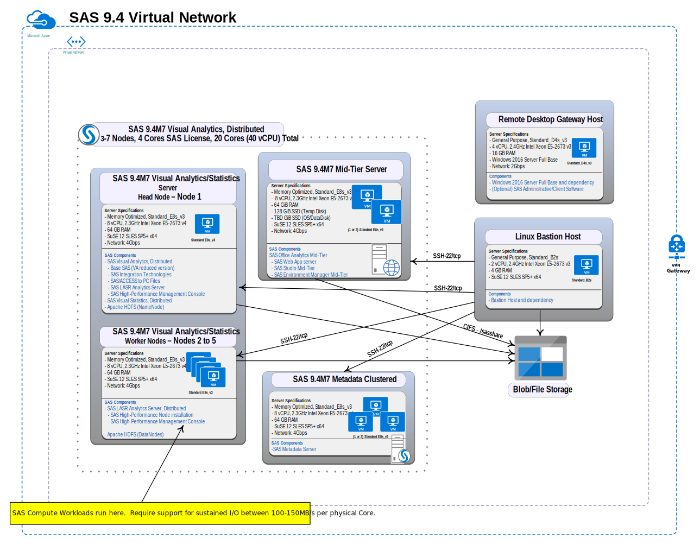

# SAS 9.4 Visual Analytics/Visual Statistics Quickstart Template for Azure 

**Note:** The SAS 9.4 Visual Analytics/Visual Statistics Quickstart Template for Azure is an example architecture only, and is not intended for production use. Specifically, the quickstart provides an example of how SAS 9.4 VA/VS workloads running in a massively parallel processing (MPP) environment with SAS LASR Analytic Server can be run on Azure.  When running in an MPP environment, the SAS 9.4 VA/VS Quickstart Template for Azure deploys Apache Hadoop.  As stated in our [SAS 9.4 Support for Hadoop policy](https://support.sas.com/en/documentation/third-party-software-reference/9-4/support-for-hadoop.html), SAS does not provide support for the installation or administration of Apache Hadoop.  For support with these issues, please refer to the Apache Hadoop open source community.  The intent of the SAS 9.4 VA/VS Quickstart Template for Azure is to provide customers an opportunity to test deployments on the cloud before committing to a lift and shift from their current on-premise deployments.


## Contents
1. [Overview](#Overview)
    1. [Costs and Licenses](#Costs)
        1. [SAS 9.4 VA/VS server](#compute)
        1. [SAS 9.4M7 Mid-Tier server](#midtier)
        1. [SAS 9.4M7 Metadata clustered server](#metadata)
1. [Architecture](#architecture)
1. [Prerequisites](#Prerequisites)
1. [Best Practices when Deploying SAS 9.4M7 VA/VS on Microsoft Azure](#best_practices) 
1. [Deployment Steps](#Deployment)
    1. [Deploy Using the Azure Portal](#azureportal)
    1. [Deploy Using Mercury Admin Tools](#mercuryadmintools)
1. [Post Deployment Steps](#PostDeployment)
    1. [Accessing Resources in the Deployment](#accessresources)
    1. [Check Logs and Services Status](#logsandservices)
    1. [Restarting Services](#restartservices)
    1. [Running SAS Management Console (SMC)](#smc)
1. [Troubleshooting](#Troubleshooting)
1. [Appendix A:](#AppendixA)


<a name="Overview"></a>
## Overview
This README for SAS 9.4 Visual Analytics (VA)/ Visual Statistics (VS) Quickstart Template for Azure is used to deploy the following SAS Viya products in the Azure cloud:

* SAS Visual Analytics 7.5

* SAS Visual Statistics 7.5

This Quickstart is a reference architecture for users who want to deploy the SAS 9.4 VA/VS  platform using cloud-friendly technologies. By deploying the SAS platform in Azure, you get access to SAS analytics visualization and the ability to create powerful statistical models in an Azure-validated environment. 

For assistance with SAS software, contact  [SAS Technical Support](https://support.sas.com/en/technical-support.html).   When you contact support, you will be required to provide information, such as your SAS site number, company name, email address, and phone number, that identifies you as a licensed SAS software customer. 

<a name="Costs"></a>
### Costs and Licenses
You are responsible for the cost of the Azure services used while running this Quickstart deployment. There is no additional cost for using the Quickstart.
You will need a SAS license to launch this Quickstart. Your SAS account team and the SAS Enterprise Excellence Center can advise on the appropriate software licensing and sizing to meet your workload and performance needs.
The SAS 9.4 VA/VS Quickstart Template for Azure creates three instances, including: 
* 1 compute server virtual machine (VM), the SAS VA/VS server
* 1 middle tier VM, the SAS 9.4M7 Mid-Tier server
* 1 metadata server VM, the SAS 9.4M7 Metadata clustered server

<a name="compute"></a>
#### SAS 9.4 VA/VS server
(content under development:  Need sizing recommendations for this QS.  These are from Azure Viya Quickstart.  PD)
We  recommend that you use at least the memory optimized Standard E16s_v3 VM size.

Here are some recommended example VM sizes based on the number of licensed cores:

| Licensed Cores  | Virtual Machine| SKU	Memory(RAM) | Maximum Dataset Size | Cache Size |
| ------------- | ------------- | ------------- | ------------- | ------------- |
|4  | Standard_E8s_v3   | 64 GB  | 20-40 GB	  |128 GB  |
| 8 | Standard_E16s_v3  | 128 GB  |20-40 GB	  |256 GB  |
| 16  | Standard_E32s_v3| 256 GB  | 90-170 GB |512 GB  |

<a name="midtier"></a>
#### SAS 9.4M7 Mid-Tier server
(content under development:  Need sizing recommendation.  This came from architecture diagram. PD)
We  recommend that you use one or two of the memory optimized Standard E16s_v3 VM size at least.

<a name="metadata"></a>
#### SAS 9.4M7 Metadata clustered server
(content under development:  Need sizing recommendation.  This came from architecture diagram. PD)
We  recommend that you use one or three of the memory optimized Standard E16s_v3 VM size at least.

<a name="architecture"></a>
## Architecture

This SAS 9.4 VA/VS Quickstart Template for Azure takes a generic license for SAS 9.4 and deploys SAS into its own network. The deployment creates the network and other infrastructure.  After the deployment process completes, you will have the outputs for the web endpoints for a SAS 9.4 deployment on recommended virtual machines (VMs).  

For details, see [SAS 9.4 Intelligence Platform: Installation and Configuration Guide](https://go.documentation.sas.com/?cdcId=bicdc&cdcVersion=9.4&docsetId=biig&docsetTarget=titlepage.htm&locale=en). 

By default, Quickstart deployments enable Transport Layer Security (TLS) to help ensure that communication between external clients (on the internet) and the load balancer is secure. Likewise, TLS is enabled between the load balancer and the private subnet that contains the SAS 9.4 components. 

Deploying this Quickstart for a new virtual private cloud (VPC) with default parameters in a massively parallel processing (MPP) environment builds the following SAS 9.4 environment in the Microsoft Azure cloud, shown in Figure 1.   In MMP environments, the CASInstanceCount parameter is set to one, indicating that only one CAS controller is configured.


Figure 1: Quickstart architecture for SAS 9.4 VA/VS on Azure in an MPP Environment

<a name="Prerequisites"></a>
## Prerequisites

Before deploying SAS 9.4 VA/VS Quickstart Template for Azure, you must have the following:
* A Microsoft Azure account with Contributor and Admin Roles if you do not already have one. Request an Azure account at ["CIS Cloud Services"](http://sww.sas.com/sites/it/cloud-services/).
        
* A SAS 9.4M7 VA/VS software order that contains the following supported Quickstart products: 

        SAS Visual Analytics 7.5 on Linux 

        SAS Visual Statistics 7.5 on Linux 

* A software depot that has been downloaded with the SAS Download Manager (per the instructions in the Software Order Email) to a folder similiar to this: /<download_folder_name>/nondist/depot.

* Sufficient quota of at least ## Cores, based on four licensed SAS cores in an SMP environment.  In MPP environments, apply this sizing to the CAS workers as well as the CAS controller.

*  Verification that your required SAS 9.4M7 file upload sizes do not exceed the limits of the Application Gateway. For details about limits, see 
["Application Gateway limits."](https://docs.microsoft.com/en-us/azure/azure-subscription-service-limits?toc=%2fazure%2fapplication-gateway%2ftoc.json#application-gateway-limits)
* A resource group that does not already contain a Quickstart deployment. For more information, see ["Resource groups"](https://docs.microsoft.com/en-us/azure/azure-resource-manager/resource-group-overview#resource-groups).

* The software depot must be uploaded to Azure Blob Storage as follows:
1. Navigate to the directory where the software depot was downloaded.  
2. Upload the software depot by running this command: 
```
az storage blob upload-batch --account-name "$STORAGE_ACCOUNT" --account-key "$STORAGEKEY" --destination "$SHARE_NAME" --destination-path "$SUBDIRECTORY_NAME" --source "$(pwd)" 
```
For more information about this command, see ["az storage blob upload-batch"](https://docs.microsoft.com/en-us/cli/azure/storage/blob?view=azure-cli-latest#az_storage_blob_upload_batch).

<a name="best_practices"></a>
## Best Practices when Deploying SAS 9.4M7 VA/VS on Microsoft Azure

<a name="Deployment"></a>
## Deployment Steps

<a name="azureportal"></a>
### Deploy Using the Azure Portalt 

1. Log into the Azure portal [here](https://portal.azure.com/#home).  
2. Navigate to the  [Custom Deployment page](https://portal.azure.com/#create/Microsoft.Template/uri/https%3a%2f%2fraw.githubusercontent.com%2fsassoftware%2fazure-quickstart-templates%2fdevelop-sas94m7-VAVS%2fsas-9.4m7-VA%2fazuredeploy.json).
3. Specify the following parameters for your deployment:

|Parameter Name|Value|
|--------------|-----------|
|Subscription|Specifies what subscription to use for the deployment.|
|Resource group|Specifies what resource group to use. Choose an existing group or click *Create new* and provide a name for the new group.|
|Region|Defines the Azure region in which the deployment should run.
|Location|Defines the location in Microsoft Azure where these resources should be created. This is derived from the Resource group.|
|SAS Depot Location|Specifies the URI of the Azure Blob Store where the software depot was uploaded.|
|Use a New or Existing Virtual Network?|Specifies whether to use a new or existing network.|
|Existing Virtual Network Resource Group|Specifies the resource group if using an existing virtual network. Leave blank if using a new network. Otherwise enter the resource group for the existing network|
|Virtual Network Name|Use the default value (recommended).|
|Operating System Image|Specifies the operating system to use.  Currently, only SUSE is supported.|
|Mid-Tier VM Count|Specifies the number of virtual machines (VMs) for the midtier server. Select 1 for a non-clustered midtier server.  Select 2 for a 2 node midtier cluster.
|Mid-Tier VM Size|Specifies the VM size. Use the default size (recommended).|
|Visual Analytics Worker Count|Specifies the number of worker instances created for the SAS Visual Analytics controller.| 
|Visual Analytics Controller Size|(content under development PD)|
|Visual Analytics Worker Size|(content under development PD)|
|Proximity Placement Group Name| Specifies the proximity group for instances. For better performance, you might want to place all instances in the same proximity group. You supply the name.|
|SSH Key for VM Access| Specfies the full SSH public key that will be added to the servers. Cut and paste a public SSH key into this field.|
|SAS Administration Password|Specifies the password used for SAS authentication. Enter the password to be used for the sasadm@saspw account.|
|Azure Administration Password|Specifies the password used for OS authentication.  Enter the password to be used for the sasinst account.|
|Admin Ingress Location|Specifies to allow inbound SSH traffic to the Ansible Controller from this Classless Inter-Domain Routing (CIDR) block (IP address range). Must be a valid IP CIDR range of the form x.x.x.x/x.|
|Web Ingress Location| Specfies to allow inbound HTTP traffic to the SAS 9.4 environment from this CIDR block (IP address range). Must be a valid IP CIDR range of the form x.x.x.x/x.|
|Deploy Azure Bastion|Specifies to allow users to create a Windows Bastion instance in the deployment.|
|\_artifacts Location SAS Token|Leave blank.|
|\_artifacts Location|Use the default value (recommended).|

3. Click *Next: Review and Create*. 
4. If the validation is successful,  click *Create*. When the *Deployment is in progress* window appears, the deployment will begin.
Deployments typically take 2-3 hours to complete. 

<a name="mercuryadmintools"></a>
### Deploy Using the Mercury Admin Tools

(content under development:  Do we still need this?  PD)

<a name="PostDeployment"></a>
## Post Deployment Steps

<a name="accessresources"></a>
### Accessing Resources in the Deployment

1. Open the resource group.
2. Click *Deployments*.
3. Click *Microsoft Template-\<deployment name\>*.
5. Click *Outputs* to access the following:
    * jump_IP IP address
    * SAS Visual Analytics URL
    * SAS Studio URL
6. Browse to the SAS Visual Analytics and SAS Studio URLs.  Log in as *sasadm@saspw*.  Enter the password that you specified for the SAS Administration password value [here](#azureportal).

<a name="logsandservices"></a>
### Check Logs and Services Status

Check the logs and services status by accessing the various VM instances from the jumpvm, as follows: (content under development: What are the correct steps for  checking logs and services status post deployment? Leaving these instructions for now. PD)

1. Obtain the Public IP Address of the jumpvm from the jumpvm’s details: 

   a. Navigate to [https://portal.azure.com/#blade/HubsExtension/BrowseResourceGroups](https://portal.azure.com/#blade/HubsExtension/BrowseResourceGroups) and select the *Resource Group* created by the deployment.
   
   b. Select the *jumpvm* resource from the list of resources in the *Resource Group*. The public IP address is displayed in the *Resource Overview*. 

2. Using the Public IP address, ssh to the jumpvm: 

    ```
   ssh -I <public key pem file> AzureUser@<jumpvm public IP address>
   ```
   
   The jumpvm provides SSH access to the other VMs in the deployment: 
   * SSH access using the AzureUser account 
   ```
   ssh <vm name>
   ```
   For example:
   ```
   ssh midtier-0 
   ```
   * SSH access using the sasinst service account
   ```
   ssh sasinst@<vm name>
   ```
   For example:
   ```
   ssh sasinst@midtier-0 
   ```
   The password for all accounts is set to the default: *Go4thsas*
   
   SAS is installed in the /sas folder on all VMs. 

<a name="restartservices"></a>
### Restarting Services
(content under development: Do we still need this? Should it go in the Troubleshooting section?  PD)
Some services may not successfully restart when the deployment completes. 

To restart the midtier services, SSH to the midtier-0 VM instance and perform the following steps: 
```
cd /sas/config/Lev1 
./sas.servers stop 
./sas.servers start 
```

<a name="smc"></a>
### Running SAS Management Console (SMC)
(content under development: Do we still need this?  PD)
The easiest way to run SMC is to connect to the deployment using X11 port forwarding as follows:
```
ssh -X -i <public key pem file> AzureUser@<jumpvm public IP address>
ssh -X <vm name> 
cd /sas/SASHome/SASManagementConsole/9.4 
./sasmc & 
```
For example, to run SMC on the *midtier-0* VM:
```
ssh -X -i <public key pem file> AzureUser@<jumpvm public IP address>
ssh -X midtier-0 
cd /sas/SASHome/SASManagementConsole/9.4 
./sasmc & 
```

<a name="Troubleshooting"></a>
## Troubleshooting

<a name="AppendixA"></a>
## Appendix A: 
