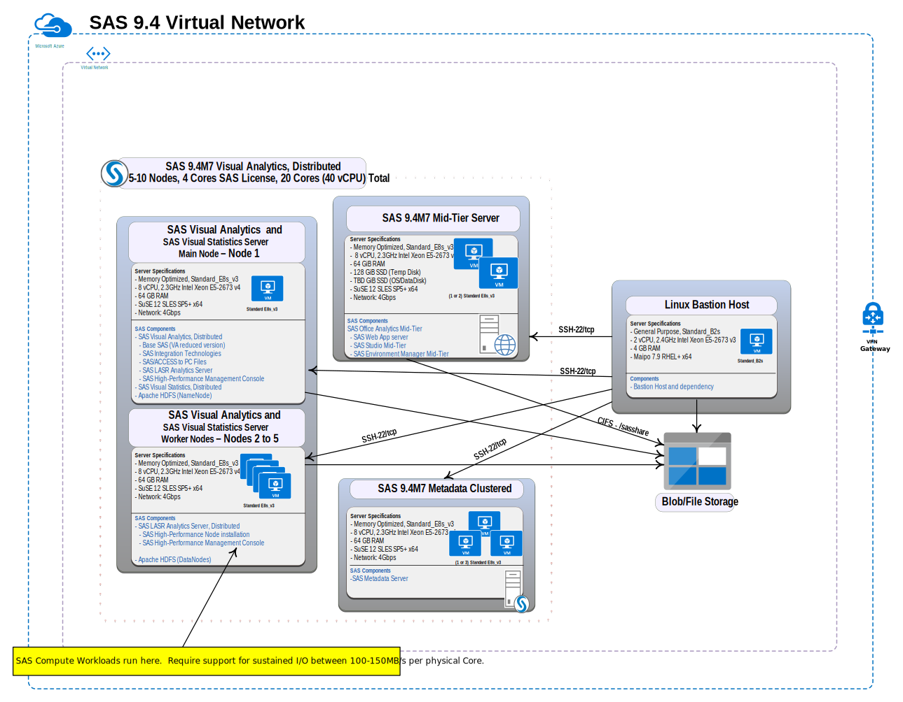

# SAS 9.4 Quickstart Template for Azure with SAS Visual Analytics and SAS Visual Statistics

**Note:** The SAS 9.4 Quickstart Template for Azure with SAS Visual Analytics and SAS Visual Statistics is an example architecture only, and is not intended for production use. Specifically, the Quickstart provides an example of how SAS Visual Analytics in SAS 9.4  and SAS Visual Statistics in SAS 9.4 workloads running in a massively parallel processing (MPP) environment with SAS LASR Analytic Server can be run on Azure.  When running in an MPP environment, the SAS 9.4 Quickstart Template for Azure with SAS Visual Analytics and SAS Visual Statistics deploys Apache Hadoop.  As stated in our [SAS 9.4 Support for Hadoop policy](https://support.sas.com/en/documentation/third-party-software-reference/9-4/support-for-hadoop.html), SAS does not provide support for the installation or administration of Apache Hadoop.  For support with these issues, please refer to the Apache Hadoop open-source community.  The intent of the SAS 9.4 Quickstart Template for Azure with SAS Visual Analytics and SAS Visual Statistics is to provide customers an opportunity to test deployments on the cloud before committing to a lift and shift from their current on-premises deployments.

<a name="Deploybutton"></a>
[](https://portal.azure.com/#create/Microsoft.Template/uri/https%3A%2F%2Fraw.githubusercontent.com%2FAzure%2Fazure-quickstart-templates%2Fmaster%2Fsas-viya%2Fazuredeploy.json)


## Contents
1. [Overview](#Overview)
    1. [Costs and Licenses](#Costs)        
1. [Architecture](#architecture)
1. [Prerequisites](#Prerequisites)
1. [Deployment Steps](#Deployment)
    1. [Deploy Using the Azure Portal](#azureportal)
1. [Post Deployment Steps](#PostDeployment)
    1. [Accessing Resources in the Deployment](#accessresources)      
    1. [Running SAS Management Console](#smc)
1. [Troubleshooting](#troubleshooting)
    1. [Check Logs and Services Status](#logsandservices)
    1. [Restarting Services](#restartservices)
3. [Appendix A: Getting the SAS Token](#AppendixA)

<a name="Overview"></a>
## Overview
This README for the SAS 9.4M7 Quickstart Template for Azure with SAS Visual Analytics and SAS Visual Statistics is used to deploy the following SAS 9.4 products in the Azure cloud:

* SAS Visual Analytics 7.51

* SAS Visual Statistics 7.51

This Quickstart is a reference architecture for users who want to deploy SAS Visual Analytics in SAS 9.4 and SAS Visual Statistics in SAS 9.4 using cloud-friendly technologies. By deploying SAS 9.4 in Azure, you get access to SAS analytics visualization and the ability to create powerful statistical models in an Azure-validated environment. 

For assistance with SAS software, contact  [SAS Technical Support](https://support.sas.com/en/technical-support.html).   When you contact support, you will be required to provide information, such as your SAS site number, company name, email address, and phone number, that identifies you as a licensed SAS software customer. 

<a name="Costs"></a>
### Costs and Licenses
You are responsible for the cost of the Azure services used while running this Quickstart deployment. There is no additional cost for using the Quickstart.
You will need a SAS license to launch this Quickstart. Your SAS account team and the SAS Enterprise Excellence Center can advise on the appropriate software licensing and sizing to meet your workload and performance needs.
The SAS 9.4 Quickstart Template for Azure with SAS Visual Analytics and SAS Visual Statistics creates instances as follows: 
* 1 compute server virtual machine (VM) for the SAS Visual Analytics in SAS 9.4M7 and SAS Visual Statistics in SAS 9.4M7 server main node, plus the number of VMs for the SAS Visual Analytics and SAS  Visual Statistics workers (as specified in the Visual Analytics Worker Count parameter)
* the number of middle tier VMs for the SAS 9.4M7 Mid-Tier server (as specified in the Mid-Tier VM Count parameter)
* the number of metadata server VMs for the SAS 9.4M7 Metadata clustered server (as specified in the Metadata VM Count parameter)

**Note:** The first release of the SAS 9.4 Quickstart Template for Azure with SAS Visual Analytics and SAS Visual Statistics supports only a single instance of the metadata server.

To determine the appropriate sizes of these resources, we recommend that you work with your SAS account team to form a hardware estimate, and use the instance sizes from the hardware estimate. See [Best Practices for using Microsoft Azure with SAS](https://communities.sas.com/t5/Administration-and-Deployment/Best-Practices-for-Using-Microsoft-Azure-with-SAS/m-p/676833#M19680) for more information.

<a name="architecture"></a>
## Architecture

This SAS 9.4 Quickstart Template for Azure with SAS Visual Analytics and SAS Visual Statistics takes a generic license for SAS 9.4 and deploys SAS into its own network. The deployment creates the network and other infrastructure.  After the deployment process completes, you will have the outputs for the web endpoints for a SAS 9.4 deployment on recommended virtual machines (VMs).  

For details, see [SAS 9.4 Intelligence Platform: Installation and Configuration Guide](https://go.documentation.sas.com/?cdcId=bicdc&cdcVersion=9.4&docsetId=biig&docsetTarget=titlepage.htm&locale=en). 

By default, Quickstart deployments enable Transport Layer Security (TLS) to help ensure that communication between external clients (on the internet) and the load balancer is secure. Likewise, TLS is enabled between the load balancer and the private subnet that contains the SAS 9.4 components. 

Deploying this Quickstart for a new virtual private cloud (VPC) with default parameters in a massively parallel processing (MPP) environment builds the following SAS 9.4 environment in the Microsoft Azure cloud, shown in Figure 1.   In MPP environments, the CASInstanceCount parameter is set to one, indicating that only one CAS controller is configured.

**Note:** In the diagram below, a SAS 9.4M7 Metadata Clustered server is depicted.  However, the first release of the SAS 9.4 Quickstart Template for Azure with SAS Visual Analytics and SAS Visual Statistics supports only a single instance of the metadata server.


Figure 1: Quickstart architecture in Azure for SAS Visual Analytics in SAS 9.4 and SAS Visual Statistics in SAS 9.4 in an MPP Environment

<a name="Prerequisites"></a>
## Prerequisites

Before deploying the SAS 9.4 Quickstart Template for Azure with SAS Visual Analytics and SAS Visual Statistics, you must have the following:
* A Microsoft Azure account with Contributor and Admin Roles if you do not already have one. Request an Azure account at ["CIS Cloud Services"](http://sww.sas.com/sites/it/cloud-services/).
        
* A SAS Visual Analytics in SAS 9.4M7 and SAS Visual Statistics in SAS 9.4M7 software order that contains the following supported Quickstart products: 

        SAS Visual Analytics 7.51 on Linux 

        SAS Visual Statistics 7.51 on Linux 

* A software depot that has been downloaded with the SAS Download Manager (per the instructions in the Software Order Email) to a folder similar to this: /<download_folder_name>/nondist/depot.

* Sufficient number of cores. We  recommend that you work with your SAS account team to form a hardware estimate, and use the instance sizes from the hardware estimate.  See [Best Practices for using Microsoft Azure with SAS](https://communities.sas.com/t5/Administration-and-Deployment/Best-Practices-for-Using-Microsoft-Azure-with-SAS/m-p/676833#M19680) for more information.

*  Verification that your required SAS 9.4M7 file upload sizes do not exceed the limits of the Application Gateway. For details about limits, see 
["Application Gateway limits."](https://docs.microsoft.com/en-us/azure/azure-subscription-service-limits?toc=%2fazure%2fapplication-gateway%2ftoc.json#application-gateway-limits)
* A resource group that does not already contain a Quickstart deployment. For more information, see ["Resource groups"](https://docs.microsoft.com/en-us/azure/azure-resource-manager/resource-group-overview#resource-groups).

* If you are using Azure NFS file shares, you must enable your Azure subscription for NFS.  For more information, see the "Register the NFS 4.1 Protocol" section at [How to create an NFS File Share](https://docs.microsoft.com/en-us/azure/storage/files/storage-files-how-to-create-nfs-shares?tabs=azure-portal).

*  Use of a region that supports Availability Zones. For more information, see [Azure Services that support Availability Zones](https://docs.microsoft.com/en-us/azure/availability-zones/az-region).
 
* The software depot must be uploaded to Azure Blob Storage as follows:
1. Navigate to the directory where the software depot was downloaded.  
2. Upload the software depot by running this command: 
```
az storage blob upload-batch --account-name "$STORAGE_ACCOUNT" --account-key "$STORAGEKEY" --destination "$SHARE_NAME" --destination-path "$SUBDIRECTORY_NAME" --source "$(pwd)" 
```
For more information about this command, see ["az storage blob upload-batch"](https://docs.microsoft.com/en-us/cli/azure/storage/blob?view=azure-cli-latest#az_storage_blob_upload_batch).

<a name="depotlocation"></a>
* The URL for the SAS depot location:
1. From the Azure Portal [here](https://portal.azure.com/#home), click *Resource Groups*.
2. From the left column, click on the storage account that you uploaded the SAS 9.4 order files to.
3. Expand *BLOB CONTAINERS*.  Verify that your order files are inside the blob container.
4. Get the SAS Token string. See ["Appendix A"](#AppendixA) for instructions. 
5. Click *Copy URL* from the menu at the top to get the path to your order files.
6. Append the SAS Token string that you saved in step 4 to the end of the URL that you copied in step 5 to determine the URL for the SAS depot location.

For example, suppose that the URL path to your order files is:
\<protocol\>://sas9storageaccount.blob.core.windows.net/sas9-storagecontainer/\<order-directory\>

Suppose that the SAS Token string is \<token-string\>.

Then the  SAS depot location is:
\<protocol\>://sas9storageaccount.blob.core.windows.net/sas9-storagecontainer/\<order-directory\>\<token-string\>

<a name="Deployment"></a>
## Deployment Steps

<a name="azureportal"></a>
### Deploy Using the Azure Portal 
 
1. Click the "Deploy to Azure" button at the beginning of this document [here](#Deploybutton). 
2. Specify the following parameters for your deployment:

|Parameter Name|Value|
|--------------|-----------|
|Subscription|Specifies what subscription to use for the deployment.|
|Resource group|Specifies what resource group to use. Choose an existing group or click *Create new* and provide a name for the new group.|
|Region|Defines the Azure region in which the deployment should run. The available Azure regions are listed at [Azure Services that support Availability Zones](https://docs.microsoft.com/en-us/azure/availability-zones/az-region). The available Azure regions if using Azure NFS file shares are listed in the "Available regions" section at [How to create an NFS share](https://docs.microsoft.com/en-us/azure/storage/files/storage-files-how-to-create-nfs-shares?tabs=azure-portal).  
|Location|Defines the location in Microsoft Azure where these resources should be created. This is derived from the Resource group.|
|SAS Depot Location|Specifies the URI of the Azure Blob Store where the software depot was uploaded. You determined this URI during the prerequisite step [here](#depotlocation).|
|SAS Plan File Location|Specifies the URI to download the plan file from as currently specified in the Azure Blob Store. Leave blank if the plan file is stored in the depot blob.
|Use a New or Existing Virtual Network?|Specifies whether to use a new or existing network.|
|Existing Virtual Network Resource Group|Specifies the resource group if using an existing virtual network. Leave blank if using a new network. Otherwise, enter the resource group for the existing network|
|Virtual Network Name|Use the default value (recommended).|
|Operating System Image|Specifies the operating system to use.  Currently, only SUSE is supported.|
|Mid-Tier VM Count|Specifies the number of virtual machines (VMs) for the middle tier server. Select 1 for a non-clustered middle tier server.  Select 2 for a 2 node middle tier cluster.
|Mid-Tier VM Size|Specifies the VM size. Use the default size (recommended).|
|Visual Analytics Worker Count|Specifies the number of worker instances created for the SAS Visual Analytics controller.| 
|Visual Analytics Controller Size|Specifies the size of the Visual Analytics Controller.|
|Visual Analytics Worker Size|Specifies the size of the SAS Visual Analytics Worker.|
|Proximity Placement Group Name| Specifies the proximity group for instances. For better performance, you might want to place all instances in the same proximity group. You supply the name.|
|SSH Key for VM Access| Specifies the full SSH public key that will be added to the servers. Cut and paste a public SSH key into this field.|
|SAS Administration Password|Specifies the password used for SAS authentication. Enter the password to be used for the sasadm@saspw account.|
|Azure Administration Password|Specifies the password used for OS authentication.  Enter the password to be used for the sasinst account.|
|Admin Ingress Location|Specifies to allow inbound SSH traffic to the Ansible Controller from this Classless Inter-Domain Routing (CIDR) block (IP address range). Must be a valid IP CIDR range of the form x.x.x.x/x.|
|Web Ingress Location| Specifies to allow inbound HTTP traffic to the SAS 9.4 environment from this CIDR block (IP address range). Must be a valid IP CIDR range of the form x.x.x.x/x.|
|\_artifacts Location SAS Token|Leave blank.|
|\_artifacts Location|Use the default value (recommended).|

3. Click *Next: Review and Create*. 
4. If the validation is successful,  click *Create*. When the *Deployment is in progress* window appears, the deployment begins.
Deployments typically take 2-3 hours to complete. 

<a name="PostDeployment"></a>
## Post Deployment Steps

<a name="accessresources"></a>
### Accessing Resources in the Deployment

1. Open the resource group.
2. Click *Deployments*.
3. Click *Microsoft Template-\<deployment name\>*.
5. Click *Outputs* to access the following:
    * jump_IP IP address
    * SAS Visual Analytics URL
    * SAS Studio URL
6. Browse to the SAS Visual Analytics and SAS Studio URLs.  Log in as *sasadm@saspw*.  Enter the password that you specified for the SAS Administration password value [here](#azureportal).

<a name="smc"></a>
### Running SAS Management Console 

The easiest way to run SAS Management Console is to connect to the deployment using X11 port forwarding as follows:
```
ssh -X -i <public key pem file> AzureUser@<jumpvm public IP address>
ssh -X <vm name> 
cd /opt/sas/SASHome/SASManagementConsole/9.4 
./sasmc & 
```
For example, to run SAS Management Console on the *midtier-0* VM:
```
ssh -X -i <public key pem file> AzureUser@<jumpvm public IP address>
ssh -X midtier-0 
cd /opt/sas/SASHome/SASManagementConsole/9.4 
./sasmc & 
```
,a name="troubleshooting"></a>
## Troubleshooting 

<a name="logsandservices"></a>
### Check Logs and Services Status
Check the logs and services status by accessing the various VM instances from the jumpvm, as follows: 

1. Obtain the public IP Address of the jumpvm from the jumpvm’s details: 

   a. Navigate to [https://portal.azure.com/#blade/HubsExtension/BrowseResourceGroups](https://portal.azure.com/#blade/HubsExtension/BrowseResourceGroups) and select the *Resource Group* created by the deployment.
   
   b. Select the *jumpvm* resource from the list of resources in the *Resource Group*. The public IP address is displayed in the *Resource Overview*. 

2. Using the public IP address, SSH to the jumpvm: 

    ```
   ssh -I <public key pem file> AzureUser@<jumpvm public IP address>
   ```
   
   The jumpvm provides SSH access to the other VMs in the deployment: 
   * SSH access using the AzureUser account 
   ```
   ssh <vm name>
   ```
   For example:
   ```
   ssh midtier-0 
   ```
   * SSH access using the sasinst service account
   ```
   ssh sasinst@<vm name>
   ```
   For example:
   ```
   ssh sasinst@midtier-0 
   ```
   The password for all accounts is set to the default: *Go4thsas*
   
   SAS is installed in the /opt/sas folder on all VMs. 
<a name="restartservices"></a>
### Restarting Services

Some services might not successfully restart when the deployment completes. 

To restart the services using the start and stop scripts, perform the following steps:
1. Obtain the public IP Address of the jumpvm from the jumpvm’s details: 

   a. Navigate to [https://portal.azure.com/#blade/HubsExtension/BrowseResourceGroups](https://portal.azure.com/#blade/HubsExtension/BrowseResourceGroups) and select the *Resource Group* created by the deployment.
   
   b. Select the *jumpvm* resource from the list of resources in the *Resource Group*. The public IP address is displayed in the *Resource Overview*. 
2. Using the public IP address, SSH to the jumpvm: 

    ```
   ssh -I <public key pem file> AzureUser@<jumpvm public IP address>
   ```
 3. Log in to the Azure CLI:
 ```
 /usr/local/bin/az login --use-device-code
 ```
 For more information about the Azure CLI, see [Sign in with Azure CLI](https://docs.microsoft.com/en-us/cli/azure/authenticate-azure-cli).
 
 4. Verify that the current subscription matches the subscription in which SAS has been deployed:
 ```
 /usr/local/bin/az/account list --output table
 ```
 For more information about the az account command see [az account](https://docs.microsoft.com/en-us/cli/azure/account?view=azure-cli-latest).
 
 5. If the subscriptions do not match, set the current subscription to the subscription in which SAS has been deployed:
 ```
 /usr/local/bin/az/account set --subscription <subscription>
 ```
 6. When the correct subscription is set, you can run the start and stop scripts as follows:
   
    a. To start the SAS services on the SAS 9.4M7 Metadata server, SAS 9.4M7 Mid-tier server, and SAS Visual Analytics controller VMs:
    ```
    /sas/install/scripts/start_sas.sh 
    ```
    
    b. To return the status of the SAS services on the SAS 9.4M7 Metadata server, SAS 9.4M7 Mid-tier server, and SAS Visual Analytic controller VMs:
    ```
    /sas/install/scripts/status_sas.sh 
    ```
    c. To stop the SAS services on the SAS 9.4M7 Metadata server, SAS 9.4M7 Mid-tier server, and SAS Visual Analytic controller VMs:
    ```
    /sas/install/scripts/stop_sas.sh 
    ```


<a name="AppendixA"></a>
## Appendix A: Get the SAS Token
1. From the Azure Portal [here](https://portal.azure.com/#home), click *Resource Groups*.
2. From the left column, click on the storage account that you uploaded the SAS 9.4 order files to.
3. Expand *BLOB CONTAINERS*.  Verify that your order files are inside the blob container.
8. From the left column, click on *Shared access signature*.
9. From the Shared Access Signature window, click the *Container* and *Object* check boxes under *Allowed resource types*.
10. Specify an end date. The end date specifies the expiration date of your SAS Token.  You might want to specify a date that is a year in the future.
11. Copy and paste the string under *SAS Token*. Save to a known location.


