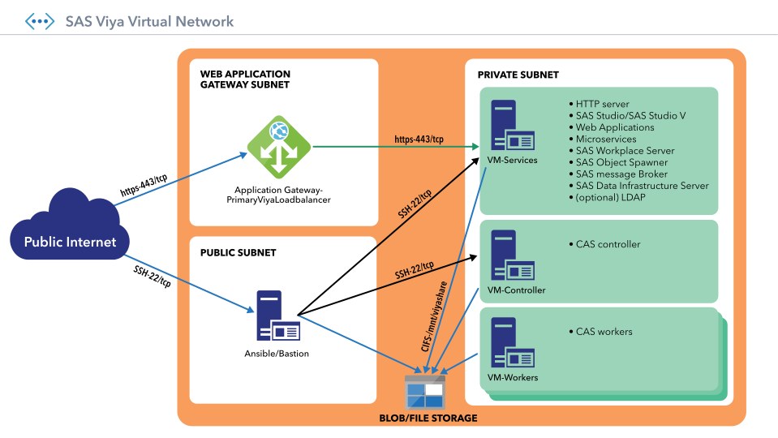
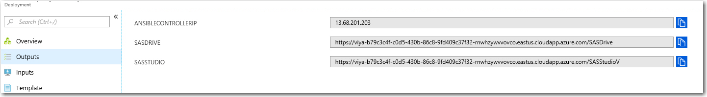

# SAS Viya Quickstart Template for Azure


[](https://portal.azure.com/#create/Microsoft.Template/uri/https%3A%2F%2Fraw.githubusercontent.com%2FAzure%2Fazure-quickstart-templates%2Fmaster%2Fsas-viya%2Fazuredeploy.json)
[](http://armviz.io/#/?load=https%3A%2F%2Fraw.githubusercontent.com%2FAzure%2Fazure-quickstart-templates%2Fmaster%2Fsas-viya%2Fazuredeploy.json)

**Note:** For the current operational status of this Quickstart, click [here](https://github.com/sassoftware/azure-quickstart-templates/tree/master/sas-viya) to redirect to the SAS repository.

This README for  SAS Viya Quickstart Template for Azure is used to deploy the following SAS Viya products in the Azure cloud:

* SAS Visual Analytics 8.5 on Linux
* SAS Visual Statistics 8.5 on Linux
* SAS Visual Data Mining and Machine Learning 8.5 on Linux
* SAS Data Preparation 2.5

This Quickstart is a reference architecture for users who want to deploy the SAS platform, using microservices and other cloud-friendly technologies. By deploying the SAS platform in Azure, you get SAS analytics, data visualization, and machine-learning capabilities in an Azure-validated environment. 

For assistance with SAS software, contact  [SAS Technical Support](https://support.sas.com/en/technical-support.html).   When you contact support, you will be required to provide information, such as your SAS site number, company name, email address, and phone number, that identifies you as a licensed SAS software customer. 
 
## Contents
- [SAS Viya Quickstart Template for Azure](#sas-viya-quickstart-template-for-azure)
  - [Contents](#contents)
  - [Solution Summary](#solution-summary)
    - [Costs and Licenses](#costs-and-licenses)
      - [CAS Controller VM](#cas-controller-vm)
      - [SAS Viya Services VM](#sas-viya-services-vm)
  - [Prerequisites](#prerequisites)
    - [Upload the License File to an Azure Blob](#upload-the-license-file-to-an-azure-blob)
    - [(Optional) Create a Mirror Repository](#optional-create-a-mirror-repository)
    - [Upload the Entire Mirror to Azure Blob Storage](#upload-the-entire-mirror-to-azure-blob-storage)
  - [Best Practices When Deploying SAS Viya on Azure](#best-practices-when-deploying-sas-viya-on-azure)
  - [Deployment Steps](#deployment-steps)
  - [Additional Deployment Details](#additional-deployment-details)
  - [User Accounts](#user-accounts)
    - [Important File and Folder Locations](#important-file-and-folder-locations)
  - [Optional Post-Deployment](#optional-post-deployment)
    - [Configure a Certificate Authority-Signed Digital Certificate and Custom DNS Name](#configure-a-certificate-authority-signed-digital-certificate-and-custom-dns-name)
    - [Enable Access to Existing Data Sources](#enable-access-to-existing-data-sources)
    - [Validate the Server Certificate if Using SAS/ACCESS](#validate-the-server-certificate-if-using-sasaccess)
    - [Set Up ODBC and Microsoft SQL Server](#set-up-odbc-and-microsoft-sql-server)
    - [Set Up SAS Data Agent](#set-up-sas-data-agent)
  - [Usage](#usage)
  - [Troubleshooting](#troubleshooting)
    - [Review the Log Files](#review-the-log-files)
      - [Ansible Server Log Files:](#ansible-server-log-files)
      - [Services Server Log Files](#services-server-log-files)
      - [Controller Server Log Files](#controller-server-log-files)
    - [Restarting the SAS Services](#restarting-the-sas-services)
      - [Checking the status of the services through Viya-Ark](#checking-the-status-of-the-services-through-viya-ark)
      - [Restarting the services through Viya-Ark](#restarting-the-services-through-viya-ark)
      - [SSH Error: data could not be sent to remote host](#ssh-error-data-could-not-be-sent-to-remote-host)
      - [Yum repo errors “Error: Package 'package' Requires: 'another package' Available"](#yum-repo-errors-error-package-package-requires-another-package-available%22)
  - [Appendix A: Configuring the Identities Service](#appendix-a-configuring-the-identities-service)
    - [Verify Security Settings](#verify-security-settings)
    - [Create a Service Account](#create-a-service-account)
    - [Configure the Identities Service](#configure-the-identities-service)
      - [Connection](#connection)
      - [User](#user)
      - [Group](#group)
    - [Verify the Configuration](#verify-the-configuration)
    - [Configure PAM for SAS Studio](#configure-pam-for-sas-studio)
  - [Appendix B: Managing Users for the Provided OpenLDAP Server](#appendix-b-managing-users-for-the-provided-openldap-server)
    - [List All Users and Groups](#list-all-users-and-groups)
    - [Add a User](#add-a-user)
    - [Change or Set a Password](#change-or-set-a-password)
    - [Delete a User](#delete-a-user)
  - [Appendix C: Security Considerations](#appendix-c-security-considerations)
    - [Hardening Provided OpenLDAP Security](#hardening-provided-openldap-security)
    - [Updating the Operating System](#updating-the-operating-system)
  - [Appendix D: Telemetry](#appendix-d-telemetry)
    - [Notification for Resource Manager Template Deployments](#notification-for-resource-manager-template-deployments)

<a name="Summary"></a>
## Solution Summary
By default, Quickstart deployments enable Transport Layer Security (TLS) for secure communication.

This SAS Viya Quickstart Template for Azure will take a SAS provided license package for SAS Viya and deploy SAS into its own network. The deployment creates the network and other infrastructure.  After the deployment process completes, you will have the outputs for the web endpoints for a SAS Viya deployment on recommended virtual machines (VMs). 

When you deploy the Quickstart with default parameters in a symmetric multiprocessing (SMP) environment, the following SAS Viya environment is built in the Microsoft Azure cloud, shown in Figure 1.  In SMP environments, the **CAS Node Count** parameter is set to one, indicating that only one CAS controller is configured.


Figure 1: Quickstart architecture for SAS Viya on Azure in an SMP Environment

When you deploy the Quickstart with default parameters in a massively parallel processing (MPP) environment, the following SAS Viya environment is built in the Microsoft Azure cloud, shown in Figure 2.  In MPP environments, the **CAS Node Count** parameter is set to a value of 2 or more, indicating the number of CAS workers that are configured in addition to the CAS controller. 



Figure 2: Quickstart architecture for SAS Viya on Azure in an MPP Environment

For details, see [SAS Viya 3.5 for Linux: Deployment Guide](https://go.documentation.sas.com/?docsetId=dplyml0phy0lax&docsetTarget=soe.htm&docsetVersion=3.5&locale=en).

<a name="Costs"></a>
### Costs and Licenses
You are responsible for the cost of the Azure services used while running this Quickstart deployment. There is no additional cost for using the Quickstart.
You will need a SAS license {emailed from SAS as `SAS_Viya_deployment_data.zip`} in order to launch this Quickstart. Your SAS account team and the SAS Enterprise Excellence Center can advise on the appropriate software licensing and sizing to meet workload and performance needs.
SAS Viya Quickstart Template for Azure creates three instances, including: 
* 1 compute virtual machine (VM), the Cloud Analytic Services (CAS) controller
* 1 VM for administration, the Ansible controller
* 1 VM for the SAS Viya services

#### CAS Controller VM

Here are some recommended example VM sizes based on the number of licensed cores:

| Licensed Cores  | Virtual Machine| SKU	Memory(RAM) | Maximum Dataset Size | Cache Size |
| ------------- | ------------- | ------------- | ------------- | ------------- |
|4  | Standard_E8s_v3   | 64 GB  | 20-40 GB	  |128 GB  |
| 8 | Standard_E16s_v3  | 128 GB  |20-40 GB	  |256 GB  |
| 16  | Standard_E32s_v3| 256 GB  | 90-170 GB |512 GB  |

#### SAS Viya Services VM

If you are installing VDMML or a similarly large installation, we  recommend that you use at least the Standard E16s_v3 VM size.

<a name="Prerequisites"></a>
## Prerequisites
Before deploying SAS Viya Quickstart Template for Azure, you must have the following:
* Azure user account with Contributor and Admin Roles
* Sufficient quota of at least 28 Cores, based on four licensed SAS cores in an SMP environment.  In MPP environments, apply this sizing to the CAS workers as well as the CAS controller.
* A SAS Software Order Confirmation Email that contains supported Quickstart products:

 		SAS Visual Analytics 8.5 on Linux
		SAS Visual Statistics 8.5 on Linux
        SAS Visual Data Mining and Machine Learning 8.5 on Linux
*  The license file {emailed from SAS as `SAS_Viya_deployment_data.zip`} which describes your SAS Software Order and is uploaded to an Azure Blob (see below)
*  Verification that your required SAS Viya file upload sizes do not exceed the limits of the Application Gateway. For details about limits, see 
["Application Gateway limits."](https://docs.microsoft.com/en-us/azure/azure-subscription-service-limits?toc=%2fazure%2fapplication-gateway%2ftoc.json#application-gateway-limits)
* A resource group that does not already contain a Quickstart deployment. For more information, see [Resource groups](https://docs.microsoft.com/en-us/azure/azure-resource-manager/resource-group-overview#resource-groups).

<a name="License"></a>
### Upload the License File to an Azure Blob
The QuickStart deployment requires a parameter `Deployment Data Location`, which is the Shared Access Signature (SAS) URI for the SAS Softwared License. 

1. Upload the `SAS_Viya_deployment_data.zip` {emailed from SAS} to Azure Blob Storage.  It's suggested that you create a Blob directory named `license` with a single object `SAS_Viya_deployment_data.zip`.  Follow the Microsoft Azure instructions to 
["Create a Container"](https://docs.microsoft.com/en-us/azure/storage/blobs/storage-quickstart-blobs-portal#create-a-container) and 
["Upload a Block Blob."](https://docs.microsoft.com/en-us/azure/storage/blobs/storage-quickstart-blobs-portal#upload-a-block-blob)

2. Create a Shared Access Signature (SAS) URI token: 
    * From the Azure Portal | Storage Account | Storage Explorer (preview), navigate to the Blob directory named `license` (assuming you followed the suggestion)
    * Right click and select **Generate Shared Access Signature**
    * Review the settings, ensure Read & List are checked, then click **Create** token
    * Copy the URI and save it to be used as a Parameter in the QuickStart.
    
For details, see ["Using Shared Access Signatures."](https://docs.microsoft.com/en-us/azure/storage/common/storage-dotnet-shared-access-signature-part-1)

<a name="Mirror"></a>
### (Optional) Create a Mirror Repository 
For your repository, you can do either:
* Use the default method, which downloads the installation files directly from SAS.
* Upload an entire mirror to Azure blob storage.

To use a mirror repository, create a mirror repository as documented in ["Create a Mirror Repository"](https://go.documentation.sas.com/?docsetId=dplyml0phy0lax&docsetTarget=p1ilrw734naazfn119i2rqik91r0.htm&docsetVersion=3.5&locale=en) in the SAS Viya 3.5 for Linux: Deployment Guide.  

**Note:** For the deployment to recognize the mirror directory, the URL must end with a "/" directly before the SAS key.

### Upload the Entire Mirror to Azure Blob Storage 
1. Upload the mirror:
```
az storage blob upload-batch --account-name "$STORAGE_ACCOUNT" --account-key "$STORAGEKEY" --destination "$SHARE_NAME" --destination-path "$SUBDIRECTORY_NAME" --source "$(pwd)" 
```
2. Create a SAS key that has (at a minimum) List blob and Get blob privileges on the blob store.

3. During deployment, set the DeploymentMirror parameter to the URL of the folder in the Azure blob that is qualified by that SAS key.

**Note** For the mirror storage, use the same storage account that you used for the license file in ["Upload the License Zip file."](#license)

<a name="Best-Practices"></a>
## Best Practices When Deploying SAS Viya on Azure
We recommend the following as best practices:
* Create a separate resource group for each Quickstart deployment. For more information, see [Resource groups](https://docs.microsoft.com/en-us/azure/azure-resource-manager/resource-group-overview#resource-groups).
* In resource groups that contain a Quickstart deployment, include only the Quickstart deployment in the resource group to facilitate the deletion of the deployment as a unit.

<a name="Deployment"></a>
## Deployment Steps
You can click the "Deploy to Azure" button at the beginning of this document or follow the instructions for a command-line (CLI) deployment using the scripts in the root of this repository.

The deployment takes between 1 and 4 hours, depending on the quantity of software licensed.

<a name="deployment-details"></a>

## Additional Deployment Details
## User Accounts
<a name="useraccounts"></a>
The *vmuser* host operating system account is created during deployment. Use this account to log in via SSH to any of the machines.

The *sasadmin* and *sasuser* SAS Viya user accounts are also created during deployment.  These accounts exist in LDAP, and are the default user accounts for logging in to SAS Viya.  You cannot directly log on to the host operating system with these accounts.

### Important File and Folder Locations
<a name="filefolderlocations"></a>

Here are the location and sizes of key files and folders that are useful for troubleshooting and performing maintenance tasks:

| Storage Type  | Description/Purpose| Location/Size|
| ------------- | ------------- | ------------- | 
|OS  |  Standard operating system files and server build<br>software location. Standard company defragmentation policy should apply to OS volumes. |  *Ansible controller:* 32GB <br> *Services VM:* 32GB <br> *Controller VM:* 32GB    |
|PLAYBOOKS | Location of Ansible playbooks. |*Ansible controller:*<br>  Main SAS deployment- /sas/install/ansible/sas_viya_playbook <br>  Pre- and Post-Deployment Playbooks- <br>/sas/install/ansible/ <br>  /sas/install/comon/ansible/ |
|SASDEPLOYMENT  | Location of SAS deployment. |*Services VM*, *Controller VM*, *Worker VM:*<br> /opt/sas – 256 GB   | 
|SASREPO | Location of local mirror of SAS repository (if mirror is used). | *Visual VM:* /mnt/viyashare/mirror <br>(mounted shared directory on an Azure files share)|
|SASDATA|Location of SAS data, projects, source code, and applications.|*Services VM:*<br>Default locations under /opt/sas<br>*Controller VM:*<br>User CASLIB locations-<br> /opt/sas/viya/config/data/cas|
|SASWORK/SASUTIL| Location of SAS workspace and temporary scratch area. This area will predominantly be used for transient and volatile data and technically emptied after the completion of job processing.|*Services VM:* /sastmp/saswork<br>Symlink to  /mnt/resource/sastmp/saswork,<br> which is on the ephemeral disks for this machine.<br>Size depends on the machine selected and is set by Azure.|
|SASCACHE|Location of CAS disk cache.|*Controller VM:* /sastmp/cascache<br>Symlink to /mnt/resource/sastmp/cascache, <br>which is on the ephemeral disks for this machine. <br>Size depends on the machine selected and is set by Azure.|
|SASLOGS|Location of the SAS application log files.|*Services VM* and *Controller VM:*<br>/opt/sas/viya/config/var/log<br>(also at /var/log/sas/viya)|
|SASBACKUP|Location for SAS Backup and Recovery Tool backup vault.|*Services VM:*<br>/opt/sas/backups<br>(part of the 256 GB of /opt/sas)|
<a name="Post-Deployment"></a>
## Optional Post-Deployment 
<a name="DNS"></a>
 ### Configure a Certificate Authority-Signed Digital Certificate and Custom DNS Name

By default, the Quickstart deployment generates a highly unique DNS name for your deployment and a self-signed certificate for secure connections. This is enough for limited use cases or proofs of concept. However, because a self-signed certificate provides limited protection against man-in-the-middle attacks and the default DNS is computer-readable, it is recommended that you change the DNS name and provide a Trusted Root signed certificate.
After acquiring a domain name and a TLS certificate from your corporate IT department, Domain Name Registrar, or Certificate Authority, update your Domain Name Server entry to support one of the following choices:
* create a CNAME or Alias record at the current unique Domain Name of the application gateway. (Refer to the DNS name attribute under the PrimaryViyaLoadbalancer_PublicIP resource for the current deployment's unique Domain Name.)
* create a traditional A record at the application gateway IP. (Refer to the IP address under the PrimaryViyaLoadbalancer_PublicIP resource for the current deployment's application gateway IP.)

If you have acquired a new domain name or are using an existing domain name, you can upload a trusted root signed certificate for that domain to the application gateway. For details, see ["Renew Application Gateway certificates."](https://docs.microsoft.com/en-us/azure/application-gateway/renew-certificates)

<a name="DataSources"></a>
### Enable Access to Existing Data Sources
To access an existing data source from your SAS Viya deployment, add an inbound rule to each security group or firewall for the data source as follows:
*  If your data source is accessed via the public internet, add a public IP to the SAS Viya services VM and SAS Viya controller VM. Add an Allow rule to your data source for both the services VM and controller VM  public IP addresses. When creating the public IP addresses for each SAS Viya VM, a Static IP using the "Standard" SKU is recommended. For details, see
 ["Create, change, or delete a public IP address."](https://docs.microsoft.com/en-us/azure/virtual-network/virtual-network-public-ip-address)

* If you have an Azure-managed database, add the service endpoint for the database to the private subnet of your SAS Viya network. For details, see
 ["Use Virtual Network service endpoints and rules for Azure SQL."](https://docs.microsoft.com/en-us/azure/sql-database/sql-database-vnet-service-endpoint-rule-overview)

* If you have peered the virtual network, add a rule to "Allow the private subnet CIDR range" for the SAS Viya network. (By default, 10.0.127.0/24). For details, see 
 ["Virtual network peering."](https://docs.microsoft.com/en-us/azure/virtual-network/virtual-network-peering-overview)

Data sources accessed through SAS/ACCESS should use the [SAS Data Agent for Linux Deployment Guide](https://go.documentation.sas.com/?docsetId=dplyml0phy0lax&docsetTarget=titlepage.htm&docsetVersion=3.5&locale=en) instructions to  ["Configure Data Access"](https://go.documentation.sas.com/?docsetId=dplyml0phy0lax&docsetTarget=p03m8khzllmphsn17iubdbx6fjpq.htm&docsetVersion=3.5&locale=en) and ["Validate the Deployment."](https://go.documentation.sas.com/?docsetId=dplydagent0phy0lax&docsetTarget=n1v7mc6ox8omgfn1qzjjjektc7te.htm&docsetVersion=2.5&locale=en)

<a name="ACCESSCertWarn"></a>
### Validate the Server Certificate if Using SAS/ACCESS
If you are using SAS/ACCESS with SSL/TLS, unvalidated SSL certificates are not supported. In this case, a trust store must be explicitly provided.

**Note:** For most Azure-managed data sources, the standard OpenSSL trust store validates the data source certificate:
```
/etc/pki/ca-trust/extracted/openssl/ca-bundle.trust.crt
```
<a name="MSSQL"></a>
### Set Up ODBC and Microsoft SQL Server
1. Locate the following two odbc.ini files:
* CAS controller: /opt/sas/viya/home/lib64/accessclients/odbc.ini
* SAS Viya services: /opt/sas/spre/home/lib64/accessclients/odbc.ini

2. For each file, modify the parameters. 
* For detailed information about configuring data access, see 
 ["Configure Data Access"](https://go.documentation.sas.com/?docsetId=dplyml0phy0lax&docsetTarget=p03m8khzllmphsn17iubdbx6fjpq.htm&docsetVersion=3.5&locale=en) in SAS Data Agent for Linux: Deployment Guide. 
  
* For specific DataDirect information, see ["Configuration Through the System Information (odbc.ini) File."](https://documentation.progress.com/output/DataDirect/odbcsqlserverhelp/index.html#page/odbcsqlserver%2Fconfiguration-through-the-system-information-(od.html%23))

3. For SQLServer, specify the appropriate driver location:
* For SAS Viya: /opt/sas/spre/home/lib64/accessclients/lib/S0sqls28.so 
* For CAS controller: /opt/sas/viya/home/lib64/accessclients/lib/S0sqls28.so 
```
[SQLServerTest] 
Driver=<driver location>
Description=SAS Institute, Inc 7.1 SQL Server Wire Protocol 
AlternateServers= 
AlwaysReportTriggerResults=0 
AnsiNPW=1 
ApplicationName= 
ApplicationUsingThreads=1 
AuthenticationMethod=1 
BulkBinaryThreshold=32 
BulkCharacterThreshold=-1 
BulkLoadBatchSize=1024 
BulkLoadFieldDelimiter= 
BulkLoadOptions=2 
BulkLoadRecordDelimiter= 
ConnectionReset=0 
ConnectionRetryCount=0 
ConnectionRetryDelay=3 
Database=sqlserver 
EnableBulkLoad=0 
EnableQuotedIdentifiers=0
```
4. Save the odbc.ini files.

<a name="DataAgent"></a>
### Set Up SAS Data Agent

1. Perform the pre-installation and installation steps in [SAS Data Agent for Linux: Deployment Guide.](https://go.documentation.sas.com/?docsetId=dplydagent0phy0lax&docsetTarget=p06vsqpjpj2motn1qhi5t40u8xf4.htm&docsetVersion=2.5&locale=en) For the post-installation tasks, you can either:
    * (Recommended) Use the post-installation playbooks as specified in steps 6 and 7 below.
    * Perform the manual steps in the SAS Data Agent for Linux: Deployment Guide.

2. In the SAS Viya and SAS Data Preparation environment, open the firewall to allow access on port 443 as follows:

      a. Obtain the public IP of the SAS Data agent firewall. The SAS Data Agent firewall address is either the public IP of the machine where the HTTPS service is running or the public IP of the NAT that routes outgoing traffic in the SAS Data Agent network.

      b. Modify the security group of the Application Gateway. By default, this is called "PrimaryViyaLoadbalancer_NetworkSecurityGroup" and will be under the resource group of your SAS Viya deployment. Add an inbound rule for port 443 for the public IP that is specified in step 2a.
      
3. To verify that the connection works, on the machine assigned to the [httpproxy] host group in the Ansible inventory file in your SAS Data Agent environment:
   ``` 
    sudo yum install -y nc
    nc -v -z  <DNS-of-SAS-Viya-endpoint> 443
   ``` 
   If the output from the nc command contains "Ncat: Connected to <IP_address:443>", the connection was successful.
   
4. To allow access from your SAS Viya network, open the firewall of the SAS Data Agent Environment. You can either:
    * Add a public IP address to both the controller and services VMs and allow port 443 from the public IPs of your installation. In this case, a Static IP using the "Standard" SKU is recommended. For details, see ["Create, change, or delete a public IP address."](https://docs.microsoft.com/en-us/azure/virtual-network/virtual-network-public-ip-address) 
    
    * Allow general access to port 443 for all IP addresses.

5. To verify the connection, on the services host:
    ``` 
    sudo yum install -y nc
    nc -v -z  <IP-or-DNS-of-the-SAS-Data-Agent-host> 443
    ``` 
    
   If the output from the nc command contains "Ncat: Connected to <IP_address:443>", the connection was successful.
   
6. Register the SAS Data Agent with the SAS Viya environment. As the deployment vmuser, log on to the Ansible controller VM and run the following command from the /sas/install/ansible/sas_viya_playbook directory:

**Note:** The password of the admin user is the value that you specified during deployment for the SASAdminPass input parameter. 

   ``` 
    cp /sas/install/postconfig-helpers/dataprep2dataagent.yml ./dataprep2dataagent.yml
   ``` 
   
   ``` 
   ansible-playbook dataprep2dataagent.yml \
       -e "adminuser=sasadmin adminpw=<password of admin user>" \
       -e "data_agent_host=<FQDN(DNS)-of-SAS-Data-Agent-machine>" \
       -e "secret=<handshake-string>" \
       -i "/sas/install/ansible/sas_viya_playbook/inventory.ini"
   ```

7. Register the SAS Viya environment with the SAS Data Agent. Copy the following file from the Ansible controller in your SAS Viya deployment into the playbook directory (sas_viya_playbook) in your SAS Data Agent deployment:

   ``` 
   /sas/install/postconfig-helpers/dataagent2dataprep.yml
   ``` 
 
   From the playbook directory (sas_viya_playbook) for the SAS Data Agent:
    ```
    ansible-playbook dataagent2dataprep.yml \
       -e "data_prep_host=<DNS-of-SAS-Viya-endpoint>" \
       -e "secret=<handshake-string>" 
    ```
    
      **Note:** The DNS of the SAS Viya endpoint is the value of the SASDrive output parameter, without the " prefix and the "/SASDrive" suffix.

8. To access the data sources through SAS/ACCESS, see ["Configure Data Access"](https://go.documentation.sas.com/?docsetId=dplyml0phy0lax&docsetTarget=p03m8khzllmphsn17iubdbx6fjpq.htm&docsetVersion=3.5&locale=en)
in the SAS Data Agent for Linux: Deployment Guide.

9. Validate the environment, including round-trip communication. For details, see the ["Validation"](https://go.documentation.sas.com/?docsetId=dplydagent0phy0lax&docsetTarget=n1v7mc6ox8omgfn1qzjjjektc7te.htm&docsetVersion=2.5&locale=en ) chapter in the SAS Data Agent for Linux: Deployment Guide.

<a name="Usage"></a>
## Usage 

* To log in to any machine via SSH to check on a deployment or to perform maintenance, log in as *vmuser*.

* To log in to SAS Viya initially, use one of the following default user accounts: *sasadmin* (administrative user) or *sasuser*.

* To access SAS Viya applications, navigate to the **Outputs** screen and access SASDrive or SASStudio. 

 

* To connect to VMs through Azure Bastion:
1. Log in to the Azure Bastion server as *vmuser*:
```
ssh vmuser@<AnsibleControllerIP>
```
2. From the Azure Bastion server, connect to the services, controller, and worker VMs as *vmuser*:
```
ssh vmuser@services
ssh vmuser@controller
ssh vmuser@worker01
ssh vmuser@worker02
```

<a name="Tshoot"></a>
## Troubleshooting
If your deployment fails:
1.	Check to ensure that the location of your license is accessible.
2.	If you created a mirror, verify that the mirror is correct.
3.	Review the failed deployment steps and see 
["Deployment errors"](https://docs.microsoft.com/en-us/azure/azure-resource-manager/resource-manager-common-deployment-errors#deployment-errors) in the Azure troubleshooting documentation.
4. If the value of the DeploymentDataLocation is left as *""*, then the Azure resources have been allocated, but SAS Viya has not been installed. You must delete the deployment and redeploy with a valid link to your license.
For more information, see ["Upload the License Zip file."](#License) 

* In general, issues that occur in the primary deployment but do not originate from a sub-deployment are platform issues such as the inability to obtain sufficient resources in a timely manner. In these cases, you must redeploy your software.  When the deployment is run via the CLI, the primary deployment is called "azure-deploy". When the deployment is run via the UI template, the primary deployment is called "Microsoft.Template". The names of sub-deployments usually begin with "AnsiblePhase".

* If the error comes from a sub-deployment (for example, “AnsiblePhase4PreViyaInstall”), review the log files.

<a name="ReviewLog"></a>
### Review the Log Files
Ansible is the primary virtual machine that is used for the installation. Most of the deployment log files reside on the Ansible virtual machine.   
#### Ansible Server Log Files:
The /var/log/sas/install directory is the primary deployment log directory. Other logs follow:
* runAnsiblePhase*.log files: logs that are produced by the extensions 
* install_runner.log: logs that are created by an asynchronous task started in phase 1 and ending in phase 7. Sections of the text are returned as the results in the runAnsiblePhase* logs.

* Commands.log: a listing of the parameters supplied to the Ansible start script.

#### Services Server Log Files
*	/var/log/sas: parent folder for SAS Viya application logs. If there is a startup issue after installation, the information in these logs might be helpful. 
*	/var/log/sas/install
    * prerequisites.log: log that is created by the first setup script on the services VM that prepares it for Ansible to run against it and to mount /mnt/viyashare
    * viya_mirror_download.log: If no deployment mirror is specified, then this is the location of the mirror manager log

####  Controller Server Log Files
*	/var/log/sas: SAS logs. If there is a  startup issue after installation, this will be the location for the information.
*	/var/log/sas/install	
    * prerequisites.log: log that is created by the first setup script on the CAS Controller VM that prepares it for Ansible to run against and to mount /mnt/viyashare
    
<a name="RestartServices"></a>
### Restarting the SAS Services
While all the services can be started on each box independently, the Viya-Ark toolkit provides an efficient way to restart all the services across all the boxes from the Ansible controller.

#### Checking the status of the services through Viya-Ark
Viya-Ark can check the status of the services by issuing the following commands as the vmuser on the Ansible controller:
```
cd /sas/install/ansible/sas_viya_playbook/
ansible-playbook viya-ark/playbooks/viya-mmsu/viya-services-status.yml
```

#### Restarting the services through Viya-Ark
Viya-Ark can restart all of the services by issuing the following commands as the vmuser on the Ansible controller:
```
cd /sas/install/ansible/sas_viya_playbook/
ansible-playbook viya-ark/playbooks/viya-mmsu/viya-services-restart.yml -e enable_stray_cleanup=true
```
<a name="UncommonErrors"></a>
If you encounter the following errors, remove the deployment and redeploy the software again.
#### SSH Error: data could not be sent to remote host
This error is the result of issues related to dns/network during some critical times during the build. (In most cases, the system is set to reconnect or retry.). 
#### Yum repo errors “Error: Package 'package' Requires: 'another package' Available"

This error is the result of RHEL RPM mirrors that are not always correct in Azure. The error is rare. Typically the repositories are back in sync within a few hours.  

<a name="AddA"></a>
## Appendix A: Configuring the Identities Service
<a name="AddAVerify"></a>
### Verify Security Settings
Ensure that the correct port on your Lightweight Directory Access Protocol (LDAP) or secure LDAP (LDAPS) machine can be accessed by the SAS Viya machines:
* Port 389 if using LDAP
* Port 636 if using secure LDAP (LDAPS). For more information about securing LDAP connections, see [Encrypt LDAP Connections](https://go.documentation.sas.com/?docsetId=calencryptmotion&docsetTarget=n1xdqv1sezyrahn17erzcunxwix9.htm&docsetVersion=3.5&locale=en#p1bai319815977n1bzdyyxr3d5he) in the Encryption in SAS Viya: Data in Motion.

<a name="AddACreateServiceAccount"></a>
### Create a Service Account
Create a service account in your LDAP system. The service account must have permission to read the users and groups that will log on to the system.

<a name="AddAConfigureIdentitiesService"></a>
### Configure the Identities Service
**Note:**   OpenLDAP systems and customized AD setups might require additional configuration that is beyond the scope of this guide.
* See [Configure the Connection to Your Identity Provider ](https://go.documentation.sas.com/?docsetId=dplyml0phy0lax&docsetTarget=p0dt267jhkqh3un178jzupyyetsa.htm&docsetVersion=3.5&locale=en#n1p4yydj6grbban1kl1te52gv0kf) in the SAS Viya for Linux: Deployment Guide for more information about configuring the identities service. 
* See [Encrypt LDAP Connections](https://go.documentation.sas.com/?docsetId=calencryptmotion&docsetTarget=n1xdqv1sezyrahn17erzcunxwix9.htm&docsetVersion=3.5&locale=en#p1bai319815977n1bzdyyxr3d5he) in  Encryption in SAS Viya: Data in Motion for more information about securing LDAP connections.

In the SAS Environment Manager, on the Configuration tab, select the Identities service. There are three sections to configure: connection, user, and group. 
#### Connection
*	host - the DNS address or IP address of your LDAP machine
*	password - the password of the service account that SAS Viya will use to connect to your LDAP machine.
*	port - the port your LDAP server uses
*	userDN - the DN of the LDAP service account
#### User
*	accountID - the parameter used for the user name. This can be uid, samAccountName or name depending on your system
*	baseDN - DN to search for users under
#### Group
*	accountID - the parameter used for the name of the group
*	baseDN - DN to search for groups under
Set the default values to work with a standard Microsoft Active Directory system.

 
<a name="AddAVerifyTheConfiguration"></a>
### Verify the Configuration

1.	Log in to SAS Viya with your LDAP accounts. You might need to restart SAS Viya for the LDAP changes to take effect.
2.	Run the ldapsearch command from one of the SAS Viya machines.
   ```
   ldapsearch -x -h <YOUR LDAP HOST> -b <YOUR DN> -D <YOUR LDAP SERVICE ACCOUNT> -W 
   ```
4.	Enter the password to your LDAP service account.
If verification is successful, the list of your users and groups is displayed.

<a name="AddAConfigurePam"></a>
### Configure PAM for SAS Studio
Because SAS Studio does not use the SAS Logon Manager, it has different requirements for integration with an LDAP system. SAS Studio manages authentication through a pluggable authentication module (PAM). You can use System Security Services Daemon (SSSD) to integrate the PAM configuration on your services machine with your LDAP system.
To access SAS Studio, the following conditions must be met:
*	The user must exist locally on the system.
*	The user must have an accessible home directory.

For details about configuring SSSD against your LDAP setup, see the RedHat documentation. In many cases SSSD is configured to automatically create home directories when a user logs on to the system locally or via SSH. Because SAS Studio does not do this; you must manually create home directories for each remote user.
After SSSD has been configured, you might need to restart the services machine.

<a name="AddB"></a>
## Appendix B: Managing Users for the Provided OpenLDAP Server

<a name="AddBLoginAndList"></a>
### List All Users and Groups
From the Ansible controller VM, log in to the services VM: 
```
ssh services.viya.sas
```
To list all users and groups: 

``` 
ldapsearch -x -h localhost -b "dc=sasviya,dc=com" 
```

**Note:** All LDAP commands listed in this appendix will be issued from the services VM.

<a name="AddBAddUser"></a>
### Add a User
1. Create the LDAP entry for the new user.

    - Copy the following content into a new text file, which will be used as a template for values you provide:
      ```
      dn: uid=<newuser>,ou=users,dc=sasviya,dc=com
      cn: <newuser>
      givenName: <New>
      sn: <User>
      objectClass: top
      objectClass: inetOrgPerson
      objectClass: organizationalPerson
      objectClass: posixAccount
      loginShell: /bin/bash
      uidNumber: <100000>
      gidNumber: 100001
      homeDirectory: /home/<newuser>
      mail: <newuser>@services.viya.sas
      displayName: <New User>
      ```
      **Note:** The file (which is in LDIF format), can have any base name. For this example, `add_user.ldif` will be used.

    - Replace the values enclosed in angle brackets `(<>)` with information for the new user. The new value for `uidNumber` must be unique (use `ldapsearch` to display the existing values).
    - Issue this command to add the new entry to the LDAP directory:
      ```
      ldapadd -x -W -h localhost -D "cn=admin,dc=sasviya,dc=com" -f /path/to/add_user.ldif 
      ```
      **Note:** You will be prompted for a password. For this (and subsequent) LDAP commands, use the SAS admin password that was specified when creating the deployment.

2. Add the user as a member of the `sasusers` group (to enable access to SAS Viya products).

   - Create another new text file (i.e. `add_to_group.ldif`) with the following contents:
     ```
     dn: cn=sasusers,ou=groups,dc=sasviya,dc=com
     changetype: modify
     add: memberUid
     memberUid: <newuser>
     -
     add: member
     member: uid=<newuser>,ou=users,dc=sasviya,dc=com
     ```
   - Replace the values in angle brackets `(<>)` with the CN value from the user LDIF file that you created in step 1.
   - Issue this command to add the member to the group:
     ```
     ldapadd -x -W -h localhost -D "cn=admin,dc=sasviya,dc=com" -f /path/to/add_to_group.ldif
     ```

3. Create home directories for the new user on both the services and controller VMs.

   - From the Ansible controller VM, issue the following commands:
     ```
     ssh services
     sudo mkdir -p /home/<newuser>
     sudo chown <newuser>:sasusers /home/<newuser>
     exit
   
     ssh controller
     sudo mkdir -p /home/<newuser>/casuser
     sudo chown -R <newuser>:sasusers /home/<newuser>
     exit
     ```
     **Note:**  Replace `<newuser>` with the CN value of the new user from the user LDIF file that you created in step 1.

4. Set the new user's password (see next section)

<a name="AddBPassword"></a>
### Change or Set a Password
Issue this command to change or set a user's password:
```
ldappasswd -x -W -h localhost -s <password> -D cn=admin,dc=sasviya,dc=com  "uid=<user>,ou=users,dc=sasviya,dc=com" 
```
   **Note:**  Replace `<password>` with the desired password, and `<user>` with the CN value of the user (to prevent the command
   from being saved to the bash history, preface the command with a space). Alternately, use `-S` (instead of `-s`) to cause the command to prompt
   for the password (avoiding the need to enter it on the command line).    

<a name="AddBDeleteUser"></a>
### Delete a User
Issue this command to delete a user:
```
ldapdelete -x -W -h localhost -D "cn=admin,dc=sasviya,dc=com" "uid=<user>,ou=users,dc=sasviya,dc=com"
```
   **Note:**  Replace `<user>` with the CN value of the user being deleted.

<a name="Security"></a>
## Appendix C: Security Considerations

<a name="nsc"></a>
###	Network Security Groups 
SAS Viya Quickstart for Azure uses the following network security groups to control access to the servers and load balancers from sources outside the virtual network. All server to server communication between subnets in the SAS Viya virtual network is permitted.

| Name   | Ingress Rules| Egress Rules | Servers/Load Balancers | Notes |
| ------------- | ------------- | ------------- | ------------- | ------------- |
|AnsibleController_NetworkSecurityGroup  | Allow port 22/tcp from CIDR prefix specified in the "AdminIngressLocation" parameter. Deny all others.| Allow All  | Ansible |Ansible/bastion server can be connected to through SSH only.   |
|PrimaryViyaLoadbalancer_NetworkSecurityGroup  | Allow port 443/tcp from CIDR prefix specified in the  "WebIngressLocation" parameter.  Deny all others. | Allow All  | PrimaryViyaLoadbalancer  |The primary load balancer can be connected to only through https.    |
| Viya_NetworkSecurityGroup |	Deny All |	Allow All |Services Controller |	No external connections can be directly made to the SAS Viya servers. 

<a name="hard"></a>
### Hardening Provided OpenLDAP Security 
By default, the OpenLDAP provider is set up if you provide a user password that does not use TLS to secure the communications between the controller and the OpenLDAP server. Most connections should be authenticated by the OAuth provider in SASLogon, which communicates by loopback with the OpenLDAP server. In a production environment, it is recommended that you enable TLS encryption for OpenLDAP queries. For information about enabling LDAPS, refer to the
 [ OpenLDAP documentation.](https://www.openldap.org/doc/admin24/tls.html)
 
 <a name="datasec"></a>
###		Data Security 
The Quickstart deployment is built to get you "up and running" quickly. However, the deployment trades some security for the assurances that a large quantity of SAS licensed products can be loaded without issue. Before you load highly valuable data, it is recommended that you:
* Lock down the communication between the servers to allow only those ports that your licensed products are using.
*  Ensure that the user rights of created users are as minimal as possible.
<a name="updates"></a>
###  Updating the Operating System
During installation, yum updates servers but will not automatically apply patches after deployment is complete. To apply patches either:
* Schedule updates on the boxes through cron 
* Regularly log on to the system and run a "yum update" command to keep security patches up to date on the operating system

<a name="telemetry"></a>
## Appendix D: Telemetry
<a name="msnotification"></a>
### Notification for Resource Manager Template Deployments
When you deploy this template, Microsoft is able to identify the installation of SAS software with the Azure resources that are deployed. Microsoft is able to correlate the Azure resources that are used to support the software. Microsoft collects this information to provide the best experiences with their products and to operate their business. The data is collected and governed by Microsoft's privacy policies, which can be found at [Microsoft Trust Center](https://www.microsoft.com/trustcenter).
