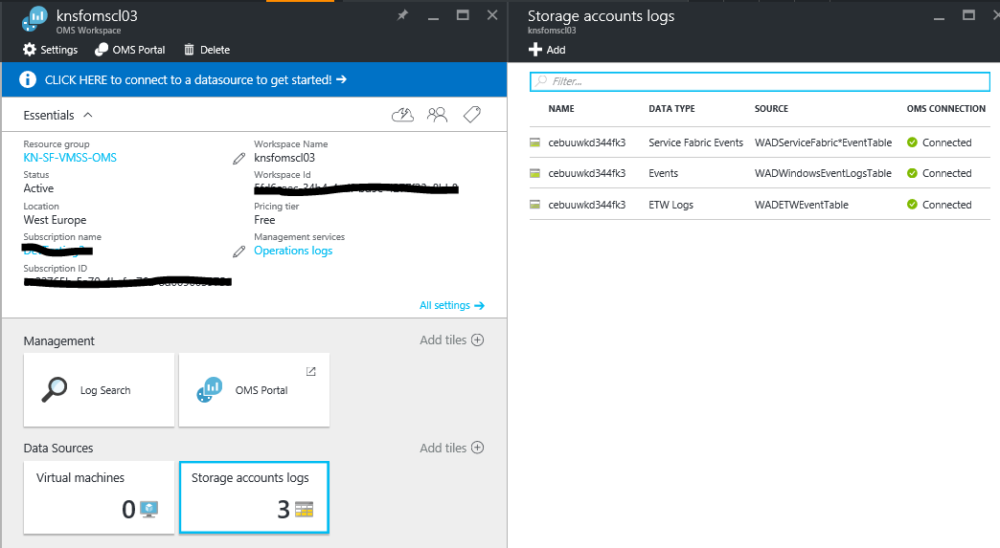
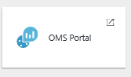
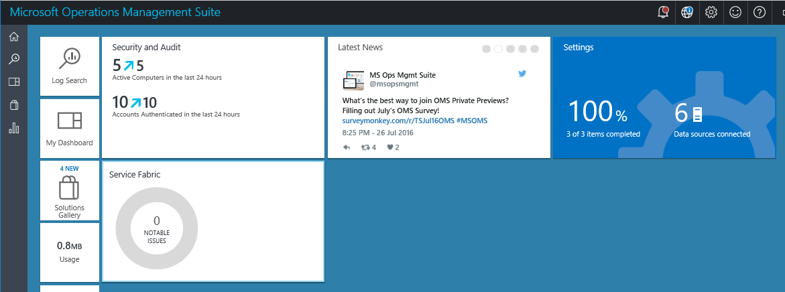
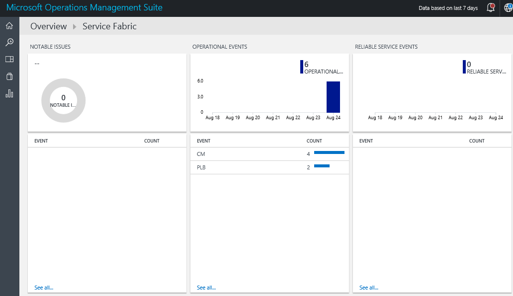
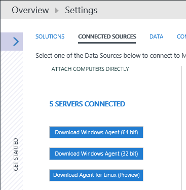

# Deploy Azure Service Fabric Cluster and enable monitoring for Service Fabric and VMSS using OMS Log Analytics

 

This template will deploy an Azure Service Fabric Cluster together with an OMS Log Analytics workspace, adds the diagnostic storage account into OMS for monitoring and insights and enables the OMS Gallery Solution for Service Fabric. In addition, each VM Scale Set instance will get connected to the OMS Workspace.

The OMS Gallery Service Fabric solution uses Azure Diagnostics data from your Service Fabric VMs, by collecting this data from your Azure WAD tables. 
Log Analytics then reads Service Fabric framework events, including Reliable Service Events, Actor Events, Operational Events, and Custom ETW events. 
The Service Fabric solution dashboard shows you notable issues and relevant events in your Service Fabric environment.

Once the template has been deployed, you can see the following table logs being ingested to your OMS Workspace

To see the Service Fabric solution in OMS, click on 'OMS Portal'

This will take you to the main dashboard showing the following solutions enabled:

* Security and Audit
* Service Fabric

Click on 'Service Fabric' to see details about your Service Fabric cluster

You can also verify that your Virtual Machine Scale Set instances are registered to the OMS Workspace by navigating into 'Settings' and click on 'CONNECTED SOURCES'
This should show that the 5 instances are associated with the workspace.

