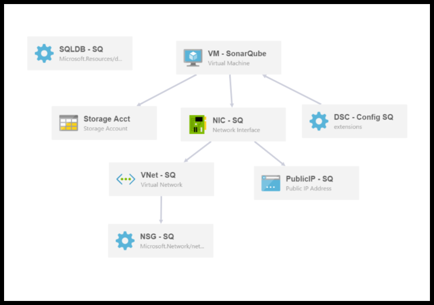

# Secure SonarQube VM with Azure SQL DB  
## Version 1.0

This template deploys an Azure SQL Server, Azure SQL DB, Windows Server 2012R2 VM (Standard DS1 v2) with SonarQube installed.  This template 
can be deployed to a new resource group (recommended) or to an existing resource group.  

Once the deployment is complete you can increase the resources provided to SonarQube by changing the VM from a Standard DS1 v2 machine to any larger DS_x_ v2 machine without the need to redeploy SonarQube or migrate any data.

[License](https://raw.githubusercontent.com/azure/azure-quickstart-templates/master/sonarqube-azuresql/oss/License.txt)  
[Third Party Notices](https://raw.githubusercontent.com/azure/azure-quickstart-templates/master/sonarqube-azuresql/oss/ThirdPartyNotices.txt)

* * *
#### Note:  
This Beta release deploys a secure SonarQube installation by default, howevere we invoke a **self-signed** which you will have to replace with a trusted one for production use.

##### Production Certificate
Because CAs provide the various SSL certificate types at different price points, you should start by deciding what type of SSL certificate to buy. To secure a single domain name (**www.contoso.com**), you just need a basic certificate. To secure multiple domain names (**contoso.com** and **www.contoso.com** and **sonarqube.contoso.com**), you need either a wildcard certificate or a certificate with Subject Alternate Name (subjectAltName).+

Once you know which SSL certificate to buy, you submit a Certificate Signing Request (CSR) to a CA. When you get requested certificate back from the CA, you then generate a .pfx file from the certificate. You can perform these steps using the tool of your choice. Here are instructions for the common tools:

* [Certreq.exe steps](https://docs.microsoft.com/en-us/azure/app-service-web/web-sites-configure-ssl-certificate#bkmk_certreq) - the Windows utility for creating certificate requests. It has been part of Windows since Windows XP/Windows Server 2000.
* [IIS Manager steps](https://docs.microsoft.com/en-us/azure/app-service-web/web-sites-configure-ssl-certificate#bkmk_iismgr) - The tool of choice if you're already familiar with it.
* [OpenSSL steps](https://docs.microsoft.com/en-us/azure/app-service-web/web-sites-configure-ssl-certificate#bkmk_openssl) - an [open-source](https://www.openssl.org/), [cross-platform tool](https://www.openssl.org/). Use it to help you get an SSL certificate from any platform.
* [subjectAltName steps using OpenSSL](https://docs.microsoft.com/en-us/azure/app-service-web/web-sites-configure-ssl-certificate#bkmk_subjectaltname) - steps for getting subjectAltName certificates.

The approach we used to secure the installation is documented in [Running SonarQube behind a reversed proxy](https://blogs.msdn.microsoft.com/visualstudioalmrangers/2016/06/04/running-sonarqube-behind-an-iis-reversed-proxy/).

* * *

### Workflow
This template performs the following workflow to create the SonarQube installation.  
- Deploy an Azure SQL Server database (named in sqDB\_ServerName) into the selected resource group  
- Create a SQL database within the Azure SQl Server (named in sqDB\_DBName)  
- Create a Storage Acct to support the SonarQube VM  
- Create a Network Service Group (firewall) which allows  
  1. HTTP (port 80), HTTPS (port 443) and SonarQube (port 9000) traffic In  
  2. Allows RDP (port 3389) traffic both In and Out  
  3. All other Inbound traffic is blocked.
- Create a Public IP address and DNS (named in sq\_PublicIP\_DnsPrefix)
- Create a Virtual Network
- Create a Virtual Network Interface Card (NIC) for the SonarQube VM
- Create a Virtual Machine (named in sqVM\_AppName) with Windows Server 2012 R2 and JDK8 installed
- Run a PowerShell Desired State Configuration script on the Virtual Machine to:    
  1. Disable IE ESC  
  2. Enable Remote Desktop  
  3. Allow RDP through the Windows Firewall  
  4. Allow SonarQube HTTP (80) Inbound through the Windows Firewall  
  5. Allow SonarQube HTTPS (443) Inbound through the Windows Firewall   
  6. Download SonarQube 5.6.1 and unzip to staging folder
  7. Replace the SonarQube connection string with the connection string of the Azure SQL Server created earlier  
  8. Install SonarQube as a Windows Service using the Local Admin account
  9. Start the SonarQube Windows Service and let it configure the SonarQube DB
- In case of secure installation, run a PowerShell custom extension on the Virtual Machine to:
  1. Install Application Request Routing on IIS (ARR)
  2. Generate a self-signed certificate
  3. Change SonarQube website binding to HTTPs using port 443 and the self-signed certificate.
  4. Disable HTTP firewall rule.
  5. Configure AAR proxy settings.
  6. Add rewrite rules for the website.

* * *

### Deployment
To deploy this template simply click the "Deploy to Azure" button above.  This will launch the Azure Portal and you will be prompted to provide values for the parameters below.

The deployment in Azure can take up to 30 minutes.  At the end of the deployment, SonarQube will be configured to run as a Windows Service on the SonarQube VM.  When the SonarQube service starts for the first time, it will configure its database.  This can take up to 15 minutes to complete during which time the Azure deployment shows as completed but you still won't be able to reach the SonarQube home page.  _Please give SonarQube some time to update._

Once the deployment and configuration have finished you will be able to access your SonarQube by entering its public address into a browser.  The address format is:

** http://[sq\_PublicIP\_DnsPrefix].[AzureRegion].cloudapp.azure.com:9000 ** 
**Ex:** http://my-sonarqube.eastus.cloudapp.azure.com:9000
**Ex: Secure** https://my-sonarqube.eastus.cloudapp.azure.com

* * *

### Parameter Descriptions

| Parameter Name | Description | Default value |
|----------------|-------------|---------------|
| sqVM\_AppName | Name of the VM that SonarQube will be installed upon. | sonarqubevm  |
| sq\_PublicIP\_DnsPrefix | The prefix of the public URL for the VM on the Internet (Max 63 chars, lower-case).  It should match with the following regular expression: ^[a-z][a-z0-9-]{1,61}[a-z0-9]$ or it will raise an error. This will be used to buld the fully qualified URL for the SonarQube site in the form of _http://[sq\_PublicIP\_DnsPrefix].[AzureRegion].cloudapp.azure.com_  **Ex:** A value of "my-sonarqube" will result in a URL of http://my-sonarqube.eastus.cloudapp.azure.com if the ARM template is deployed into a storage account hosted in the EASTUS Azure region. | None |
| sqVM\_AppAdmin\_UserName |  Local Admin account name for the SonarQube VM.  | None |
| sqVM\_AppAdmin\_Password | Password for the SonarQube VM Local Admin account. | None |
| sqDB\_Admin\_UserName | Admin account name for Azure SQL Server. | None |
| sqDB\_Admin\_Password | Password for Azure SQL Server Admin account. | None |
| sqDB\_ServerName  | Name of Azure SQL Server (Max: 10 chars)  | sonarsql |
| sqDB\_DBName | Name of the SonarQube DB on the Azure SQL Server | sonar |    
| sqDB\_DBEdition | Edition of Azure SQL Server to create, Allowed Values: Basic, Business, Premium, Standard, Web | Basic |    
| sqStorage_AcctType | Type of Azure Storage Acct to create, Standard\_LRS, Standard\_ZRS, Standard\_GRS, Standard\_RAGRS, Premium\_LRS   | Standard\_LRS |    
| sqVM_Installation_Type | Type of SonarQube installation: Secure (HTTPs) or nonsecure (HTTP)| Secure |    
| sqVM_ReverseProxy_Type | Type of reverse proxy to be used in case of Secure installation | IIS |    
| sqVM_LTS_Version  | SonarQube LTS version, currently support only sonarqube-5.6.4 | sonarqube-5.6.4 |

* * *

### Template Visualization

`Tags: SonarQube, SQL`

## Contributors
We thank the following contributors to this project: 

[Jean-Marc Prieur](https://github.com/jmprieur),

[Giulio Vian](https://github.com/giuliov),  

[Brian Randell](https://github.com/brianrandell),   

[John Spinella](https://github.com/jrspinella),   

Cesar Solis,  

Sergio Romero Ortiz,  

[Hosam Kamel](https://github.com/hkamel),  

[Kevin Mack](https://github.com/KevinDMack),  

Pierre Donyegro,  

Rui Miguel Carriho de Melo,  

David Corbin,  

[Gordon Beeming](https://github.com/Gordon-Beeming),  

Vinicius Moura,  

Clementino de Mendonca,  

[Steven St. Jean](https://github.com/sstjean)
