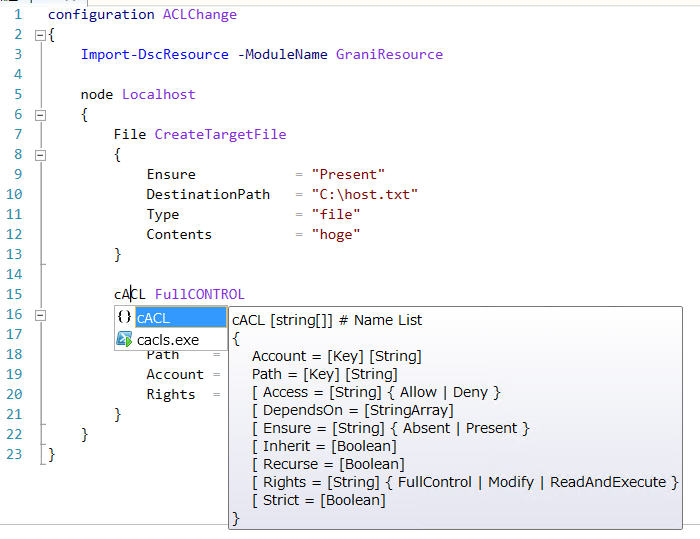

Grani_ACL
============

DSC Resource to configure ACL for NTFS.

Resource Information
----

Name | FriendlyName | ModuleName 
-----|-----|-----
Grani_ACL | cACL | GraniResource

Test Status
----

See GraniResource.Test for the detail.

Method | Result
----|----
Pester| not yet
Configuration| pass
Get-DSCConfiguration| pass
Test-DSCConfiguration| pass

Intellisense
----



Sample
----

- Download content from raw.github.com

```powershell
configuration ACLChange
{
    Import-DscResource -ModuleName GraniResource

    node Localhost
    {
        File CreateTargetFile
        {
            Ensure            = "Present"
            DestinationPath   = "C:\host.txt"
            Type              = "file"
            Contents          = "hoge"
        }

        cACL FullCONTROL
        {
            Ensure  = "Present"
            Path    = "C:\host.txt"
            Account = "Users"
            Rights  = "FullControl"
        }
    }
}
```

Tips
----

**Strict User targeting**

As there are two way of user specification in Windows.

1. Domain/UserName | Domain/GroupName
2. UserName | GroupName

In Domain Environment you need to target Domain Name for strict targeting AD User or Group.

```powershell
configuration ACLChange
{
    Import-DscResource -ModuleName GraniResource

    node Localhost
    {
        File CreateTargetFile
        {
            Ensure            = "Present"
            DestinationPath   = "C:\host.txt"
            Type              = "file"
            Contents          = "hoge"
        }

        cACL DomainFullCONTROL
        {
            Ensure  = "Present"
            Path    = "C:\host.txt"
            Account = "DomainName\UserName"
            Rights  = "FullControl"
        }
    }
}
```

In WorkGroup Environment, there are BuiltIn User Account and custom User Account. You will find Strict should disable because Domain will be Computer Name. But you cannot identify what the computer name which configuration apply?

```powershell
configuration ACLChange
{
    Import-DscResource -ModuleName GraniResource

    node Localhost
    {
        File CreateTargetFile
        {
            Ensure            = "Present"
            DestinationPath   = "C:\host.txt"
            Type              = "file"
            Contents          = "hoge"
        }

        cACL everyoneFullCONTROL
        {
            Ensure  = "Present"
            Path    = "C:\host.txt"
            Account = "everyone"
            Rights  = "FullControl"
        }
    }
}
```