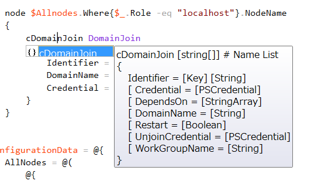

Grani_DomainJoin
============

DSC Resource to download content from remote uri.

Resource Information
----

Name | FriendlyName | ModuleName 
-----|-----|-----
Grani_DomainJoin | cDomainJoin | GraniResource

Test Status
----

See GraniResource.Test for the detail.

Method | Result
----|----
Pester| pass
Configuration| pass
Get-DSCConfiguration| pass
Test-DSCConfiguration| pass

Intellisense
----



Sample
----

- Join to the Domain

```powershell
configuration DomainJoin
{
    param
    (
        [PSCredential]$Credential
    )

    Import-DscResource -ModuleName GraniResource

    node $Allnodes.Where{$_.Role -eq "localhost"}.NodeName
    {
        cDomainJoin Download
        {
            Identifier = 'DomainJoin'
            DomainName = 'contoso.com'
            Credential = $Credential
        }
    }
}

$configurationData = @{
    AllNodes = @(
        @{
            NodeName = '*'
            PSDSCAllowPlainTextPassword = $true
        }
        @{
            NodeName = "localhost"
            Role     = "localhost"
        }
    )
}
```

- Unjoin from the Domain and Join to WORKGROUP


```powershell
configuration DomainUnJoin
{
    param
    (
        [PSCredential]$Credential
    )

    Import-DscResource -ModuleName GraniResource

    node $Allnodes.Where{$_.Role -eq "localhost"}.NodeName
    {
        cDomainJoin Download
        {
            Identifier = 'DomainUnjoin'
            WorkGroupName = 'WORKGROUP'
            Credential = $Credential
        }
    }
}

$configurationData = @{
    AllNodes = @(
        @{
            NodeName = '*'
            PSDSCAllowPlainTextPassword = $true
        }
        @{
            NodeName = "localhost"
            Role     = "localhost"
        }
    )
}
$credential = (Get-Credential)
DomainUnJoin -Credential $credential -ConfigurationData $configurationData
Start-DscConfiguration -Verbose -Force -Wait -Path DomainUnJoin -Debug
```

Tips
----

**DomainName and WorkGroupName**

Don't specify both ```DomainName``` and ```WorkGroupName``` parameter at once.

**Reboot Control**

As either Domain Join or Domain Unjoin (WorkGroup Join) requires Reboot after operated. You can handle reboot with LCM parameter "RebootNodeIfNeeded".

Currently there are xPendingReboot resource available from MSTF. (cPendingBeboot in this repository).

See detail at [Use PowerShell DSC to Check Pending Reboot](http://blogs.technet.com/b/heyscriptingguy/archive/2014/10/15/use-powershell-dsc-to-check-pending-reboot.aspx).

This article is not enough explained, but you will find it required to use ```Set-DSCLocalConfigurationManager``` Cmndlet to change ```RebootNodeIfNeeded```.