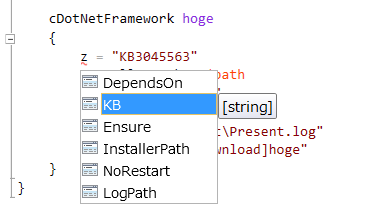

Grani_DotNetFramework
============

DSC Resource to install/uninstall .NetFramework offline file.

Resource Information
----

Name | FriendlyName | ModuleName 
-----|-----|-----
Grani_DotNetFramework | cDotNetFramework | GraniResource

Test Status
----

See GraniResource.Test for the detail.

Method | Result
----|----
Pester| pass
Configuration| pass
Get-DSCConfiguration| pass
Test-DSCConfiguration| pass

Intellisense
----



Sample
----

- Install .NetFramework 4.6

Download and Install .NetFramework 4.6 for Windows Server 2012 R2

```powershell
configuration Present
{
    $uri46 = "http://go.microsoft.com/fwlink/?LinkId=528222";
    $folder = "c:\Test";
    $path = Join-Path $folder "NDP46-KB3045560-Web.exe";

    Import-DscResource -ModuleName GraniResource

    cDownload hoge
    {
        Uri = $uri46
        DestinationPath = $path
    }

    cDotNetFramework hoge
    {
        KB = "KB3045563"
        InstallerPath = $path
        Ensure = "Present"
        NoRestart = $true
        LogPath = "C:\Test\Present.log"
        DependsOn = "[cDownload]hoge"
    }    
}
```

- Uninstall .NetFramework 4.6

Uninstall .NetFramework 4.6 for Windows Server 2012 R2

```powershell
configuration Absent
{
    Import-DscResource -ModuleName GraniResource

    cDotNetFramework hoge
    {
        KB = "KB3045563"
        Ensure = "Absent"
        NoRestart = $true
    }    
}
```
