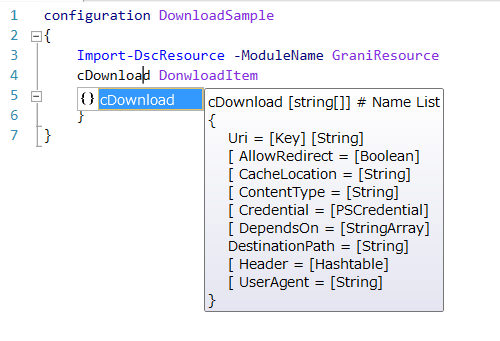

Grani_Download
============

DSC Resource to download content from remote uri.

Resource Information
----

Name | FriendlyName | ModuleName 
-----|-----|-----
Grani_Download | cDownload | GraniResource

Test Status
----

See GraniResource.Test for the detail.

Method | Result
----|----
Pester| pass
Configuration| pass
Get-DSCConfiguration| pass
Test-DSCConfiguration| pass

Intellisense
----



Sample
----

- Download content from raw.github.com

```powershell
configuration DownloadSample
{
    Import-DscResource -ModuleName GraniResource
    cDownload DownloadItem
    {
        DestinationPath = "C:\Tools\README.md"
        Uri = "https://raw.githubusercontent.com/guitarrapc/DSCResources/master/README.md"
    }
}
```

Tips
----

**Trace Remote file change**

Grani_Download will not trace remote file change in default.

If you want to change on remote file, there are 2 way would be thinkable.

1. Always download Remote content and override on local.
2. Download on temp location, hash check and override if change detected.

Both way would try to connect remote content. It means if there are any Rate Limit on API then API will consume every time access. Grani_Download avoid this API consume by not tracing remote file change.

You can do way 1 by passing LCM special location which will erace every time LCM try to run (SET).

```powershell
configuration DownloadSample
{
    Import-DscResource -ModuleName GraniResource
    cDownload DownloadItem
    {
        DestinationPath = "C:\Tools\README.md"
        Uri = "https://raw.githubusercontent.com/guitarrapc/DSCResources/master/README.md"
        CacheLocation = "$env:ProgramData\Microsoft\Windows\PowerShell\Configuration\BuiltinProvCache\Grani_Download"
    }
}
```
